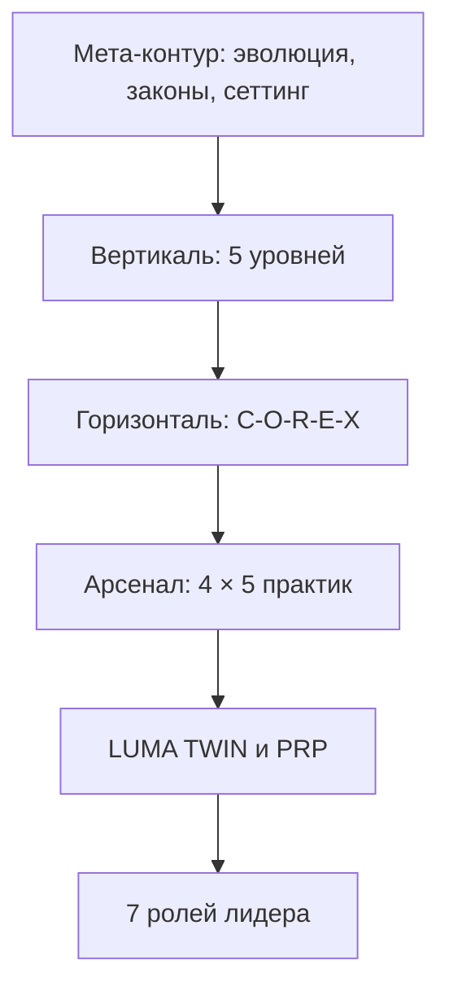

# COREX. Разбор проигранного матча

Сорок минут до конца квартала он всё ещё считал, что выигрывает.

Совет директоров, четырнадцать человек, презентация на восемьдесят слайдов, цифры, которые он лично проверял три ночи. Он говорил хорошо — он всегда говорил хорошо. На сорок первой минуте финансовый директор задал вопрос про отток в сегменте, и он ответил быстрее, чем понял вопрос.

Ответ был правильный. Тон был не тот.

Он это почувствовал сразу: в зале что-то сместилось, как смещается вес у человека, который решил не спорить. Дальше всё шло гладко, слайды закончились, его поблагодарили. Через одиннадцать дней двое ключевых людей ушли к конкуренту, забрав команду. Ещё через месяц совет утвердил бюджет, который он считал невозможным.

Он до сих пор не может назвать момент, в который проиграл. Ему кажется, что проиграл он на сорок первой минуте. На самом деле — тремя годами раньше, когда согласился на роль, в которой нельзя было не знать ответа.

---

Эта книга — про такие матчи.

Не про то, как стать лучшей версией себя. Про то, как разбирать запись игры: где был сделан ход, после которого позиция стала проигранной, хотя на табло ещё ничего не изменилось.

**Симулизм** отвечает, зачем ты вообще играешь. **ROOT** объясняет законы поля, по которым система выставляет счёт. **COREX** — третья книга, и она начинается там, где первые две закончились: у человека, который уже знает своё «зачем» и знает законы, но выходит на конкретный матч в понедельник в десять утра.

Здесь работают четыре слова, и дальше они используются буквально.

**Матч** — ограниченный отрезок с исходом: переговоры, квартал, разговор с сыном, год в должности. У матча есть начало, конец и результат, который можно назвать.

**Ход** — то, что ты делаешь внутри матча. Ходов немного, и большинство людей повторяют три-четыре одних и тех же всю карьеру.

**Фол** — нарушение, за которое платят не сразу. Именно поэтому его не видно в моменте.

**Сезон** — то, из чего складывается карьера и жизнь. Отдельный матч можно проиграть. Сезон проигрывают только те, кто не смотрит записи.

---

## Что считается выигрышем

Прежде чем открывать методологию, стоит договориться об одном, иначе всё остальное бессмысленно.

Большинство людей на вершине не могут назвать своё условие победы. Они могут назвать метрику — выручку, долю, оценку компании — и искренне считают, что это одно и то же. Разница выясняется в момент, когда метрика достигнута, а ничего не происходит.

**Условие победы не лежит в конце сезона.** Оно назначается на берегу — до первого матча — и звучит как описание того, каким ты выходишь из игры, а не того, что у тебя будет на счету.

Проверка простая: если твоё условие победы можно выполнить, став человеком, которым ты не хочешь быть, — это не твоё условие победы. Это чужая метрика, которую ты согласился отрабатывать.

Формулировка этого пункта — первая работа в [модуле 1](/03-setting-laws). Всё остальное в книге — инструменты. Инструмент без условия победы просто быстрее приводит не туда.

---

## Карта книги

Читай модули по порядку или входи с того слоя, где сейчас затор.

## Введение. Эволюция метода

- **0.1. Раскол школ:** почему психоанализ, бихевиоризм, КПТ и коучинг буксуют на масштабе первых лиц.
- **0.2. Триединство:** Data-слой MENASIS, алгоритм COREX, исполнительная среда LUMA TWIN.
- **0.3. Психика как радар:** опережающее отражение — устранять сбой до столкновения с кризисом.

## Модуль 1. Стол: сеттинг, фолы и роли

- **1.1. Пять фолов:** стёртый игрок, перевёрнутый порядок, перекос обмена, подделанный факт, лояльность чужому потолку. Законы, по которым за них платят, — в ROOT.
- **1.2. Внешний сеттинг:** тайминг, территория, финансы, конфиденциальность, чистота ролей.
- **1.3. Внутренний сеттинг:** идентичность «равный с равным», дистанция, нейтральность, контейнирование, самокалибровка.
- **1.4. Смена ролей:** допустимые переходы, необратимый выход в бизнес, запрет возврата в терапию, протокол трёх точек.
- **1.5. Доверие + синергия:** четыре столпа рацио и четыре столпа союза; партнёрское соглашение «на берегу».

## Модуль 2. Вертикаль: 5 уровней

- **Уровень 1. Витальный:** сон, гидратация, Зона 2, HRV, вагус.
- **Уровень 2. Эмоциональный:** Наблюдатель, 90 секунд, соматика, Внутренний Штиль.
- **Уровень 3. Интеллектуальный:** первопринципы, процессы, PDCA, Парето 80/20.
- **Уровень 4. Контекстуальный:** макро-мониторинг, «лебеди», стратегия штанги, дублирование.
- **Уровень 5. Политический:** четыре капитала, Soft Power, наследие.
- **Degraded Mode:** аварийный сброс к телу и смыслу, затем ступенчатый перезапуск.

## Модуль 3. Диагностика

- **3.1. Четыре опоры:** целостность, привязанность, гибкость, реализация.
- **3.2. MENASIS за 3 минуты:** ядро MICE, 8 психотипов ACTION, ценности NEXUS, октава DO–SI, «ахиллесова пята».

## Модуль 4. Горизонталь C-O-R-E-X

- **C — Calibrate:** факты, язык видеокамеры, замер ресурса.
- **O — Obstacle:** вторичная выгода → безопасность → сценарий.
- **R — Result:** оцифрованная точка Б, интерфейс TO-BE.
- **E — Engine:** точечный рычаг (разбор корня, BSFF, Red Teaming, кадры, ИИ).
- **X — Xecution:** контракт на 1 страницу, микрошаг на 72 часа, загрузка в PRP.

## Модуль 5. Арсенал (4 × 5)

- **Диагностика:** MENASIS, Hogan Suite, Архетипы 2.0, Holland RIASEC, LAB Profile.
- **Трансформация:** разбор корня, BSFF, нейровагус, протокол 90 сек, Внутренний Штиль.
- **Бизнес и стратегия:** SFBT, первопринципы, Red Teaming, Pre-Mortem / штанга, PDCA.
- **Технологии и AI:** двойники AS-IS/TO-BE, PRP, когнитивный оффлоадинг, AI-Advisor, AI-Simulator.

## Модуль 6. LUMA TWIN и PRP

- **6.1. Двойники:** AS-IS (текущие ограничения) → TO-BE (целевой аватар).
- **6.2. PRP:** семь контуров HUD лидера — биология, внимание, капитал, окружение, роли, сейф, AI-совет.
- **6.3. AI Reality Simulator:** прогон решений до шага и предикция срывов.

## Модуль 7. Семь ролей лидера

- **7.1. Сам с собой:** ревизия идентичности, аудит 5 уровней, сброс перегрузки.
- **7.2. Муж:** суверенное партнёрство, матрица 9×9 ключей.
- **7.3. Отец:** передача ценностей, инициация, опора без гиперопеки.
- **7.4. Партнёр по бизнесу:** аудит доверия и синергии, сценарии цивилизованного выхода.
- **7.5. Клиент (C-Level):** снятие ступора, аудит рисков, независимое зеркало.
- **7.6. Топ-менеджер:** One-to-One, саботаж, перевод исполнителя в субъекта.
- **7.7. Друг:** безусловная связь вне делового контекста.

## Модуль 8. Практикум

1. Чек-лист сеттинга и чистоты ролей.
2. Бланк экспресс-диагностики 4 опор.
3. Гайд 30 вопросов интервью MENASIS.
4. Шаблон 1-страничного Executive-протокола.
5. Регламент 4-недельного интенсива LUMA TWIN.

## Приложение. Лист персонажа

Вертикаль, MENASIS и C-O-R-E-X как видимая игра: три трека, XP только за факты, скилл-дерево арсенала, Degraded Mode.
