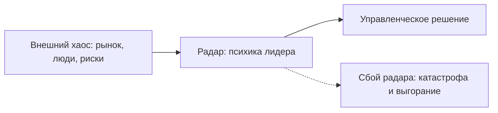

# Эволюция метода: почему COREX работает

После совета он не пошёл домой.

Пошёл в спортзал. Железо, пот, наушники. Через неделю — ретрит в горах, тишина, дневник. Потом коуч с белой доской и целью на год, написанной красивым маркером.

Ни одно из трёх не было глупостью. Просто ни одно не отвечало на вопрос, который жёг изнутри: **какой ход сделал позицию проигранной**.

Он искал разбор записи. Ему продавали вектор.

На масштабе первого лица цена этой подмены считается не в «инсайтах». Она считается в кассовом разрыве, сорванной сделке и ночи, когда пульс не падает ниже сотни. Времени на красивый вектор нет. Есть матч в понедельник в десять.

COREX собирает диагностику, протокол сессии и исполнительную среду в один контур именно под этот матч. Не под развитие «вообще». Под ход, который уже стоил дорого.

## Почему классические подходы буксуют на масштабе

Больше ста лет психологическая наука росла через раскол. Каждая школа брала один фрагмент личности и объявляла его целым. На обычном человеке это ещё терпимо. На собственнике, топе, инвесторе — нет.

| Школа | Ограничение для первых лиц |
| --- | --- |
| Психоанализ (Фрейд, Юнг) | Годами копается в прошлом. Даёт инсайты, но не даёт бизнес-результата. |
| Бихевиоризм (Павлов, Скиннер) | Дрессирует внешние привычки (стимул → реакция). Игнорирует смыслы, ценности и волю. |
| Когнитивизм / КПТ (Бек, Эллис) | Пытается решить всё через рациональную логику. Бессилен перед соматикой и глубоким аффектом. |
| Традиционный коучинг | Накачивает мотивацией «к цели». Разбивается о подсознательный саботаж и страх. |

Когда в кабинет входит человек с высокой ценой ошибки, фрагмент ломается о реальность:

- Фаундер в кортизоловом ступоре перед кассовым разрывом — **бесполезно отправлять в детство**. На это нет времени.
- Партнёр тихо сливает сделки из страха масштаба — **бесполезно мотивировать KPI**. Он продолжит сливать.
- Лидер выгорел физиологически (HRV на нуле, сон сломан) — **бесполезно менять убеждения**. Железо перегрето. Процессор не тянет софт.

> Классическое консультирование часто лечит многоуровневую систему одним плоским инструментом. На первых лицах это заканчивается потерей, а не «процессом».

## Триединство: MENASIS + COREX + LUMA TWIN

COREX вырос на стыке нейробиологии, теории управления, доказательной психотерапии и IT-архитектуры. Это не «школа мнений». Это замкнутый контур из трёх слоёв.

| Слой | Что делает | Выход |
| --- | --- | --- |
| Диагностика: MENASIS | 7 уровней сканирования, байесовские алгоритмы, защита от социальной желательности, MICE-анализ ядра | Точный срез реальности (модель AS-IS) |
| Операционный метод: COREX | Вертикаль: 5 уровней масштаба. Горизонталь: 5 шагов сессии C-O-R-E-X | Точечная интервенция и проект результата (TO-BE) |
| Исполнительная среда: LUMA TWIN | Personal Resource Planning, AI Reality Simulator, Roadmap, трекинг 24/7 | Решения внедряются без срыва |

MENASIS показывает, кто перед тобой на самом деле. COREX проводит ход. LUMA TWIN не даёт ходу раствориться к среде.

### Закон пяти элементов

В каждом рабочем модуле — строго **5 элементов**:

- **5 уровней вертикали:** витальный → эмоциональный → интеллектуальный → контекстуальный → политический.
- **5 шагов сессии:** Calibrate → Obstacle → Result → Engine → Xecution.
- **5 правил внешнего сеттинга** и **5 опор внутреннего сеттинга**.
- **4 квадранта** по 5 практик в каждом (20 инструментов).

Пятёрка здесь не мистика. Это ограничение, которое не даёт размазать внимание на двадцать «важных» вещей сразу.

## Психика как бортовой радар

В советской и мировой психофизиологии (Сеченов, Павлов, Леонтьев, Анохин) показано: психика возникла не для красивых переживаний. Она возникла как орган опережающего управления поведением. Радар. Не дневник чувств.

Как это устроено:

1. **Растения** не имеют психики: адаптируются веками, меняя форму.
2. **Человек** адаптируется мгновенно за счёт поведения.
3. Психика считывает сигналы среды, строит модель будущего и направляет действие **до столкновения с препятствием**.

Четыре–восемь предложений науки здесь не для украшения. Они объясняют, почему «просто почувствовать» недостаточно, а «просто подумать» — тоже. Радар либо видит раньше удара, либо ты узнаёшь о ударе по боли.

### Почему первые лица терпят крах

Когда предприниматель зависает в затяжном стрессе, радар сбивается:

- Амигдала заливает мозг кортизолом → отключается префронтальная кора. Аналитика уходит.
- Включаются теневые страхи (C-компонент MICE: осуждение, несостоятельность, хаос, исключение) → лидер воюет с ветряными мельницами, видит предательство там, где его нет, или слепо доверяет токсичным партнёрам.
- Внутренняя карта перестаёт совпадать с рынком. Дальше — потеря капитала, срыв сделок, коллапс здоровья. Не метафора. Счёт.

COREX калибрует этот радар: убирает ошибки в чтении поля и даёт инструменты управления собой, людьми и капиталом — в темпе матча, а не в темпе «когда-нибудь разберёмся».
