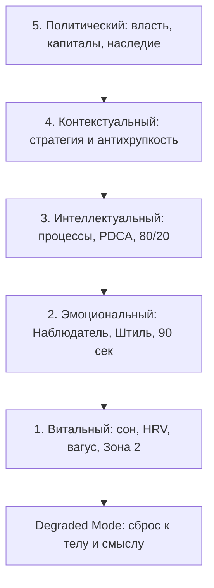

# Вертикаль: 5 уровней масштабирования

Третья ночь без сна. Во рту сухо. В груди — тот самый жар, который ещё можно назвать «мобилизацией», если очень хочется себя обмануть.

Он готовился к совету директоров как к политическому матчу: расстановка сил, влияние, формулировки. А провалился на витальном этаже: ответ раньше, чем услышан вопрос. Матч разыгрывался не на том этаже, на котором он его вёл.

Вертикаль COREX — лестница масштаба личности и бизнеса. Каждый уровень держит предыдущий. Скачок через этаж заканчивается выгоранием или инфарктом. Не «иногда». Часто — именно так.

Практический смысл простой: вертикаль показывает, **на каком этаже играется твой следующий матч**.

## Уровень 1. Витальный (тело, биология, энергия)

> **Цель:** избыточный физиологический ресурс и нейропластичность. Без этого уровня амбиции ведут к выгоранию.

| Опора | Норма |
| --- | --- |
| Сон и циркадные ритмы | 7–8 часов, блок синего света, утренний свет |
| Гидратация и соли | 30–40 мл/кг + электролиты (Mg, K, Na) |
| Нутрициология | Harvard Plate (50/25/25), окно 12–16 часов |
| Матрица движения | Зона 2 (150 мин/нед) + сила 2–3 раза/нед |
| Нейровагусный тонус | Контрастный душ, дыхание, высокий HRV |

### Протокол уровня 1

1. **Архитектура сна.** За 2 часа до сна — исключение экранов или красный фильтр. Температура в спальне 18–19 °C, полная темнота. Качество сна оценивай не по будильнику, а по ясности ума в первые 30 минут после пробуждения.
2. **Митохондриальная база (Зона 2).** 150+ минут в неделю циклической нагрузки (ходьба в гору, бег, гребля, велосипед) на пульсе, при котором можно говорить предложениями, но нельзя петь.
3. **Активация блуждающего нерва.** Завершение утреннего душа 30–60 секундами холодной воды. Тренирует переключение из стресса (симпатика) в восстановление (парасимпатика).

**Критерий мастерства:** высокая HRV, стабильная энергия 14 часов без допингов (кофеин и сахар).

## Уровень 2. Эмоциональный (психика, растождествление, поле)

> **Цель:** внутренняя устойчивость (Внутренний Штиль) и управление эмоциональным контекстом встреч.

| Опора | Норма |
| --- | --- |
| Режим Наблюдателя | «Я — не мои мысли, я — тот, кто наблюдает» |
| Правило 90 секунд | Биохимическая утилизация пикового аффекта |
| Соматический сброс | Эмоция = ощущение в теле + ментальный ярлык |
| Эмпатический резонанс | Считывание скрытых мотивов через поле |
| Внутренний Штиль | Тишина перед принятием решений |

### Протокол уровня 2

1. **Протокол «90 секунд» (Дж. Боулт Тейлор).** Выброс адреналина и кортизола смывается кровью за 90 секунд. Если тебя триггернули — **замолчи на 90 секунд**. Наблюдай жар в груди или сжатие челюсти. Не думай и не отвечай. Через полторы минуты биохимия спадёт.
2. **Растождествление.** Разрыв связки «мне страшно → я в опасности». Замена: *«Фиксирую сигнал тревоги в теле. Это датчик. Я продолжаю вести корабль»*.

**Критерий мастерства:** отсутствие срывов на переговорах; способность зайти в комнату с паникующей командой и вернуть людей в рабочий строй.

## Уровень 3. Интеллектуальный (системы, процессы, мышление)

> **Цель:** превратить предпринимательский хаос в оцифрованные, масштабируемые процессы.

| Опора | Норма |
| --- | --- |
| Первопринципы | Расщепление проблемы до базовых констант |
| Процессный подход | Жизнь и бизнес как цепочки алгоритмов |
| Цикл PDCA | Plan → Do → Check → Act |
| Фильтр Парето (80/20) | Отсечение 80% операционной шелухи |
| Хаб экспертизы | Твёрдый навык мирового уровня с высоким чеком |

### Протокол уровня 3

1. **First-Principles Thinking.** Запрет на аргумент *«так делают все на рынке»*. Вопрос: *«Каковы базовые физические и экономические константы этой задачи?»*
2. **Оцифровка регламентов.** Если задача повторяется более двух раз — 1-страничный чек-лист и передача исполнителю. Лидер освобождает оперативную память.

**Критерий мастерства:** бизнес генерирует чистую прибыль без ежедневного вмешательства первого лица; задачи выполняются по регламентам с первой попытки.

## Уровень 4. Контекстуальный (стратегия и антихрупкость)

> **Цель:** синхронизация с макротрендами и архитектура, которая становится сильнее от рыночного хаоса.

| Опора | Норма |
| --- | --- |
| Макро-мониторинг | Геополитика, технологии, сдвиги рынка |
| Охота за «лебедями» | Готовность к угрозам и асимметричным шансам |
| Стратегия штанги | 80–90% ультра-надёжно / 10–20% венчурный ×10 |
| Избыточность систем | Дублирование серверов, команд, юрисдикций |
| Адаптивная скорость | Смена бизнес-модели за 14 дней при форс-мажоре |

### Протокол уровня 4 (стратегия штанги)

Лидер отказывается от «среднего риска»:

- **Левый конец (80–90% ресурсов):** консервативные активы, твёрдые контракты, стабильный денежный поток.
- **Правый конец (10–20% ресурсов):** высокорисковые гипотезы (AI, новые рынки, M&A), способные дать рост ×10–×100.

**Критерий мастерства:** любой кризис на рынке увеличивает долю рынка твоей компании.

## Уровень 5. Политический (власть, капиталы, наследие)

> **Цель:** влияние, управление чужими ресурсами, правила игры на рынке, наследие.

| Опора | Норма |
| --- | --- |
| 4 вида капитала | Финансовый, социальный, медийный, знаниевый |
| Теория игр и коалиции | Долгосрочные союзы Win-Win с топ-игроками |
| Soft Power | Управление через стандарты, тренды и смыслы |
| Рычаг масштаба | Масштаб через код, контент, капитал и людей |
| Наследие (Legacy) | Институты, переживающие создателя |

### Протокол уровня 5

- **Капитализация влияния.** Лидер перестаёт продавать рабочее время. Капитализирует социальный капитал (доступ к ЛПР), медийный (личный бренд и AI-двойники) и знаниевый (патенты, закрытые методологии).
- **Субъектность.** Лидер перестаёт играть по чужим правилам — сам задаёт стандарты ниши.

**Критерий мастерства:** свобода выбора проектов; влияние на индустрию; капитал и институты работают без физического присутствия создателя.

## Degraded Mode: аварийный сброс

Когда происходит катастрофа (иск, кассовый разрыв, предательство, потеря здоровья), попытка жить на уровнях 4 и 5 ведёт к срыву. Тело уже в яме. Голова пишет стратегию. Это не героизм. Это фол против себя.

| Шаг | Действие |
| --- | --- |
| 1. Стоп-кран | Полное отключение задач уровней 3, 4, 5. Заморозка масштабирования |
| 2. Откат к уровню 1 и смыслу | 8 часов сна, электролиты, отказ от стимуляторов, ходьба, холодный душ. Вопрос: «Я жив, ценности со мной, кто я сейчас?» |
| 3. Последовательный перезапуск | Тело → эмоции в штиле → регламенты → стратегия → власть |

> **Правило перезапуска:** нельзя переписывать бизнес-стратегию (уровень 4), пока тело в кортизоловой яме (уровень 1), а в голове паника (уровень 2).
