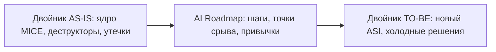
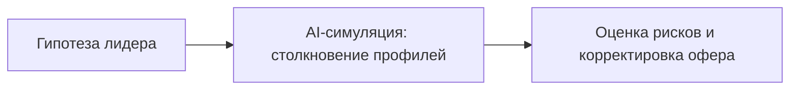

# Исполнительная среда: LUMA TWIN

Сессия кончилась в 11:47. На столе — один микрошаг и дедлайн через 72 часа. В груди ещё держалась ясность, как после холодного душа.

В среду в 23:10 ясности не было. Была лента, три незакрытых чата и то самое «завтра с утра». К пятнице тело уже знало: матч снова проигран между сессиями, не на них.

Это и есть главная трагедия чужого «разбора». На поле — инсайт и план. В быту — заводские настройки. Рутина возвращает хаос быстрее, чем ты успеваешь назвать его фолом.

**LUMA TWIN** держит траекторию, когда ты уже не на столе. Между понедельником и следующим понедельником.

| Слой платформы | Функция |
| --- | --- |
| Цифровой срез (AS-IS) | Оцифровка текущего ядра (MENASIS) и багов |
| Целевая модель (TO-BE) | Проектирование нового интерфейса (ASI) |
| Система PRP | Personal Resource Planning — семь контуров HUD лидера |
| AI Reality Simulator | Сценарное моделирование решений до шага |
| Непрерывный AI-Advisor | Контекстный спарринг и трекинг KPI 24/7 |

## Архитектура двойников: переход AS-IS → TO-BE

Платформа держит **две живые модели**. Не «профили для галочки». Двух игроков, с которыми можно разговаривать, когда в голове шум.

### Двойник AS-IS (что ты есть в записи)

Собирается из отчёта MENASIS: тесты, NLP, 30 проективных вопросов. Слепок текущего человека: мотивы, ведущие страхи (C в MICE), идеология, эго-роль, реакция на кризис, «ахиллесова пята».

**Зачем:** зеркало без жалости к самообману. Можно спросить AS-IS: *«Почему я прямо сейчас тяну запуск?»* — и получить ответ алгоритма, а не сказку, которую ты сам себе продаёшь с понедельника.

### Двойник TO-BE (кем ты выходишь из матча)

Проектируется на шаге **Result (R)** сессии COREX. Новый адаптивный социальный интерфейс (ASI): привычки, зрелый переговорный стиль, делегирование, правила сохранения ресурса.

**Зачем:** личный ориентир перед ходом. Перед каждым жёстким решением — один вопрос: *«Как здесь поступил бы мой TO-BE?»* Если ответ стыдный — ход уже проигран, даже если табло ещё зелёное.

## PRP: семь контуров HUD лидера

ERP ведёт склад, кассу и логистику компании. **PRP** ведёт ресурсы человека: тело, внимание, деньги, окружение, роли, сейф, AI-совет. Канон — **семь модулей**. Подробная разборка — в следующей главе.

| Модуль | Зеркало ERP | Что трекает |
| --- | --- | --- |
| 1. HUD | Производство и склад | Сон, HRV, энергия, движение |
| 2. Cognitive & Task | Операционные процессы | Deep Work, календарь, Smart Roadmap |
| 3. Financial & Asset | Баланс, P&L, ДДС | Активы, cash flow, стратегия штанги |
| 4. Social CRM | Контрагенты и сделки | Окружение, баланс «брать — давать», 9×9 |
| 5. Human Capital | HR и университет | MENASIS, 7 ролей, RIASEC |
| 6. Sovereign Vault | Документооборот и ИБ | Договоры, ключи, Tinbl Core |
| 7. AI-Advisor & Simulator | BI и совет директоров | Двойники, симулятор, предикция срывов |

### Как это бьёт в тело

1. **Синхронизация биометрии.** Oura, Apple Watch, Whoop — в защищённый профиль. HRV упал на 30%, глубокий сон меньше 45 минут — PRP пишет прямо: *«Когнитивная ёмкость снижена. Стратегические переговоры — на вторую половину дня»*. Не «потерпи». Перенеси.
2. **Утечки внимания.** PRP оцифровывает день и подсвечивает задачи, которые ты тащишь чужими руками в своей голове. То, что должно быть делегировано, перестаёт притворяться «срочным».

## AI Reality Simulator

Цена ошибки первого лица другая. Неправильный найм — от десяти годовых окладов. Сорванная M&A — миллионы и лица, которые потом не смотрят в глаза. Симулятор — закрытая песочница: рискованный ход прогоняется **до** того, как он станет фактом на поле.

### Сценарии, которые экономят сезон

1. **Стресс-тест найма.** В систему — профили кандидата и CEO. Симулятор моделирует форс-мажор и выдаёт прогноз: *«Через 3 месяца конфликт за контроль: эпилептоид против гипертима. Переписать должностную»*. Лучше переписать бумагу, чем хоронить команду.
2. **Репетиция жёстких переговоров.** Диалог с AI под психотип оппонента — пока голос не перестаёт дрожать, а челюсть не разжимается сама.
3. **Tinbl Core.** Профили на персональных зашифрованных серверах. Не уходят в обучение публичных нейросетей. Принадлежат клиенту. Точка.

### Что меняется на практике

Трансформация перестаёт держаться на силе воли среды. Ты получаешь контур, который тянет траекторию 24/7 — между сессиями, когда обычно и проигрывают матч.
