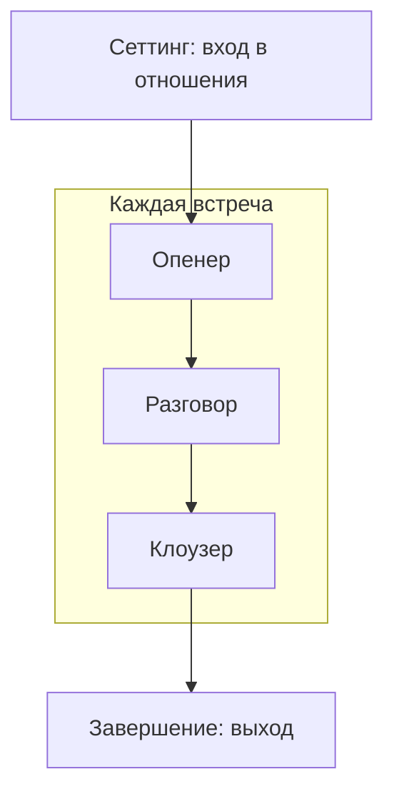

# Книга протоколов: 7 ролей лидера

Дома за ужином — тон совета директоров. С другом — unit-экономика «заодно». С сыном — Red Teaming прооценки. Потом удивление: «я же всё делал правильно».

Делал. В чужом матче.

Одна и та же психика ведёт себя по-разному в разных контурах. Протокол «Я сам с собой» не работает на совете. Протокол «Я с клиентом» рвёт дружбу. Эта глава — развилка: какой протокол открывать сейчас.

Главная ошибка здесь — не выбрать не тот протокол. Главная ошибка — играть одним во всех семи матчах. Человек, который дома ведёт себя как на переговорах, не «последовательный». Этот человек просто не различает, в какой матч зашёл, — и получает фол там, где формально всё «по правилам».

## Матрица семи ролей

| № | Роль | Контур | Главный закон |
| --- | --- | --- | --- |
| 1 | Я сам с собой | Внутренний диалог, самокалибровка, Штиль | Сначала тело и смысл, потом решения |
| 2 | Я — муж | Суверенное партнёрство, матрица 9×9 | Действия ↔ состояние |
| 3 | Я — отец | Инициация, опора, передача ценностей | Принятие без гиперопеки |
| 4 | Я с партнёром | Доверие + синергия, соглашение | Равные, прозрачный выход |
| 5 | Я с клиентом (C-Level) | Executive Advisory, спарринг, Red Teaming | Равный с равным, факты |
| 6 | Я с топ-менеджером | One-to-One, делегирование, субъектность | Не забирать задачу себе |
| 7 | Я с другом | Чистое общение вне бизнеса | Никаких сделок на этой территории |

В PRP роли живут в `settings` (идентичности), `relations` (связи) и `segments` (орбиты доверия). Смена роли без смены контракта — нарушение чистоты сеттинга из модуля 1.

## Логика выбора протокола

Три вопроса до входа в разговор. Не после. До.

1. **Кто напротив?** Ты сам / супруг(а) / ребёнок / равный сооснователь / платящий C-Level / подчинённый / друг. Если роль не назвать одним словом — сначала проясни контракт. Не начинай сессию в тумане.
2. **Какой закон нарушен?** Принадлежность, иерархия, баланс, правда или лояльность. Протокол — способ вернуть закон, а не «поговорить по душам».
3. **Где перекос по вертикали?** Тело на уровне 1, а разговор про экспансию (уровень 4) — сначала «Я сам с собой» и Degraded Mode. Не переговоры с инвестором на севшей батарее.

### Когда какой протокол

| Сигнал | Открывай |
| --- | --- |
| Оперативная память забита, решения из истощения, нет одного фокуса на день | 7.1 Сам с собой |
| Дома копится молчанка, секс и быт разъехались, нет тыла | 7.2 Муж |
| Ребёнок боится ошибки, живёт твоими амбициями, нет права на провал | 7.3 Отец |
| Недосказанность по ролям и деньгам, хочется обсудить партнёра за спиной | 7.4 Партнёр |
| Клиент ждёт согласия, а не зеркала; гипотеза не стресс-тестирована | 7.5 Клиент |
| Топ приносит проблемы без вариантов; ты делаешь его работу | 7.6 Топ-менеджер |
| Дружба стала нетворкингом, сравниваете чеки, хочется «заодно» продать услугу | 7.7 Друг |

### Запретные смешения

- Вести клиента как терапевта и одновременно входить с ним в сделку — запретный переход из модуля 1.
- Разбирать с другом unit-экономику «за ужином» — это уже протокол 7.5. Нужен отдельный контракт.
- Чинить брак скриптами C-Level (Red Teaming, факты без контейнера) — ломает тыл. Тыл — не доска для разбора полётов.

> **Правило входа:** один разговор — одна роль. Если роль меняется, произнеси это вслух и перезаключи рамку (протокол трёх точек).

## Два уровня контракта

У любого протокола два контура. Макро обрамляет микро: сначала вход в отношения, потом уже разговоры внутри них.

| Уровень | Когда | Формат |
| --- | --- | --- |
| Макро (отношения) | При старте / при выходе | Сеттинг / Завершение |
| Микро (разговор) | Перед / после каждой встречи | Опенер / Клоузер |

Эталон макро-уровня — протокол партнёра (глава 16). Остальные главы дают свою версию сеттинга и завершения под роль.

## Универсальная рамка

Каждый протокол открывается и закрывается явно на обоих уровнях. Без этого роли смешиваются, договорённости теряются, контур остаётся открытым — и потом «мы же говорили» звучит как приговор двум разным воспоминаниям.

### Сеттинг (вход в отношения)

Один раз — при старте этой связи или при перезапуске после паузы / кризиса. Договор на всё время роли, не на эти двадцать минут.

| Шаг | Что делается | Зачем |
| --- | --- | --- |
| 1. Назвать связь | Кто мы друг другу в этой роли | Нет «ну мы же понимаем» |
| 2. Назвать зачем | Для чего этот союз / контур существует | Расхождение горизонта вскрывается сразу |
| 3. Назвать нарушение | Что ломает контракт | Граница до первого кризиса |
| 4. Назвать разбор | Как решаем разногласия | Алгоритм вместо молчанки |
| 5. Назвать пересмотр | Когда договор живой, а не «навсегда» | Сеттинг можно обновить, нельзя забыть |

### Завершение (выход из отношений)

Когда связь меняет форму или кончается. Не ссора и не «просто перестали писать».

| Шаг | Что делается | Зачем |
| --- | --- | --- |
| 1. Назвать смену формы | «Эта роль закрывается / становится другой» | Контракт не висит открытым |
| 2. Признать вклад | Что было ценным — вслух, без суда | Закон принадлежности |
| 3. Новые условия или стоп | Либо новый контур, либо чистый выход | Нет серой зоны |
| 4. Закрыть старую роль | Фиксация в PRP, один текст наружу если нужно | Нет протечки в соседние контуры |

### Опенер (открытие разговора)

Четыре шага до начала каждой встречи — внутри уже существующего сеттинга:

| Шаг | Что делается | Зачем |
| --- | --- | --- |
| 1. Назвать роль | «Сейчас я в роли мужа / партнёра / консультанта» | Оба понимают, какой протокол включён |
| 2. Назвать горизонт | «У нас 20 / 40 / 60 минут» | Управление временем, нет растворения |
| 3. Назвать цель | «Я хочу получить один конкретный результат: [X]» | Фокус, не «поговорить по душам» |
| 4. Назвать правила | Что действует в этом контуре: конфиденциальность, чистота роли, отсутствие бизнес-тем или, наоборот, жёсткий факт-чек | Нет сюрпризов в процессе |

### Клоузер (закрытие разговора)

Четыре шага в конце каждой встречи:

| Шаг | Что делается | Зачем |
| --- | --- | --- |
| 1. Итог | Одно предложение: что произошло в этом разговоре | Оба выходят с одинаковой картинкой |
| 2. Договорённость | Конкретный шаг, дата, критерий «готово» → в PRP | Не «поговорили», а закрыто действием |
| 3. Чек-ин | Когда и как проверим исполнение | Убирает «ну мы же говорили об этом» |
| 4. Закрыть роль | «Контур закрыт» или выход из роли явно вслух | Нет протечки одного контура в другой |

Опенер и клоузер — в каждом из семи протоколов. Сеттинг и завершение — в протоколах 2–7 (муж, отец, партнёр, клиент, топ-менеджер, друг). Протокол «Я сам с собой» живёт на микро-уровне: там нет второго человека, с которым заключают союз.
