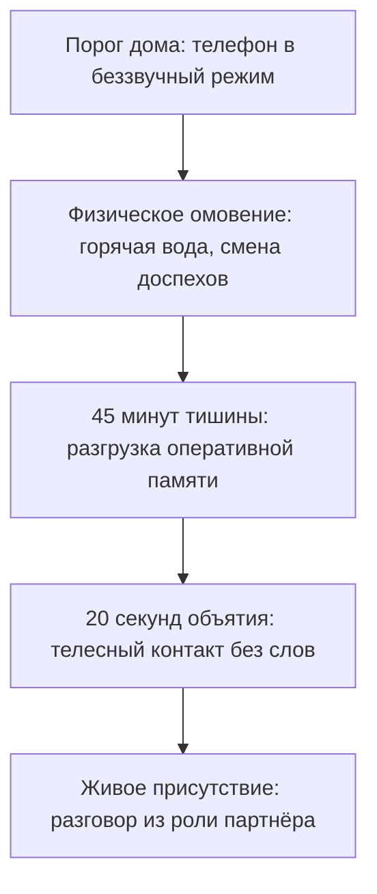

# Протокол 2: «Я — Супруг и суверенный партнёр»

Дверь прихожей захлопывается с глухим щелчком. Пальто брошено на вешалку, в кармане всё ещё вибрирует телефон, разрывающийся от уведомлений из рабочего чата. В голове прокручивается сорок пятая минута вечернего совета директоров: нестыковки в бюджете, жёсткий взгляд финансового директора, недожатая сделка.

Ты заходишь на кухню. Твой партнёр стоит у окна или наливает воду. Не оборачивается сразу, только плечи едва заметно напрягаются. Ты ловишь себя на том, что уже открываешь рот, чтобы привычным командным голосом выдать сводку новостей за день. Корпоративный язык кажется таким надёжным, броня — такой привычной. Человек медленно поворачивается, смотрит на тебя усталыми глазами и тихо спрашивает: «Ты чай будешь?»

В горле сухо. Через двадцать минут в спальне повиснет та вязкая, душная тишина, в которой слышно лишь монотонное гудение холодильника. Близость «если останутся силы» не случится — потому что сил нет уже ни у кого. Есть только фантом генерального директора, которого притащили в семейную спальню прямо на подошвах своей обуви, наивно полагая, что деловая хватка и сухость — это признак силы.

Это не внезапно вспыхнувший «кризис семи лет». Это системная авария на твоём собственном поле. И табло домашнего матча устроено коварнее любого корпоративного отчёта: оно годами маскирует убытки. Когда ты наконец заметишь трещину, уйдёт не просто уставшая команда — обрушится сам тыл, ради защиты которого ты когда-то выходил во внешний мир.

> [!NOTE]
> **Нейробиология взрослой привязанности и ко-регуляция**  
> Исследования Сью Джонсон (автора эмоционально-фокусированной терапии) и поливагальная теория Стивена Порджеса показывают: в устойчивом союзе нервные системы партнёров функционируют как единый осциллятор. Когда лидер возвращается домой в состоянии хронической симпатической активации (режим «бей или беги», повышенный кортизол, микронапряжение лицевых мышц), зеркальные нейроны партнёра мгновенно считывают это не как «усталость от работы», а как скрытую угрозу безопасности общего пространства. Возникает феномен взаимной защитной изоляции. Без осознанного сенсорного переключения ко-регуляция сменяется взаимной нейроцепцией опасности, превращая дом в продолжение окопа.

---

## Сеттинг: союзный контракт на берегу

Суверенное партнёрство не возникает по умолчанию из штампа в паспорте или романтической влюблённости. Романтика — это стартовое топливо, которого хватает ровно на первые восемнадцать месяцев. Дальше начинается совместная навигация в открытом море.

Сеттинг союза — это фундаментальный разговор двух трезвых взрослых людей. Его проводят до переезда под общую крышу, либо в момент глубокого, честного перезапуска отношений, когда старые детские иллюзии окончательно разбились о реальность.

Это не сухой юридический брачный договор (хотя имущественные вопросы должны быть урегулированы до буквы). Это согласование карты смыслов. Пять прямых вопросов, на которые оба партнёра отвечают вслух, глядя друг другу в глаза:

1. **Какой масштаб союза мы строим?** Это просто совместный комфортный быт, союз взаимного развития и дерзких вызовов, или мы закладываем фундамент долгой фамильной династии?
2. **Каков персональный язык любви каждого из нас?** Через что именно — слова признания, прикосновения, тишину, помощь или подарки — твой партнёр физически чувствует, что он в безопасности и любим?
3. **Что для каждого из нас является безоговорочным нарушением союза?** Где пролегает граница, за которой доверие сгорает дотла (ложь о деньгах, эмоциональная или физическая измена, унижение достоинства на людях)?
4. **Каков наш алгоритм проживания шторма?** Как именно мы ведём себя, когда накрывает ярость или обида? Действует ли правило сорока пяти минут на остывание, или мы договариваемся не уходить в глухую молчанку неделями?
5. **Когда мы сверяем компас?** В какой день года мы садимся вдвоём без детей и телефонов, чтобы спросить друг друга: «Мы всё ещё идём туда, куда хотели, или наш маршрут пора обновить?»

Если хотя бы на один из этих вопросов у пары нет ясного ответа, строить общий дом ещё рано. Любой сильный внешний кризис — потеря бизнеса, болезнь, рождение первенца — превратит слепые зоны контракта в минное поле.

---

## Точка входа: ритуал возвращения домой

Самая частая ошибка лидера — переступать порог дома на полном ходу, не сбросив боевой аффект. Мозг ещё переваривает созвоны, а тело уже требует домашнего уюта. В результате первые же слова, брошенные домашним, звучат как распоряжения подчинённым или сухой допрос.

Переход из боевого контура во внутренний требует физического ритуала. Это не магия, а физиология: нужно дать блуждающему нерву сигнал переключить симпатическую нервную систему на парасимпатическую.

### Алгоритм вечерней декомпрессии

1. **Смена доспехов.** Телефон переводится в беззвучный режим ещё в прихожей и убирается в специальный ящик. Никаких ноутбуков за кухонным столом. Деловая одежда немедленно снимается: пока ты в костюме или рубашке, твоё подсознание остаётся в переговорной. Тёплая вода на лицо и запястья смывает остаточное мышечное напряжение.
2. **Суверенная пауза (45 минут).** Если день был разгромным, скажи прямо и спокойно: *«Родной/родная, день был очень тяжёлым. Мне нужно сорок минут тишины, чтобы вернуться в себя. Я здесь, с вами, просто перезагружу голову в кабинете»*. Это снимает тревогу: партнёр понимает, что молчание — не признак скрытой обиды на семью.
3. **Двадцатисекундное объятие.** До любых разговоров о счетах, школе или планах на отпуск — подойди и обними. Без намёков на продолжение, без суеты. Только тяжесть рук на плечах, тепло и ровное дыхание живот к животу. Через двадцать секунд окситоцин гасит кортизоловый фон у обоих.

> [!TIP]
> **Практика двадцати секунд**  
> Нейробиологические тесты Джона Готтмана зафиксировали: короткие формальные поцелуи на бегу не вызывают физиологического отклика. Однако плотный тактильный контакт продолжительностью от 20 секунд запускает мощный выброс окситоцина и эндорфинов, снижает артериальное давление и выравнивает сердечный ритм. Сделай это объятие священным законом входа в дом.

---

## Девять взаимных опор суверенного союза

Зрелые отношения — это не застывшая скульптура, а непрерывный динамический танец двух суверенных личностей. Когда оба партнёра держат свой контур, в союзе возникает эффект резонансного усиления: забота одного становится источником устойчивости и вдохновения для другого.

Ниже представлена универсальная матрица девяти жизненных опор союза, описывающая взаимный вклад каждого взрослого партнёра — независимо от гендера.

| Опора союза | Вектор устойчивости и формы | Вектор тепла и принятия | Психологический смысл |
| --- | --- | --- | --- |
| **1. Безопасность и тыл** | **Safe Container** — железобетонная предсказуемость слова, финансовая защита и внешний порядок. | **Energy Fuel** — безусловная вера в потенциал партнёра, создание тёплой гавани без необходимости обороняться. | Семья становится неприступной крепостью, а не источником стресса. |
| **2. Эмоциональный щит** | **Emotional Shield** — способность выдержать слёзы и шторм партнёра, оставаясь спокойным контейнером. | **Zero-Drama Zone** — отказ от пассивной агрессии, токсичных намёков и манипуляций молчанием. | Конфликты решаются открытым диалогом через рот, а не войной на истощение. |
| **3. Разделяемое лидерство** | **Strategic Lead** — готовность брать на себя финальные решения и ответственность за курс в своих зонах. | **Shared Trust** — доверие к штурвалу партнёра, отсутствие мелочного контроля на поворотах. | У союза есть согласованный курс; исчезает парализующее соревнование за власть. |
| **4. Чувственность и огонь** | **Romantic Spark** — восхищение красотой партнёра, галантность, романтическая инициатива. | **Sensual Reset** — раскрепощённость, сексуальная открытость, совместное исследование близости и страсти. | Брак не вырождается в скучное «соседство двух уставших менеджеров». |
| **5. Масштаб и мысль** | **Growth Synergy** — готовность делиться горизонтом, инвестировать в образование и проекты партнёра. | **Mind Match** — глубокий интеллектуальный спарринг, тонкая интуитивная калибровка идей. | Партнёрам всегда есть о чём говорить через 10, 20 и 40 лет. |
| **6. Истинное зеркало** | **True Mirror** — принятие партнёра уставшим, уязвимым, без социального лоска; любовь без условий. | **Armor Drop** — снятие маски «железного лидера», смелость показать свою хрупкость близкому человеку. | Дом — единственное место на Земле, где можно быть неидеальным. |
| **7. Признание и свет** | **Appreciation Anchor** — способность замечать и благодарить за бытовой и эмоциональный вклад в семью. | **Joy Dividend** — искренняя радость победам и подаркам партнёра, открытые и сияющие глаза. | Усилия близкого не обесцениваются, а наполняются глубоким смыслом. |
| **8. Суверенное пространство** | **Freedom Trust** — полное уважение к личной территории, творчеству, карьере и друзьям партнёра. | **Sovereign Retreat** — спокойное право на уединение в своей «пещере» для перезагрузки без допросов. | Никто не душит другого контролем; сохраняется притяжение дистанции. |
| **9. Игра и притяжение** | **Playful Spark** — лёгкий юмор, взаимный флирт, спонтанные свидания посреди недели. | **Sovereign Gravity** — наличие собственной насыщенной жизни, увлечений и внутренней глубины. | Отношения сохраняют искру новизны и взаимного магнетизма на долгие годы. |

---

## Как работает самоподдерживающийся контур

Когда эта система собрана, никто не «терпит» ради детей и не чувствует себя обделённым донором. Возникает замкнутый психосоматический контур:

1. Партнёр обеспечивает внешнюю предсказуемость и снимает экзистенциальный страх за безопасность (`Safe Container`) → второй партнёр расслабляет тело и ум, наполняя союз избытком радости, тепла и мягкости (`Joy Dividend`).
2. В союзе исчезают скрытые претензии и ядовитые шпильки (`Zero-Drama`) → восстанавливается нервная система обоих, позволяя быть несокрушимой опорой в моменты кризисов (`Emotional Shield`).
3. Партнёры доверяют стратегическим решениям друг друга в согласованных сферах и не вырывают руль на каждом светофоре (`Shared Trust`) → крепнет взаимная уверенность и желание окружать друг друга заботой и щедрыми дарами (`Strategic Lead`).

Если же один из элементов матрицы выпадает на месяцы, баланс рушится. Если один из партнёров перестаёт держать слово и срывает договорённости, второй автоматически включает гиперконтроль. Другой считывает этот контроль как недоверие и покушение на авторитет, замыкается или уходит в глухую оборону. Начинается взаимная эрозия союза.

> [!IMPORTANT]
> **Табу: переговорные приёмы в спальне**  
> Категорически запрещено применять дома методы жёстких деловых переговоров, технику Red Teaming, саркастический разбор логических нестыковок или манипуляции. То, что делает тебя беспощадным стратегом на рынке, дома превращает тебя в тирана. Логика бессильна там, где плачет живое сердце. Когда близкий человек охвачен тревогой, ему нужны твои крепкие объятия и спокойное присутствие, а не пятнадцать аргументов, доказывающих его неправоту.

---

## Диагностика: когда система подаёт сигнал бедствия

Не жди, пока дело дойдёт до судебных исков или тихого отчуждения по разным комнатам. Заглядывай в зеркало семейного контура каждую неделю. Обрати внимание на эти пять критических симптомов:

* **Разговоры свелись к логистике.** Вы обсуждаете только доставку продуктов, оплату счетов и расписание репетиторов. В контакте не осталось ни капли любопытства к душе другого.
* **Интимная жизнь стала строкой в календаре.** Секс превратился в формальность или инструмент торга и вознаграждения за «хорошее поведение».
* **Появление сарказма и закатывания глаз.** Согласно исследованиям Джона Готтмана, презрение — это предиктивный маркер распада союза номер один с точностью 93%. Если в интонациях прорезался яд, отношения находятся в реанимации.
* **Убегание в работу.** Ты задерживаешься в офисе не потому, что этого требует проект, а потому, что мысль о возвращении домой вызывает глухую тоску или ком в солнечном сплетении.
* **Запрет на слабость.** Ты не можешь сказать партнёру, что растерян или боишься, а партнёр боится показать тебе свою усталость, чтобы не нарваться на раздражённую лекцию.

Если ты заметил у себя хотя бы три признака — остановись. Не пытайся заваливать проблему дорогими подарками или поездками на курорты. Никакой пятизвёздочный отель не вернёт тепло, если за столиком сидят двое глухих людей. Начните с честного разговора на кухне: без обвинений, через простое признание: *«Мне кажется, мы заблудились. Я очень скучаю по нам настоящим. Давай поговорим»*.

---

## Осознанное завершение: если союз исчерпан

Бывают ситуации, когда двое взрослых людей честно прошли через ремонт, обратились к специалистам, пересобрали договорённости, но с кристальной ясностью увидели: их совместный путь завершён. Ценности разошлись на базовом уровне, цели перестали резонировать, а совместное пребывание превратилось во взаимное истощение.

COREX отвергает как трусливое бегство в измены, так и токсичное жертвование жизнью «ради детей». Дети, растущие в атмосфере затяжной холодной войны, получают тяжёлые эмоциональные травмы на всю жизнь.

Завершение союза должно быть таким же суверенным, честным и взрослым, как и его начало:

1. **Прямое слово без посредников.** Никаких сообщений в мессенджерах, никаких разговоров через адвокатов или общих знакомых. Двое садятся за стол и смотрят друг другу в глаза.
2. **Признание пройденного пути.** *«Мы создали много прекрасного. У нас потрясающие дети и годы настоящей победы. Я бесконечно благодарен тебе за всё, что было между нами. Но эта форма нашего союза умерла. Держаться за труп — значит осквернять память о том ценном, что нас соединяло»*.
3. **Безоговорочная защита детей.** Родительский контур остаётся нерушимым навсегда. Детям прямо и спокойно объясняется: *«Мы завершаем наш союз как пара, но мы навсегда остаёмся вашими любящими родителями. Вы ни в чём не виноваты, и наша любовь к вам не изменится никогда»*.
4. **Благородство и справедливость в материальном контуре.** Лидер, выходящий из брака, обеспечивает достойный и справедливый жизненный фундамент для партнёра и детей. Делить подушки, ложки или использовать алименты и имущество как инструмент мести — признак глубокой личностной деградации.

Суверенный человек умеет красиво войти в союз и благородно, с высоко поднятой головой выйти из него, сохранив человеческое достоинство и чистоту своего имени.
