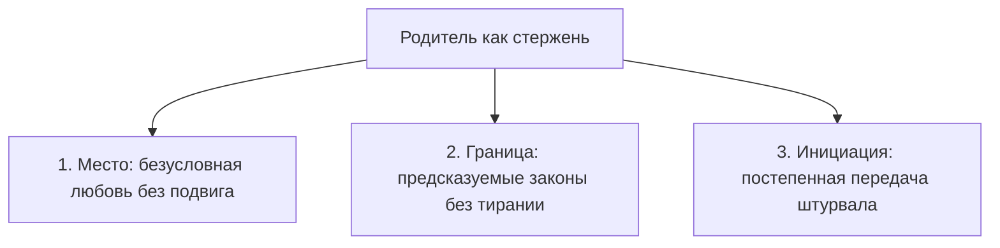
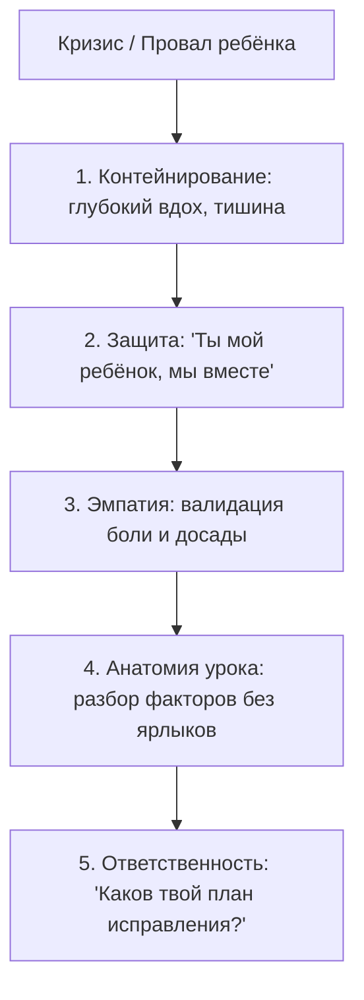

# Протокол 3: «Я — Родитель и наставник»

Дверь детской комнаты приоткрыта на пару пальцев. На столе горит настольная лампа, освещая раскрытую тетрадь или смятый протокол спортивных соревнований. Ребёнок сидит на кровати, ссутулив плечи, и смотрит в пол. Он слышит твои шаги в коридоре и уже заранее знает каждое твоё слово. В его теле включилась та же реакция сжатия, которую ты сам испытывал десятки лет назад перед собственными строгими родителями.

У тебя в груди привычно поднимается горячая, раздражённая волна: *«Я же столько в тебя вкладываю... Почему нельзя было просто постараться? В твоём возрасте я...»*

Остановись на самом пороге. Сделай медленный выдох.

У тебя есть ровно три секунды, чтобы разорвать эту родовую цепь. Ты можешь войти и разразиться очередной назидательной тирадой, повторив заученный семейный сценарий вины и стыда. А можешь присесть рядом, опуститься на уровень его глаз, положить тёплую руку ему между лопаток и просто помолчать, давая детской душе опереться на твою спокойную силу.

Цель осознанного родительства по COREX — воспитать автономную, психологически укоренённую личность со стальным внутренним стержнем. Не послушного исполнителя. Не твою уменьшенную копию. Не аватар для воплощения твоих собственных несбывшихся амбиций. Если всё, чего ты требуешь от своего ребёнка — это продолжение твоих амбиций, ты не родитель. Ты захватчик, крадущий чужую уникальную жизнь.

> [!NOTE]
> **Нейробиология родительского присутствия и дофаминовое созревание**  
> Исследования развития мозга (в частности, труды Джона Боулби, Аллана Шора и Дэниела Сигела) доказывают, что зрелое родительское присутствие играет решающую роль в созревании вентромедиальной префронтальной коры и формировании эмоциональной саморегуляции. Родительский контур одновременно обеспечивает базовую безопасность (Safe Haven) и активирует исследовательское поведение (Secure Base), обучая ребёнка справляться с посильным риском и фрустрацией. Взгляд родителя, полный спокойной гордости и веры, стимулирует здоровую дофаминергическую систему вознаграждения, создавая у ребёнка глубинное ощущение: «Мир сложен, но я способен его исследовать, справляться с вызовами и побеждать».

---

## Сеттинг: три священных столпа родительства

Родитель — это не надзиратель с ремнём и не беспомощный попуститель, заискивающий перед подростком. Лидер держит в семье три фундаментальных контура, без которых развитие ребёнка неизбежно кренится либо в инфантилизм, либо в тревожный перфекционизм.

### 1. Безусловное место в семье

Ребёнок имеет неотъемлемое право на принадлежность к семье просто по факту своего рождения. Он не должен заслуживать любовь примерным поведением, круглыми пятёрками в дневнике или победными кубками. 

Когда родитель транслирует: «Я горд тобой только тогда, когда ты первый», он закладывает в психику ребёнка мину замедленного действия — синдром самозванца и пожизненную зависимость от чужого одобрения. Место в твоём сердце гарантировано навсегда. Даже если весь мир отвернётся от него, родительский дом остаётся непоколебимым бастионом.

### 2. Справедливая и предсказуемая граница

Границы — это не капризы родительского настроения, когда за один и тот же поступок сегодня смеются, а завтра наказывают, потому что на работе сорвался контракт. Границы в доме COREX предсказуемы, как законы гравитации.

* Родитель никогда не атакует личность ребёнка — обсуждается только конкретный деструктивный поступок и его последствия.
* Насилие, физическое унижение и сарказм исключены абсолютно: они учат не морали, а искусству скрывать следы и врать в глаза.
* Закон един для всех: если в доме запрещены гаджеты за обеденным столом, взрослые первыми убирают свои смартфоны.

### 3. Инициация субъектности

Настоящее родительство — это искусство постепенно становиться ненужным. С каждым годом родитель осознанно передаёт ребёнку всё больше прав на собственный выбор и всё больше ответственности за его последствия:

* В 7 лет — выбор одежды, увлечений и распорядка уборки в своей комнате.
* В 12 лет — самостоятельное управление карманными деньгами, распределение времени на уроки и спорт.
* В 16 лет — выбор круга общения, жизненных ориентиров и будущей профессии без родительского диктата.

Если двадцатипятилетний взрослый до сих пор звонит родителям, чтобы согласовать покупку автомобиля или смену работы, инициация провалена. Семья вырастила психологического инвалида.

---

## Точка входа: опенер доверительного контакта

Дети мгновенно чувствуют фальшь. Когда родитель подходит к ребёнку с вопросом «Ну, как дела в школе?», уткнувшись при этом глазами в рабочий планшет, ребёнок отвечает дежурным «Нормально» и снова надевает наушники. Контакта не произошло.

Перед любым важным разговором с ребёнком соблюдай ритуал присутствия:

1. **Опуститься на уровень глаз.** Если ребёнок маленький — присядь на корточки. Если подросток лежит на кровати — сядь рядом на пол или на край постели. Никогда не веди воспитательных бесед с доминирующей позиции сверху вниз: поза власти включает у ребёнка защитный ступор.
2. **Сбросить повестку дня.** Объяви прямо: *«У меня есть полчаса, и мой телефон выключен. Я пришёл не проверять уроки и не читать нравоучения. Я пришёл побыть с тобой. Расскажи мне, чем ты сейчас живёшь»*.
3. **Закон нерушимого слота.** Заведи железное правило: минимум два часа в неделю родитель проводит с каждым ребёнком один на один. Без других родственников, без посторонних. Это может быть совместный поход, сборка модели, спорт или просто прогулка в парке с любимой едой. В этот слот ребёнок может спросить обо всём — об отношениях, о страхе, о взрослении, о мире — и получить честный, глубокий взрослый ответ без ханжества.

> [!TIP]
> **Принцип «Сначала контакт — потом коррекция» (Connect before Redirect)**  
> Профессор психиатрии Дэниел Сигел подчёркивает: кора головного мозга не способна воспринимать логические доводы и уроки морали, пока лимбическая система охвачена тревогой или стыдом. Прежде чем объяснять ребёнку, где он ошибся, согрей его своим принятием. Обними, назови его эмоцию («Ты сейчас очень злишься и расстроен, я тебя понимаю»), дождитесь глубокого вздоха облегчения — и только потом переходите к разбору причин.

---

## Разговор после падения: алгоритм проживания провала

Главный тест на зрелость твоего родительства случается не на торжественной линейке, когда ребёнок получает награду. Тест наступает в тот день, когда он совершил глупость, разбил чужую вещь, провалил экзамен или столкнулся с полицией.

Именно в эту секунду решается, кем ты останешься в его памяти на всю жизнь: карателем, от которого нужно прятаться, или надёжной гаванью, куда можно прийти с любой бедой.

### Пять шагов зрелого разговора

1. **Удержи собственное раздражение.** Твоё желание наорать — это не забота о ребёнке, а твой собственный страх («Что обо мне подумают знакомые?», «Я плохой родитель!»). Заткни своё эго. Сделай паузу.
2. **Обозначь союз.** Первые слова должны быть такими: *«Я рядом. Мы со всем разберёмся. Моё отношение к тебе не изменилось ни на миллиметр. Ты — мой ребёнок, и я люблю тебя»*. Это мгновенно выключает панический ужас отвержения.
3. **Отдели поступок от личности.** Забудь фразы: *«Ты бестолочь», «Ты ленивый», «У тебя руки не из того места»*. Скажи точно: *«Ты совершил очень опрометчивый поступок. Это привело к серьёзным последствиям. Но ты сам — способный и умный человек, и я знаю, что ты способен делать выводы»*.
4. **Не кради у ребёнка последствия.** Самая медвежья услуга, которую может оказать влиятельный родитель — это примчаться и за пять минут решить проблему деньгами или звонками, оставив подростка безнаказанным. Если ребёнок разбил соседское окно — он сам идёт извиняться и отрабатывает стоимость стекла своим трудом. Родитель стоит за плечом как моральная опора, но метлу в руки берёт виновник.
5. **Спроси о следующем ходе.** Не навязывай своё решение. Спроси: *«Что ты сам планируешь делать в этой ситуации? Как ты исправишь содеянное?»* Дай ему сделать выбор и прожить гордость за собственную ответственность.

---

## Диагностика: пять уровней родительского аудита

Раз в квартал задавай себе честные вопросы по пяти уровням вертикали COREX:

| Уровень вертикали | Проверочный вопрос родителю | Зелёный маркер зрелости |
| --- | --- | --- |
| **L1. Витальный** | Чувствует ли ребёнок физическую безопасность рядом со мной? | Нет страха резких движений, окриков и вспышек ярости; здоровый сон, питание и двигательная активность. |
| **L2. Эмоциональный** | Может ли ребёнок свободно плакать, злиться или бояться в моём присутствии? | Родитель не подавляет эмоции («хватит ныть, терпи»), а помогает их экологично прожить и назвать. |
| **L3. Интеллектуальный** | Понимает ли ребёнок правила семьи и причины ограничений? | Законы объяснены на доступном языке; правила логичны и соблюдаются самими взрослыми. |
| **L4. Контекстуальный** | Готовлю ли я ребёнка к вызовам реального мира или держу в золотой клетке? | Посильные трудности по возрасту, навыки самостоятельности, умение распоряжаться бюджетом и готовить еду. |
| **L5. Смысловой** | Какие жизненные ценности и смыслы я передаю личным примером? | Дети видят, как родитель держит слово, отстаивает справедливость и увлечённо созидает. |

---

## Церемония инициации: переход из опекуна в союзника

Наступает день, когда детство заканчивается. Это один из самых трудных моментов для сильного лидера: признать, что его птенец вырос, расправил крылья и больше не нуждается в родительском контроле.

Многие родители проваливают этот переход, пытаясь до седых волос контролировать личную жизнь, бизнес и бюджет своих взрослых детей. Они превращаются в брюзгливых тиранов, от которых дети вынуждены спасаться дистанцией и закрытостью.

Суверенный родитель совершает осознанный обряд перехода. В день совершеннолетия или окончания университета он собирает близких, наливает бокалы и произносит слова взрослого посвящения:

> *«Сын (или дочь). До сегодняшнего дня я был(а) твоим защитником, учителем и опекуном. Я нёс(ла) за тебя полную ответственность. Сегодня моя роль меняется.  
> 
> С этой секунды я слагаю с себя полномочия верховного распорядителя твоей жизнью. Твоя судьба, твои победы, твои ошибки и твои решения — отныне полностью в твоих руках. Я больше никогда не стану навязывать тебе, с кем жить, во что верить и как распоряжаться своей жизнью.  
> 
> Я перехожу в роль твоего взрослого союзника и наставника. Мой дом всегда открыт для тебя. Мой совет всегда доступен, если ты сам(а) о нём попросишь. Но штурвал твоего корабля теперь принадлежит только тебе. Плыви смело. Я верю в тебя»*.

С этого дня родитель уважает суверенитет своего взрослого ребёнка так же свято, как уважает границы равного партнёра. Это величайший подарок, который зрелый родитель может сделать своему наследию.
