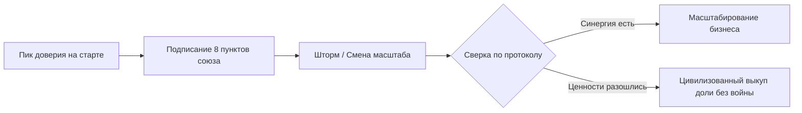

# Протокол 4: «Я с бизнес-партнёром»

Полночь. На экране смартфона светится окно общего рабочего чата учредителей. В два часа дня ты отправил туда развёрнутое сообщение с графиком кассового разрыва и списком неотложных платежей на пятницу. Возле сообщения стоят две синие галочки: «Просмотрено». Ответа нет уже десять часов.

Ты сидишь в тёмной кухне, сжимая в руке остывшую кружку, и чувствуешь, как под ложечкой разливается знакомый, тошнотворный холод. Ты ловишь себя на предательской мысли: завтра утром, пока он не пришёл в офис, собрать за закрытыми дверями ключевых топов и «по-честному» рассказать им, как обстоят дела на самом деле. Старая университетская дружба, под звон бокалов переросшая десять лет назад в общий бизнес, трещит по швам. Официальные учредительные документы в сейфе ещё безупречны, но в живом поле доверие уже сгорело дотла.

Партнёрство в бизнесе — это союз равных, построенный на взаимной синергии и бескомпромиссной честности. Если этой синергии больше нет, а в воздухе повисла токсичная недосказанность, наивно надеяться на «ещё один стратегический выездной тимбилдинг». Зрелость лидера проявляется не в попытках любой ценой склеить разбитую вазу, а в способности провести цивилизованный, благородный развод, сохранив капитал, достоинство и чистоту своего имени.

> [!NOTE]
> **Нейробиология экономической несправедливости и ультимативные игры**  
> Эксперименты нейроэкономистов с классической игрой «Ультиматум» (Ultimatum Game) доказали: когда человек сталкивается с распределением ресурсов, которое его подсознание оценивает как несправедливое, у него активируется передняя островковая доля мозга (anterior insula). Это та же самая зона, которая вспыхивает при физической боли или ощущении запаха тухлого мяса. Мозг воспринимает нечестного партнёра не как «ошибшегося коллегу», а как токсичного паразита. В этот момент включается иррациональная готовность нанести ответный удар, даже ценой полного уничтожения собственной выгоды и крушения компании.

---

## Сеттинг: контракт союза в мирное время

Девяносто процентов партнёрств погибают по одной банальной причине: люди договариваются о свадьбе, но стесняются заранее обсудить правила развода. На старте проекта, когда все охвачены эйфорией первых успехов, любые разговоры об отступных или долях кажутся мелочным недоверием.

Однако железный закон COREX гласит: **соглашение о выходе должно быть подписано в день максимальной любви и доверия.** Когда начнётся шторм и стороны охватит обида, договориться по-человечески будет уже невозможно.

### Восемь фундаментальных пунктов соглашения

1. **Единый горизонт и метрики успеха.** Какую компанию мы строим через три года в твёрдых оцифрованных показателях? Если один партнёр мечтает о дивидендной стабильности и размеренной жизни в Альпах, а второй жаждет захватить весь мировой рынок через бесконечные венчурные раунды, они неизбежно перегрызут друг другу глотки.
2. **Нерушимые ценностные табу.** Три-пять фундаментальных принципов, которые оба учредителя произносят без запинки. Нарушение любого из них (откаты, фальсификация отчётности, публичное унижение партнёра) означает немедленный запуск процедуры прекращения союза.
3. **Разделение властей и суверенные мандаты.** Кто за что отвечает безоговорочно. Если один партнёр держит продукт и технологии, второй не лезет в архитектуру кода. Если второй ведёт финансы и продажи, первый не вмешивается в переговоры с клиентами без прямого запроса.
4. **Зоны абсолютного вето.** Список стратегических решений, которые могут быть приняты только единогласно: привлечение внешних кредитов свыше установленной суммы, продажа ключевых активов компании, назначение топ-менеджеров с прямым подчинением совету директоров.
5. **Финансовая дисциплина основателей.** Твёрдые правила: фиксированная рыночная зарплата за операционные функции, график и условия выплаты дивидендов, абсолютный запрет на использование кассы компании в личных целях. Никаких «перехватить до конца месяца на ремонт машины».
6. **Алгоритм разрешения тупиков (Deadlock Protocol).** Если голоса разделились 50 на 50, а решение критически важно: сначала закрытая встреча 1:1 без свидетелей, затем привлечение независимого профессионального медиатора. Если компромисс не найден — запуск механизма выкупа.
7. **Триггеры обязательного пересмотра договора.** События, при которых основатели обязаны сесть за стол и актуализировать карту: привлечение крупного раунда инвестиций, рождение детей, критическое выгорание или тяжёлая болезнь одного из соучредителей.
8. **Формула цивилизованного выхода (Buy-Sell Agreement).** Чёткая, математически прозрачная методика оценки стоимости доли при выходе одного из партнёров (мультипликатор к чистой прибыли или EBITDA за последние 12 месяцев). Сроки рассрочки платежей, гарантирующие, что выкуп не убьёт оборотный капитал предприятия.

---

## Тест на совместимость: восемь прямых вопросов

Прежде чем вкладывать общие миллионы и регистрировать юридическое лицо, закройтесь в переговорной на два часа и по очереди ответьте вслух на восемь контрольных вопросов:

1. *«Зачем лично мне этот бизнес помимо денег? Какую экзистенциальную рану я пытаюсь исцелить этим проектом?»*
2. *«Что лично для меня является предательством со стороны партнёра? Приведи самый болезненный сценарий из твоего прошлого опыта».*
3. *«В чём моя самая сильная, хищническая суперсила, и в какую зону ты обязуешься не лезть со своими советами?»*
4. *«В чём моя главная слабость и слепая зона, где мне жизненно необходима твоя подстраховка?»*
5. *«Как именно я веду себя, когда нахожусь на пике стресса? Я ору, замыкаюсь, нападаю или исчезаю? Что тебе нужно делать в этот момент?»*
6. *«Какой ежемесячный личный доход необходим каждому из нас, чтобы мы не чувствовали себя обделёнными и не смотрели голодными глазами в общую кассу?»*
7. *«Готов ли ты в случае критического расхождения во взглядах продать свою долю по заранее оговорённой формуле и уйти без обиды и мести?»*
8. *«Что мы делаем, если через два года один из нас поймёт, что хочет заниматься совершенно другим делом?»*

Если при ответе на любой из этих вопросов твой визави начинает мяться, уходить в общие философские фразы или отшучиваться: *«Да ладно тебе, мы же друзья, сочтёмся как-нибудь»*, — остановись. Это красный флаг максимального уровня опасности. Твой корабль ещё не отплыл от причала, а на борту уже заложена пороховая бочка с зажжённым фитилём.

> [!IMPORTANT]
> **Табу: смешение дружбы и управления**  
> Самый разрушительный грех в бизнесе — решать рабочие вопросы из позиции старой дружбы, а в дружеские посиделки приносить претензии по операционке. Если вы друзья и партнёры одновременно, у вас должно быть два абсолютно изолированных контура. За столом совета директоров вы — два профессионала, подотчётных перед цифрами и командой. В баре в пятницу вечером вы — друзья, для которых бизнес табуирован. Тот, кто не способен выдержать эту гигиену границ, потеряет и компанию, и друга.

---

## Диагностика: пять маркеров скрытой эрозии союза

Партнёрство редко взрывается внезапно. Гниение начинается задолго до публичных скандалов и судебных разбирательств. Обрати внимание на эти пять симптомов:

* **Информационная асимметрия.** Ты случайно узнаёшь о важных переговорах, переводах средств или кадровых перестановках от третьих лиц или рядовых сотрудников.
* **Подковерные коалиции.** Партнёр начинает настраивать менеджмент против тебя, кулуарно шепчась в курилках: *«Вы же знаете, шеф у нас витает в облаках, реально тяну всё я»*.
* **Дисбаланс энергии и вклада.** Один из партнёров пашет по четырнадцать часов в сутки без выходных, а второй появляется в офисе раз в неделю на два часа, требуя при этом равного распределения дивидендов.
* **Потеря уважения в интонациях.** Появление пассивной агрессии, сарказма на общих планёрках, демонстративное игнорирование сообщений в мессенджерах.
* **Отказ от открытого аудита.** Любая просьба предоставить детальную финансовую выписку или аудит клиентской базы встречается с обидой: *«Ты что, мне не доверяешь?!»*

Если на табло зажглись хотя бы два таких маркера, иллюзий строить нельзя. Время уговоров прошло. Пора инициировать официальный совет партнёров и вскрывать назревший нарыв.

---

## Протокол цивилизованного выхода: Shotgun Clause

Если пути окончательно разошлись, зрелый лидер действует по заранее прописанному алгоритму. В мировой практике высшим стандартом разрешения неразрешимых споров является так называемый механизм «техасской перестрелки» (Shotgun Clause):

1. **Инициация предложения.** Партнёр А направляет партнёру Б официальное безотзывное предложение с указанием конкретной цены за одну акцию (долю) компании.
2. **Право выбора.** Партнёр Б, получив уведомление, имеет право выбора из двух вариантов:
   * Либо продать свою долю партнёру А по указанной в предложении цене;
   * Либо выкупить долю партнёра А точно по этой же цене за акцию.
3. **Защита от спекуляций.** Этот элегантный алгоритм из теории игр полностью исключает манипуляции: инициатор не может назвать заниженную цену, иначе у него мгновенно выкупят его собственный пакет за бесценок. Он вынужден назвать кристально честную, справедливую рыночную стоимость.

После закрытия сделки стороны подписывают взаимное соглашение о неразглашении (NDA), отказ от взаимных претензий и публичный пресс-релиз, в котором благодарят друг друга за годы совместной созидательной работы. Команда сохраняет спокойствие, клиенты не разбегаются, а бывшие партнёры остаются свободными, суверенными людьми, готовыми к новым великим свершениям.
