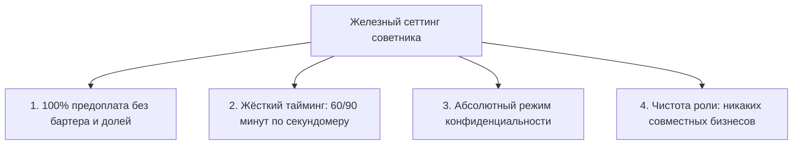
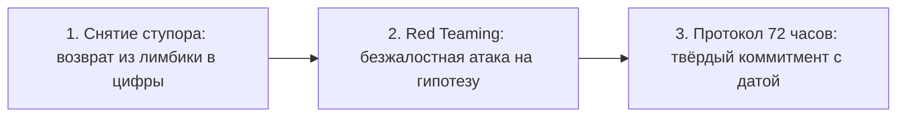

# Протокол 5: «Я с клиентом (C-Level Advisory)»

Он распахивает дверь переговорной на пятнадцать минут позже назначенного времени. Дорогой костюм безупречного кроя, на запястье поблескивают часы стоимостью в приличную квартиру, на лице играет та снисходительная, ленивая полуулыбка человека, который привык, что мир подстраивается под его ритм. Он бросает на полированный стол тяжелый смартфон и с порога заявляет: *«Рынок сдох. Команда разложилась, кругом одни бездари и предатели. Партнёры выкручивают руки. Скажи мне, что делать»*.

Ни цифр. Ни фактов. Ни дат. Только густой, токсичный бульон из чужого аффекта, замаскированного под стратегическую усталость. Он откидывается на спинку кожаного кресла и выжидательно смотрит на тебя, ожидая привычного подобострастного кивка.

У тебя пересыхает в горле. В подсознании услужливо всплывает сумма шестизначного ежемесячного гонорара, который этот человек платит за твоё сопровождение. Твои губы уже сами готовы растянуться в угодливую улыбку понимания: *«Да, конечно, времена сейчас непростые...»*

Остановись. Сделай медленный вдох через нос и почувствуй стопами твёрдый пол.

Если ты сейчас кивнёшь — ты мёртв как советник. Этот лидер нанял тебя не для того, чтобы за свои же миллионы слушать сладкую ложь. В его свите уже стоят десятки вице-президентов, директоров и секретарей, которые смотрят ему в рот и ловят каждое движение брови. Он пришёл к тебе за единственной вещью, которую невозможно купить на открытом рынке: за кристально чистым, бескомпромиссным зеркалом реальности. Если ты испугаешься его миллиардов или свирепого взгляда — ты превратишься в дорогого придворного шута. А компания, которую ты обязан был отрезвить, через полгода с грохотом разобьётся о скалы рынка.

> [!NOTE]
> **Нейробиология власти и «синдром гибриса»**  
> Нейробиологические эксперименты Дачера Келтнера (Dacher Keltner, University of California, Berkeley) и исследования Дэвида Оуэна в отношении «синдрома гибриса» (Hubris Syndrome) показывают: длительное нахождение на вершине власти вызывает структурные изменения в мозге, поразительно напоминающие последствия черепно-мозговой травмы. У лидеров резко снижается активность системы зеркальных нейронов, деградирует способность к эмпатии и распознаванию рисков. Мозг первого лица начинает отфильтровывать любую информацию, не подтверждающую его величие. Советник COREX выполняет функцию внешней искусственной префронтальной коры, насильственно возвращающей лидера к контакту с физической реальностью.

---

## Сеттинг: четыре железные опоры независимости

Никакой спарринг невозможен, если советник находится в уязвимой или зависимой позиции. Сеттинг соглашения с первым лицом выстраивается до первой минуты совместной работы и не сдвигается ни на миллиметр, даже если клиент предлагает удвоить чек или зовёт на личный вертолёт.

### 1. Финансовый суверенитет

Только стопроцентная предварительная оплата. Никаких «потом закроем по результатам квартала», никакого бартера услугами, никакого входа в опционы или доли в компании клиента. Как только советник начинает зависеть от курсовой стоимости акций заказчика, его взгляд мутнеет, а зеркало превращается в кривое стекло собственных корыстных интересов.

### 2. Территория и хронометраж

Сессия длится ровно 60 или 90 минут. Если клиент опоздал на двадцать минут — это его личный выбор, но время сессии не продлевается ни на секунду. Пространство встречи должно быть абсолютно нейтральным: закрытый кабинет без посторонних ушей, выключенные телефоны, отсутствие секретарей и помощников.

### 3. Абсолютная тайна исповеди (NDI)

Всё, что звучит в переговорной — финансовые махинации, сомнения в собственной дееспособности, панические атаки перед советом директоров, семейные драмы — остаётся в этих стенах навсегда. Советник никогда не использует кейсы действующего клиента для самопиара или демонстрации своей осведомлённости в кулуарах.

### 4. Абсолютная чистота ролей

Советник первого лица не становится его другом, собутыльником, крестным отцом его детей или инвестором его стартапов. Как только возникает эмоциональное панибратство, профессиональный контракт уничтожается. Ты перестаёшь быть зеркалом и становишься заложником чужой семейной или корпоративной драмы.

---

## Точка входа: опенер бескомпромиссного зеркала

В первые две минуты сессии, до того как клиент начнёт вываливать свои гипотезы, советник обязан явно и вслух утвердить правила игры. Это не формальность, а психологическая вакцинация против сопротивления эго.

### Текст священного контракта

> *«Добрый день, Алексей. Наш таймер запущен, у нас ровно шестьдесят минут. Твоя предоплата закрыта, соглашение о конфиденциальности действует.  
> 
> Перед тем как мы начнём, я хочу напомнить суть моей роли. Я — твоё независимое внешнее зеркало. Я не твой подчинённый, я не претендую на твою похвалу и не боюсь твоего гнева. Моя единственная задача — показывать тебе объективную реальность без прикрас, называть вещи своими именами и вскрывать уязвимости в твоих решениях, даже если это будет для тебя крайне некомфортно.  
> 
> Если ты пришёл сюда за тем, чтобы я погладил твоё самолюбие — лучше забери деньги прямо сейчас. Если ты готов к беспощадному честному спаррингу — кивни и скажи мне вслух: «Я принимаю эту рамку»*.

Пока клиент не произнесёт вслух ясное, осознанное согласие, сессия не начинается. Ты не двигаешься дальше. Ты ждёшь. Этот момент инициации ломает привычный паттерн властного доминирования и переводит взаимодействие в плоскость «взрослый со взрослым».

---

## Три боевые задачи каждой стратегической сессии

Сессия с первым лицом не имеет ничего общего с академическими лекциями или абстрактными рассуждениями «за жизнь». Это высокоточная хирургическая операция, решающая три конкретные задачи:

### 1. Перевод из лимбической драмы в язык фактов

Когда лидер заявляет: *«У нас катастрофа, поставщики нас предали!»*, советник немедленно активирует инструмент **«Язык видеокамеры»**:
* *«Что конкретно зафиксировала бы бесстрастная видеокамера? Какой пункт договора нарушен? Каков точный объем сорванной партии в тоннах? Сколько денег мы теряем в день? Где акт сверки?»*
* Как только эмоции рассекаются скальпелем точных определений, панический страх отступает. Проблема перестаёт казаться экзистенциальным концом света и превращается в тривиальную инженерную задачу.

### 2. Беспощадный Red Teaming и Pre-Mortem

Первые лица часто влюбляются в свои гениальные идеи. Они окружают себя аналитиками, которые услужливо рисуют графики экспоненциального роста. Задача советника — провести мысленный эксперимент Гари Кляйна:
* *«Представь, что прошёл ровно год. Твой проект с треском провалился, мы потеряли три миллиона долларов, а конкуренты смеются над нами на отраслевой конференции. Назови мне пять конкретных причин, почему этот труп лежит перед нами?»*
* Этот приём снимает блокировку с подсознания: лидер перестаёт обороняться и сам начинает видеть скрытые течи в днище своего флагмана.

### 3. Одностраничный протокол с дедлайном 72 часа

Ни одна сессия не заканчивается на стадии «мы отлично поштурмили». Итогом встречи становится ровно один лист бумаги, на котором зафиксировано:
* **Фокус недели:** главная системная точка приложения усилий.
* **Три необратимых действия:** конкретные шаги, которые должны быть совершены в течение ближайших 72 часов.
* **Критерий выполнения:** фамилия ответственного лица и дата проверки.

> [!TIP]
> **Принцип «Не трогай руль клиента»**  
> Советник никогда не говорит первому лицу: «Сделай вот так». Это грубейшая ошибка, убивающая субъектность лидера. Зрелый мастер формулирует дилеммы: *«Ты видишь развилку: вариант А несёт такие системные риски, вариант Б требует таких ресурсов. Выбор — только твой. Какое решение ты принимаешь прямо сейчас?»* Ответственность за бизнес должна целиком и полностью оставаться на плечах того, кто владеет компанией.

---

## Диагностика: когда клиент пытается сломать рамку

Лидеры с гипертрофированным эго постоянно тестируют советника на прочность. Они делают это неосознанно — так альфа-волк проверяет зубы претендента на лидерство. Обрати внимание на классические провокации:

* **Попытка обесценивания:** *«Ты никогда не управлял заводом с пятью тысячами рабочих, откуда тебе знать наши реалии?»*  
  *Ответ советника:* *«Именно потому, что я не завяз в твоей заводской рутине, я вижу системную слепоту твоего топ-менеджмента со стороны. Если тебе нужен опытный технарь — найми главного инженера. Если нужно спасти маржинальность бизнеса — слушай, что я показываю»*.
* **Попытка купить дружбу:** *«Слушай, бросай эти формальности, погнали на выходных на охоту на моем вертолёте, там всё и обсудим»*.  
  *Ответ советника:* *«Спасибо за приглашение, Алексей. Мой контракт исключает неформальные поездки. За эти деньги ты покупаешь мою кристальную трезвость, а не компанию для застолья»*.
* **Пассивная агрессия и срыв дедлайнов:** систематические опоздания, проверка почты во время сессии, невыполнение коммитментов 72 часов.

> [!IMPORTANT]
> **Правило трёх предупреждений**  
> Если клиент во второй раз срывает рамку сеттинга (систематически опаздывает, отвлекается на телефонные звонки во время работы или не выполняет согласованные шаги), советник выносит прямое официальное предупреждение. При третьем нарушении контракт расторгается в одностороннем порядке без возврата предоплаты. Способность встать из-за стола и выйти — главное оружие и залог непререкаемого авторитета настоящего мастера COREX.
