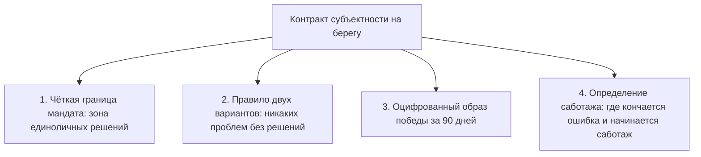
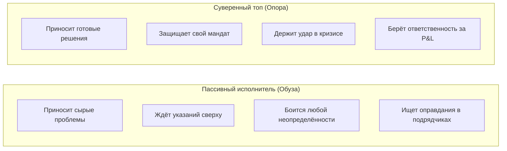

# Протокол 6: «Я с топ-менеджером»

Среда, три часа дня. Регулярная встреча один на один с твоим директором по маркетингу или руководителем операционного блока. Человек с солидным резюме, впечатляющим списком регалий и высокой рыночной зарплатой сидит напротив тебя в кресле. Прошло двадцать минут встречи, и вот он с виноватым вздохом выкладывает на стол очередную проблему: *«Подрядчики срывают сроки интеграции CRM. Клиенты жалуются, лиды дорожают. Я не знаю, как на них надавить. Что нам делать?»*

Ни одного предложенного сценария. Никаких расчётов альтернатив. Только застывший в глазах немой призыв: «Шеф, спаси».

У тебя привычно сжимаются скулы. В голове моментально вспыхивает нервный импульс: *«Господи, да мне быстрее самому позвонить их генеральному и за десять минут всё разрулить, чем полтора часа объяснять этому человеку элементарные вещи!»* Твои руки уже сами тянутся к клавиатуре, пальцы открывают мессенджер...

Остановись. Убери руки от стола. Откинься на спинку кресла.

Если ты сейчас заберёшь эту задачу себе — ты проиграл матч. Ты совершил классическое управленческое самоубийство, описанное ещё Уильямом Онкэном в его знаменитой притче об «обезьяне на спине». Ты только что позволил дорогому наёмному топу пересадить свою орущую обезьяну на твои плечи. 

К вечеру пятницы ты будешь задыхаться от шестидесятичасовой рабочей недели, выжатый, злой и дёрганый, срываясь на домашних и бормоча: *«Кругом одни идиоты, ничего нельзя доверить!»* А твой топ-менеджер в шесть вечера закроет крышку ноутбука и со спокойной совестью пойдёт пить раф в ближайшую кофейню. Ты купил сомнительную скорость на три дня, но окончательно кастрировал субъектность своего руководителя на весь квартал.

> [!NOTE]
> **Нейробиология автономии и модель SCARF**  
> Исследования Дэвида Рока (NeuroLeadership Institute) и теория самодетерминации Эдварда Деси и Ричарда Райана доказывают: ощущение автономии (Autonomy) — базовый биологический драйвер мозга. Когда руководитель забирает задачу обратно или начинает диктовать мельчайшие шаги реализации, мозг подчинённого реагирует на микроменеджмент как на физическую угрозу статусу (Status threat). Выброс кортизола парализует префронтальную кору, погружая сотрудника в состояние «выученной беспомощности». Напротив, когда лидер удерживает границу и требует самостоятельного выбора, у менеджера активируется стриатум и выделяется дофамин от преодоления сложного вызова.

---

## Сеттинг: контракт на берегу при первом One-to-One

Отношения с ключевым руководителем не выстраиваются стихийно. До того как топ-менеджер погрузится в операционный водоворот, лидер обязан провести установочную сессию и зафиксировать правила игры на берегу.

### Четыре пункта взрослого соглашения

1. **Границы суверенного мандата.** Топ-менеджер должен с абсолютной ясностью понимать: в каких вопросах он обладает правом последней подписи и единоличного распоряжения бюджетом, а какие требуют согласования с генеральным директором. Если граница размыта, топ либо будет парализован страхом ошибки, либо станет совершать самовольные катастрофические действия.
2. **Железное «правило двух решений».** Руководитель подписывает священный закон коммуникации: *«Ты имеешь право прийти ко мне с любой, самой чудовищной проблемой. Но ты не имеешь права войти в мой кабинет, не имея в руках минимум двух продуманных вариантов её решения с оценкой рисков и ресурсов по каждому»*.
3. **Оцифрованный образ победы.** Что конкретно является критерием блестящей работы через 30, 60 и 90 дней? Не процессные отчёты, а твёрдые метрики: сокращение стоимости привлечения клиента на 18%, запуск склада без единого сбоя, найм четырёх сеньор-разработчиков.
4. **Критерии саботажа и некомпетентности.** Честный разговор о красных линиях: *«Если ты допустил ошибку в гипотезе и потерял деньги — мы разберём урок и пойдём дальше. Но если ты скрыл проблему, солгал в цифрах или начал кулуарно жаловаться команде на руководство — мы расстанемся в тот же день»*.

---

## Регламент эффективного One-to-One: хронометраж тридцати минут

Встреча 1:1 — это не планёрка по статусу текущих тикетов. Для статусов есть канбан-доски и дашборды. Индивидуальная встреча с первым лицом предназначена для калибровки мышления, снятия барьеров и выращивания внутреннего предпринимателя.

| Этап встречи | Хронометраж | Что происходит за столом | Чего делать категорически нельзя |
| --- | --- | --- | --- |
| **1. Монолог топа** | Первые 10 минут | Топ-менеджер озвучивает ключевые вызовы, победы недели и узкие горлышки. Лидер молчит и слушает. | Перебивать на полуслове, комментировать, хвататься за телефон. |
| **2. Защита вариантов** | 10 минут | Топ презентует два варианта решения сложной дилеммы и аргументирует свой выбор. | Говорить готовый ответ: «Делай как я скажу». |
| **3. Сократовский спарринг** | 5 минут | Лидер задаёт точечные вопросы, вскрывающие слепые зоны гипотезы. | Читать лекции о своём богатом предпринимательском опыте. |
| **4. Твёрдый коммитмент** | Финальные 5 минут | Топ озвучивает решение под протокол: фамилия, действие, дедлайн в пределах 72 часов. | Завершать встречу фразой «ну, посмотрим по ситуации». |

> [!TIP]
> **Три сократовских вопроса вместо приказа**  
> Когда топ-менеджер умоляет подсказать верное решение, используй три вопроса, возвращающих ответственность:
> 1. *«Если бы это была твоя собственная компания и твои личные деньги на кону — какой вариант ты бы выбрал прямо сейчас?»*
> 2. *«Какой самый худший сценарий может произойти при реализации твоего плана, и как именно ты будешь его купировать?»*
> 3. *«Какая помощь от меня как генерального директора тебе нужна, чтобы твой план сработал безупречно?»*

---

## Диагностика: исполнитель против субъекта

Наблюдая за поведением топ-менеджера на дистанции нескольких месяцев, лидер обязан безошибочно различать два психотипа:

Если перед тобой талантливый исполнитель, который панически боится ответственности — не пытайся сделать из него вице-президента. Он сгорит сам и завалит направление. Переведи его на позицию ведущего эксперта или аналитика. 

Но если топ-менеджер систематически саботирует договорённости, демонстрирует скрытое сопротивление, «забывает» внести правки и сеет токсичные сомнения среди линейных сотрудников — перед тобой скрытый бунт.

---

## Различение: некомпетентность или скрытый саботаж

Когда результаты падают, лидер должен провести точную диагностику причины:

1. **Некомпетентность (не хватает скилла):** человек открыто признаёт трудность, жадно просит литературы, готов учиться у внешних консультантов, горит делом, но путается в методологии.  
   *Решение:* предоставить обучение, нанять внешнего ментора или дать сильного заместителя.
2. **Саботаж (проблема в отношении и воле):** человек виртуозно находит виноватых во внешней среде, саркастически комментирует решения совета директоров, формально выполняет регламенты («итальянская забастовка»), но в воздухе стоит ледяное равнодушие к результату.  
   *Решение:* немедленное увольнение. Саботаж — это инфекция, поражающая всю ткань корпоративной культуры.

> [!IMPORTANT]
> **Закон неприкасаемости мандата**  
> Никогда не отдавай распоряжений сотрудникам через голову их непосредственного руководителя. Если генеральный директор прибегает в отдел продаж и начинает раздавать указания менеджерам в обход коммерческого директора — коммерческий директор перестаёт существовать как властная фигура. Если ты не доверяешь своему топ-менеджеру — уволь его. Но пока он в должности — соблюдай суверенную цепочку командования.
