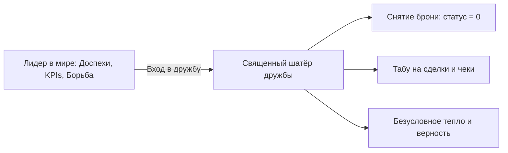

# Протокол 7: «Я с другом»

Вечер пятницы в шумном столичном ресторане. Официант ещё не успел принести горячее, а разговор за столом уже привычно сполз в колею делового отчёта: оборотные средства, кадровый голод, раунды инвестиций, покупка недвижимости в Дубае. Вы сидите друг напротив друга и меряетесь оценками своих бизнесов точно так же, как старые рубаки меряются боевыми шрамами.

Ты смотришь на человека, с которым когда-то делил одну пачку пельменей в студенческом общежитии и мечтал изменить мир. И вдруг чувствуешь, как в груди разливается глухая, ледяная пустота. 

Не потому, что твой друг стал плохим. А потому, что за этим столом больше нет друзей. Сидят два настороженных функционера, два ходячих бренда, непрерывно сканирующих друг друга на предмет полезности, связей и скрытых угроз. Настоящий друг растворился, уступив место «стратегическому контакту из телефонной книги».

По мере роста капитала и масштаба власти дружба становится самым дефицитным и хрупким активом в жизни лидера. Вокруг тебя выстраивается плотная стена людей, которым от тебя что-то нужно: деньги, контракты, протекция, статусное селфи. Если ты позволишь рыночной логике сожрать последний островок чистой человеческой близости, через пару лет ты обнаружишь себя на вершине ледяной горы — невероятно богатым, влиятельным и абсолютно, смертельно одиноким.

> [!NOTE]
> **Нейробиология социального буфера и цена лидерского одиночества**  
> Масштабные мета-анализы профессора Джулианны Холт-Лунстад (Университет Бригама Янга) убедительно доказали: хроническое социальное одиночество и отсутствие глубоких доверительных связей эквивалентны по вреду для организма выкуриванию 15 сигарет в день и наносят больший урон сердечно-сосудистой системе, чем ожирение или гиподинамия. Исследования Робина Данбара (Оксфордский университет) подтверждают: подлинный контакт со старыми близкими друзьями активирует мю-опиоидную систему мозга, запускает мощный эндорфиновый всплеск и обеспечивает так называемый «социальный буфер» (Social Buffering), который буквально смывает последствия затяжного стресса высоких кабинетов.

---

## Священный закон: дружба как территория вне рынка

Дружба по протоколу COREX — это единственное пространство в жизни лидера, где **категорически запрещены любые транзакции, метрики эффективности и протоколы 72 часов.**

Здесь нет генеральных директоров, нет списков Forbes, нет победителей и проигравших. Здесь не нужно держать фасад успешного успеха и не нужно доказывать своё право на уважение. Это священное убежище, где воин имеет право снять свой титановый шлем, лечь на траву и быть просто живым человеком — уязвимым, растерянным, смешным или грустным.

---

## Сеттинг: границы заповедной зоны

Дружба не выживает сама по себе в агрессивной среде большого бизнеса. Чтобы сохранить её чистоту, два зрелых человека заключают негласный, но железобетонный пакт о разделении контекстов.

### Четыре правила суверенной дружбы

1. **Абсолютный запрет на скрытые продажи.** Если ты встретился со старым другом — забудь о желании «заодно» предложить ему стать инвестором твоего нового фонда, купить партию твоего товара или познакомить тебя с нужным чиновником. Как только в дружеский разговор проникает корыстный коммерческий интерес, дружба умирает. Если тебе действительно нужно деловое сотрудничество — назначь официальную встречу в офисе в рабочий полдень и говори на языке цифр. Не оскверняй священный стол.
2. **Нулевая толерантность к статусной конкуренции.** В компании друга запрещено хвастаться новыми часами, элитными машинами и размером годовых бонусов. Если у твоего друга временные финансовые трудности — ты никогда не подчеркнёшь свой триумф. А если у него случился провал — твоё сердце сожмётся от искреннего сочувствия, а не от тайной, ядовитой радости превосходства (Schadenfreude).
3. **Друг — не бесплатный психотерапевт и не дешёвый консультант.** Не превращай встречи с друзьями в бесконечный слив токсичных жалоб на тяжёлую долю, неверную жену или тупых сотрудников. Дружба питается взаимной радостью, живым смехом, совместными приключениями и тёплым присутствием, а не паразитированием на чужом эмоциональном ресурсе.
4. **Право на слабость и исповедь.** Это место, где можно вслух произнести слова, за которые на бирже тебя сожрали бы заживо: *«Брат, я дико устал. Я не знаю, куда двигаться дальше. Мне просто страшно»*. И знать с абсолютной математической гарантией: эти слова никогда не станут предметом сплетен или оружием против тебя.

> [!IMPORTANT]
> **Правило двух разных столов**  
> Если судьба сложилась так, что вы с другом решили запустить совместный бизнес — немедленно разделите два стола. За столом совета директоров вы — бескомпромиссные деловые партнёры, где дружба не может быть оправданием невыполненных обязательств. Но в пятницу вечером вы садитесь за другой стол, выключаете рабочие телефоны и накладываете строжайшее вето на любые разговоры о делах фирмы. Тот, кто не способен выдержать эту дистанцию, неизбежно похоронит и общее дело, и многолетнюю дружбу.

---

## Ритуал встречи: возвращение в детство

Чтобы сбросить гипноз взрослой суеты, регулярные дружеские встречи требуют осознанной гигиены внимания:

* **Гаджеты в гардероб.** Во время дружеского ужина оба смартфона переводятся в режим полёта и убираются с глаз долой. Никаких «я только на секунду отвечу в чат акционеров». Твоё стопроцентное внимание — это высший дар уважения и любви к человеку, сидящему напротив.
* **Общие воспоминания и корни.** Вспомните, как вы мёрзли на вокзале с двадцатью рублями в кармане, как играли рок-н-ролл в сыром подвале, как дрались двор на двор. Возврат к истокам мгновенно сбивает спесь и напоминает душе о её истинном, не отравленном деньгами естестве.
* **Совместное физическое дело.** Настоящая дружба закаляется не в пафосных ресторанах с кальянами, а в совместном движении: сплав на байдарках по горной реке, восхождение на перевал, поход, баня на дровах с ледяной купелью, многокилометровый маршрут на велосипедах. Тело, преодолевающее стихию плечом к плечу с другом, вспоминает глубокое чувство надёжного плеча.

---

## Диагностика: когда дружба начинает умирать

Не закрывай глаза, если замечаешь у себя или у товарища эти тревожные симптомы:

* **Ты звонишь только тогда, когда тебе что-то нужно.** Твой звонок звучит не ради вопроса: *«Как твоё сердце? Как ты сам?»*, а с фразы: *«Слушай, у тебя случайно нет выхода на главного налоговика области?»*
* **Исчезла лёгкость и появился внутренний цензор.** Ты начинаешь тщательно фильтровать каждое слово, боясь показаться недостаточно солидным или неуспешным.
* **Встречи переносятся месяцами.** На сообщение друга ты отвечаешь дежурным: *«Дико занят, на следующей неделе спишемся»* — и пропадаешь на полгода.
* **Появилась зависть.** Успех друга вызывает у тебя не радостный крик восторга, а глухое жжение в груди и желание найти в его триумфе скрытый изъян или помощь богатых родственников.

Если ты узнал себя хотя бы в одном пункте — отложи эту книгу прямо сейчас. Возьми телефон, набери номер старого друга и скажи простые слова: *«Привет. Я давно не звонил и виноват. Я просто соскучился. Давай увидимся на выходных»*. 

В конце пути, когда погаснут софиты и замолкнут овации биржевых аналитиков, в твоей памяти останутся не строчки балансовых отчётов, а тепло верной руки, которая держала тебя над пропастью просто потому, что вы — друзья.
