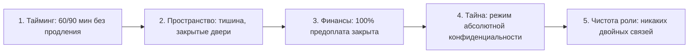
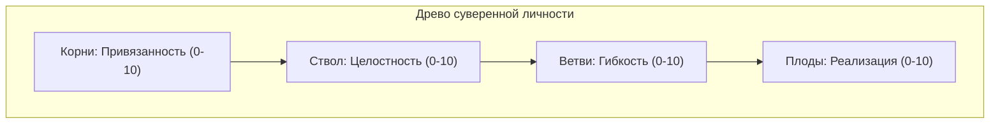
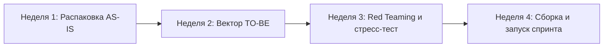

# Практикум: арсенал мастера и боевые бланки

К этому моменту книга передала тебе полную архитектуру метода. Теория завершена. Дальше начинается территория белого листа бумаги — единственного беспристрастного свидетеля, который не позволит тебе солгать себе после завершения трудного разговора или стратегической сессии.

Человеческий мозг под давлением стресса склонен к мгновенной самоамнистии: он виртуозно переписывает воспоминания, сглаживает углы и находит блестящие оправдания собственной нерешительности. Бумага не знает жалости. То, что зафиксировано чернилами, удерживает реальность и превращает хаос мыслей в строгий хирургический протокол.

Этот раздел — твой полевой инструментарий. Распечатай эти бланки, держи их в кожаной папке на рабочем столе и используй как штурманские карты перед выходом в открытое море высоких ставок.

> [!NOTE]
> **Психофизиология овеществления мысли и когнитивная разгрузка**  
> Исследования Атула Гаванде («Чек-лист. Как избежать глупых ошибок») и лауреата Нобелевской премии Даниэля Канемана показывают: в условиях высокой когнитивной перегрузки рабочая память лидера (System 2) неизбежно сбоит, пропуская критические микросигналы. Овеществление решений на бумаге снижает ментальное напряжение в префронтальной коре на 40%, выключает парализующую руминацию (навязчивое пережёвывание тревожных мыслей) и активирует моторные зоны коры, программируя нервную систему на прямое физическое действие.

---

## Чек-лист предстартового сеттинга

Используется мастером или лидером **ровно за 15 минут до начала любой важной сессии, переговоров или трудного диалога.** Если хотя бы два пункта горят красным — пространство не собрано. Входить в контакт нельзя: ты проиграешь чужому аффекту.

### Внешний периметр



| Параметр | Критерий готовности | Состояние |
| --- | --- | --- |
| **1. Тайминг** | Слот 60 или 90 минут зафиксирован в календаре. Действует правило отмены за 24 часа. | [ ] Готово |
| **2. Пространство** | Закрытый кабинет или защищённый канал связи. Полное отсутствие посторонних звуков и свидетелей. | [ ] Готово |
| **3. Финансы** | Стопроцентная предоплата на счёте. Никаких долговых хвостов, бартера или подарков. | [ ] Готово |
| **4. Конфиденциальность** | Подтверждён режим абсолютной тайны исповеди. Запись отключена, телефоны в беззвучном режиме. | [ ] Готово |
| **5. Чистота роли** | Отсутствие двойных связей: с этим человеком нет общего распила долей, романов или взаимных долгов. | [ ] Готово |

### Внутренний камертон мастера

* **Суверенная идентичность:** я стою на позиции «равный с равным». Во мне нет трепета перед чужими миллиардами, властью или громким титулом.
* **Устойчивая дистанция:** я готов быть предельно близко к чужой боли, не проваливаясь в созависимое спасательство и драму.
* **Радикальная нейтральность:** мои моральные оценки, высокомерие и нравоучения сброшены. Я — чистое стекло, отражающее факты.
* **Физический контейнер:** челюсть расслаблена, плечи опущены, диафрагма свободна, стопы плотно упираются в пол. Моё тело способно выдержать чужой эмоциональный взрыв.
* **Отказ от нарциссизма:** у меня нет скрытого желания понравиться, показаться гением или спасти чужую душу вопреки её воле.

---

## Пять жизненных регламентов носителя

Мастер COREX не имеет права садиться за стол спарринга с разряженной батареей. Это вопрос профессиональной этики: уставший, истощённый лидер совершает системные ошибки, которых никогда не допустил бы в ясном сознании.

| Регламент | Биологическая норма | Маркер сбоя при нарушении |
| --- | --- | --- |
| **1. Архитектура сна** | Отбой до 23:00, 7–8 часов непрерывного сна в абсолютной темноте и прохладе. Экраны гаснут за час до сна. | Первым падает эмоциональный контейнер: вспышки раздражения вместо невозмутимого присутствия. |
| **2. Чистое топливо** | Сбалансированный рацион: белки, клетчатка, сложные углеводы. Исключение пищевого мусора и сахарных пиков. | Инсулиновые качели посреди сессии, провал концентрации на 40-й минуте сложного разговора. |
| **3. Силовая закалка** | Регулярные физические нагрузки 3–4 раза в неделю, холодные обливания по утрам, плотная ходьба пешком. | Падает порог переносимости чужого стресса; тело начинает сжиматься в позу эмбриона. |
| **4. Священная тишина** | Минимум 24 часа в неделю в режиме цифрового детокса: без соцсетей, новостей и рабочих переписок. | Информационный шум засоряет слух; лидер перестаёт различать скрытые интонации собеседника. |
| **5. Раскрепощение тела** | Ежедневная разгрузка зажимов: растяжка шейного отдела, расслабление диафрагмы и тазового дна. | Спазм диафрагмы → поверхностное дыхание → мозг переходит в панический режим выживания. |

---

## Пятиминутный контур разрыва чужого сценария

Если посреди дня ты внезапно поймал себя на неадекватной реакции — вспышке ярости, детской обиде или желании спрятаться в угол — примени протокол C-O-R-E-X к самому себе. Найди тихое место, закрой глаза и пройди пять шагов:

1. **C (Calibrate — Калибровка):** В какой точке тела застрял спазм прямо сейчас? Назови физическое место: ком в горле, тяжесть в груди, узел в солнечном сплетении, онемение затылка. Не объясняй причину — почувствуй ткань зажима.
2. **O (Obstacle — Чей это ход?):** Чью интонацию, позу или слова я сейчас бессознательно копирую? Чей это сценарий: отца, школьного завуча, первого инвестора, бывшей жены? Назови конкретное имя.
3. **R (Result — Истинный суверенный отклик):** Каков мой собственный взрослый ответ в этой точке, если я свободен от чужих теней? Сформулируй ровно одну фразу от первого лица без частицы «не».
4. **E (Engine — Возврат чужого груза):** Сделай глубокий вдох животом и на выдохе мысленно скажи: *«Это твой опыт и твой страх. Я с уважением возвращаю его тебе. А себе я возвращаю мою силу»*. Физический маркер прохождения — спонтанный глубокий выдох и тепло в кончиках пальцев.
5. **X (eXecute — Одно твёрдое действие):** Соверши одно конкретное микродействие в ближайшие 60 минут, которое подтверждает твою суверенную позицию (спокойный звонок, отправка корректного письма, отказ от навязанного компромисса).

---

## Бланк экспресс-диагностики четырёх опор (Индекс MENASIS)

Заполняется в начале диагностической работы для фиксации точки А. Каждая опора оценивается по шкале от 1 до 10 баллов.



| Опора | Диагностический вопрос | Балл (1–10) | Твёрдый маркер нормы |
| --- | --- | --- | --- |
| **1. Целостность (Ствол)** | *«Кто я, если у меня забрать все мои деньги, титулы, проекты и признание?»* | _____ | Локус контроля внутри; отсутствие потребности доказывать свою значимость миру. |
| **2. Привязанность (Корни)** | *«На кого в этом мире я могу опереться всем весом и не бояться удара в спину?»* | _____ | Наличие глубокого, безопасного тыла; способность доверять близким без паранойи. |
| **3. Гибкость (Ветви)** | *«Как быстро моё сознание переходит от шока катастрофы к трезвому расчёту ходов?»* | _____ | Восстановление ясности мышления в течение 48 часов после удара судьбы. |
| **4. Реализация (Плоды)** | *«Каковы оцифрованные материальные плоды моего труда здесь и сейчас?»* | _____ | Твёрдые результаты в бизнесе и материи, признанные внешним независимым рынком. |

### Ключ к интерпретации суммы баллов

* **32–40 баллов (Зелёная зона суверенитета):** Система устойчива. Лидер готов к масштабной экспансии, сложным сделкам и выходу на институциональный уровень (уровни 4–5).
* **20–31 балл (Жёлтая зона напряжения):** Накопленная скрытая усталость. Немедленный запрет на новые стартапы и кредиты. Фокус на восстановлении тела, закрытии хвостов и укреплении фундамента (уровни 1–3).
* **Ниже 20 баллов (Красная зона Degraded Mode):** Критическое истощение несущих конструкций. Активация аварийного протокола: делегирование всей операционки заместителю, неделя сна, медицинский чекап, запрет на любые стратегические решения.

---

## Диагностическое интервью MENASIS: 30 стратегических вопросов

Проводится в формате двухчасового глубинного интервью. Задача ведущего — не просто слушать слова, а фиксировать телесные микрореакции: задержку дыхания, отвод глаз, изменение тембра голоса.

### Блок 1. Экосистема и жизненный контекст
1. Если бы ты писал роман о текущем этапе своей жизни, каков его главный драматический конфликт?
2. Назови три ключевые планеты, которые вращаются на твоей орбите ближе всего к тебе?
3. Какое чужое ожидание прямо сейчас давит на тебя свинцовой плитой?
4. Опиши идеальный вторник через пять лет: во сколько ты проснулся, где ты находишься, что чувствует твоё тело?
5. В момент внезапной смертельной опасности что твоё тело делает рефлекторно: бьёт, замирает или бежит?

### Блок 2. Родовые корни, воля и суверенные границы
6. Какую негласную роль ты играл в родительской семье: спасатель, гордость рода, невидимка или бунтарь?
7. Какое событие юности навсегда раскололо твою жизнь на «до» и «после»?
8. В контакте с новыми людьми ты больше напоминаешь неприступный бастион с пушками или распахнутый штормовой порт?
9. Вспомни проект, который ты вытащил исключительно на стиснутых зубах. Ради чего ты терпел эту боль?
10. Когда твой проект терпит сокрушительный крах, какова твоя первая автоматическая мысль: «Где мой просчёт?» или «Кто меня подставил?»

### Блок 3. Мыслительные фильтры и внутренняя конституция
11. Вспомни случай, когда ты сознательно нарушил общепринятый моральный или юридический закон. Что ты чувствовал в этот момент?
12. После трёхчасового многолюдного приёма ты чувствуешь себя окрылённым или тебе нужно уйти в тёмную комнату и молчать?
13. При входе в новый масштабный бизнес ты сначала видишь глобальную стратегию или немедленно погружаешься в регламенты и сметы?
14. Как ты понимаешь, что решение принято абсолютно верно: математические расчёты в таблице или физический щелчок в груди?
15. Какое человеческое качество в партнёрах вызывает у тебя мгновенную, неконтролируемую ярость?

### Блок 4. Внутренние драйверы, капитал и призвание
16. Перед тобой две двери: гарантия абсолютной пожизненной сытости или дикая свобода, сопряжённая со смертельным риском. В какую дверь ты шагнёшь не задумываясь?
17. Представь: на твоём счёте лежит сумма с десятью нулями, и ты уже отдохнул целый год. Ради чего ты встанешь с постели завтра утром?
18. Если стереть всю твою память и оставить только три ключевых профессиональных навыка, что ты сохранишь?
19. В чём заключается твой природный гений коммуникации, который работает сам по себе, без малейших усилий?
20. Как ты осваивал своё последнее мастерство: через академические учебники и лекции или через набивание шишек на живой практике?

### Блок 5. Теневые стороны, триггеры и механизмы саботажа
21. Закончи фразу на одном дыхании, не задумываясь: *«Большие деньги — это...»*
22. Какая ничтожная бытовая мелочь способна сорвать с тебя маску вежливости и выпустить наружу разъярённого зверя?
23. Вспомни момент за последний год, когда ты растворился во времени и полностью забыл о еде и сне. Что именно ты делал?
24. Опиши свою самую уродливую, токсичную теневую версию в момент абсолютного бессилия.
25. Если бы у тебя была возможность взмахом руки исцелить одну системную болезнь человечества, что бы ты уничтожил?

### Блок 6. Масштаб амбиций и сценарии кризиса
26. Какая твоя собственная черта характера прямо сейчас является главным тормозом для роста компании в десять раз?
27. Ответь себе с кристальной честностью: кто ты в глубине души — единоличный царь на вершине горы, серый кардинал за кулисами или вольный странствующий архитектор?
28. Каким одним безжалостным словом твои ключевые топ-менеджеры опишут твоё поведение в момент глубокого кризиса?
29. Какой бесконечный диалог спорят два непримиримых голоса внутри твоей головы по ночам?
30. Если твой текущий флагманский бизнес завтра обанкротится — какова будет истинная, глубинная причина этой катастрофы?

---

## Одностраничный исполнительный протокол COREX

Заполняется по итогам сессии от руки. Никаких многостраничных отчётов: план, который не помещается на одном листе А4, никогда не будет реализован. Копия остаётся у лидера и у советника.

```
================================================================================
                    ИСПОЛНИТЕЛЬНЫЙ ПРОТОКОЛ СЕССИИ COREX
================================================================================
Лидер (Клиент): _________________________  Дата: _______________________________
Мастер (Советник): ______________________  Тайминг сессии: _____________________
--------------------------------------------------------------------------------
1. ТОЧКА А (Факты без драмы):
   - Фактический статус проблемы: _____________________________________________
   - Уровень витального ресурса лидера (1-10): _____  Индекс опор MENASIS: _____
   - Локализация затора (Голова / Команда / Регламенты / Касса): _______________

2. КОРНЕВОЙ УЗЕЛ:
   - Обнаруженный системный фол: ______________________________________________
   - Базовый бессознательный страх: ___________________________________________

3. ОБРАЗ ПОБЕДЫ (TO-BE):
   - Оцифрованная цель следующего спринта: _____________________________________
   - Новая поведенческая модель лидера: ________________________________________

4. ВЫБРАННЫЙ РЫЧАГ (Инструмент арсенала): ______________________________________

5. НЕОБРАТИМЫЙ КОММИТМЕНТ 72 ЧАСОВ (Strict Execution Window):
   [ ] Шаг 1: _____________________________________________ Дедлайн: ___________
   [ ] Шаг 2: _____________________________________________ Дедлайн: ___________
   [ ] Шаг 3: _____________________________________________ Дедлайн: ___________

Дата следующего контрольного чек-ина: __________________________________________
--------------------------------------------------------------------------------
Подпись Лидера: ______________________    Подпись Мастера: _____________________
================================================================================
```

> [!IMPORTANT]
> **Закон 72 часов**  
> Любое управленческое озарение или решение, которое не воплотилось в физическое необратимое действие в течение первых 72 часов, с вероятностью 95% растворится без следа. Либо ты делаешь первый материальный шаг (подписание приказа, транш, официальный разговор) в течение трёх суток — либо ты просто впустую потратил время и деньги на сессии.

---

## Дорожная карта трансформации: 4-недельный цикл LUMA TWIN

Регламент работы с двойником реальности для перевода системы из состояния текущей перегрузки (AS-IS) в желаемое суверенное будущее (TO-BE).



* **Неделя 1: Бескомпромиссная оцифровка точки А (AS-IS).** Сплошной аудит утечек энергии, выгрузка застарелых обид и страхов, глубокая оцифровка профиля MENASIS. Первый честный взгляд на своего двойника в зеркале: снятие иллюзий о собственной незаменимости.
* **Неделя 2: Архитектура истинного вектора (TO-BE).** Безжалостная фильтрация навязанных социумом и чужими амбициями целей. Построение дорожной карты развития на 12 месяцев. Стресс-тестирование гипотез на устойчивость к кризисам.
* **Неделя 3: Ликвидация скрытых заторов и теневых выгод.** Вскрытие причин выученной беспомощности и подсознательного сопротивления успеху. Прогон сложных сценариев переговоров и конфликтов в симуляторе реальности до появления мышечной уверенности.
* **Неделя 4: Запуск обновлённой операционной системы.** Утверждение новых семейных и деловых регламентов, распределение мандатов в команде, фиксация правил суверенного партнёрства. Переход в режим боевого 90-дневного спринта с еженедельными контрольными замерами.
