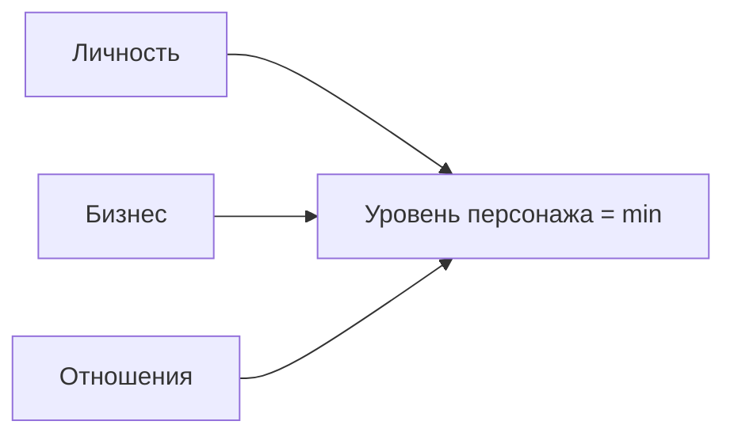

# Лист персонажа: жизнь как игра

Вернёмся к человеку, который проиграл на сорок первой минуте.

Через полтора года у него другая компания, меньше по выручке. Совет директоров из шести человек вместо четырнадцати. Он по-прежнему не всегда знает ответ и научился это говорить вслух — оказалось, что после такой фразы в зале ничего не смещается.

Изменилось не мастерство. Изменилось то, что он теперь видит запись. Матч в понедельник, фол в четверг, счёт в марте — всё это стало для него связанными событиями, а не чередой неприятностей.

Эта глава делает механику видимой до конца.

COREX уже игра: закон самого слабого трека, критерии мастерства, микрошаг на 72 часа — правила, которые работали без интерфейса. Здесь появляется сам интерфейс: персонаж, XP, уровни, квесты. XP начисляется только за поведение. Прочтение главы даёт ранг «читал», не уровень. **Симулизм** дал «зачем». **ROOT** — законы поля. Здесь — build, который видно на HUD.

> **Контекст в PRP:** `xp_log`, `level_progress`, `skill_ranks`, `role_levels`, `achievements`.
> **Закон:** правда. Нельзя задонатить выход из Degraded Mode.

## Архитектура персонажа

Три полосы прогресса — три трека из сквозной матрицы. Уровень персонажа равен **минимуму** из трёх. Это и есть ахиллесова пята. Бизнес на L4 при теле на L1 — не «успех с долгом». Это персонаж, который ещё на первом этаже, сколько бы ни врало табло.

| Трек | L1 | L2 | L3 | L4 | L5 |
| --- | --- | --- | --- | --- | --- |
| Личность | Тело | Эмоции | Процессы | Стратегия | Власть |
| Бизнес | Cash flow | Культура | Регламенты | Экспансия | Экосистема |
| Отношения | Безопасность | Zero-Drama | Соглашение | Союз 9×9 | Династия |

## Четыре стата: индекс здоровья системы

Четыре опоры MENASIS — HP персонажа. Каждая опора: 0–10. Сумма × 2.5 даёт **ИЗС** (0–100). ИЗС ниже 50 включает Degraded Mode. Тело скажет раньше цифры — но цифра не врёт так удобно.

| Стат | Метафора | Вопрос |
| --- | --- | --- |
| Целостность | Ствол | Кто я без регалий? |
| Привязанность | Корни | На кого опереться всем весом? |
| Гибкость | Ветви | Как держу удар в первые 48 часов? |
| Реализация | Плоды | Какой оцифрованный результат сейчас? |

Слабое звено подсвечивается. Прокачка сильного стата при красном слабом — самообман с красивым XP.

## Класс: психотип MENASIS

Класс задаёт асимметрию XP. Не блокирует ветки — как в жизни: гипертим быстрее качает энергию и медленнее системность.

| Класс | Бонус XP | Дебафф XP |
| --- | --- | --- |
| Hyper (гипертим) | +20% идеи и энергия | −20% системность |
| Epil (эпилептоид) | +20% регламенты и контроль | −20% творчество |
| Para (паранойял) | +20% масштаб и стратегия | −20% доверие |
| Schiz (шизоид) | +25% аналитика | −25% социальный трек |
| Hyst (истероид) | +20% публичность | −20% рутина |
| Emot (эмотив) | +20% отношения | −20% границы |
| Anx (тревожный) | +20% управление рисками | −20% действие |
| Hypo (гипотим) | +20% анализ и due diligence | −20% позитивный сдвиг |

Класс ставится один раз по отчёту MENASIS (модуль Action). Смена класса — только после нового скана, не «потому что так выгоднее».

## Архетип: вторичный класс с L2

Разблокируется, когда личность закрыла эмоциональный уровень. Пять архетипов из арсенала:

| Архетип | Где живёт | Типичный фокус |
| --- | --- | --- |
| Правитель | Политический уровень, Executive Advisory | Рамка, капитал, наследие |
| Стратег-трансформатор | Контекстуальный уровень | Инновации, штанга, тренды |
| Бунтарь | Слом паттернов | Creative destruction, выход из лояльности |
| Маг | Трансформация | разбор корня, BSFF, соматика |
| Мудрец | Диагностика | MENASIS, чтение людей, зеркало |

Один архетип активен. Второй можно открыть на L4 — не раньше: иначе это косплей.

## XP: только факты

Прочтение не качает персонажа. Качает закрытый микрошаг, сон, Зона 2, протокол, выход из Degraded.

| Источник | XP | Подтверждение |
| --- | --- | --- |
| Микрошаг 72 ч (шаг X) | 50 | Галочка в `goals` |
| Полная сессия C-O-R-E-X | 120 | Журнал сессии: C 30 + O 50 + R 25 + E 15 |
| Сон 7+ ч, 14 дней подряд | 40 | HUD |
| 150 мин Зоны 2 за неделю | 35 | HUD движение |
| HRV в зелёной зоне 7 дней | 25 | HUD |
| Протокол 90 сек × 21 | 45 | Лог в PRP |
| Инструмент арсенала: первое применение | 20 | Журнал сессий |
| Инструмент: 5+ применений | 30 | Накопительный |
| Протокол роли закрыт (уровень 2+) | 60 | Чек-лист протокола |
| Выход из Degraded Mode | 80 | Восстановление L1 (Phoenix) |

Множители streak: 7 дней без пропуска ×1.5; 30 дней ×2.0. Классовый бонус/дебафф применяется после streak.

Незакрытый шаг X за 72 часа: квест сгорает, XP = 0. Это закон Xecution из горизонтали. Понял и не сделал — ноль, не «почти».

## Переходы уровней

Критерии — те же, что в главе про вертикаль. XP копится, но переход без критерия не открывается.

| Переход | Что должно быть правдой |
| --- | --- |
| L1 → L2 | HRV стабильна ≥ 7 дней; энергия 14 ч без допингов ≥ 14 дней; Зона 2 150 мин/нед ≥ 4 недели; аудит 5 уровней ≥ 10 раз |
| L2 → L3 | Нет срывов на переговорах ≥ 30 дней; протокол 90 сек ≥ 21 раз; ИЗС ≥ 70 |
| L3 → L4 | Регламент на каждую повторяющуюся задачу; PDCA ≥ 3 цикла; бизнес ≥ 14 дней без ежедневного CEO |
| L4 → L5 | Штанга 80/20 в контуре капитала; кризис → рост доли (кейс); смена модели ≤ 14 дней хотя бы раз |
| L5 (финал) | Четыре капитала задокументированы; институт без физического присутствия; legacy в Sovereign Vault |

Переход считается по **каждому треку отдельно**. Персонаж не прыгает на L4, пока отношения на L1.

## Скилл-дерево: 20 инструментов

Арсенал 4 × 5. Инструмент открывается на уровне и качается рангом 1–5.

| Уровень | Открывается |
| --- | --- |
| L1 | RIASEC, протокол 90 сек, нейровагус |
| L2 | MENASIS, разбор корня, BSFF, архетипы, ACT / Штиль |
| L3 | Hogan HDS, SFBT, первопринципы, PDCA, LUMA TWIN, PRP, оффлоадинг |
| L4 | LAB Profile, Red Teaming, Pre-Mortem, AI-Advisor |
| L5 | AI-Simulator и Smart Roadmap |

| Ранг | Имя | Требование |
| --- | --- | --- |
| 1 | Читал | Глава / карточка инструмента прочитана |
| 2 | Применял | Первое использование в журнале |
| 3 | Освоил | 5+ применений и результат в PRP |
| 4 | Преподаю | Объяснил другому (запись Social CRM) |
| 5 | Мастер | Применение под давлением ≥ 3 раза |

Ранг 1 не даёт XP уровня. Ранг 2 — первое применение, 20 XP.

## Семь ролей: параллельные builds

Роли — не линейный сюжет. Это семь веток. **7.1 «Я сам с собой»** — единственный prerequisite. Без зелёного L1 остальные шесть закрыты: не входи в протоколы 4–6 при красном теле.

| Уровень протокола | Значение |
| --- | --- |
| 0 | Не начата |
| 1 | Знаю признаки нарушения |
| 2 | Алгоритм применён хотя бы раз |
| 3 | Скрипты без шпаргалки |
| 4 | Веду другого по протоколу |
| 5 | Спонтанно в стрессе |

## Квест: формат C-O-R-E-X

Каждая сессия — квест в `goals` + `journals`.

| Шаг | Что пишется | XP шага |
| --- | --- | --- |
| C | Ресурс 1–10, факт языком камеры | 30 |
| O | Плоскость (голова / люди / процессы), корень | 50 |
| R | Точка Б, ASI | 25 |
| E | Инструмент арсенала | 15 |
| X | Микрошаг ≤ 72 ч, дата чек-ина | 50 (только если закрыт) |

Пример:

> **Квест.** Разрешить конфликт по траншу.
> C: ресурс 3/10; партнёр не подписал транш 18.08.
> O: плоскость «голова»; страх несостоятельности (Inadequacy, C в MICE).
> R: подписанный транш 01.09; ASI — холодный переговорщик.
> E: разбор корня 5 мин + Red Teaming 10 мин.
> X: черновик 3 слайдов до 20:00; чек-ин 22.08.
>
> Закрыт за 72 часа → +120 XP. Разбор корня: ранг 2 → 3.

## Degraded Mode

Триггеры: HRV упал на 30%, сон меньше 6 часов, ИЗС ниже 50.

| Пока режим включён | Что происходит |
| --- | --- |
| Квесты L3–L5 | Заблокированы |
| Доступны | Сон, электролиты, Зона 2, холод, протокол 7.1 |
| HUD | Полоса «Восстановление» 0–100% |
| Выход | Факт L1, не кнопка. Бонус Phoenix +80 XP и achievement |

Нельзя купить выход. Это единственная честная «смерть» в этой игре: откат к телу, потом ступенчатый перезапуск.

## Орбиты: социальный слой

Четыре круга доверия из PRP — гильдейские ярусы.

| Орбита | Кто | Эффект |
| --- | --- | --- |
| 1 | Семья / тыл | Максимальный бонус XP на восстановление |
| 2 | Сооснователи / партнёры | Синергия 1+1=3, если оба на L3+ |
| 3 | Команда | Общий прогресс зоны ответственности |
| 4 | Внешний мир | Публичный профиль, социальный капитал |

Alliance: оба из орбиты 2 закрыли недельный квест — оба +15% XP (закон баланса: шаг 11 на шаг 10).

## Сезоны

90 дней = один сезон. Четыре недели интенсива LUMA × ~2.5.

| Сезон | Имя | Фокус |
| --- | --- | --- |
| 1 | Body OS | Мастерство L1 |
| 2 | Emotional OS | Мастерство L2 |
| 3 | Operational OS | Мастерство L3 |
| 4 | Strategic OS | Мастерство L4 |
| 5 | Political OS | Мастерство L5 |

В конце сезона: новый срез AS-IS → TO-BE в LUMA TWIN. Сезон не «пройден», если слабый трек не подтянут до порога. Можно врать себе про прогресс. HUD — нет.

## Как пользоваться листом

1. Поставь класс по MENASIS. Заполни четыре опоры. Получи ИЗС.
2. Отметь текущий этаж на каждом треке. Уровень персонажа = минимум.
3. Открой протокол 7.1. Зелёный L1 — вход в остальные роли и квесты выше тела.
4. Веди квесты только через C-O-R-E-X. Без шага X квест не существует.
5. Если сработал Degraded — играй L1, пока полоса восстановления не закроется фактом, не обещанием.
