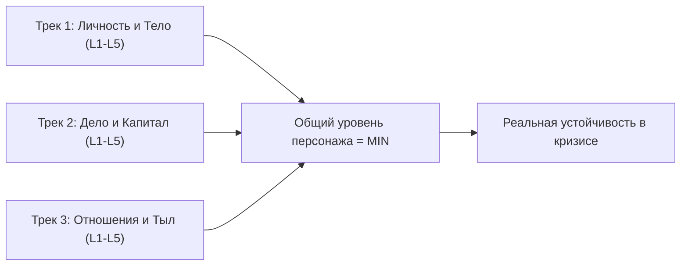
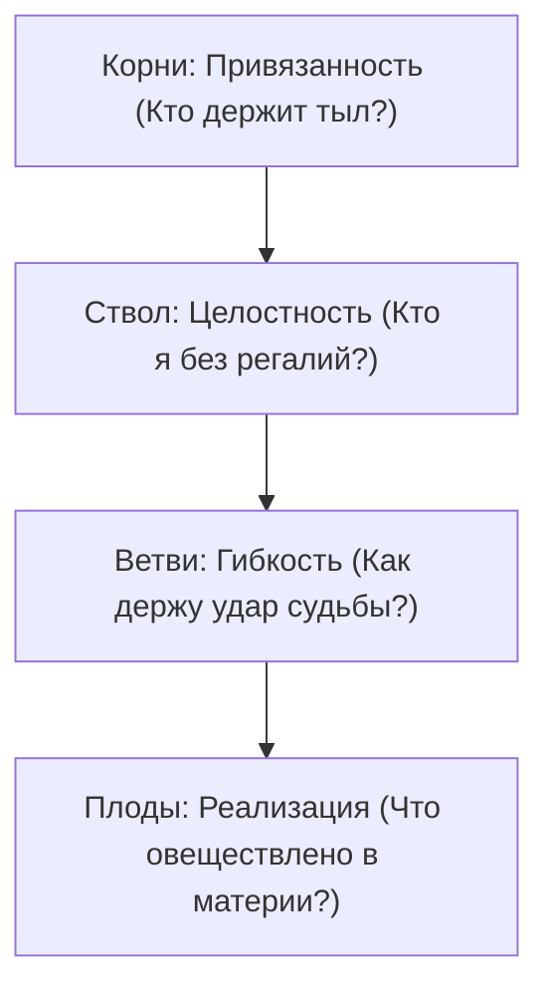
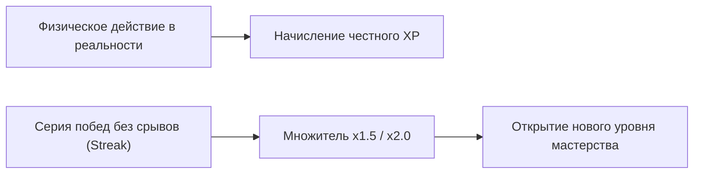
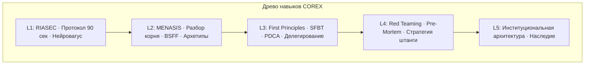
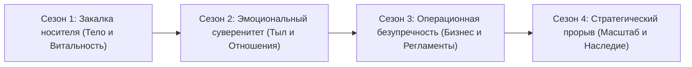

# Лист персонажа: жизнь как великая игра

Вернёмся к человеку, с которого началась эта книга — к тому самому генеральному директору, который потерпел сокрушительное поражение на сорок первой минуте вечернего совета директоров.

Прошло полтора года. У него другая компания — чуть меньше по выручке, но с чистой маржинальностью в три раза выше прежней. В совете директоров сидят шесть проверенных, трезвых профессионалов вместо четырнадцати тщеславных интриганов. Он по-прежнему не всегда знает готовые ответы на вызовы рынка, но теперь спокойно и открыто говорит об этом вслух, глядя прямо в глаза партнёрам. И оказалось, что после этих честных слов мир не рушится, акции не падают, а доверие в зале лишь крепнет.

Что изменилось? Не его профессиональное мастерство. Изменилось то, что теперь он видит всю шахматную доску целиком. Матч в понедельник, микрофол в четверг, спазм в горле при разговоре с финансовым директором, весенний кассовый разрыв — всё это перестало казаться ему хаотичной чередой несправедливых ударов судьбы. Всё это стало связной тканью единой партии.

Эта финальная глава делает скрытую механику твоей жизни абсолютно прозрачной.

Жизнь суверенного лидера — это не каторжный труд и не хаотичное выживание. Это захватывающая, эпическая игра с высокими ставками. Здесь действуют непреложные законы физики: закон слабейшего трека, критерии зрелости мастерства, непреклонное правило первых 72 часов. Здесь появляется твой личный интерфейс управления судьбой: персонаж, реальный опыт, уровни силы и боевые квесты.

> [!NOTE]
> **Геймификация высшего порядка и архитектура потока**  
> Исследования Джейн Макгонигал («Реальность с разбитым экраном») и концепция потока Михая Чиксентмихайи доказывают: человеческая психика раскрывает максимальную продуктивность и жизнестойкость, когда хаотичная реальность структурируется по законам осмысленной игры. Чёткие правила, мгновенная обратная связь от тела, оцифрованные цели и видимый прогресс переводят мозг из состояния тревожной неопределённости в режим вовлечённого азарта. Геймификация по COREX — это не инфантильные бейджики, а взрослая кибернетическая модель управления личной эволюцией.

---

## Архитектура персонажа: три жизненных трека

Твой персонаж развивается одновременно по трём параллельным магистралям. Но главный закон гласит: **общий уровень персонажа равен минимальному значению из трёх треков.**

Нельзя иметь бизнес четвёртого уровня (экспансия и фонды), если твоё тело находится на первом этаже (хроническая бессонница, лишний вес и давление). Это не «успешный лидер с временными трудностями». В терминах игровой механики это хрупкий персонаж первого уровня с колоссальной уязвимостью к любому критическому удару.

| Уровень вертикали | Трек 1: Личность и Тело | Трек 2: Дело и Капитал | Трек 3: Отношения и Тыл |
| --- | --- | --- | --- |
| **L1. Витальный** | Сон, кардио, гормоны, телесная устойчивость | Твёрдый операционный Cash Flow, отсутствие долгов | Физическая безопасность, закрытые бытовые базовые нужды |
| **L2. Эмоциональный** | Контейнирование аффекта, зрелость, протокол 90 сек | Здоровая культура команды, отсутствие токсичности | Зона Zero-Drama, честный контакт, снятие брони |
| **L3. Процессный** | Чёткий распорядок дня, регламенты личной энергии | Настроенная регулярная операционка, делегирование | Живой союзный контракт, распределение ролей в семье |
| **L4. Стратегический** | Антихрупкость, мышление от первого лица | Масштабная экспансия, M&A, независимость от основателя | Суверенное партнёрство 9×9, глубокая синергия |
| **L5. Институциональный** | Мудрость, служение миссии, внутренний покой | Капитал поколений, фонды, автономные экосистемы | Родовое древо, фамильное наследие, династия |

---

## Четыре базовых стата: Индекс Здоровья Системы (ИЗС)

Четыре несущие опоры древа MENASIS определяют шкалу жизненной энергии (HP) твоего персонажа. Каждая опора оценивается от 0 до 10 баллов:

$$\text{ИЗС} = (\text{Целостность} + \text{Привязанность} + \text{Гибкость} + \text{Реализация}) \times 2.5$$

Индекс измеряется по шкале от 0 до 100 пунктов:
* **ИЗС 80–100:** Абсолютная мощность. Персонаж способен выдерживать колоссальные перегрузки, открывать новые рынки и вести за собой тысячи людей.
* **ИЗС 50–79:** Рабочая норма. Устойчивое движение по курсу, регулярное закрытие задач.
* **ИЗС ниже 50:** Аварийный режим. Немедленная активация протокола восстановления.

---

## Психологический класс: врождённый профиль MENASIS

Твой врождённый психотип определяет естественные бонусы и штрафы к распределению энергии. Игра не требует ломать себя об колено — она учит использовать сильные стороны и ставить подпорки в зонах уязвимости:

| Класс персонажа | Врождённый бонус к опыту | Характерный дебафф (Слепая зона) |
| --- | --- | --- |
| **Hyper (Гипертим)** | +25% к генерации идей, скорости старта и харизме | −20% к системной рутине, доведению дел до конца |
| **Epil (Эпилептоид)** | +25% к наведению порядка, регламентам и контролю | −20% к гибкости, спонтанности и принятию нового |
| **Para (Паранойял)** | +25% к стратегическому масштабу и воле к победе | −20% к человеческому теплу, эмпатии и доверию |
| **Schiz (Шизоид)** | +30% к глубинному анализу, инновациям и архитектуре | −25% к социальной коммуникации и дипломатии |
| **Hyst (Истероид)** | +25% к публичным выступлениям, бренду и вдохновению | −20% к монотонной операционке за кулисами |
| **Emot (Эмотив)** | +25% к тонкой эмпатии, командному клею и заботе | −20% к жёстким переговорам и удержанию границ |
| **Anx (Тревожный)** | +25% к риск-менеджменту, комплаенсу и бдительности | −20% к быстрым дерзким решениям в условиях риска |

---

## Начисление жизненного опыта (XP): только физические факты

В игре COREX опыт начисляется исключительно за **реальные поведенческие изменения в физическом мире.** Чтение умных книг, просмотр лекций или витание в облаках дают ровно ноль очков опыта. 

Ты не можешь повысить уровень своего персонажа размышлениями — ты прокачиваешь его только решениями, шагами и дисциплиной.

### Таблица боевого опыта

| Достижение в реальности | Награда (XP) | Твёрдый материальный критерий |
| --- | --- | --- |
| **Микрошаг 72 часов (Шаг X)** | +50 XP | Физическое действие совершено и зафиксировано в протоколе. |
| **Полная сессия C-O-R-E-X** | +120 XP | Сессия завершена, найден корневой затор, подписан протокол. |
| **Дисциплина сна: 14 дней подряд** | +40 XP | Отбой до 23:00, 7+ часов сна по данным трекера без единого сбоя. |
| **Аэробная выносливость (Зона 2)** | +35 XP | 150 минут низкоинтенсивного бега или ходьбы за неделю. |
| **Протокол 90 секунд при аффекте** | +45 XP | Купирование вспышки стресса через дыхание без срыва на людей. |
| **Первое применение инструмента арсенала** | +20 XP | Инструмент применён в реальной боевой ситуации на практике. |
| **Мастерство инструмента (5+ применений)** | +50 XP | Метод вошёл в привычку и даёт воспроизводимый результат. |
| **Успешный выход из Degraded Mode** | +80 XP | Восстановление витальных показателей L1 собственными силами. |

> [!TIP]
> **Множители непрерывной серии (Streak)**  
> Дисциплина вознаграждается экспоненциально: непрерывное удержание любого позитивного протокола в течение 7 дней активирует множитель опыта $\times 1.5$. Удержание серии в течение 30 дней даёт постоянный бонус $\times 2.0$ ко всем сопутствующим действиям. Один осознанный пропуск возвращает множитель к единице.

---

## Дерево мастерства: 20 инструментов арсенала

Каждый инструмент лидера открывается по мере восхождения по вертикали и прокачивается по пяти рангам мастерства:

1. **Ранг 1 (Теоретик):** концепция прочитана и понята интеллектуально.
2. **Ранг 2 (Практик):** инструмент применён на практике хотя бы один раз.
3. **Ранг 3 (Специалист):** инструмент успешно отработан более 5 раз с измеримым эффектом.
4. **Ранг 4 (Наставник):** ты способен объяснить и передать навык другому лидеру.
5. **Ранг 5 (Грандмастер):** спонтанное, безошибочное применение инструмента в условиях экстремального стресса.

---

## Аварийный режим (Degraded Mode): биологический предохранитель

Когда вариабельность сердечного ритма (HRV) падает ниже критической отметки, сон разрушен, а индекс опор опускается ниже 50 пунктов, внутренняя система безопасности переводит персонажа в **Degraded Mode**.

Это не наказание. Это аварийный протокол корабля, отключающий второстепенные приборы при пробое обшивки:

* **Блокировка высоких квестов:** лидеру категорически запрещено вести переговоры о слияниях, привлекать новые инвестиции или выяснять отношения с супругой. Любое решение на уровнях L3–L5 в этом состоянии будет ошибочным.
* **Единственный доступный квест — Восстановление:** глубокий сон, тёплая простая еда, прогулки на свежем воздухе, электролиты, протокол возвращения к телу.
* **Честный выход:** аварийный режим нельзя выключить силой воли, кофеином или энергетиками. Полоса восстановления закрывается только объективными физиологическими показателями.

> [!IMPORTANT]
> **Нельзя задонатить выход из перегрузки**  
> Самая опасная иллюзия богатого человека — вера в то, что истощение можно вылечить дорогими капельницами за один день, не меняя ритма жизни. Природа неподкупна. Если ты сжёг свои витальные ресурсы, единственный способ вернуться в строй — честно отдать телу долг тишиной, сном и покоем.

---

## Четыре сезона личной эволюции: 90-дневные кампании

Год делится на четыре девяностодневные кампании. Каждая кампания — это сфокусированный сезон прокачки конкретного пласта твоей жизни:

В конце каждого сезона ты садишься перед чистым листом бумаги, открываешь этот лист персонажа и проводишь беспристрастную ревизию. 

Где просели опоры? Какой трек оказался самым слабым звеном? Каков твой реальный боевой уровень прямо сейчас?

Ты смотришь на свою жизнь трезвым, спокойным взглядом взрослого мастера. Игра продолжается. Правила понятны. Штурвал в твоих руках. И впереди тебя ждёт самый захватывающий сезон твоей жизни.
