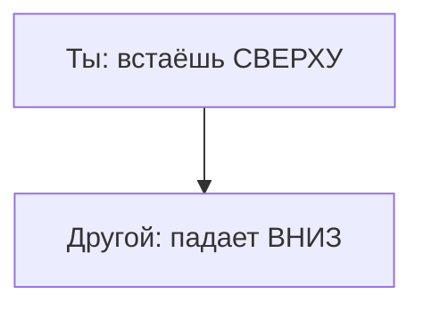

# Режим наблюдателя

На третий день в горах тишина показала, что ей плевать на моё техзадание.

Первые двое суток я сидел на деревянной веранде и с секундомером вымогал «духовный опыт». Ум составил график: в десять — покой, к полудню — инсайт, к вечеру — покалывание в ладонях и единство с миром. Природа ответила осами, ноющей поясницей и скрипом сосен.

На третий день я сдался. Сел на ступени, выронил блокнот, перестал требовать от неба, гор и собственного тела результатов.

И тогда, когда внутри опустело от ожиданий, пришло всё. Без спецэффектов. Ровно. Как прилив.

Так открылся закон, который звучит как издёвка:

**Чтобы сдвинуть глубокий код, сначала придётся отпустить желание его сдвигать.**

---

## Капкан спасателя

На внутреннюю работу почти все заходят с разводным ключом.

«Победить лень». «Искоренить страх». «Починить мать». «Заставить партнёра развиваться». В самом взгляде уже война: *ну когда тебя наконец отпустит?*

Сеть отвечает просто: **каков запрос — таков ответ.** Смотришь на страх или на слабость близкого через «ты бракованный, тебя надо чинить» — в взгляде уже давление. Система ставит защиту.

Самая благородная и самая ядовитая ловушка — **роль спасателя**.

Кажется, что просто переживаешь за пьющего отца, тянешь выгоревшего коллегу, спасаешь инфантильного партнёра. Другой считывает иное:

> *«Ты сам не справляешься. Ты сломан. Я знаю лучше, как тебе жить».*

В этом есть высокомерие, даже если оно одето в заботу. Канал рвётся сразу.

**Режим наблюдателя — права «только чтение».**

Руки с клавиатуры. В исполняемый процесс чужой жизни не лезть. Единственный честный сигнал: *«Я вижу тебя таким, какой ты есть. Твой кризис — твой. Я не подгоняю траекторию».*

Наблюдатель — чистая вода. Пока в ней ничего не растворено, Сеть отвечает честно. Стоит захотеть «починить», «ускорить», «сделать правильно» — вода мутнеет. Дальше всё, что в ней заваришь, пахнет борьбой.

Сдвиг начинается там, где снимаешь напор. Убери тиски — застрявшее поедет само. То, что годами стояло против самобичевания, тает под взглядом без насилия.

---

> [!NOTE]
> В 1968 году Роберт Розенталь и Ленор Якобсон провели в начальной школе Сан-Франциско опыт, который потом назвали эффектом Пигмалиона. Детям дали обычный тест интеллекта. Учителям назвали несколько учеников с «скрытым потенциалом к скачку». Имена взяли генератором случайных чисел. Через год именно эти дети ушли вперёд по IQ и оценкам. Дополнительных занятий не было. Менялось качество взгляда: вера в ресурс, меньше жалости, готовность выдержать ошибку. Мозг ответил на ожидание. Обратная сторона — эффект Голема: жалость сверху и тайное «ты не вывезешь» обрушивают любой узел так же точно. В логике ROOT наблюдатель — не пассив. Это настройка: присутствие либо даёт чужой системе право на свою опору, либо цементирует её слабость.

---

## Загадка «Право на тьму»

> [!TIP]
> **Загадка**
> Близкий друг неизлечимо болен. Боль не отпускает, рассудок ясен. Он просит достать препарат для ухода — втайне от клиники. Поможешь — нарушишь закон. Откажешь и вызовешь санитаров — его зафиксируют и продлят агонию на аппаратах.
>
> **Голос Расчёта:** Достать препарат. Продлевать мучение без смысла — умножать зло. Облегчить финал можно сейчас.
> **Голос Правила:** Отказать. Закон не резиновый. Сдвинешь границу один раз — станешь судьёй там, где тебе не место.
> **Голос Души:** Остаться. Не бог и не надзиратель. Сесть рядом и не отворачиваться. Его выбор — его. Твои руки — твои.
>
> *Вопрос силы:* Чья это жизнь — его, институтов или тех, кому страшно остаться без него?

> [!NOTE]
> Заметь первую реакцию ума: уже идёт спор, **что предпринять**. Три голоса втянули в роль вершителя. Это и есть капкан спасателя: право решать за другого украдено за секунду.
>
> Наблюдатель делает шаг назад. Вопрос другой: **человека услышали?**
>
> Он в сознании. Цену взвесил. Пришёл не за опекой — за присутствием.
>
> Не бог: *«Я слышу. Я здесь. От твоей тьмы не отворачиваюсь».*
>
> И если просит переступить твой предел — честность границ: *«Я остаюсь до последней секунды. Делать это за тебя не стану. Это больше, чем я могу понести».*
>
> Это не предательство. Это уважение его права без сдачи своего. Этика здесь не инструкция. Это способность выдержать чужую трагедию, оставаясь собой.

---

## Лена и запах валерьянки

Лена — терапевт. Этот урок она получила не из учебника. Из собственного тела в кресле напротив.

К концу дня плечи каменные, зубы сжаты. Клиенты с тяжёлыми депрессиями топтались на месте — сжимались под её тёплым и давящим взглядом. Она хотела помочь. Она вталкивала их в выздоровление силой ума и тепла.

На супервизии пелена спала. Благородное «я должна вытащить любой ценой» оказалось попыткой реанимировать чужую волю.

Супервизор спросил: «Лена, кого ты спасаешь в этом кабинете на самом деле?»

Она заплакала так, как не плакала двадцать лет.

Ей семь. Ноябрь. За кухонной дверью воет мать: отец снова не ночевал и, кажется, ушёл. Из щели тянет спиртовой валерьянкой. Лена босиком на холодном линолеуме колотит в краску: *«Мамочка, не плачь. Я буду послушной, я получу все пятёрки, только не умирай».*

Всю взрослую жизнь она стояла на том полу. Каждому клиенту, каждому партнёру доказывала: «Я спасу тебя, только не уходи в темноту».

В кабинете супервизора она впервые села рядом с той семилетней. *«Мамина боль была маминой. Ты не могла её спасти. Тебе больше не нужно никого чинить, чтобы иметь право дышать».*

На следующий день пришёл самый «безнадёжный». Мужчина, привыкший к жалости. Лена не стала предлагать техники. Села напротив и смотрела как стекло. Без требований.

Он осёкся на полуслове. Опустил голову и впервые за два года заплакал — взрослой скорбью, из которой вообще можно встать.

---

## Практика: Read-Only

Выбери человека, которого всё ещё чинишь: наставляешь, уберегаешь, тащишь.

Поймай тянущее в груди или висках, когда думаешь о его беде. Это эго штурмует чужую систему.

Три длинных выдоха через рот. Рычаги выключить. Ты — зеркало. Озеро. Поверхность, которая отражает и ничего не держит.

Держа образ, скажи вслух:

> *«Я вижу тебя. Твои ошибки, уроки и темп — твои. Я снимаю претензию знать, как тебе жить. Я доверяю тебе справиться со своей судьбой».*

Побудь в этом минуту.

Фаервол взвывает: *«Отпущу — случится катастрофа».* Пусть волна пройдёт. Потом обычно приходит непроизвольный вдох животом и отпускает трапеции. Это тело говорит, что захват разомкнули.

Разрешая другому его жизнь, впервые возвращаешь свою.

---

> [!IMPORTANT]
> **Закон главы**
> Каков взгляд — таков ответ системы. Присутствие без насилия отпускает то, что штурм только цементирует.
