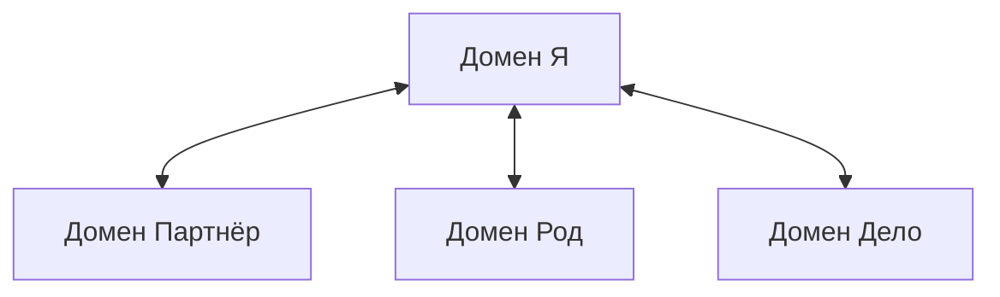

# Что такое система

Начнём с неприятного.

Жизнь принадлежит тебе лишь отчасти. Большая часть «своих» выборов загружена раньше рождения. И львиная доля драм — не личная трагедия, а наследство: тяжёлый чемодан с чужими письмами, который таскаешь из года в год, уверенный, что собрал его сам.

Слышишь протест? «Я мыслю — значит, выбираю». «Судьба в моих руках». Под диафрагмой уже ком?

Нормально. Все влюблены в миф об отдельном сервере посреди поля: своё питание, свой фаервол, полная свобода.

Красиво. Платишь выгоранием, паникой на пике и тихим ужасом в день, когда узнаёшь судьбу тех, о ком в семье молчали.

Ты не отдельный процессор. Ты **терминал, вшитый в сеть связей**. То, что кажется спонтанным желанием или внезапной апатией, часто — пакет по скрытому каналу.

Эту инфраструктуру мы называем **Системой**.

---

## Три слова

**Сеть** — скрытая матрица повседневности. Трубы под асфальтом: кабель, вода, оптоволокно. Сверху ходят и не думают, что решает, зажжётся ли люстра. Под каждой семьёй, компанией, парой — паутина негласных правил, завещаний и незакрытых трагедий. Сеть не спрашивает разрешения. Она исполняет код, пока ты смотришь на экран и не понимаешь, почему сюжет не меняется.

**Система** — живой сервер конкретной сети. Не ящик в стойке: память, опыт, закон целостности. Работает по пяти протоколам. Сломай один — уходит в аварию и начинает выкачивать силу из узлов, лишь бы удержать баланс.

**Узел** — твоя точка в топологии. Не свидетель и не жертва. Хаб, сквозь который идёт трафик нескольких систем сразу. Одни порты дают опору. По другим свистит чужая вина. Третьи забиты чужими счетами. Узел не выбирал семью и эпоху. Узел с доступом к панели может увидеть трафик и сменить маршрутизацию.

---

## Четыре домена

Систем вокруг много: класс, команда, семья партнёра. Каждая со своими правилами. Весь массив складывается в **четыре домена**:

**«Я».** Всё внутри. За процессор дерутся Ядро, фаервол, тело и десяток голосов. Один хочет вершин. Второй изображает недомогание, лишь бы не выходить. Третий сидит в углу и смеётся над обоими. Пока делят время — батарея тает, полезной работы ноль.

**«Партнёр».** Сервер на двух узлах. То, что зовут «угасанием», чаще сбой сопряжения двух несопоставимых баз. За каждым — свой род с запретами и скелетами. Бывшие не удаляются кнопкой. Незакрытые сессии фонят, и новый человек подключается к чужому сценарию, не понимая, откуда раздражение.

**«Род».** Самый глубокий. Данные сотен: строители и палачи, раскулаченные и забытые. Не локальная машина — мэйнфрейм. Если кого-то вычеркнули из стыда или ужаса, Сеть не терпит дыры. Она назначит младший узел — тебя — обслуживать пустую ячейку. Тяга к саморазрушению или хроническое одиночество окажутся попыткой допрожить чужую судьбу.

**«Дело».** Бизнес, проект, коллектив. Те же законы в других костюмах. Основатели — «родители», сотрудники — «дети», уволенные со скандалом — призраки в опенспейсе. Криво закрытый прошлый проект висит дампом и душит следующий.

Новость одна: **во всех четырёх доменах законы те же**. Разобрал архитектуру одного — ключ ко всем.

---

> [!NOTE]
> В 2003 году Наоми Эйзенбергер с коллегами из UCLA положила людей в томограф и дала им игру Cyberball: перебрасывать мяч на экране с двумя «партнёрами». Те казались живыми. В какой-то момент оба переставали пасовать — показательно исключали. В мозге вспыхивали дорсальная передняя поясная кора и передняя островковая доля: те же зоны, что кричат при ожоге или ударе. Для млекопитающего изгнание из стаи неотличимо от сломанной кости. В дикой природе одинокий узел гибнет. В логике Сети принудительное удаление элемента — не тихая пометка в журнале. Это аварийный сигнал на всю шину. Система платит за дыру ресурсами всех, кто остался.

---

## Быль: вычеркнутый сооснователь

Кабинет Сергея на тридцать третьем этаже пах дорогим чаем и тихой безнадёжностью.

Компания два года росла — и впечаталась в стену. Бюджеты на маркетинг удваивали, хедхантеры тащили лучших, отдел продаж ночевал в офисе. Выручка стояла. Между лопатками круглосуточно давила плита.

В расстановке он вывел узлы бизнеса. Компания стояла спиной к рынку. Все смотрели в дальний угол переговорной. Там серое пятно. От взгляда на него сдавило виски.

Долгая тишина.

**Дима.** Первый партнёр. Полуподвал, лапша из пакетов, один обогреватель, один разбитый сервер. Через три года запахло инвестициями. Сергей решил: мягкий Дима «не тянет темп». Разговор через юриста. Долю выкупили по номиналу. Имя стёрли с сайта, фото убрали, сотрудникам запретили вспоминать. Два года Сергей рассказывал журналам, как поднял империю в одиночку.

Вот он. Исключённый узел.

Сеть помнила бессонные ночи Димы и каждую строчку фреймворка. Сергей думал, что сбросил обузу. Свободная прибыль уходила на одну задачу: держать призрак в углу.

Сергей опустил голову на стол.

> *«Дима, я вижу тебя. Без твоих ночей в том подвале бизнеса не было бы. Я признаю твой вклад. Возвращаю тебе место в фундаменте. Ложь забираю назад.»*

Плита между лопатками треснула. Горло отпустило. В поле компания медленно развернулась к рынку.

Через месяц он набрал номер, который три года держал в блоке.

— Дим. Это я. Давай встретимся.

Крошечная кофейня на окраине. Два седеющих мужчины смотрели в стаканчики. Двадцать минут воздух звенел.

Потом Дима, без злобы:

— Знаешь, Серёг… дело даже не в долях. Ты за три года ни разу не спросил, жив ли я после того инфаркта.

Сергей опустил голову на стол при всех и заплакал. Броня, костюмы, интервью — за секунду. Перед Димой сидел парень из подвала, который предал единственного друга из трусости.

Дима молчал. Потом протянул руку и сжал запястье.

— Ладно. Главное — вспомнил. Живые мы.

Зажим между лопатками ушёл. В грудь хлынул воздух.

Через квартал выручка выросла на сорок пять процентов. Рекламу не трогали. **Восстановили топологию.**

---

Сергей не изобрёл закон. Он перестал его нарушать.

Эти правила одни **во всех четырёх доменах**. Не берут взятки и не слушают оправдания.

Первый бережёт право каждого элемента быть.  
Второй — иерархию и направление силы.  
Третий — баланс отдачи и получения.  
Четвёртый — факты как есть.  
Пятый — скрытый контракт со «своими», из-за которого узел не идёт дальше их потолка.

Следующая глава — все пять. С именами и с тем, что делать, когда узнаёшь себя внутри одного из них.

---

## Практика: карта Сети

Лист А4. Ручка. Двадцать минут без экрана.

Себя — в центр. Вокруг четыре сектора: *Я, Партнёр, Род, Дело*. Без причёсывания впиши фигуры и связи.

Закрой глаза. По очереди направь внимание на каждую фигуру. Не мысли — датчики: где спазм в горле, где холодеет живот, при ком хочется отвести глаза. Там повреждённый порт.

Глядя на этот узел, ответь прямо. Кого здесь делают несуществующим? Чьи обязанности взвалены на себя? Где обмен идёт в одну сторону?

Вслух, держа контакт с телом:

> *«Я — узел в большой Сети. Я вижу её элементы, включая тех, кого пытались стереть. Каждому — его место и масштаб. Себе — своё: не чужое и не меньше.»*

Заметь ответ: вдох шире, стопы теплее, спина есть. Когда контур замыкается, узлу открывается мощность Сети — несравнимо больше, чем у одного.

---

> [!IMPORTANT]
> **Закон главы**
> Вычеркнутый узел не исчезает. Он уходит в подполье и жрёт свободную энергию сети.
