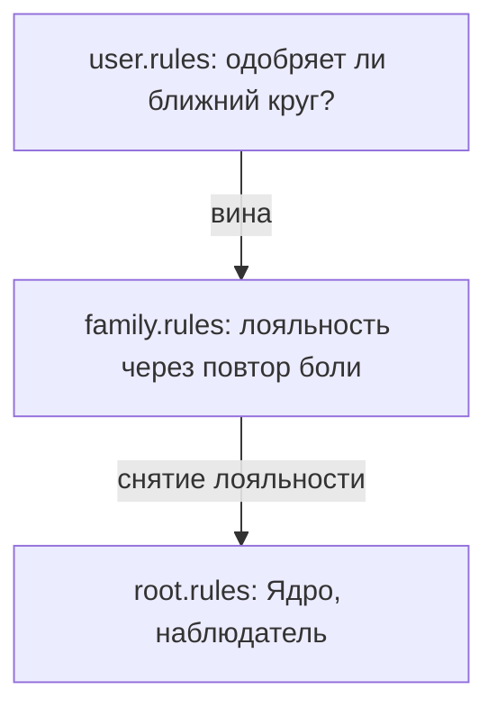

# Виды политик доступа

Внутренний голос вины, который зовёшь совестью, не мудрость и не искра.

Это вахтёр на проходной стаи. Задача одна: не дать изгнать. Сидит под солнечным сплетением и бубнит: не высовывайся; не радуйся, пока другим тяжело; сначала семья, о себе потом.

Вырасти среди волков — тот же вахтёр считал бы ночной вой нормой, а речь на задних лапах — предательством. Он не делит добро и зло. Он делит «как у своих» и «не как у своих».

У детской нервной системы инструкция глубже самосохранения: **будь как стая, иначе умрёшь**. Выпасть из семьи для ребёнка — буквально смерть.

Поэтому, прежде чем снова склонить голову перед «стыдно жить хорошо», посмотрим, какой файл держит порты закрытыми.

---

## Три уровня

**`user.rules`.** Верх. Нормы круга, то, что сейчас принято. Проверяет одно: *достаточно ли я удобен, чтобы меня не отвергли?* Бытовой стыд. Страх показаться смешным.

**`family.rules`.** Ниже. Верность роду. Клану всё равно на твой счёт и твою постель. Задача — чтобы цепь не рвалась.

Если бабушка потеряла мужа на войне и тянула троих, а мать терпела тирана ради «полной семьи» — во внучке компилируется правило:

> *«Женщина нашего рода обязана страдать. Сытая взаимная любовь — дезертирство.»*

Сеть без скандала сорвёт любые тёплые отношения. Подсунет холодного, занятого — лишь бы страдание сравнялось.

**`root.rules`.** Ядро. Нет своих и чужих, нет должников. Все равны по праву рождения. Режим наблюдателя — единственная точка, из которой старый скрипт вообще можно снять.

---

> [!NOTE]
> В 1970 году Анри Тэшфел в Бристоле делил подростков на группы по пустяку: кто больше точек угадал на экране, кому больше нравится Кандинский, кому Клее. Мальчики друг друга не знали и не встречались. Раздавать настоящие деньги они всё равно предпочитали так, чтобы «свои» получили больше разрыв с «чужими», даже если своя сумма от этого падала. Семь монет себе и три врагу казались лучше, чем десять и десять. Групповая верность вспыхивает на пустом месте. В логике Сети это та же слепая лояльность: контур безопасности скорее останется бедным внутри клана, чем нарушит код солидарности. Личное благополучие биосистема читает как дезертирство и сразу выставляет вину в теле.

---

## Загадка трёх голосов

> [!TIP]
> **Загадка**
> Дела пошли в гору. Прибыль есть. Дома тепло. На счёте впервые можно не смотреть на ценник. И на пике внутри воет сирена: живот скручивает, плечи втягиваются, накатывает страх расплаты.
>
> **Голос Расчёта:** Спрячь. Оденься проще. Не раздражай своих. Зависть родственников сожрёт живьём.
> **Голос Правила:** Отец горбатился за копейки. Бабушка экономила на спичках. Твоя сытость оскорбляет их могилы. Раздели общую судьбу.
> **Голос Души:** Их тяжесть — их времени. Твоё процветание не насмешка. Это единственное оправдание их цены. Имеешь право жить.
>
> *Вопрос силы:* Кому служит добровольное страдание — мёртвым или тьме в настоящем?

---

## Сессия. Наталья

Наталья: «Стоит наладиться — повышение, квартира, мир с мужем — как накрывает. Внутри: „Не имеешь права“. Тогда скандалы, сомнительные вложения, снова разбитое корыто».

> **Терапевт:** Спустись в этот ужас. Где сильнее всего?
>
> **Наталья:** *(ладонь на желудок)* Под рёбрами. Кол. Плечи сводит, голова вжимается. Будто поймали с поличным.
>
> **Терапевт:** Поставь женскую ветвь: мать, бабушку, прабабушку. Что кол говорит перед ними?
>
> **Наталья:** Стыд. Бабушка овдовела в двадцать два — завал в шахте. В сорок седьмом варила троим лебеду, сама жевала траву за печкой. Отца мамы я слышала ночами: бил за остывший суп, она выла в подушку, я под одеялом шептала: не брошу тебя. А у меня светлая студия, муж, кофе из фарфора. Чувствую себя предательницей. Счастьем сыплю соль на их раны.
>
> **Терапевт:** Файл `family.rules`: любовь к матери оплачивается повторением её ада. Благополучие = измена. Посмотри им в глаза. Спроси: они терпели, чтобы ты легла рядом в землю — или чтобы хоть одна ветвь увидела солнце?
>
> **Наталья:** Бабушка смотрит…
>
> **Терапевт:** Скажи: *«Я вижу ваш голод и вашу тьму. Кланяюсь цене, которую вы заплатили, чтобы жизнь дошла до меня. Моё счастье — не насмешка. Это смысл ваших жертв. Тяжесть оставляю в вашем времени.»*
>
> **Наталья:** *(длинный выдох)* Бабушка улыбается. Шершавой ладонью по щеке: *«Живи, девочка. За нас. Радуйся.»*
>
> **Терапевт:** Что под рёбрами?
>
> **Наталья:** Кол растаял. Тепло. Впервые не нужно умирать, чтобы быть их дочерью.

---

## Паритет

Вражда Чернышовых и Волковых не была романтикой дуэлей. Бухгалтерия истребления: купленные дела, поджоги складов, банкротства. Детям передали не капитал. Рефлекс: *та фамилия — угроза*.

Роман и Юлия выросли внутри этой оптики.

Встретились на карнавале в Венеции. Маски, балкон, совпадение голосов. Когда маски сняли, отступать было поздно: тела узнали друг друга раньше фаерволов.

Три года прятались в нейтральных городах. Говорили себе: двадцать первый век, мы выше вендетт.

Родовой код по заявлению не отпускает.

Брат Юлии настиг их на парковке аэропорта. Монтировка. Роман оттолкнул. Тот споткнулся о бордюр и виском об угол колонны.

Хруст. Бензин. Лужа на бетоне.

Парень умер сразу. За обиду, истоков которой уже никто не помнил.

Стена стала бетонной. Отец Юлии выдал её за партнёра по сырью. Роман уехал за океан.

Последний раз — на крыше недостроенного «Паритета». Комплекс, который отцы начинали как общий триумф и заморозили судами.

Юлия говорила бесцветно:

— Уйду с тобой — вычеркнут. Останусь — сгнию. Но самое страшное: твоё лицо навсегда связано со смертью брата. Прости.

Разошлись.

Оба построили приличные фасады. Роман женился на спокойной иностранке. Юлия — свет и благотворительность под руку с респектабельным мужем.

В детях поселился паралич близости.

Сын Романа в двадцать пять разорвал помолвку за неделю до венчания и не смог объяснить. Дочь Юлии выбирала холодных — и каждый раз с горьким торжеством: «Я знала, мужчины приносят боль».

Они не знали друг друга. В них работал один дефект: **близость = катастрофа**.

«Паритет» достроили через пятнадцать лет.

На банкете старики сидели во главе — два памятника ненависти с трясущимися руками.

За соседним столом, по протоколу рассадки, — внуки. Сын Романа. Дочь Юлии. Весь вечер молчали. Руки под скатертью.

Потом она подняла глаза. Он не отвёл. Три секунды посреди звона бокалов. Узнавание одной и той же раны.

Вражды не было. Была мысль: *неужели можно просто положить оружие?*

Война родов не кончается победой. Её цена — поколения, которые не умеют впустить человека и всю жизнь строят форт вокруг одиночества.

---

## Практика

Лист. От руки.

Назови запрет, который обслуживаешь своей болью:

> *«Я запрещаю себе [свободу / здоровье / тёплый брак], потому что у нас принято [выживать / терпеть холод / страдать в одиночку]. Саботаж — моя дань верности.»*

Рядом — новое правило:

> *«Я признаю вашу цену. Счета разделяю. Ваша судьба — ваша, моя жизнь — моя. Контракт на верность через саморазрушение снимаю. Цвету в знак уважения к вашим жертвам.»*

Встань перед зеркалом. Скажи второй текст тихо и твёрдо. Если кол в животе сменяется теплом — запись прошла. Если нет — не форсируй. Вернёшься в главе про патч.

---

> [!IMPORTANT]
> **Закон главы**
> Счастье часто маскируется под предательство рода. Это не совесть. Это старый страж, чьи полномочия истекли.

---

> [!TIP]
> **Живой AI-психолог**
> Первый акт закрыт: карта контуров есть. Если родовые файлы вскрыли спазм или глухое «не надо» — не сиди с этим один. Чат внизу страницы. Ассистент разберёт конкретный узел, когда книга задевает больное.
