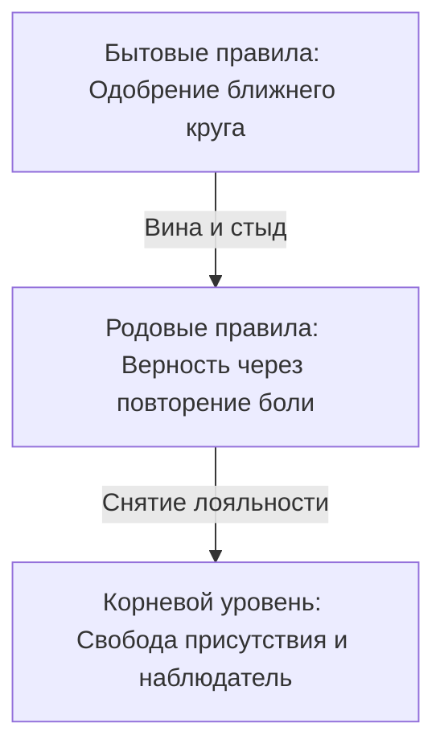

# Виды политик доступа

Тот разъедающий голос вины, который мы с детства привыкли уважительно называть совестью, редко бывает голосом мудрости или высшей справедливости.

Чаще всего это голос перепуганного часового на проходной первобытной стаи. Его задача примитивна и жестока: не дать тебе выделиться, чтобы стая не изгнала тебя на мороз. Он сидит в солнечном сплетении тяжелым камнем и шепчет: *«Не высовывайся. Не смей радоваться, пока другим тяжело. Сначала отдай всё близким, а о себе подумаешь в последнюю очередь. Счастье опасно, за него придется расплачиваться»*.

Если бы человек вырос среди волчьей стаи, этот же внутренний страж считал бы ночной вой абсолютной нормой, а попытку встать на две ноги — предательством стаи. Ему чужды понятия добра и зла. У него есть только один критерий: «как у наших» или «не как у наших».

В глубинах детской нервной системы записана команда, которая старше логики и рассудка: **будь таким, как твои близкие, иначе ты погибнешь**. Для беззащитного ребенка потеря принадлежности к своей семье действительно означает верную смерть.

Поэтому, прежде чем в очередной раз покорно опустить голову перед липким чувством «мне стыдно жить хорошо», стоит разобраться, какие внутренние законы управляют твоими границами.

---

## Три уровня правил

В устройстве человеческой психики действуют три разных уровня предписаний:

**Бытовой уровень (правила социума).**  
Это поверхностный слой: нормы приличия, привычки текущего окружения, сиюминутная мода на поведение. Этот контур постоянно сканирует пространство: *«Достаточно ли я удобен для других? Не выгляжу ли я глупо? Не сочтут ли меня эгоистом?»* Здесь живут обычный стыд и страх насмешки.

**Родовой уровень (правила семейной верности).**  
Этот пласт лежит неизмеримо глубже. Родовой системе нет дела до твоих дипломов, комфорта или размера банковского счета. Ее единственная задача — чтобы цепочка выживания не прерывалась, а связь между поколениями подтверждалась общей судьбой.

Если бабушка потеряла мужа на фронте и одна в голоде поднимала троих сирот, а мать тридцать лет терпела домашнего тирана ради того, «чтобы у детей был отец», в подсознании внучки без всяких слов формируется негласная клятва:

> *«Женщина нашего рода не имеет права на легкую и радостную женскую долю. Быть любимой, жить в сытости и неге — значит предать память тех, кто нес крест до меня».*

Психика сама разрушит любые счастливые и теплые отношения. Она выберет эмоционально недоступного, холодного или зависимого партнера — лишь бы уровень душевной боли сравнялся со страданиями матери и бабушки.

**Корневой уровень (уровень сути и наблюдателя).**  
Здесь нет разделения на «своих» и «чужих», нет долгов и вины за чужие тяготы. Каждый человек признается равным по праву своего рождения. Только из этого спокойного и ясного состояния наблюдателя можно увидеть старую разрушительную верность и снять ее без вражды к роду.

---

> [!NOTE]
> В 1970 году британский социальный психолог Анри Тэшфел провел в Бристоле серию экспериментов по минимальной групповой парадигме. Он делил незнакомых подростков на группы по совершенно случайным поводам: по оценке количества точек на экране или предпочтению картин Кандинского и Клее. Мальчики не общались между собой и не видели друг друга. Тем не менее, распределяя реальные деньги, они стабильно предпочитали не максимизировать собственный выигрыш, а увеличивать разрыв в пользу «своих» за счет «чужих». Они охотнее соглашались получить семь монет себе и три сопернику, чем десять себе и десять сопернику.
> 
> Потребность в слепой групповой лояльности вспыхивает мгновенно. В семейной системе этот механизм работает на уровне биологии: контур безопасности предпочитает оставаться бедным и больным внутри семейного клана, чем нарушить кодекс общей беды. Любое личное благополучие тело считывает как дезертирство и немедленно реагирует спазмом вины.

---

## Загадка трех голосов

> [!TIP]
> **Ситуация**  
> Твои дела пошли в гору. Проект приносит прибыль, дома тепло и спокойно, на счете впервые в жизни лежит сумма, позволяющая не смотреть на ценники. И на самом пике этого успеха внутри поднимается ледяная тревога: живот сводит судорогой, плечи втягиваются, накатывает тяжелое предчувствие неминуемой беды.
>
> **Голос Расчета:** *«Спрячь все. Оденься попроще, не привлекай внимания, не зли родственников. Их скрытая зависть и обиды отравят тебя».*  
> **Голос Слепой Лояльности:** *«Отец всю жизнь надрывался на заводе за копейки. Бабушка экономила каждую крошку хлеба. Твоя сытая беззаботность — это оскорбление их памяти. Раздели их тяжесть, стань скромнее».*  
> **Голос Сути:** *«Их тяжесть принадлежала их времени и обстоятельствам. Твое процветание — это не насмешка над ними, а единственный подлинный смысл их лишений. Ты имеешь право жить своей жизнью».*
>
> *Вопрос на осознанность:* Кому на самом деле служит твое добровольное страдание — облегчает ли оно участь ушедших предков или лишь множит темноту в настоящем?

---

## Сессия. Наталья

Наталья — успешный архитектор интерьеров, тридцать четыре года.

— Стоит моим делам наладиться — крупный заказ, покупка квартиры, гармония с мужем, — как внутри начинается настоящий ад. Словно сирена завывает: «Ты не имеешь права! Это ненадолго!». И я словно сама начинаю все рушить: устраиваю дикие сцены мужу на ровном месте, влезаю в долги, отдаю деньги проходимцам. Пока снова не окажусь на бобах, не могу успокоиться.

> **Терапевт:** Закрой глаза и опусти внимание в эту тревогу. Где она живет в теле?
>
> **Наталья:** *(кладет руку под ребра, пальцы напряжены)* Здесь. Под диафрагмой. Ледяной кол. Голова втягивается в плечи, дыхание мелкое. Ощущение, будто меня поймали на воровстве и сейчас будут судить.
>
> **Терапевт:** Представь перед собой женщин своего рода: маму, бабушку, прабабушку. Что этот ледяной кол говорит им?
>
> **Наталья:** *(голос срывается, на глазах слезы)* Он говорит: мне стыдно перед вами. Бабушка осталась вдовой в двадцать два года — дед погиб при завале на шахте. В голодном сорок седьмом она варила троим детям похлебку из лебеды, а сама тайком жевала сырую траву за печкой, чтобы не упасть. Маминого отца я помню: он приходил пьяным, избивал мать за остывший суп. Она выла ночью в подушку, а я, семилетняя, сидела под одеялом и шептала: «Мамочка, я никогда тебя не брошу, я буду с тобой». А сейчас у меня светлая студия с панорамными окнами, любящий муж, фарфоровые чашки, кофе по утрам. Я чувствую себя последней предательницей. Словно своим счастьем я насмехаюсь над их адом.
>
> **Терапевт:** Это закон слепой верности: доказать свою любовь к матери можно только повторением ее мучений. Благополучие приравнивается к измене. Посмотри в глаза своей бабушке. Посмотри на маму. Спроси их прямо: они вынесли эту тьму для того, чтобы ты легла рядом с ними в эту же могилу — или для того, чтобы хоть одна веточка их дерева наконец увидела солнце и расцвела?
>
> **Наталья:** *(долго молчит, слезы текут по щекам)* Бабушка смотрит на меня... В ее взгляде нет упрека.
>
> **Терапевт:** Скажи им вслух: *«Я вижу ваш голод, ваш страх и вашу тьму. Я склоняюсь перед той огромной ценой, которую вы заплатили, чтобы жизнь не прервалась и дошла до меня. Мое счастье — это не предательство. Моя радость — это продолжение и смысл ваших жертв. Вашу боль я с уважением оставляю в вашем времени, а себе беру жизнь».*
>
> **Наталья:** *(делает протяжный, свободный выдох, спина расправляется)* Бабушка улыбнулась. Она словно подошла и гладит меня своей сухой, шершавой ладонью по щеке. Говорит: «Живи, внучка. Живи за нас, дыши свободно, радуйся».
>
> **Терапевт:** Что сейчас происходит под ребрами?
>
> **Наталья:** Ледяной кол растаял. В груди разливается горячая волна. Мне впервые в жизни не нужно умирать и страдать, чтобы оставаться их дочерью.

---

## Паритет

Вражда двух сибирских купеческих родов — Чернышовых и Волковых — не имела ничего общего с романтикой дворянских дуэлей. Это была беспощадная война на уничтожение: сфабрикованные судебные иски, поджоги лесопилок, разорение и нищета. Детям передавали не любовь и не созидание, а волчий инстинкт: *любой человек с той фамилией — смертельный враг*.

Роман Чернышов и Юлия Волкова выросли внутри этой тяжелой ненависти.

Они случайно встретились на карнавале в Венеции. Безлюдный мост над каналом, старинные маски, поразительное совпадение тембров и интонаций. Когда на рассвете маски были сняты, отступать оказалось поздно: тела и души узнали друг друга раньше, чем включился рассудок.

Три года они тайно встречались в нейтральных городах и отелях. Они наивно говорили себе: на дворе двадцать первый век, мы современные европейские люди, мы выше средневековых семейных вендетт.

Но древняя родовая солидарность не отпускает человека по одному лишь интеллектуальному заявлению.

Старший брат Юлии выследил их на парковке транзитного аэропорта. Монтировка, крики, ярость. Роман бросился наперерез, чтобы защитить Юлию, оттолкнул нападавшего. Брат оступился на мокром асфальте и со всего размаха ударился виском об острый угол бетонной опоры.

Сухой хруст кости. Запах бензина. Неподвижное тело на сером бетоне.

Парень умер мгновенно — за родовую обиду вековой давности, истинных причин которой в семьях уже никто толком не помнил.

Стена между домами стала непреодолимой. Отец спешно выдал Юлию за жесткого сырьевого партнера. Роман уехал за океан, оборвав все связи.

Их последняя встреча произошла на продуваемой ветром крыше недостроенного делового центра «Паритет» — гигантского комплекса, который их отцы когда-то начинали строить как символ примирения, но затем заморозили многолетними судебными тяжбами.

Юлия говорила тихим, мертвым голосом:

— Если я уйду с тобой, моя семья вычеркнет меня навсегда. Если останусь — я медленно сгнию заживо. Но самое невыносимое другое: каждый раз, глядя в твои глаза, я буду видеть смерть брата. Прости меня.

Они разошлись в разные стороны.

Оба создали внешне безупречные фасады. Роман женился на спокойной, рассудительной женщине. Юлия вела светскую жизнь и возглавляла благотворительные фонды под руку с респектабельным супругом.

Но в их детях поселился странный паралич близости.

Сын Романа в двадцать пять лет внезапно разорвал помолвку с любимой девушкой за неделю до свадьбы, так и не сумев объяснить причину своего панического бегства. Дочь Юлии выбирала исключительно эмоционально холодных мужчин, а после каждого мучительного разрыва повторяла с горьким триумфом: «Я всегда знала, что мужчины приносят только предательство и боль».

Молодые люди не были знакомы друг с другом, но в обоих безотказно работал один и тот же невидимый родовой закон: **подлинная близость ведет к катастрофе и крови**.

Небоскреб «Паритет» достроили спустя пятнадцать лет.

На торжественном открытии во главе банкетного стола сидели двое дряхлых стариков — два живых памятника многолетней ненависти с дрожащими руками и холодными глазами.

А за соседним столом, по протоколу рассадки партнеров, оказались их внуки. Сын Романа и дочь Юлии. Они весь вечер сидели молча, пряча напряженные руки под скатертью.

А потом девушка подняла глаза. Молодой человек не отвел взгляда. Несколько секунд посреди звона хрустальных бокалов и фальшивых тостов они смотрели друг на друга с внезапным узнаванием одной и той же неизбывной тоски.

В их взглядах не было ни капли вражды. В них читалась только одна робкая мысль: *«Неужели можно наконец опустить это ржавое оружие?»*

Война семей никогда не заканчивается победой. Ее расплатой всегда становятся последующие поколения, которые разучились впускать человека в свое сердце и всю жизнь строят крепости вокруг ледяного одиночества.

---

## Практика

Возьми чистый лист бумаги и напиши от руки.

Четко и без прикрас назови тот запрет, который ты годами обслуживаешь собственной болью:

> *«Я запрещаю себе [финансовую свободу / крепкое здоровье / теплый счастливый брак], потому что в нашей семье было принято [тяжело выживать / терпеть холод / страдать в одиночестве]. Мой саботаж и мои неудачи были тайным доказательством моей верности вам».*

Рядом напиши слова освобождения:

> *«Я вижу цену вашей жизни и кланяюсь ей. Но наши судьбы и счета я разделяю. Ваша тяжелая доля принадлежит вам, а моя жизнь принадлежит мне. Контракт на верность через страдание и саморазрушение я расторгаю. Мое счастье, здоровье и процветание будут лучшей данью уважения к тому, что вы передали мне жизнь».*

Встань прямо перед зеркалом. Посмотри себе в глаза и произнеси второй текст спокойно, тихо и бесповоротно. 

Если спазм в солнечном сплетении сменяется глубоким вздохом и теплом в груди — слова нашли свое место. Если внутри сохраняется сопротивление — не дави на себя. Мы вернемся к этому узлу в следующих главах.

---

> [!IMPORTANT]
> **Главная мысль главы**  
> Счастье часто маскируется под предательство родовых традиций. Но сжимающий горло голос — это не совесть. Это старый страж, чьи полномочия давно истекли.

---

> [!TIP]
> **Интерактивный помощник**  
> Первый акт завершен: перед тобой полная карта базовых контуров системы. Если работа с родовыми узлами вскрыла старую боль, спазм или глухое сопротивление — не оставайся с этим один на один. Ты можешь использовать диалоговое окно внизу страницы, чтобы вместе с ассистентом бережно разобрать свой конкретный тупик.
