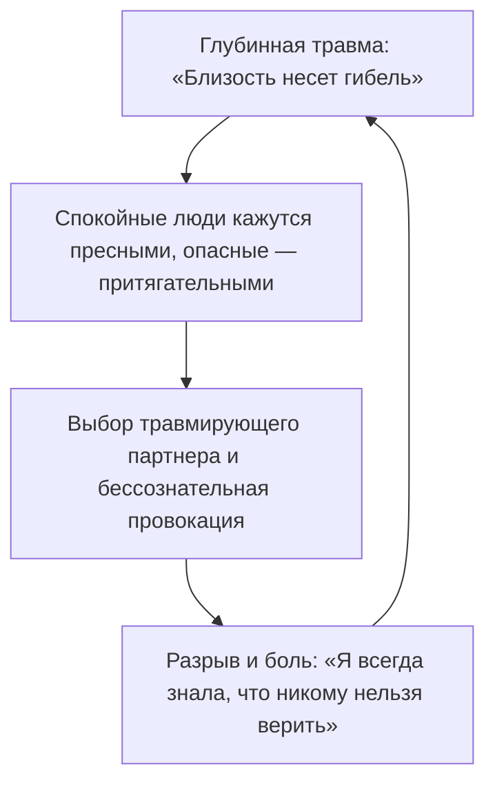

# Природа повторяющихся сценариев

Декорации вокруг тебя могут меняться с калейдоскопической скоростью. Меняются города, профессии, партнеры, суммы на счетах. Но финальная сцена любой жизненной драмы раз за разом повторяется с пугающей точностью до миллиметра.

Работодатели разные, а увольнение всегда происходит по одной и той же унизительной схеме. Новые отношения всякий раз начинаются с фейерверка надежд, а через полтора года неизменно превращаются в выжженную эмоциональную пустыню. Деньги приходят легко, но ровно на одной и той же планке обязательно случается форс-мажор: внезапный судебный иск, авария, тяжелая болезнь или поломка, срезающая весь излишек под корень.

Рассудок услужливо подсовывает привычные оправдания: «неудачный экономический цикл», «незрелые партнеры», «банальное невезение».

Эти версии звучат успокаивающе. Но они обходятся слишком дорого, потому что надежно скрывают истинный корень проблемы.

Это не слепой рок и не злая судьба. Это негласная внутренняя клятва, запечатанная в глубинах родового бессознательного. Психика не ошибается случайно. Она с безупречной точностью исполняет глубинную команду, усвоенную в момент далекой семейной катастрофы: *«Переступать эту черту смертельно опасно. Остановись»*.

---

## Три поколения семьи Беловых

Ноябрь девяносто четвертого года. Промозглая тьма на окраине промышленного города. Николай Белов сидит на заднем кожаном сиденье тяжелого бронированного «мерседеса» и дрожащей рукой вытирает липкий пот с шеи.

Под ногами лежит армейский кейс с пачками долларов. Под сиденьем — укороченный автомат с откинутым прикладом. В мясорубке девяностых Николай выжил там, где полегли сотни его ровесников: на зверином чутье, на абсолютной паранойе, на привычке всегда бить первым. В ту ночь он чудом выскочил из засады на шоссе. Двое его верных телохранителей остались лежать на мокром асфальте.

Добравшись до своего загородного особняка, Николай заперся в темном кабинете, залпом выпил полстакана водки и намертво впечатал в свое нутро закон выживания:

*«Верить нельзя ни одной живой душе. Любая душевная близость — это подставленное под нож горло. Тотальный контроль — единственный способ остаться в живых».*

С этим законом он прожил следующие тридцать лет. Он заработал десятки миллионов, построил огромную промышленную империю. И умер в шестьдесят два года от внезапного разрыва аорты в кирпичной крепости за шестиметровым забором, среди своры свирепых овчарок и десятков камер наблюдения. Своих охранников и помощников он заставлял проходить полиграф каждую неделю. В момент смерти рядом с ним не было никого — за долгие годы подозрительности он разругался абсолютно со всеми близкими.

Его сын Дмитрий вырос в атмосфере непрекращающегося домашнего обыска: вскрытые личные дневники, внезапные ночные проверки комнаты, жесткие допросы за опоздание из школы на пять минут.

Дмитрий поклялся себе, что никогда не станет похож на отца, и выбрал внешне полную противоположность. Никакой семьи. Никаких долгосрочных контрактов. Смена стран, городов и женщин каждые три месяца. Он с гордостью заявлял о своей абсолютной независимости и внутренней свободе.

Но это была не свобода. Это был тот же самый отцовский ужас перед близостью, только превращенный в бесконечный панический бег. В сорок пять лет Дмитрий очнулся на ледяном полу своего роскошного пентхауса в Сингапуре от приступа мерцательной аритмии. В его телефонной книге были тысячи контактов влиятельных людей со всего мира. И ни одного человека, которому можно было бы позвонить посреди ночи и по-человечески попросить привезти сердечные капли.

Внучка Николая, Алина, пришла на консультацию в тридцать два года. Успешный арт-директор, два престижных европейских диплома, безупречный вкус. И при этом — безжизненный, усталый голос женщины, которая смертельно вымотана собственной судьбой.

— Почему со мной раз за разом происходит одно и то же? — говорила она, пряча глаза. — Я влюбляюсь в мужчин, которые сначала буквально носят меня на руках. А через полгода начинают контролировать каждый мой шаг: читают переписки, запрещают общаться с подругами, ревнуют к каждому столбу и запирают в четырех стенах. Я всей душой ненавижу контроль! Я задыхаюсь в этих отношениях! И каждый раз сама снова наступаю на те же грабли.

> **Терапевт:** Закрой глаза. Представь, как твой партнер берет твой телефон и требует показать личные сообщения. Что происходит в теле прямо сейчас?
>
> **Алина:** *(плечи сжимаются, пальцы судорожно впиваются в колени)* Горло перехватило. Вокруг груди словно затянули колючую проволоку. Хочется спрятаться под кровать, уменьшиться, стать невидимкой.
>
> **Терапевт:** Кому на самом деле принадлежит этот ледяной панцирь? Кто в твоем роду впервые надел эту броню, чтобы не получить нож в спину?
>
> **Алина:** *(голос дрожит)* Дедушка Николай... Тот черный бронированный «мерседес». Вой сирен скорой помощи. Кровь охранников на асфальте. Я вижу, как он сжимает в руках автомат и твердит: никому нельзя верить, расслабишься — убьют. А рядом стоит папа. Он всю жизнь бежал от дедушки по миру и в сорок пять упал посреди пустого пентхауса, потому что рядом не было ни души.
>
> **Терапевт:** Три поколения. Дед спасался маниакальным контролем. Отец спасался бегством от любой привязанности. А ты бессознательно выбираешь домашних тюремщиков, чтобы снова и снова подтверждать их древний родовой завет: близость смертельно опасна. Поставь деда и отца перед собой. Посмотри им в глаза и скажи правду.
>
> **Алина:** Дедушка... Папа... Я вижу вашу войну. Я вижу засаду на ночной трассе. Я вижу ледяную пустыню сингапурского пентхауса. Вы выживали так, как могли. И я появилась на свет благодаря вашей силе. Но эта бойня закончилась тридцать лет назад. Мой дом — это не осажденная крепость. Человек рядом со мной — это не наемный убийца. Я снимаю с себя ваш бронежилет. Вашу войну я с уважением оставляю вам. А в своей жизни я выбираю учиться доверять.
>
> **Алина:** *(делает судорожный вдох, колючая хватка на ребрах с глухим щелчком разжимается, слезы облегчения омывают лицо)*

Через полгода Алина прислала короткое сообщение: «Я встретила спокойного, теплого человека. Мы вместе уже четыре месяца. По вечерам на нашей кухне больше не пахнет гарью и порохом. Оказывается, можно просто пить чай рядом с мужчиной, дышать полной грудью и не ждать удара в спину».

Три поколения семьи жили по закону, написанному кровью на асфальте в далеком девяносто четвертом году. Когда эту древнюю клятву наконец назвали по имени и с поклоном вернули ее времени, морок рассеялся сам собой.

---

---

> [!NOTE]
> Американские психоаналитики Роберт Столороу и Джордж Атвуд, основатели теории интерсубъективных систем, доказали: феномен навязчивого повторения травмы (repetition compulsion) — это не патологическое стремление к саморазрушению. Это отчаянная попытка человеческой психики доиграть и исцелить то, что когда-то оборвалось катастрофой.
> 
> Когда ребенок или предок сталкивается с трагедией в одиночестве, не имея рядом зрелого взрослого, способного разделить эту боль, психика фиксирует экстремальные условия беды как непреложный закон всего мироздания. В дальнейшем человек бессознательно отбрасывает всё, что противоречит этому закону, и упорно воссоздает знакомый кошмар в надежде на этот раз переписать финал. Биология стремится не к страданию — она ищет завершения. Пока корень сценария не осознан, повторяющийся кошмар кажется неотъемлемым свойством внешнего мира, а не внутренней программой, которая сама его призывает.

---

## Почему сценарий так трудно разомкнуть

Любой застарелый сценарий обладает тремя свойствами, которые делают его невидимым для обычного рассудка:

**Он действует из слепой зоны.**  
Ты не помнишь момента, когда эта клятва была запечатана в роду. Ты просто смотришь на мир через темное тонированное стекло семейной травмы и искренне веришь, что небо над всеми людьми черного цвета.

**Он подменяет восприятие.**  
Если в твоем бессознательном живет закон «меня обязательно предадут», рядом с надежным, уравновешенным и любящим человеком тебе будет мучительно скучно. В этих отношениях не будет привычного адреналинового шторма. Зато к эмоционально холодным, ненадежным или женатым партнерам потянет с непреодолимой силой. А затем последуют подозрения, проверки, неизбежный разрыв и горькое торжество: *«Ну вот. Я так и знал. Людям верить нельзя»*.

**Под каждым сценарием лежит невыплаканная боль.**  
Любое жесткое жизненное правило — это лишь окоп, торопливо вырытый поверх детского ужаса оказаться брошенным и ненужным. Именно поэтому поверхностные позитивные аффирмации вызывают лишь тошноту и раздражение: наклеивание цветочных обоев поверх раскаленной стены аварийного ядерного реактора не способно снизить уровень радиации.

---

## Практика

Вспомни три самых тяжелых жизненных тупика из совершенно разных сфер: крах в отношениях, провал в бизнесе, потеря денег.

Отбрось внешние декорации, имена и обстоятельства. Какое одно-единственное ощущение оставалось на дне каждого из этих трех финалов? Глухое унижение? Одиночество на морозе? Чувство полного бессилия? Это и есть твой глубинный эмоциональный маркер.

Сформулируй ту негласную команду, которую когда-то записала твоя испуганная семейная система:

*«Если я проявлю себя настоящим — меня уничтожат».*  
*«Любовь можно получить только ценой унизительного рабства».*  
*«Большие деньги привлекают хищников. Безопаснее всего быть бедным и незаметным».*

Положи ладонь на то место в теле, где отзывается эта фраза. Произнеси вслух, ощущая каждое слово:

> *«Я вижу ту страшную боль, из которой родилось это правило. В момент опасности оно действительно спасло жизнь моим предкам. Но сейчас другое время и другие обстоятельства. Я снимаю эту инструкцию с исполнения. Моя жизнь принадлежит сегодняшнему дню».*

Если дыхание стало глубже, а спазм в висках или грудине мягко отпустил — разрушительный сценарий потерял свою гипнотическую власть. Тело сделало первый шаг к подлинной свободе.

---

> [!IMPORTANT]
> **Главная мысль главы**  
> Разрушительный жизненный сценарий будет воспроизводиться бесконечно до тех пор, пока скрытая в его корне клятва не будет названа своим истинным именем.
