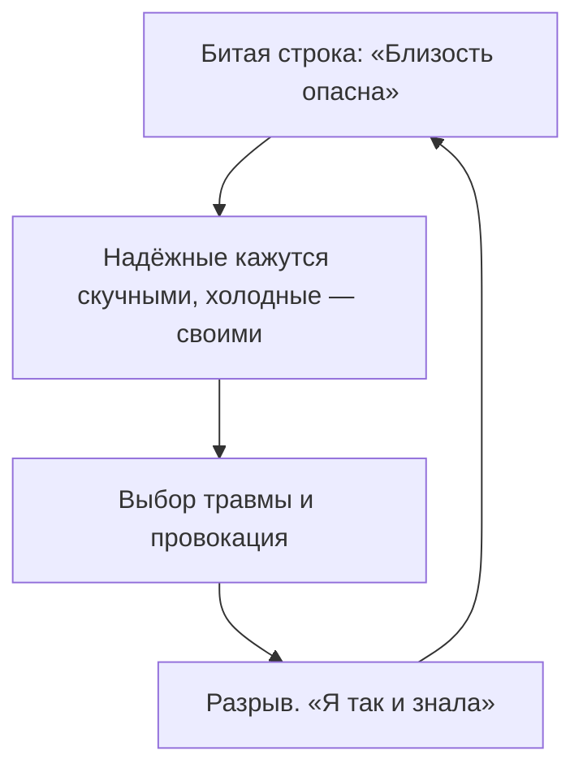

# Природа багов

Декорации меняются. Имена тасуются. Суммы на счетах скачут. Финальная сцена — та же, до миллиметра.

Работодатели разные — увольняют по одной унизительной схеме. Отношения начинаются с фейерверка и через полтора года становятся пустыней. Деньги приходят легко — и на одной и той же цифре случается пожар, иск, поломка, болезнь. Излишек срезан под корень.

Голова подсовывает удобное: не тот цикл, незрелые партнёры, невезение.

Версии приятные. И дорогие: они закрывают причину.

Это не рок. **Битая строка в корневом файле.** Система не ошибается случайно. Она исполняет команду, записанную при первой загрузке: *дальше этого рубежа двигаться смертельно опасно.*

---

## Три поколения Беловых

Ноябрь девяносто четвёртого. Николай Белов на заднем сиденье бронированного «мерседеса» вытирает платком шею.

Под ногами — армейский кейс с долларами. Под сиденьем — укороченный автомат. В девяностые он выжил там, где легли сотни: на недоверии, на паранойе, на ударе первым. В ту ночь засады он избежал. Двоих охранников — нет.

В особняке он заперся в кабинете, налил водки и впечатал закон:

*«Верить нельзя никому. Любая близость — открытое горло под нож. Контроль — единственный способ дышать.»*

С этим он прожил тридцать лет. Десятки миллионов. Империя. И смерть в шестьдесят два — разрыв аорты, в кирпичном форте за шестиметровым забором, среди овчарок и камер. Телохранителей гонял через детектор лжи каждую неделю. Рядом не было никого. Со всеми переругался.

Сын Дмитрий вырос в домашнем обыске: дневники, комната, допрос за опоздание на пять минут.

Он выбрал, как ему казалось, противоположность. Никакой семьи. Никаких контрактов дольше сезона. Страны и женщины — каждые три месяца. Гордо: абсолютная автономия.

Это не была свобода. Это была та же ось страха, только бегом. В сорок пять он очнулся на полу стеклянного пентхауса. Мерцательная аритмия. Тысяча контактов в телефоне. Ни одного, кому можно позвонить ночью и попросить привезти лекарство.

Внучка Алина пришла в тридцать два. Арт-директор. Два европейских диплома. Голос человека, который уже устал от собственной биографии:

— Почему я влюбляюсь в тех, кто сначала носит на руках, а через полгода читает переписки, запрещает подруг и запирает дома? Я ненавижу контроль. Задыхаюсь. И сама опять в него лезу.

> **Терапевт:** Закрой глаза. Он берёт твой телефон и требует пароль. Что в теле?
>
> **Алина:** *(плечи внутрь, пальцы в колени)* Горло. Вокруг груди — колючая проволока. Хочется под кровать. Стать невидимкой.
>
> **Терапевт:** Чей это корсет? Кто в роду надел броню, чтобы не получить нож в спину?
>
> **Алина:** Дедушка Николай. Тот «мерседес». Вой сирен. Кровь охранников на асфальте. Он сжимает автомат и шепчет: никому нельзя. Расслабишься — убьют. А рядом папа. Бежал от него по всему миру и в сорок пять упал на пол, потому что позвонить было некому.
>
> **Терапевт:** Три поколения. Дед — контролем. Отец — бегством. Ты выбираешь тюремщиков, чтобы подтвердить их завет: близость — это горло под нож. Поставь обоих перед собой. Скажи.
>
> **Алина:** Дедушка. Папа. Я вижу вашу войну. Засаду на трассе. Пустыню в том пентхаусе. Вы выживали как могли. Я родилась благодаря этому. Бойня кончилась тридцать лет назад. Мой дом — не крепость. Человек рядом — не киллер. Снимаю ваш бронежилет. Войну возвращаю вам. Я выбираю доверять в своём времени.
>
> **Алина:** *(всхлип; проволока на рёбрах щёлкает и отпускает. Первый полный вдох)*

Через полгода — короткое сообщение: «Встретила спокойного. Четыре месяца. По вечерам в тишине больше не пахнет порохом. Можно дышать рядом и не ждать удара».

Три поколения танцевали под музыку, записанную на залитом кровью асфальте. Строку вернули туда, где её написали. Морок рассеялся.

---

---

> [!NOTE]
> Роберт Столороу и Джордж Атвуд описывали навязчивое повторение не как тягу к гибели, а как попытку нервной системы доиграть то, что оборвалось. Ребёнок попадает в катастрофу, рядом нет взрослого, который выдержит. Мозг фиксирует условия катастрофы как закон: так устроен мир. Дальше он отбрасывает всё, что закону противоречит, и ищет ситуации, где финал можно переиграть. Биология хочет не боли. Она хочет завершения. Пока строка не названа, кошмар кажется свойством реальности, а не программой, которая сама себе его заказывает.

---

## Почему строка не умирает

Она работает без окна. Момента записи не помнишь. Смотришь на мир через тонированное стекло и веришь, что небо чёрное.

Она подделывает вход. С прошивкой «меня предадут» рядом с открытым человеком скучно: нет привычной бури. К холодным тянет. Дальше контроль, подозрения, уход. И трагическое облегчение: *ну вот. Я так и знал.*

Под каждым багом — неразряженная боль. Правило — окоп поверх детского ужаса, что ты не нужен. Поэтому аффирмации тошнит. Обои на стене горящего реактора фон не снижают.

---

## Практика

Возьми три тупика из разных мест: дело, близость, деньги. Выкинь декорации. Какое одно ощущение стояло в финале каждого? Унижение. Брошенность. Бессилие. Это контрольная сумма.

Сожми в одну фразу, которую записала испуганная система:

*«Если проявлюсь — уничтожат.»*  
*«Любовь надо заслуживать рабством.»*  
*«Большие деньги зовут хищников. Безопаснее быть нищим.»*

Вслух, внимание в теле:

> *«Я вижу, из какой боли это скомпилировали. В тот момент правило спасло. Контекст другой. Снимаю инструкцию с исполнения. Моя жизнь — этого времени.»*

Если вдох стал шире и тиски на висках или грудине дали слабину — процесс остановлен. Не «навсегда в теории». На этот вдох. Дальше тело проверит само.

---

> [!IMPORTANT]
> **Закон главы**
> Сценарий крутится, пока строка в его корне не названа.
