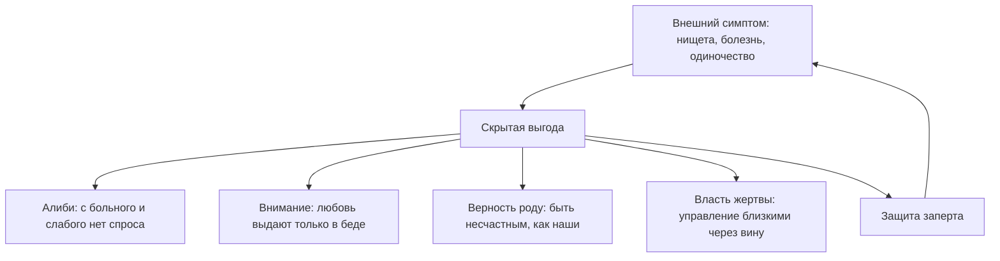

# Вторичные выгоды и скрытые защиты

Задай себе один предельно прямой и честный вопрос.

Почему в твоей жизни до сих пор нет тех денег, которых ты объективно стоишь по своим способностям и опыту? Почему рядом с тобой находится не тот человек, ради которого по утрам хочется летать, а тот, с кем всё «как-то само собой сложилось по привычке»?

«Неблагоприятные времена». «Черная полоса». «Экономический кризис». «Трудные родственники». «Хроническое выгорание». Эти формулировки звучат респектабельно, вызывают сочувствие у окружающих и прекрасно снимают ответственность.

Но это удобная полуправда. И сейчас мы снимем с нее маску.

Если какая-то тяжелая проблема не решается в твоей жизни годами — непроходящее безденежье, череда одинаковых деструктивных связей, телесный симптом, перед которым бессильны врачи, — это происходит вовсе не вопреки твоей воле. Это происходит при ее молчаливом, глубоко скрытом согласии.

Внутренняя защита человека устроена парадоксальным образом: психика упорно удерживает проблему, если эта проблема выполняет какую-то жизненно важную охранную функцию.

Можно годами клеить коллажи желаний на стену, читать мотивационные книги и посещать тренинги финансового изобилия. Но в тот самый момент, когда перед тобой открывается реальная возможность качественного прорыва, кто-то внутри тебя резко нажимает на стоп-кран: накатывает парализующая лень, за день до решающего собеседования скручивает острый приступ болезни, а рука словно сама отправляет резкое, сжигающее все мосты сообщение ключевому клиенту.

Этот внутренний саботажник — твоя **вторичная выгода**. Пока она не выведена на чистую воду и не названа своим истинным именем, симптом останется неприкосновенным.

Ее почерк безошибочен: внезапно забытое поручение, от которого зависело твое повышение; проспанный авиарейс на решающие переговоры; необъяснимая ангина накануне старта масштабного проекта. Человек привык жаловаться на фатальное невезение. Но на самом деле внутренняя защита блокирует прорыв потому, что для нее любое кардинальное изменение на данный момент выглядит куда опаснее, чем привычное болото.

---

> [!NOTE]
> Профессора Гарвардского университета Роберт Кеган и Лайза Лахи тридцать лет исследовали поразительный психологический феномен, получивший название «иммунитет к изменениям» (Immunity to Change). Ученые наблюдали за тем, почему высокоинтеллектуальные, волевые люди с завидным постоянством саботируют собственные осознанные цели.
> 
> Исследования показали: за каждым хроническим срывом всегда стоит скрытое, конкурирующее обязательство, о существовании которого сам человек даже не догадывается. Это не слабость характера и не отсутствие дисциплины. Это мощная подсознательная страховка: страх потерять принадлежность к семье, ужас перед столкновением со стыдом или нежелание нести взрослую ответственность за ошибки. 
> 
> Человеческая психика всегда выбирает знакомое привычное несчастье как меньшее зло по сравнению с той неизвестной катастрофой, которую нарисовало воображение. Разомкнуть эту защиту волевым насилием невозможно. Она растворяется только тогда, когда человек осознает, от какой именно боли его так долго спасал этот симптом.

---

## Алексей

Алексею тридцать два года. Талантливый инженер-программист с редким математическим складом ума. И при этом последние пять лет он сидит на шее у своей уставшей, измученной жены.

Его дни проходят в редких копеечных подработках на фрилансе, бесконечных обещаниях «начать с понедельника» и философских рассуждениях. Три психотерапевта, десятки прочитанных книг по тайм-менеджменту. Но стоило только на горизонте появиться солидной должности с высоким окладом — у Алексея мгновенно начиналась острая почечная колика. Либо за полчаса до финальной встречи с инвесторами он отправлял им неадекватное, вызывающее письмо, навсегда сжигая все мосты.

Его тупик охранялся с маниакальной тщательностью.

> **Терапевт:** Представь: трудовой договор подписан. Завтра твой первый рабочий день в роли ведущего системного архитектора компании. Семья полностью обеспечена, впереди большие перспективы. Положи руку на грудь. Что происходит в теле?
>
> **Алексей:** *(мгновенно, с улыбкой)* Да я буду на седьмом небе от счастья! Это же работа моей мечты!
>
> **Терапевт:** Это говорит твой фасад. Закрой глаза и опустись глубже. Завтра утром нужно встать, надеть костюм и войти в офис, где каждое решение лежит на тебе. Что происходит с дыханием прямо сейчас?
>
> **Алексей:** *(лицо темнеет, улыбка сползает, пальцы сжимаются в кулаки)* Дышать нечем. На грудную клетку будто положили бетонную плиту. В горле спазм. Ладони стали ледяными и влажными. Меня накрывает липкий, тошнотворный ужас.
>
> **Терапевт:** Какую службу несет твой продавленный диван? От чего тебя пять лет подряд спасает статус безработного неудачника?
>
> **Алексей:** Если я начну зарабатывать по-настоящему большие деньги — с меня будет спрос по полной программе. Я больше не смогу говорить: «Я в творческом поиске, не трогайте меня». Придется отвечать за результат. Я смертельно боюсь опозориться тогда, когда от меня ждут триумфа.
>
> **Терапевт:** Это только первый рубеж обороны. Пойдем глубже. Когда ты видишь себя сильным, успешным, богатым мужчиной — чей осуждающий взгляд ты встречаешь в темноте?
>
> **Алексей:** *(голос падает до еле слышного шепота)* Отец... Он всю жизнь повторял мне одно и то же: «Ты пустое место. У тебя руки растут не оттуда. Из тебя никогда ничего путного не выйдет».
>
> **Терапевт:** Если ты станешь успешным и богатым — ты докажешь отцу, что он был неправ. Почему твоя психика изо всех сил блокирует эту победу?
>
> **Алексей:** *(молчит целую минуту, нижняя челюсть начинает мелко дрожать)* Потому что если я стану успешным... мне придется признать, что мой собственный отец двадцать лет втоптал меня в грязь просто так. Из собственной злобы и зависти. И мне придется встретиться с яростью на него. А пока я лежу на диване в нищете...
>
> **Терапевт:** Договаривай. До самого конца.
>
> **Алексей:** *(закрывает лицо руками)* ...пока я нищий и беспомощный, я каждый день ползу к его ногам и кричу: «Смотри, папа, ты победил! Я ничтожество, точно как ты и говорил! Я сломал свою жизнь ради твоей правоты! Посмотри, как мне больно! Пожалей меня! Хоть один раз в жизни обними меня и скажи, что я твой любимый сын!».

Алексей плакал двадцать минут подряд. Это плакал не тридцатидвухлетний программист. Это рыдал маленький, раздавленный жестокостью мальчик, который годами расшибает лоб о дубовую дверь отцовского кабинета.

Пять лет унизительной нищеты были вовсе не ленью. Они были немым, отчаянным криком о непринятой любви, превращенным в медленное изощренное самоубийство на глазах у любящей жены.

Затем Алексей встал, умылся холодной водой, сел обратно в кресло и долго смотрел в окно на мокрый асфальт.

— Какое безумие, — произнес он с глубоким выдохом. — Я чуть не разрушил собственную семью, чуть не втоптал себя в могилу только ради того, чтобы отомстить человеку, которого уже пять лет как нет в живых.

Спустя два месяца Алексей успешно прошел сложнейшее техническое интервью и возглавил инженерное подразделение. Не потому, что прошел очередной мотивационный марафон. А потому, что набрался мужества назвать истинного адресата, которому он годами приносил в жертву свою жизнь.

---

## Четыре скрытых контракта

Психологическая защита держится на одном из четырех скрытых соглашений:

**1. Железное алиби от неудач.**  
*«Я бы давно построил международный бизнес или написал книгу, но у меня больная спина, депрессия и кризис в стране».* Статус страдающего человека позволяет никогда не выходить на открытый ринг реальной конкуренции, где можно по-настоящему проиграть.

**2. Покупка внимания через страдание.**  
Если в детстве родители замечали ребенка и проявляли нежность только тогда, когда у него поднималась температура под сорок или случалась тяжелая травма, в психике формируется губительное равенство: *«меня любят только тогда, когда мне плохо»*. Взрослый человек бессознательно калечит собственную жизнь лишь ради того, чтобы кто-то близкий наконец положил ладонь ему на лоб и пожалел.

**3. Слепая верность через общую боль.**  
Если в семье поколениями тяжело выживали, считали каждую копейку и надрывались на износ, легкий успех и беззаботная радость считываются как предательство семейных могил. Оставаться несчастным и бедным — это тайный членский взнос за право оставаться частью своего рода.

**4. Власть и манипуляция через вину.**  
Позиция жертвы дает колоссальную скрытую власть. Страдающий человек держит всех домашних на коротком поводке: перед ним все кругом виноваты, ему все обязаны, от него нельзя уйти, его страдание дает ему моральное право попрекать и требовать.

Пока этот скрытый контракт остается в тени, внутренняя защита будет срывать любую попытку взлета. Но стоит назвать скрытую выгоду вслух, спокойно и без самоедства — и железная хватка ослабевает сама собой.

---

## Практика

Вспомни ту проблему в своей жизни, которую ты безуспешно пытаешься решить на протяжении многих месяцев или лет.

Положи ладонь на солнечное сплетение, прикрой глаза и спроси себя со всей беспощадной честностью:  
*«Что я потеряю в тот самый день, когда эта проблема исчезнет навсегда? От какой неприятной правды или от какой взрослой ответственности она меня так надежно прячет?»*

Мгновенный укол в теле укажет точный ответ. Страх не оправдать чужих ожиданий. Нежелание выходить из детской безответственности. Застарелая месть родителям. Попытка удержать партнера чувством вины. Назови эту причину вслух своими именами.

Не занимайся самобичеванием. Эта сделка была заключена тобой тогда, когда у детской психики просто не было иных способов защитить себя от боли.

Произнеси спокойно и твердо:

> *«Я вижу эту скрытую выгоду. Мой симптом долгое время был для меня единственным щитом от мира. Я благодарю его за защиту. Но сегодня этот детский контракт расторгнут».*

Взрослый человек способен получать любовь, признание и безопасность напрямую — собственным выбором, а не через добровольную инвалидность.

> *«Я снимаю запрет на свою силу, радость и достаток. Мое право на жизнь не требует доказательств через страдание. Дверь открыта».*

Сделай глубокий, свободный вдох. Почувствуй, как расправляются плечи, а диафрагма освобождается от многолетнего напряжения. Ты больше не заложник собственной защиты.

---

> [!IMPORTANT]
> **Главная мысль главы**  
> Никакие позитивные изменения не начнутся до тех пор, пока скрытая выгода от проблемы остается для психики более ценной, чем цена свободы.
