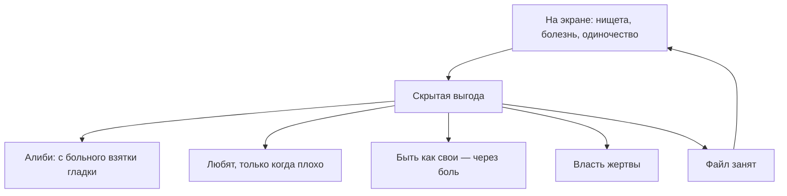

# Вторичные выгоды и Фаервол

Спроси прямо.

Почему до сих пор нет денег, которых ты стоишь? Почему рядом не тот, ради кого хочется просыпаться, а тот, с кем «как-то само сложилось»?

Неудачные времена. Невезение. Кризис. Родственники. Выгорание. Звучит прилично.

Враньё. Удобное. Сейчас его снимем.

Если брешь не закрывается годами — безденежье, одни и те же отношения, симптом, который не уходит, — это не вопреки воле. Это при её тихом согласии.

Знакомая ошибка: *невозможно удалить файл, он занят другим процессом.* Жмёшь удалить. Экран чистый. Внизу служба держит файл и не отдаёт.

Так устроен **Фаервол**.

Можно клеить карты желаний и ходить на марафоны про деньги. При реальном прорыве кто-то дёргает стоп-кран: лень, болезнь за день до собеседования, рука сама жмёт отказ от контракта.

Этот кто-то — **вторичная выгода**. Пока не названа, файл неприкосновенен.

Почерк узнаваем. «Случайно» забытое задание. Проспанная встреча, которая решала всё. Простуда за сутки до собеседования мечты. Травма перед стартом.

Ты зовёшь это невезением. Фаервол дёргает стоп-кран, когда ты подходишь слишком близко к изменению. Не из злости. Для него изменение пока опаснее застоя.

---

> [!NOTE]
> Роберт Кеган и Лайза Лахи тридцать лет в Гарварде смотрели на один парадокс: умные люди проваливают цели, в которые сами верят. Под каждым срывом находилось второе обязательство, о котором человек не знал. Не «лень». Страховка: не потерять своих, не встретиться со стыдом, не отвечать как взрослый. Психика выбирает знакомую беду как меньшее зло рядом с гибелью, которую себе нарисовала. Замок снаружи не снимается. Его снимают, когда называют, от чего именно симптом защищает.

---

## Алексей

Тридцать два. Умный инженер. Пять лет на шее у жены.

Редкие копеечные подработки. Клятвы. Три терапевта. Тайм-менеджмент наизусть. Стоило появиться должности с окладом — почечная колика. Или за полчаса до встречи грубое сообщение заказчику. Мосты сожжены.

Файл занят.

> **Терапевт:** Контракт подписан. Завтра первый день. Архитектор. Семья обеспечена. Рука на грудину. Что в теле?
>
> **Алексей:** *(сразу)* Да я счастлив буду. Мечта.
>
> **Терапевт:** Это фасад. Закрой глаза. Завтра надо встать и войти в офис. Что с дыханием?
>
> **Алексей:** *(лицо тяжелеет, кулаки)* Воздуха нет. На груди плита. Горло. Ладони ледяные. Липкий страх.
>
> **Терапевт:** Какую службу несёт диван? От чего спасает статус неудачника?
>
> **Алексей:** Если будут деньги — спросят по полной. Нельзя будет сказать «я в поиске». Придётся отвечать. Я боюсь опозориться, когда от меня ждут победы.
>
> **Терапевт:** Это первый рубеж. Глубже. Когда видишь себя сильным — чей взгляд из темноты?
>
> **Алексей:** *(шёпот)* Отец. Всю жизнь: «Ты пустое место. Из тебя ничего не выйдет».
>
> **Терапевт:** Если станешь тем, кем он запретил, — докажешь, что он был неправ. Почему система это блокирует?
>
> **Алексей:** *(минута; челюсть дрожит)* Если докажу, что он был неправ… придётся признать, что он двадцать лет топтал меня просто так. И выдержать ярость на него. А пока я на дне…
>
> **Терапевт:** Договаривай.
>
> **Алексей:** *(ладони на лице)* …пока я нищий, я каждый день ползу к нему: смотри, папа, ты победил. Я ничтожество, как ты сказал. Я сломал жизнь ради тебя. Посмотри, как больно. Пожалей. Хоть раз обними и скажи, что я твой сын.

Он плакал двадцать минут. Не взрослый. Мальчик, который бьётся лбом в дубовую дверь кабинета.

Пятилетняя нищета была не ленью. Немым криком о любви, превращённым в медленное самоубийство на виду у жены.

Потом умылся. Сел. Смотрел на мокрый асфальт.

— Безумие. Я чуть не развалил брак, чтобы отомстить человеку, который умер пять лет назад.

Через два месяца он прошёл интервью и сел архитектором. Не потому что «поверил в себя». Потому что назвал, кому на самом деле нёс свою нищету.

---

## Четыре сделки

**Алиби.** «Я бы давно построил, но спина, депрессия, не те времена». Можно не выходить на ринг, где проигрывают.

**Внимание.** Если в детстве замечали, только когда болел или влипал, формула простая: страдание равно любовь. Взрослый ломает себе жизнь, чтобы кто-то положил ладонь на лоб.

**Верность через боль.** Семья поколениями на пределе. Лёгкий успех читается как дезертирство. Быть несчастным, как свои, — цена членства.

**Власть через вину.** Жертва держит близких на коротком поводке. Страдание даёт право требовать и упрекать.

Пока сделка тайная, стоп-кран сработает у каждой цели. Назвал выгоду вслух, без самобичевания — замок щёлкает сам.

---

## Практика

Возьми то, что чинишь годами и не чинится.

Рука на солнечное сплетение. *Что я потеряю вместе с этой проблемой? От какой правды или ответственности она меня прячет?*

Укол в теле — и есть ответ. Страх не потянуть. Желание остаться ребёнком. Месть родителям. Шантаж близких. Назови вслух.

Не вини. Сделку заключили, когда других сил не было.

> *«Я вижу эту выгоду. Симптом долго был щитом. Спасибо. Контракт закрыт.»*

Взрослая система умеет брать безопасность и тепло напрямую. Не через инвалидность.

> *«Снимаю запрет на силу и достаток. Верность себе не требует жертв. Замок открыт.»*

Если дыхание отпустило и дрожь ушла — файл свободен.

---

> [!IMPORTANT]
> **Закон главы**
> Изменение не идёт, пока скрытая выгода от симптома дороже цены его снятия.
