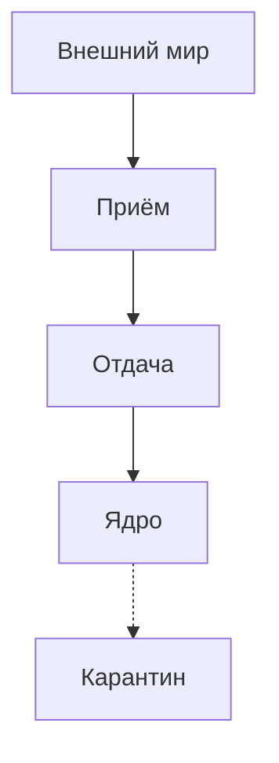

# Границы: Отдача, Приём, Карантин

Почему деньги подходят — и разворачиваются на пороге? Почему человек, который мог стать близким, чувствует это раньше тебя и тихо отступает, хотя ты «открыт» и «хочешь отношений»?

Ты не открыт. Ты за стеклом. И сам об этом не знаешь.

Мир сквозь стекло виден отлично: проекты, деньги, тёплые люди. Кажется, протяни руку. Стоит шагнуть — пространство густеет. Человек отдаляется. Заказчик уходит без объяснений. Сделка срывается за минуту до подписи.

Снаружи стучат. До тебя не доходит.

Этот режим — **Карантин**. Не характер. Не любовь к тишине. Аварийная изоляция, включённая по делу и с тех пор не снятая.

Три рубежа.

**Отдача.** Время, внимание, тепло, деньги наружу. Когда порт дырявый — недержание: кабальные условия, токсичные родственники в ущерб своим, годы за копейки, потому что страшно назвать цену.

**Приём.** Что впустить. Рабочий фильтр отделяет заботу и честность от спама: зависть, шантаж, чужой взгляд. Если фильтр пробит, косое слово коллеги бьёт в ядро, и день вырублен.

**Карантин.** Когда прессинг выше прочности, кабели выдёргивают. Снаружи ты ходишь в офис, здороваешься, ведёшь ленту. Внутри замурован. Любое сближение читается как взлом.

Карантин спасает во время бомбёжки. Если не снять его после войны, система гаснет без единого входящего сигнала.

---

> [!NOTE]
> Джон Боулби и Мэри Эйнсворт показали простую жестокость: если тот, кто кормит, одновременно источник хаоса, младенцу некуда деться. Тяга прижаться и рефлекс бежать включаются вместе. Разрешить это поведением нельзя. Мозг решает иначе: отключиться. Мэттью Либерман в UCLA увидел, что одиночество зажигает ту же зону коры, что и физическая боль. Чтобы не повторять эту боль, система снижает чувствительность к теплу. Сервер надёжно закрыт от вреда. И от пищи тоже. В вакууме он деградирует.

---

## Лёня и цепочка

Хрущёвка. Третий этаж. Тополиный пух на подоконнике.

Восьмилетний Лёня знал шаги на лестнице наизусть. Мать могла пропасть на четверо суток — в холодильнике полбанки прокисшего супа. Могла ввалиться в три ночи с чужими, бутылками и криком до рассвета.

Он жарил засохшие корки на сухой сковороде. Прятал спички. Перед сном проверял цепочку. Код: три стука, два, снова три — мать. Остальным не открывать.

Страшнее голода была надежда.

Иногда она возвращалась трезвой. Мандарины. Садилась на край кровати, гладила стриженую голову тёплой рукой и плакала: *«Лёнечка, прости. Всё, теперь по-другому. На завод устроилась, заживём».*

На несколько часов он раскрывался. Верил. Прижимался мокрой щекой к халату и задыхался от счастья.

На следующий вечер она уходила «на минутку за хлебом» и исчезала на неделю.

К третьему классу в груди что-то перегорело с сухим треском. Он перестал плакать в темноте. Когда она снова не пришла, подошёл к двери, накинул цепочку, два оборота ключа, лёг с сухими глазами.

В ту ночь восьмилетний включил карантин: *любое тепло — обман. За радостью удар. Чтобы не сдохнуть — никого не впускать.*

В тридцать четыре — ведущий разработчик. Новостройка. Чашки по линейке. Тишина. И могильная пустота.

Женщины уходили с одним лицом: «Лёня, ты святой. Голос не повышаешь. Счета закрыты. Рядом с тобой чувствуешь себя призраком. Ты за стеклом. Тебя нет дома».

> **Терапевт:** Где сейчас та дверь на цепочке?
>
> **Лёня:** *(ровно, механически)* Под костью. Сейф, залитый бетоном. Снаружи стучат. Я не открываю. Мне не больно. Мне никак.
>
> **Терапевт:** Это «никак» и есть бункер. Скажи тому мальчику: ты закрылся, чтобы выжить. Карантин спас тебе жизнь.
>
> **Лёня:** *(на этих словах горло перехватывает)* Он так долго стоял в тёмном коридоре. Каждую ночь ждал шагов. Что она вернётся трезвой и просто останется.
>
> **Терапевт:** Тебе тридцать четыре. Опасность кончилась двадцать лет назад. Положи руку ему на плечо: мама не справилась со своей судьбой. Я здесь. Я не исчезну на трое суток. Цепочку можно снять.
>
> **Лёня:** *(стон, потом рыдания; сухое тело содрогается)*

Бетон двадцати пяти лет пошёл со слезами. Цепочка, накинутая в холодной хрущёвке, упала.

Через десять минут он опустил руки. В глазах живое. Плечи вниз.

— В груди тепло. Сейфа нет. Там сердце. Я могу дышать.

Карантин сняли не потому, что мир стал безопасным. Потому что внутри наконец есть взрослый, который остаётся. Бетонировать входы больше не нужно.

---

## Практика

Где дыра.

Сливаешь себя, спасаешь других, сам в нуле — сломана **отдача**.  
Любое чужое слово вырубает день — пробит **приём**.  
Боишься любой глубины, живёшь в коконе — включён **карантин**.

Ладонь на грудину. Слышишь сердце. Вслух:

> *«Карантин спас меня, когда я был беспомощен. Сейчас я в безопасности. Ядра хватает, чтобы встречать мир лицом. Прошлое отделяю от этой минуты. Порты открыты. Тепло можно отдавать и брать.»*

В ближайшие сутки одно действие с открытым забралом. Назови свою цену без виноватой скидки. Скажи тёплое тому, кто дорог. Или спокойное «нет» там, где тебя привыкли продавить.

Жизнь, близость и деньги идут только по открытым проводам.

---

> [!IMPORTANT]
> **Закон главы**
> Дверь карантина снаружи не выбить. Её открывает тот, кто запер её изнутри.

---

> [!TIP]
> **Живой AI-психолог**
> Если детское одиночество вскрыло спазм под рёбрами — не сиди в бункере один. Чат внизу страницы. Он поможет прожить разрядку, когда книга задевает больное.
