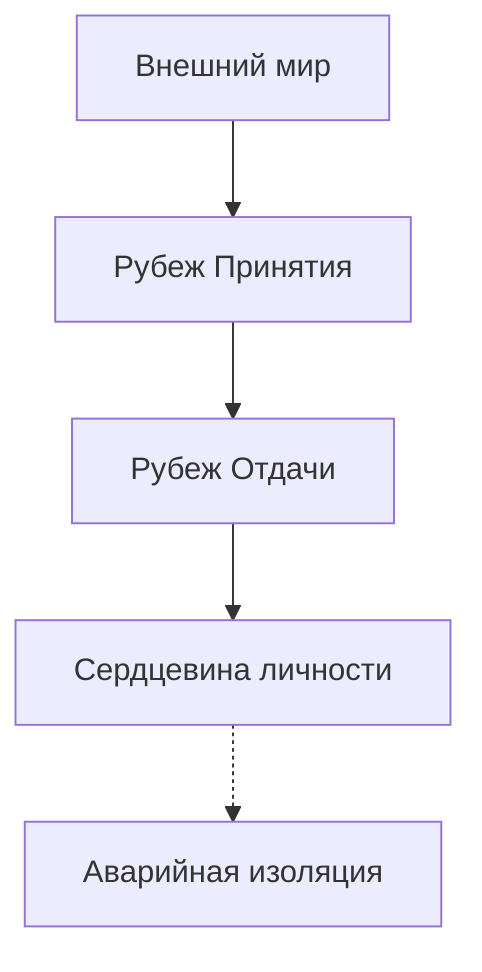

# Границы: Отдача, Принятие, Изоляция

Почему деньги подходят к тебе вплотную — и в самый последний момент разворачиваются на пороге? Почему человек, с которым могла бы случиться настоящая, глубокая любовь, чувствует невидимую преграду раньше тебя и тихо отступает, хотя на словах ты «абсолютно открыт» и «очень хочешь отношений»?

Ты не открыт. Ты находишься за глухим бронированным стеклом. И самое страшное — ты сам не замечаешь этой прозрачной стены.

Сквозь это стекло окружающий мир виден во всех деталях: интересные проекты, финансовые возможности, искренние, теплые люди. Кажется, достаточно просто протянуть руку. Но стоит сделать шаг навстречу — и пространство вокруг словно сгущается. Близкий человек внезапно отдаляется. Перспективный заказчик без объяснений уходит к конкурентам. Многообещающая сделка срывается за минуту до подписания договора.

Снаружи в твою дверь непрерывно стучат. Но до твоего сердца ни один звук не доходит.

Это состояние — не врожденный интровертный склад характера и не осознанная любовь к одиночеству. Это режим **аварийной изоляции**, который когда-то был включен по жизненно важной причине и с тех пор так и не был снят.

---

## Три рубежа психологических границ

В здоровом взаимодействии человека с миром работают три рубежа:

**1. Рубеж Отдачи (энергия наружу).**  
Это способность делиться своим временем, профессиональным мастерством, душевным теплом и материальными благами. Когда этот рубеж разрушен, у человека возникает недержание границ: кабальные условия труда, бесконечная помощь токсичным родственникам в ущерб собственной семье, годы работы за копейки из-за панического страха назвать достойную цену за свой труд.

**2. Рубеж Принятия (энергия внутрь).**  
Это способность различать, что именно впускать в свое внутреннее пространство. Здоровый фильтр легко отделяет искреннюю заботу и конструктивную обратную связь от зависти, эмоционального шантажа и чужих манипуляций. Если этот фильтр пробит, любое косое слово случайного коллеги мгновенно ранит самое сердце, выбивая человека из колеи на несколько дней.

**3. Аварийная изоляция (глухой бункер).**  
Когда внешнее давление в детстве многократно превышает запас прочности психики, человек наглухо перерубает все каналы связи. Снаружи он продолжает исправно ходить на работу, здороваться с соседями, вести социальные сети и даже поддерживать разговор. Но внутри он заживо замурован. Любая попытка подлинного сближения считывается его нервной системой как смертельный взлом периметра.

Аварийная изоляция спасает жизнь ребенку во время жестокой семейной бомбежки. Но если не снять этот режим после того, как война закончилась, человеческая душа медленно угасает в полной пустоте без единой капли входящего тепла.

---

> [!NOTE]
> Основоположники теории привязанности Джон Боулби и Мэри Эйнсворт описали трагический парадокс детской психики: когда родитель, призванный защищать и кормить ребенка, одновременно является главным источником хаоса, насилия и непредсказуемой угрозы, у малыша возникает неразрешимый биологический конфликт. Врожденный инстинкт прижаться к матери сталкивается со столь же мощным инстинктом бежать и спасаться.
> 
> Поведенчески этот тупик разрешить невозможно. И нервная система находит единственный выход: диссоциацию и тотальное эмоциональное отключение. 
> 
> Исследования профессора Мэттью Либермана в Калифорнийском университете в Лос-Анджелесе (UCLA) на базе функциональной МРТ показали: социальная изоляция и отвержение активируют в мозге ровно те же нейронные зоны (дорсальную часть передней поясной коры), которые отвечают за обработку острой физической боли. Чтобы защитить себя от этой невыносимой боли, нервная система искусственно снижает собственную чувствительность к любому теплу. Крепость оказывается надежно защищена от ударов — но одновременно она полностью отрезана от живой пищи. В этом вакууме личность начинает необратимо угасать.

---

## Лёня и дверная цепочка

Старая панельная хрущевка на окраине промышленного района. Третий этаж. Серый тополиный пух на облупленном подоконнике.

Восьмилетний Лёня знал все звуки в подъезде наизусть. Его мать страдала тяжелейшим запойным алкоголизмом. Она могла внезапно исчезнуть на четверо суток, оставив в пустом холодильнике лишь полбанки закисшего супа. А могла среди ночи ввалиться в квартиру с шумной толпой незнакомых собутыльников, битьем посуды и пьяными драками до рассвета.

Лёня научился жарить засохшие хлебные корки на сухой сковороде. Он прятал спички в тайник за батареей. Каждый вечер перед сном он проверял дверную цепочку. У них был строгий условный код: три быстрых стука, пауза, два стука, и снова три — это мать. Всем остальным открывать дверь было категорически запрещено.

Но самым страшным испытанием для маленького мальчика был вовсе не голод и не пьяный шум. Страшнее всего была *надежда*.

Иногда мать возвращалась домой трезвой. Она приносила в сетке оранжевые сладкие мандарины. Садилась на край Лёниной кровати, гладила его стриженую голову теплой, ласковой рукой и сквозь слезы шептала: *«Лёнечка, сыночек, прости меня, дуру грешную. Всё, теперь мы заживем по-человечески. Я на прядильную фабрику устроилась, я завязала. Всё будет хорошо»*.

На несколько часов мальчик распахивал свое сердце до самой глубины. Он верил каждому ее слову. Он прижимался заплаканным лицом к ее фланелевому халату и буквально задыхался от неземного счастья.

А на следующий вечер мать выходила из дома «на минутку за хлебом» — и исчезала на очередную неделю.

К третьему классу в груди Лёни что-то надломилось с сухим, окончательным треском. Он больше не плакал в темноте. Когда мать в очередной раз не вернулась к ночи, девятилетний ребенок молча подошел к входной двери, накинул тяжелую латунную цепочку, повернул замок на два оборота и лег в постель с абсолютно сухими, застывшими глазами.

В ту ночь в его душе захлопнулась спасительная дверь аварийной изоляции: *«Любое тепло — это смертельный обман. За каждой радостью обязательно следует жестокий удар. Чтобы выжить и не сойти с ума — нельзя впускать в свое сердце ни единого человека»*.

В тридцать четыре года Леонид был ведущим системным разработчиком в крупной технологической компании. Просторная квартира в новостройке бизнес-класса. Идеальная стерильная чистота: все чашки на кухне расставлены строго по одной линии. Абсолютная, звенящая тишина. И кладбищенская внутренняя пустота.

Все женщины, с которыми он пытался построить семью, через полгода-год уходили от него с одним и тем же потерянным выражением лица: «Лёня, ты святой человек. Ты никогда не повышаешь голоса. Ты полностью оплачиваешь все счета. Но рядом с тобой чувствуешь себя бесплотным призраком. Ты находишься за пуленепробиваемым стеклом. Тебя просто нет дома».

> **Терапевт:** Где прямо сейчас в твоем теле находится та входная дверь с латунной цепочкой?
>
> **Лёня:** *(отвечает ровным, металлическим голосом)* Под ребрами. Там стоит тяжелый сейф, намертво залитый бетоном. Снаружи кто-то стучит. Но я не открываю. Мне не больно. Мне абсолютно всё равно.
>
> **Терапевт:** Твое «всё равно» — это спасительный бункер. Скажи тому маленькому мальчику у двери: ты закрылся тогда, чтобы не погибнуть от горя. Твоя изоляция спасла тебе жизнь.
>
> **Лёня:** *(на этих словах дыхание перехватывает, голос дает сбой)* Он... он так долго стоял в том холодном темном коридоре. Он каждую ночь вслушивался в шаги на лестнице. Он так отчаянно ждал, что мама вернется трезвой и просто останется дома.
>
> **Терапевт:** Тебе тридцать четыре года. Ты вырос. Та смертельная опасность осталась далеко в прошлом. Положи руку мальчику на плечо и скажи: мама не справилась со своей тяжелой болезнью. Но я здесь. Я взрослый, и я никогда тебя не брошу. Дверную цепочку можно снять.
>
> **Лёня:** *(из груди вырывается глухой утробный стон, переходящий в безудержные, сотрясающие всё тело рыдания)*

Многолетний бетон треснул и осыпался под потоком живых слез. Латунная цепочка, накинутая в холодной хрущевке четверть века назад, со звоном упала на пол.

Через десять минут Леонид поднял голову. В его потухших глазах впервые за долгие годы затеплилась жизнь. Плечи мягко опустились.

— В груди разливается горячая волна, — прошептал он с благоговением. — Сейфа больше нет. Там бьется живое человеческое сердце. Я снова могу дышать.

Режим изоляции был снят не потому, что внешний мир внезапно стал абсолютно идеальным и безопасным. А потому, что внутри человека наконец появился любящий взрослый, способный выдержать любую правду. Замуровывать себя заживо больше не требовалось.

---

## Практика

Определи, в каком именно из трех рубежей произошел сбой:

- Ты без остатка растрачиваешь себя на чужие проблемы, спасаешь всех вокруг, а сам остаешься у разбитого корыта — разрушен **рубеж отдачи**.  
- Любое косое замечание, взгляд или холодность со стороны надолго выбивают тебя из равновесия — поврежден **рубеж принятия**.  
- Ты панически боишься душевной близости и годами живешь в эмоциональном коконе — включен режим **аварийной изоляции**.

Положи теплую ладонь на центр грудины. Почувствуй живое биение сердца. Произнеси вслух, ощущая вес каждого слова:

> *«Моя изоляция спасла меня тогда, когда я был маленьким и беспомощным ребенком. Но сегодня я нахожусь в безопасности. Моей взрослой силы достаточно, чтобы встречать этот мир с открытым лицом. Прошлую боль я отделяю от сегодняшнего дня. Мои границы живые и гибкие: я открываю сердце для взаимной любви, тепла и достатка».*

В течение ближайших суток сделай одно конкретное действие из состояния открытых границ:
- Назови достойную цену за свои услуги без неловких извинений и оправданий.
- Скажи искренние, теплые слова человеку, который тебе по-настоящему дорог.
- Или произнеси спокойное, бесповоротное «нет» там, где привыкли бесцеремонно нарушать твои интересы.

Жизнь, подлинная близость и изобилие приходят только туда, где двери открыты изнутри.

---

> [!IMPORTANT]
> **Главная мысль главы**  
> Дверь внутренней изоляции невозможно выбить снаружи никакими уговорами. Ее способен открыть только тот, кто когда-то запер ее изнутри.

---

> [!TIP]
> **Интерактивный помощник**  
> Если воспоминания об одиночестве или детской беззащитности отозвались щемящей болью в груди — не оставайся в этой тишине в одиночку. Диалоговое окно внизу страницы создано для того, чтобы помочь тебе бережно пройти через этот процесс и почувствовать твердую опору под ногами.
