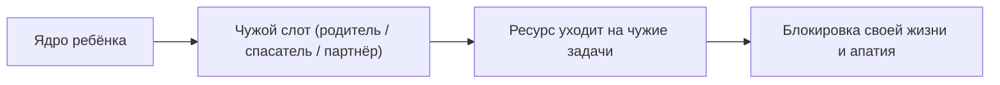

# Баг 01. Лишний элемент

Просыпаешься в квартире, где всё «правильно». Зарплата. Статус. Кухня под камень. И в груди — будто кто-то чужой дышит твоим воздухом.

Рассудок говорит: грех жаловаться. Тело отвечает иначе. Шаг — сквозь вату. Плечи уже к вечеру каменные. Словно жизнь взята напрокат, а счёт выставлен не тебе.

Это **Баг 01: Лишний элемент**.

Как новый ноутбук из коробки: включаешь — а в автозапуске уже чужие утилиты. Ты их не ставил. Они съедают память до первого твоего клика. В семье то же. Когда контур трещит — отец ушёл, мать тонет, между взрослыми пустота — ребёнка тащат в чужой слот. Маленький муж. Жилетка. Судья. Спасатель. Его нервы затыкают дыру, которую не умеют закрыть взрослые.

Он становится лишним в чужом браке. И платит за чужой дом своим правом на собственную жизнь.

---

> [!NOTE]
> Сальвадор Минухин в Филадельфийской клинике детского развития показал: семья держится, пока границы между супругами, родителями и детьми полупрозрачны, но различимы. Когда между партнёрами вакуум или война, ребёнка втягивают в коалицию — это парентификация. Он занимает место отсутствующего взрослого. У таких детей базальный кортизол и мышечный тонус как у человека в бою. Биология подростка не рассчитана на взрослые тревоги. Взрослыми они часто приходят с тупой усталостью и пустотой там, где должна быть близость: порт уже занят родительской фигурой. В логике ROOT это чужой процесс в Ring 0 — дочерний поток гоняет код супервизора и сжигает ядра на чужих задачах.

---

## Чат с ROOT: дело Насти

```status
[14:02] Настя → ROOT
Мне тридцать три. Старший партнёр в юридической фирме. Каждое утро смотрю на стеклянный небоскрёб на набережной — и тошнит. Вчера выиграла арбитраж на двести миллионов. Шампанское. Поздравления. Я заперлась в туалете и выла в полотенце. Ненавижу юриспруденцию. Ненавижу костюм. Ненавижу эту жизнь. Почему я здесь?
```

```status
[14:04] ROOT → Настя
Где в теле тяжесть этой профессии?
```

```status
[14:06] Настя → ROOT
Плечи и шея. Чугунный рюкзак. Затылок горит. Челюсти стиснуты так, что болят.
```

```status
[14:07] ROOT → Настя
Поставь профессию перед собой. Куда она смотрит?
```

```status
[14:10] Настя → ROOT
Стоит передо мной. Но смотрит не на меня. Поверх головы. Назад.
```

```status
[14:11] ROOT → Настя
Кто за спиной? Чьи глаза ждут отчёта?
```

```status
[14:15] Настя → ROOT
Отец. Ушёл, когда мне было восемь. Хлопнул дверью: «Вы ничтожества, вы сдохнете под забором без меня». Мама три месяца рыдала на ковре. Потом посадила меня перед зеркалом, сжала плечи до синяков и сказала: «Настенька, ты отомстишь ему за нас обеих. Красный диплом. Адвокат. Мы разотрём его в порошок».
```

```status
[14:17] ROOT → ROOT
ERROR: parentification_injection detected
System role: child_node
Assigned role: spousal_avenger / maternal_stabilizer
Memory footprint: 25 years of stolen runtime
```

```status
[14:18] ROOT → Настя
Двадцать пять лет ты в слоте маминого защитника и карающего меча. Чужие латы. Чужая война. Для мужчины места нет: партнёрский порт занят маминой обидой. Ты — лишний элемент в их разорванном браке.
```

```status
[14:22] Настя → ROOT
Сижу на сорок шестом этаже. Смотрю на руки. Своих желаний не было никогда. Одежду покупала ту, что мама одобряла по видео. Всю жизнь доказывала мёртвому отцу, что маму нельзя было бросать. Как же я устала воевать за них.
```

```status
[14:24] ROOT → Настя
Готова выйти из чужого слота? Не из ненависти. Из уважения к своей жизни.
```

```status
[14:26] Настя → ROOT
Да. Скажи, как снять эту броню.
```

```status
[14:27] ROOT → Настя
Поставь мать и отца перед собой. Вслух: «Мама, папа. Ваша война — ваша. Ваши счета — ваши. Я отказываюсь быть оружием, щитом и заменой мужа. Я ваш ребёнок. Возвращаю вам ваши роли. Выхожу из вашего брака. Моя жизнь — моя».
```

```status
[14:35] Настя → ROOT
Проговорила. Телефон выпал из рук. Слёзы на клавиатуру — первый раз среди рабочего дня. Потом с затылка сняли тонну. Шея двигается. Дышать можно. Внутри пусто. Страшно пусто.
```

```status
[14:37] ROOT → Настя
Пустота — не поломка. Чистый диск после удаления двадцатипятилетнего вируса. Здесь появится место для того, чего хочешь ты.
```

```status
[02:15] Настя → ROOT (через три месяца)
Ушла из партнёрства. Студия керамики и ландшафта — то, о чём плакала в школе. Доход меньше в четыре раза. Сегодня утром впервые за пятнадцать лет проснулась без кома в горле. Посмотрела в окно. Я дома. В своей жизни.
```

---

## Чемодан

Ты прилетел к морю. Открыл чемодан.

Внутри — зимний ботинок. Тяжёлый. Грязный. Сорок шестой. Один. Не твой.

Он занимал половину чемодана. Ты тащил его через две границы. Доплачивал за перевес. И вот номер с видом на пляж — а ты вместо того, чтобы выбросить, перекладываешь его поудобнее.

Потому что думаешь: раз оказался в моём чемодане — наверное, нужен.

Обычно ботинок не один.

На дне — мамина тревога «как бы чего не вышло». Ты всю жизнь зовёшь себя тревожным. А это чужая обувь не твоего размера. Рядом — дедов страх перед любой бумагой с печатью. Бабушкина вина непонятно за что.

Годами тихо. Пока не прислушаешься к внутреннему критику — и не вздрогнешь.

Он звучит не твоим тембром.

Голос учительницы. Отца. Кого-то, кого уже толком не вспомнишь.

Спроси прямо: твои ли цели ведут тебя вперёд? Или ты двадцать лет исполняешь чужой заказ и по привычке зовёшь это жизнью?

См. также: [«Границы»](/16-boundaries-safekeeping-defense-isolation), [«Базовые узлы»](/08-basic-nodes-mother-father).

---

## Анатомия чужака

Когда ребёнок соглашается стать лишним элементом, ломается три опоры:



**1. Чужое техзадание жрёт топливо.**  
Можешь пахать по восемнадцать часов. Ядро знает: это ради чужого одобрения или семейного мифа. Включает аварию — тупую свинцовую апатию. Не даёт лить воду в чужой колодец.

**2. Порт близости занят.**  
Если слот партнёрства держит опека над инфантильной матерью или спасение отца, зрелый человек не войдёт. Сеть видит: порт занят. Приходят те, кому тоже нужен костыль.

**3. Маска чужой функции.**  
Снять её кажется предательством рода. На деле это единственный способ вернуть право на своё тело и своё имя.

---

## Практика: выход из чужого слота

Если жизнь звучит чужими репликами — сделай аудит позиций.

**1. Чья роль.**  
Чьи амбиции кормит твоя карьера? Чью пустоту в паре закрывало детство? Какую родительскую рану лечишь своей кровью?

**2. Где груз в теле.**  
Плита на плечах. Ошейник на горле. Сжатие в диафрагме. Этот вес не из твоей конструкции.

**3. Возврат ролей.**  
Поставь родителей перед собой на дистанции, где дышится. Вдох животом. На выдохе вслух:

> *«Я вижу ваши конфликты, вашу боль и ваши дыры. Склоняюсь перед вашей судьбой. Я ваш ребёнок. Не родитель. Не терапевт. Не партнёр. Освобождаю чужой слот. Возвращаю вам вашу ответственность. Себе забираю право на отдельную жизнь».*

**4. Тишина после.**  
Тепло в плечах. Кровь в затылке. Не пугайся пустоты — это место, куда впервые может войти твоё.

---

> [!IMPORTANT]
> **Закон главы**
> Узел в чужом слоте сжигает свой ресурс на чужую архитектуру.
