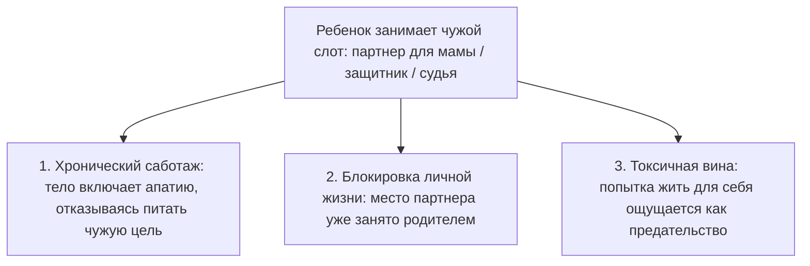

# Лишний элемент: когда ты живёшь не свою жизнь

Ты просыпаешься в квартире, где с точки зрения окружающих всё устроено безупречно. Престижная должность. Высокий доход. Стильная кухня с каменной столешницей, дорогая кофемашина, вид на огни ночного города. По всем социальным меркам ты состоялся и победил.

Но почему каждое утро под рёбрами разливается глухая свинцовая тяжесть? Почему чашка свежесваренного кофе кажется безвкусной, а тело движется сквозь день с таким трудом, словно продирается сквозь слой липкой ваты?

Ты смотришь в зеркало и ловишь себя на страшной, запретной мысли: этот успешный человек в отражении — чужой. Его победы не приносят радости. Его счета оплачиваешь ты, но сама эта жизнь словно взята напрокат у кого-то другого.

Так проявляется состояние **лишнего элемента**.

Представь новенький, мощный ноутбук. Ты только достал его из коробки, включил, а в фоновом режиме уже крутятся десятки тяжелых чужих программ. Ты их не устанавливал. Но они сжигает оперативную память и нагревают процессор до того, как ты успел открыть хотя бы один собственный файл.

В семье происходит то же самое. Когда между взрослыми разверзается пропасть — отец хлопает дверью и уходит, мать тонет в слезах и депрессии, а в доме поселяется ледяной холод, — напуганный ребёнок не может выдержать разрушения своего мира. Он бессознательно делает шаг вперед и затыкает собой зияющую дыру.

Маленький мальчик становится «мужчиной в доме», защитником и личным психотерапевтом для рыдающей матери. Девочка превращается в строгую судью, подругу-жилетку или орудие семейного возмездия. Ребенок соглашается стать костылем для чужого разорванного брака. И расплачивается за это собственным правом на отдельную судьбу.

---

> [!NOTE]
> Основатель структурной семейной терапии Сальвадор Минухин в Филадельфийской клинике детского развития доказал: семья остается здоровой средой лишь до тех пор, пока границы между поколениями четко очерчены. Между родителями должно быть свое закрытое пространство, в которое детям нет входа.
> 
> Когда между партнерами образуется эмоциональный вакуум или вспыхивает открытая война, одного из детей почти всегда втягивают в коалицию. Этот феномен в психотерапии называется **парентификацией** (от английского *parent* — родитель): ребенок меняется ролями со взрослым, становясь родителем для собственных мамы или папы.
> 
> Иван Бозормени-Надь, создатель контекстуальной семейной терапии, описал это как действие «невидимой лояльности»: из слепой детской любви ребенок готов отказаться от собственного счастья, здоровья и карьеры, лишь бы спасти тонущего родителя. Но детская нервная система биологически не рассчитана на взрослые перегрузки. Во взрослом возрасте такие люди приходят с хронической ангедонией — полной неспособностью испытывать радость от жизни: их внутренний ресурс годами расходуется на обслуживание чужой травмы.

---

## Слезы на сорок шестом этаже

Вторник, два часа дня. Панорамные окна сорок шестого этажа престижного небоскреба в деловом квартале. Внизу тонкой серебряной нитью петляет река.

Тридцатитрехлетняя Анастасия — старший партнер международной юридической фирмы. Только что завершилось полугодовое разбирательство в арбитражном суде. Сумма выигранного иска — более двухсот миллионов рублей. В переговорной гремят аплодисменты, коллеги открывают коллекционное шампанское, шеф лично пожимает ей руку и называет «главным бриллиантом компании».

А через десять минут Настя заперлась в кабинке туалета в дальнем конце коридора, прижала к лицу махровое полотенце и зашлась в беззвучном, надрывном рыдании.

— Меня буквально тошнило от каждого взгляда в зеркало, — рассказывала она позже на сессии, сжимая тонкие пальцы в замок. — Я ненавижу эти безупречные костюмы. Я всей душой презираю судебные кодексы и бесконечные иски. За победу мне начислили премию, на которую можно купить квартиру. А я стояла у раковины и думала: если я прямо сейчас шагну в окно — мне хотя бы больше не придется завтра утром надевать этот чертов пиджак. Почему я здесь? Зачем я двадцать лет грызла землю ради профессии, от которой меня выворачивает наизнанку?

> **Терапевт:** Где прямо сейчас в твоем теле живет эта профессия?
>
> **Настя:** *(рука машинально тянется к шее)* В плечах и затылке. Там словно висит раскаленный чугунный рюкзак. Челюсти стиснуты так, что крошатся зубы.
>
> **Терапевт:** Поставь образ этой профессии перед собой в комнате. Куда направлен ее взгляд?
>
> **Настя:** *(вглядывается в пустое пространство перед креслом)* Она стоит передо мной. Но смотрит не на меня. Она смотрит поверх моей головы. Назад.
>
> **Терапевт:** Кто стоит у тебя за спиной? Чьи глаза ждут этого судебного отчета?
>
> **Настя:** *(лицо бледнеет, по щекам катятся крупные слезы)* Отец... Мне было восемь лет. Ноябрь, за окном мокрый снег. Он швырнул чемодан в коридоре, зло посмотрел на нас и крикнул маме: «Вы ничтожества! Вы без меня под забором сдохнете, по помойкам пойдете!» Хлопнул дверью. Мама три месяца не вставала с ковра, выла по ночам. А потом однажды посадила меня перед зеркалом, сжала мои плечи до синяков и сказала: «Настенька, ты отомстишь ему за нас обеих. Ты закончишь школу с золотой медалью. Ты поступишь на юрфак. Ты станешь лучшим адвокатом в городе и сотрешь его в порошок».

Двадцать пять лет Настя носила чужие тяжелые латы. Она не жила своей жизнью — она работала карающим мечом брошенной женщины.

Красный диплом МГУ, бессонные ночи над учебниками, работа без отпусков по четырнадцать часов в сутки — всё это было не ее мечтой. Это была детская попытка спасти маму от отчаяния и доказать мертвому отцу, что их нельзя было предавать.

Личной жизни у Насти не было: все мужчины казались ей либо слабыми, либо потенциальными предателями. Ее сердце было наглухо занято маминой обидой. Для любви там просто не оставалось свободного места.

> **Терапевт:** Посмотри на маленькую восьмилетнюю девочку перед зеркалом. Скажи ей: война окончена. Мама не справилась со своей болью, но это была ее взрослая судьба. Ты не обязана класть свою жизнь на алтарь чужой мести.
>
> **Настя:** Мама... Папа... Я вижу вашу боль. Я вижу ваш разорванный брак. Но это ваша история. Я больше не буду вашим оружием, щитом и суррогатным мужем. Я просто ваша дочь. Я возвращаю вам ваши роли и вашу ответственность. А себе забираю право дышать.
>
> **Настя:** *(сгибается пополам, из груди вырывается глубокий всхлип, сменяющийся долгим, дрожащим выдохом)*

В ту минуту чугунная плита, прижатая к ее затылку двадцать пять лет назад, со скрежетом рухнула на пол. Плечи мягко опустились. В глазах впервые за долгое время появился живой, теплый свет.

Спустя четыре месяца Анастасия ушла из юридического партнерства. Она открыла небольшую мастерскую художественной керамики и ландшафтного дизайна — то, о чем тайком мечтала с шестого класса школы.

Ее доход снизился в несколько раз. Но в первое же весеннее утро в мастерской, перепачканная глиной, она прислала короткую весточку: «Я впервые за всю взрослую жизнь проснулась без кома в горле. Я смотрю в окно на мокрые деревья и чувствую: я наконец-то дома. В своей собственной жизни».

---

## Чемодан с чужой обувью

Представь, что ты долго копил деньги на путешествие мечты к океану. Долгий перелет, теплый тропический воздух, бирюзовая лагуна за окном отеля. Ты с предвкушением открываешь дорожный чемодан — и замираешь в недоумении.

Ровно половину чемодана занимает огромный, стоптанный зимний сапог сорок шестого размера, покрытый толстым слоем засохшей дорожной грязи. Один. Чужой. Мужской.

Ты тащил его через три границы. Доплачивал за перевес багажа в аэропорту. Надрывал поясницу на эскалаторах. И вот теперь, вместо того чтобы немедленно отправить этот хлам в мусорный бак, ты бережно достаешь его и ставишь на прикроватную тумбочку рядом со свежими орхидеями.

Почему? Потому что внутри сидит иррациональное детское убеждение: раз этот предмет оказался в моем чемодане — значит, он мне зачем-то дорог. Значит, я обязан его хранить.

В нашем психологическом багаже таких «сапог» обычно целый склад:

- На самом дне лежит мамина паническая тревога перед любыми переменами в жизни: «Сиди тихо, как бы чего не вышло». Ты всю жизнь считаешь себя робким человеком, а на самом деле носишь чужую заношенную обувь.
- Рядом припрятан дедов парализующий страх перед любым человеком при должности: страх раскулачивания, впечатанный в генетическую память.
- Чуть выше — бабушкино разъедающее чувство вины за малейшую радость, когда вокруг «люди голодают».

Годами этот груз кажется собственной сущностью. Ровно до тех пор, пока ты не прислушаешься к голосу своего внутреннего критика. Прислушайся прямо сейчас: ведь он звучит не твоим тембром.

Это голос строгой школьной учительницы, вечно недовольного отца или тревожной бабушки. Ты годами обслуживаешь чужие страхи и по привычке называешь это своей жизнью.

---

## Три симптома того, что ты занял чужое место

Когда ребенок соглашается стать лишним элементом в семейной системе, его собственное развитие неизбежно дает сбой по трем направлениям:

### 1. Тело объявляет забастовку
Ты можешь обладать железной силой воли и заставлять себя работать без выходных. Но подсознание прекрасно знает: эти сверхусилия совершаются не ради твоих истинных ценностей, а ради чужого одобрения или спасения мамы. Рано или поздно психика включает аварийный тормоз: накатывает свинцовая, непробиваемая апатия. Организм просто отказывается поставлять энергию в чужую топку.

### 2. Личная жизнь превращается в пустыню
Если в твоем сердце место главного мужчины занимает опека над инфантильной матерью, зрелая женщина рядом с тобой не появится. Если женщина живет как «защитница» своего отца, к ней будут притягиваться исключительно слабые, зависимые мужчины, ищущие вторую маму. Пространство безошибочно считывает: твое сердце уже занято чужой трагедией.

### 3. Свои желания вызывают мучительный стыд
Стоит позволить себе искренний отдых, дорогую покупку или просто день безделья, как изнутри поднимается удушливая волна стыда: «Как я могу радоваться, когда маме так плохо? Как я смею быть счастливым, если в моем роду все страдали?» Этот стыд — главный признак того, что ты перепутал границы своего и чужого опыта.

---

## Практика: освобождение чужого места

Если ты чувствуешь, что твоя жизнь подчинена чужим правилам и ожиданиям, выполни эту последовательность шагов:

### 1. Назови чужую роль по имени
Честно ответь себе на вопросы:
- Чьи нереализованные амбиции прямо сейчас обслуживает моя карьера?
- Чье одиночество я пытался компенсировать в детстве?
- Какую семейную рану я до сих пор стараюсь залечить своими достижениями?

### 2. Отыщи груз в физическом теле
Закрой глаза и просканируй ощущения. Где прямо сейчас живет этот груз? Бетонная плита на плечах? Обруч, сдавливающий виски? Ледяной спазм в районе солнечного сплетения? Положи на эту область теплую ладонь и сделай глубокий вдох животом.

### 3. Произнеси слова разделения
Представь перед собой своих родителей или того предка, чей груз ты нес. Посмотри на них с искренней благодарностью за подаренную жизнь, но с твердой взрослой границы. Произнеси вслух:

> *«Дорогие мама и папа. Я вижу ваши трудности, ваши слезы и вашу боль. Но ваша судьба принадлежит вам, а моя — мне. Я больше не буду вашим судьей, защитником или заменой партнера. Я всего лишь ваш ребенок. С глубоким уважением я оставляю ваши уроки и ваши раны вам. А себе с любовью забираю право на собственную, отдельную, счастливую жизнь».*

### 4. Позволь тишине войти внутрь
После этих слов в теле часто возникает странная, непривычная пустота. Не торопись немедленно заполнять ее новыми делами или тревогами. Эта пустота — освободившееся пространство твоей души, куда впервые за долгие годы может прийти твое настоящее «Я».

---

> [!IMPORTANT]
> **Главная мысль главы**  
> Пока ты стоишь на чужом месте и воюешь на чужом фронте, твое собственное место в жизни остается пустым.

---

> [!TIP]
> **Интерактивный помощник**  
> Если слова разделения с родителями вызвали спазм в горле или горячие слезы — не оставайся наедине с этой бурей. Диалоговое окно внизу страницы поможет бережно пройти через этот рубеж и закрепить ощущение своего законного места.
