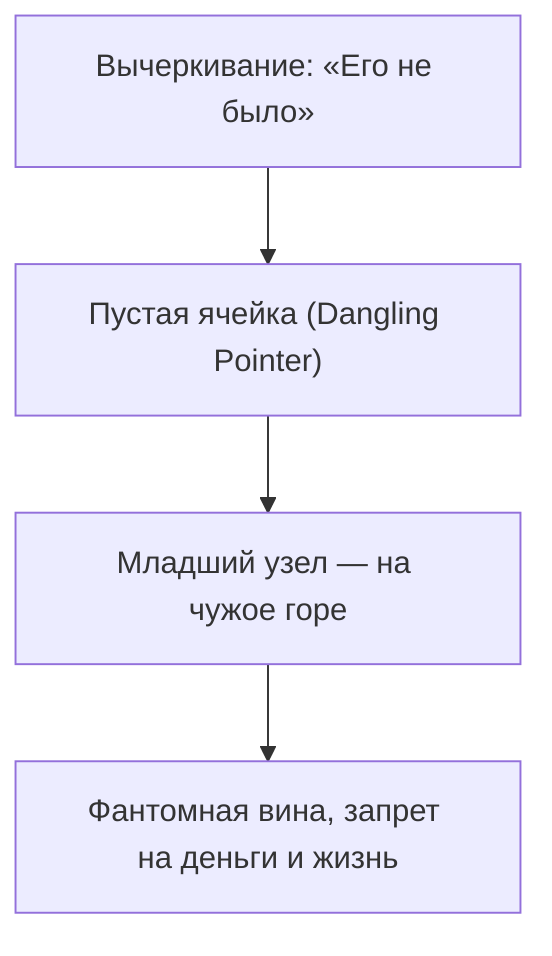

# Баг 02. Пропущенный элемент

```status
[SYSTEM AUDIT]
Обнаружена коллизия маршрутизации:
Физический адрес: занят фантомной записью.
Профиль: «временный».
Симптом: жизнь на черновике, стыд занимать пространство.
```

Бывает чувство: тебя здесь быть не должно.

Работа есть. Квартира есть. Люди вокруг. А внутри — чужая куртка с чужого плеча. Чемоданы не распаковываешь годами. Хорошую мебель не покупаешь. Планы дальше полугода — как на чужой территории перед выселением.

Это **Баг 02: Пропущенный элемент**.

Фамильный альбом. Бархатный переплёт. На групповом снимке все плечом к плечу — а в первом ряду овальная дыра с неровными краями. Лезвие бритвы. Семья делает вид, что так и было. Сколько ни листай — взгляд возвращается в прорезь.

Того, кого вырезали, нет на карточке. Его отсутствие тянет сильнее любого лица.

Сеть не терпит пустых адресов. Кого-то вычеркнули, забыли, объявили «не было». Планировщик чинит единственным способом: младшего узла сажает на фантомный сектор. Ты доживаешь чужую оборванную жизнь — и удивляешься, почему на утренний кофе сил нет.

---

> [!NOTE]
> Иван Бозормени-Надь и Берт Хеллингер называли это законом полноты: каждый, кто вошёл в систему, имеет право на место и видимость. Если из стыда, табу или горя кого-то стирают — нерождённый ребёнок, репрессированный, самоубийца, отвергнутый первый супруг — баланс ломается. В учёте невидимых лояльностей остаётся долг. Позже рождённый ребёнок получает нагрузку исключённого. В коде это висячий указатель: ключ ссылается на удалённую запись. Runtime падает или выделяет живой процесс под зомби-PID. Младший истощается, пытаясь жить две жизни. Чинится одно: исключённого называют, ставят на место, возвращают в топологию.

---

## Сессия. Максим: овальная дыра

Максиму тридцать один. Промышленный дизайнер. Городские пространства чертит сложные — а сам спит на матрасе на линолеуме в съёмной однушке.

Запрос глухой: «Я не существую. Хожу. Проектирую. Плотности нет. Я тень. С подросткового возраста — ледяная тоска: украл чужую жизнь. Зарабатывать больше ста тысяч стыдно до спазма в горле. Будто ограбил покойника».

> **Терапевт:** Ладонь туда, где тоска. Что под рукой?
>
> **Максим:** *(центр грудины, пальцы дрожат)* Овальная дыра. С блюдце. Холодная. Сквозняк из космоса. Жизни нет.
>
> **Терапевт:** Фантомный порт. Ты точно был первым ребёнком?
>
> **Максим:** *(замирает; бледнеет)* Официально — да. Единственный. В четырнадцать на поминках бабушки мать сорвалась. До меня был мальчик. Восьмой месяц. Обвитие. Мёртвый. Отец сказал: «Замолчи. Никаких гробов. Забудь. Родим нового».
>
> **Терапевт:** И родили «нового». Тебя. Ту же кроватку?
>
> **Максим:** *(вздрагивает)* Ту же. И синее байковое одеяло с мишками. Имя хотели то же — Алёша. Отец запретил. Записали Максимом.
>
> **Терапевт:** Чужой сетевой адрес. Как у [Аллы](/07-three-network-protocols) — там первенца вычеркнули из роддома, и пустота дошла до дочери. Здесь вырезали Алёшу. Сеть назначила тебя заместителем. Тридцать лет не строишь жизнь, потому что в базе ты в могиле вместо старшего брата. Готов вернуть ему место?
>
> **Максим:** *(кивает; слёзы на колени)* Да. Больше не могу быть призраком.
>
> **Терапевт:** Поставь Алёшу перед собой. Старшего. Нерождённого. Скажи:
>
> **Максим:** *(шёпот, дрожь)* «Алёша… Я вижу тебя. Ты старший брат. Первый сын. Склоняюсь перед твоей короткой судьбой. Ты заплатил смертью за моё рождение. Жизни разделены. Ты мёртвый — я живой. Ты первый — я второй. Возвращаю тебе имя и первенство. Больше не лягу в твою могилу. Посмотри на мою жизнь с благословением».

Максим опустил голову на колени. Плакал глухо, из глубины. Спазм в грудине лопнул теплом по рёбрам и животу.

Через три минуты поднял лицо — мокрое, плотное, с румянцем.

— Дыра затянулась, — прошептал, прижимая руки к груди. — Там тепло. Чувствую кости. Я есть.

На следующий день купил деревянную рамку. Лист бумаги: «Алексей — первенец семьи». Поставил на полку. Имя вернулось в реестр. Фантом перестал жрать живой узел.

---

## Исключение в четырёх доменах



* **«Я»:** стыдно занимать место, самозванец, капитал не держится.
* **«Партнёр»:** вычеркнутый бывший держит канал; новый чувствует себя третьим и уходит.
* **«Род»:** нерождённые, стыдные родственники тянут потомков в ту же изоляцию.
* **«Дело»:** выдавленный основатель оставляет дыру, которая жрёт прибыль следующих проектов.

См. также: [«Замещение»](/21-bug-04-substitution), [«Унаследованные данные»](/12-inherited-data).

---

## Практика: имя в реестре

Если фоном стыдно за сам факт существования — верни целостность.

**1. Пробел.**  
Кого вычеркнули? О ком нельзя говорить? Брат, сестра, партнёр, стыдный родственник? Нет имени — доверься пустоте в теле.

**2. Ладонь на грудину.**  
Вдох. К вычеркнутому:

> *«Я вижу тебя. Твоё место в этой системе. Твоя судьба имеет вес. Возвращаю тебе имя, номер по порядку и принадлежность. Твоё место — твоё».*

**3. Граница.**  

> *«Твою смерть и боль оставляю твоему времени. Больше не закрываю твой пробел своей жизнью. Ты старший — я младший. Выбираю быть живым на своём месте».*

**4. Материально.**  
Имя на бумаге. Свеча. Силуэт в воображаемой фотографии. Под ладонью — плотность и тепло вместо дыры.

---

> [!IMPORTANT]
> **Закон главы**
> Вычеркнутый узел не исчезает — он втягивает младшего на пустое место проживать чужую смерть.
