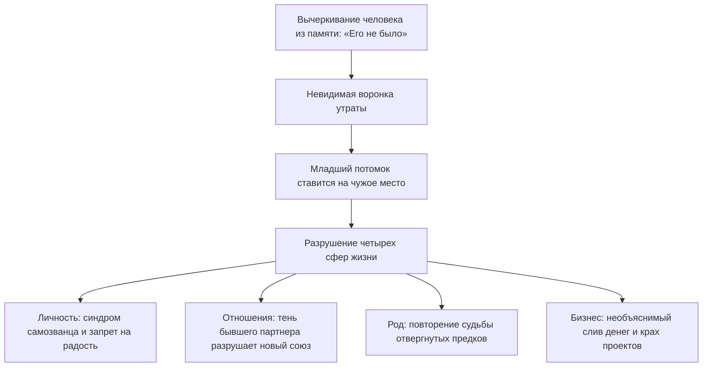

# Право быть живым: когда ты занимаешь чужое место

Бывает ли у тебя странное, глубинное ощущение, что тебя в этом мире вообще не должно быть?

Не мимолетная осенняя хандра и не усталость после тяжелой недели. А тихое, въедливое, разъедающее изнутри чувство собственной нелегитимности. 

Ты живешь обычной взрослой жизнью: ходишь на работу, общаешься с друзьями, платишь по счетам. Но внутри годами сохраняется ощущение временного постояльца. Чемоданы после переезда могут стоять неразобранными месяцами. В квартире годами не появляется хорошая, добротная мебель — зачем, если «всё это ненадолго»? Любые долгосрочные планы на жизнь вызывают панический ступор. Словно ты поселился в чужом гостиничном номере и каждую секунду ждешь, что в дверь постучит суровый администратор и с позором выставит тебя на мороз.

А самое невыносимое — это иррациональный, липкий стыд за любые свои успехи. 

Стоит выйти на хороший доход, купить красивую вещь или встретить искреннюю взаимную любовь, как в горле возникает ледяной спазм. Из глубин поднимается темная, удушливая волна: *«Я не имею права. Я украл это у кого-то другого. Я занял чужое место»*.

Так заявляет о себе **пропущенный элемент**.

---

## Овальная дыра в семейном альбоме

Представь старинный фамильный альбом в бархатном бордовом переплете. На пожелтевшей от времени фотографии родственники стоят плечом к плечу, чинно глядя в объектив. А в самом центре первого ряда зияет овальная дыра с неровными, рваными краями.

Кто-то много лет назад аккуратно вырезал оттуда лицо лезвием бритвы.

Семья листает этот альбом десятилетиями, делая вид, будто никакой прорези нет. О человеке на вырезанном фрагменте никогда не говорят вслух. Его имя под строжайшим табу. Но сколько бы ты ни вглядывался в улыбающиеся лица на снимке, взгляд неизменно падает в черную пустоту. 

Потому что пустота притягивает сильнее любого присутствия.

Человеческая родовая система устроена по строгому закону: в ней невозможно нажать кнопку «удалить без следа». Если кого-то вычеркивают из семейной памяти — умершего младенца, пропавшего без вести солдата, спившегося дядю или отвергнутого первого супруга, — на месте этого человека образуется мощная энергетическая воронка.

А дальше вступает в силу бессознательный механизм семейной компенсации: на пустое место ставят следующего рожденного ребенка.

Ты появляешься на свет как отдельная, уникальная душа. Но с первых дней жизни тебя бессознательно заставляют быть живым памятником тому, кого приказали забыть. Ты живешь не своей судьбой, болеешь не своими болезнями и несешь в сердце вековую печаль того, чье имя побоялись оплакать.

---

> [!NOTE]
> В клинической психологии этот феномен описан как **синдром замещающего ребенка** (Replacement Child Syndrome). Исследования психоаналитиков Альберта Качелла и Мориса Поро показали: когда родители переживают тяжелую потерю ребенка и, не завершив работу горя, торопятся «родить замену», новорожденный оказывается в психологической ловушке.
> 
> Родители бессознательно проецируют на младенца образ погибшего первенца. Ребенок лишается права на собственную идентичность: он либо идеализируется как воскресший ангел, либо сталкивается с глухим разочарованием, потому что не способен оживить мертвого.
> 
> Классические примеры известны мировой культуре: великий художник Винсент Ван Гог родился ровно через год после смерти своего старшего брата-младенца, получил то же имя — Винсент — и всю жизнь каждое воскресенье проходил мимо могилы с собственной фамилией и датой рождения на церковном дворе. Схожая трагедия разворачивалась в судьбе Сальвадора Дали, которого родители назвали в честь умершего первенца, убеждая мальчика, что он — реинкарнация старшего брата. Оба гения всю жизнь несли в творчестве мотив двойничества, призрачности и мучительного расщепления личности.
> 
> Основатель системной терапии Берт Хеллингер сформулировал это как **Закон Принадлежности**: каждый, кто однажды вошел в семейную систему, имеет святое и неотъемлемое право на свое место. Если система вычеркивает слабого или погибшего, младший потомок берет на себя его груз, расплачиваясь собственным здоровьем и радостью жизни.

---

## Максим и синее байковое одеяло

Тридцатиоднолетний Максим пришел на консультацию в состоянии абсолютного душевного истощения. 

У него редкий талант: он промышленный дизайнер, умеющий видеть пространство в мельчайших деталях. Максим проектирует городские набережные, уютные парки и сложные общественные пространства, наполненные светом. 

А сам при этом спит на тонком поролоновом матрасе, брошенном прямо на линолеум в пустой съемной однушке на окраине города. За спиной — ни постоянных отношений, ни накоплений, ни ощущения дома.

— Я тень, — говорил он глухим, безжизненным голосом, глядя в пол. — Я физически чувствую, что меня здесь нет. Я хожу по улицам, но сквозь меня словно дует ветер. С четырнадцати лет во мне живет ледяная, нечеловеческая тоска: чувство, будто я занял чужое место на земле. Когда на счет приходит крупный гонорар, у меня начинается паническая атака. Мне кажется, что я ограбил мертвого человека. Я тут же спускаю деньги или раздаю долги, лишь бы снова остаться ни с чем.

> **Терапевт:** Положи ладонь на то место, где сейчас живет эта тоска. Что ты чувствуешь под рукой?
>
> **Максим:** *(кладет дрожащие пальцы на центр грудины)* Здесь… круглая, холодная дыра размером с чайное блюдце. В нее со свистом втягивается ледяной воздух. Будто у меня вырезали кусок груди вместе с сердцем.
>
> **Терапевт:** Ты точно был первым ребенком у своих родителей?
>
> **Максим:** *(на секунду замирает, его лицо становится пепельно-серым)* Официально — да. Единственный и поздний сын. Но когда мне было четырнадцать, на поминках бабушки мать напилась и зарыдала. Проговорилась. За год до меня был мальчик. Восьмой месяц беременности. Тугое обвитие пуповиной. Он задохнулся внутри и родился мертвым. Отец тогда ударил кулаком по столу и закричал на мать: «Заткнись! Никаких гробов, никаких венков, никаких слез! Забудь, что он был. Завтра же начнем делать нового!»
>
> **Терапевт:** И они сделали «нового». Тебя. Куда тебя положили, когда привезли из роддома?
>
> **Максим:** *(его начинает мелко трясти)* В ту же самую деревянную кроватку… Отец даже не стал ее разбирать. И укрывали меня тем самым синим байковым одеялом с белыми мишками, которое покупали для него. Имя хотели дать то же самое — Алеша. Но отец в последний момент испугался плохой приметы и записал меня Максимом.
>
> **Терапевт:** Максим, тридцать один год ты донашиваешь судьбу старшего брата. Твоя семья попыталась замуровать свое горе, а тебя назначила живым надгробием для нерожденного первенца. Ты не покупаешь мебель и не строишь семью, потому что в семейном поле ты лежишь в могиле вместо Алеши. Ты готов вернуть брату его законное место?
>
> **Максим:** *(из глаз ручьями текут слезы)* Господи… Да. Я больше не могу быть мертвецом. Я так хочу жить.

Терапевт попросил Максима представить перед собой старшего брата — маленького мальчика, укрытого тем самым синим байковым одеялом.

> **Максим:** Алеша… Я вижу тебя. Ты — старший брат. Ты — первый сын наших родителей. Твоя короткая жизнь и твоя смерть имеют огромный вес. Ты заплатил своей жизнью за то, чтобы на свет появился я. Но наши судьбы разделены. Ты — мертвый, а я — живой. Ты — первый, а я — второй. Я возвращаю тебе твое первородство и твою память. Я больше не буду ложиться в твою могилу. Пожалуйста, посмотри на мою живую жизнь с миром.
>
> **Максим:** *(роняет голову на руки и плачет навзрыд — тяжело, освобождающе, как плачут люди после многолетней пытки)*

Спустя несколько минут дыхание Максима выровнялось. На бледных щеках проступил теплый румянец.

— Дыра закрылась, — прошептал он, благоговейно прижимая обе ладони к груди. — Внутри разливается горячая волна. Я чувствую ребра. Я чувствую землю под подошвами. Я наконец-то существую.

На следующий день Максим пошел в мастерскую, купил простую деревянную рамку и вставил в нее аккуратную надпись: *«Алексей — первенец семьи. Всегда в нашей памяти»*. Он поставил ее на книжную полку.

Тайна перестала быть проклятием. Мертвый брат занял свое почетное место в семейной истории. А живой человек наконец получил благословение жить свою собственную жизнь.

---

## Четыре сферы, в которых проявляется исключение

Феномен вычеркнутого элемента разрушает устойчивость человека на четырех уровнях:

### 1. Личность (запрет на присутствие)
Человек живет с постоянным ощущением, что он занимает чужое место. В профессии это проявляется как махровый синдром самозванца: любые награды кажутся случайностью, а деньги жгут карман, провоцируя срочно избавиться от «украденного».

### 2. Партнерство (призрак за плечом)
Если в предыдущем браке муж или жена были вычеркнуты с проклятиями, ненавистью и запретом видеться с детьми, новый партнер неизбежно почувствует себя чужим. Он словно спит в постели, где незримо лежит третий. Союз начинает трещать по швам без видимых причин.

### 3. Родовая память (лояльность к отверженным)
Тот, кого семья стыдится — родственник в тюрьме, покончивший с собой предок, разорившийся дед — никогда не исчезает бесследно. Один из внуков или правнуков бессознательно начнет копировать его повадки, привычки или зависимость, чтобы вернуть отверженного в поле внимания рода.

### 4. Дело и бизнес (тень выдавленного партнера)
Если при создании компании один из основателей был нечестно выдавлен из дела, а его вклад стерт из документов, в проекте образуется черная дыра. Прибыль будет необъяснимым образом утекать сквозь пальцы, пока первоначальная справедливость не будет восстановлена.

---

## Практика: возвращение имени и достоинства

Если ты ловишь себя на стыде за собственное существование или страхе занимать место в жизни, выполни эту исцеляющую практику:

### 1. Определи, кто был исключен
Прислушайся к своей семейной истории. О ком в доме говорили шепотом? Чьи портреты не вешали на стену? О ком плакала мама? 
- Нерожденный старший брат или сестра (аборты, выкидыши, мертворождения).
- Предок с тяжелой или «позорной» по меркам семьи судьбой.
- Если имени нет в памяти — ориентируйся на ощущение холодной пустоты в теле.

### 2. Прикосновение к телу
Положи ладонь на центр грудины. Сделай мягкий вдох через нос и глубокий выдох ртом. Обратись мысленным взором к тому, кто был забыт:

> *«Я вижу тебя. Я знаю, что ты был. Твоя судьба и твоя боль имеют огромное значение для нашей семьи. Я возвращаю тебе твое законное место, твой порядок по рождению и твою принадлежность. Ты навсегда остаешься частью нашего рода».*

### 3. Разделение судеб
Почувствуй, как перед тобой встает граница между миром живых и миром ушедших:

> *«Твоя смерть и твое испытание принадлежат тебе и твоему времени. Я больше не буду искупать твою боль своими неудачами. Ты — старший, я — младший. С любовью и уважением к тебе я выбираю оставаться живым. Я остаюсь на своем собственном месте».*

### 4. Материальное признание
Сделай то, чего не сделали испуганные взрослые: зажги в память об этом человеке свечу, напиши его имя на чистом листе бумаги или просто посиди пять минут в теплой тишине. 

Когда исключенный элемент обретает свое законное место в памяти, ледяной сквозняк в груди сменяется глубоким, живым покоем. Ты наконец получаешь полное право быть собой.

---

> [!IMPORTANT]
> **Главная мысль главы**  
> Вычеркнутый из памяти человек не исчезает: он незримо держит за руку живого, лишая его права на собственную судьбу. Свобода начинается с возвращения места каждому.

---

> [!TIP]
> **Интерактивный помощник**  
> Если тема нерожденных братьев или забытых предков подняла волну застарелой печали — не оставайся в темноте в одиночку. Диалоговое окно внизу страницы поможет бережно проговорить эти чувства и вернуть устойчивую опору в теле.
