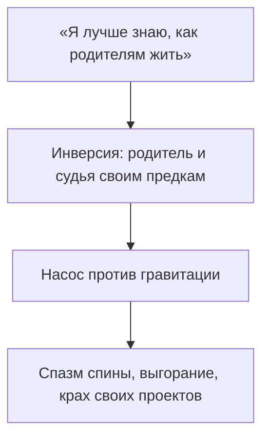

# Баг 03. Инверсия

Знакомо: всю жизнь тащишь состав в гору голой волей.

Контракты закрываются. Счета растут. Цена каждого шага — зубы до скрежета, железный обруч в грудном отделе, остановка равна срыву в пропасть.

Кажется — плата за масштаб.

Диагностика проще и жёстче. В Сети включён **Баг 03: Инверсия**.

Энергия рода течёт как вода с горы: сверху вниз. От тех, кто пришёл раньше, к тем, кто позже. От предков к родителям, от родителей к детям, от детей — к их делам и потомкам. В эту сторону жизнь идёт легко.

Инверсия — приказ водопаду течь вверх.

Младший объявляет себя старшим. Встаёт на табуретку судьи. Спасает. Поучает. Финансово усыновляет родителей. Стыдится их слабости. Монтирует насос эго и качает против течения — обратно в родительский контур.

Насос воет. Обмотки плавятся. Спина трещит под обратным давлением.

---

> [!NOTE]
> Иван Бозормени-Надь в Медицинском колледже Ганемана описал асимметричную этику поколений: дар жизни назад по цепочке не возвращают. Дети не «рассчитываются» с родителями за существование. Экологичный путь — нести ресурс вперёд: в своих детей, в дело, в творчество. Когда ребёнок становится родителем матери или отца, в теле встаёт этический и мышечный диссонанс. Электромиография фиксирует хронический гипертонус паравертебральных мышц: проприоцепция держит падающую плиту. В инженерии ROOT это reverse polarity: child node пытается питать motherboard. Идёт обратный ток. Стабилизаторы горят. Узел уходит в просадку.

---

## Быль: насос Глеба

Глебу тридцать девять. Девелоперский холдинг. Списки деловых изданий. Автопарк премиальных внедорожников.

Каждую ночь в четыре — боль между лопатками. Судорога такая, что дыхание рвётся, пальцы немеют до синевы. Остеопаты и вертебрологи: «Органики нет. Мышцы — как канаты башенного крана».

Корень — панельная хрущёвка тридцать лет назад.

Отец — тихий инженер на приборостроительном. Манжеты в графите. Стоптанные ботинки. Жена орёт ежедневно: вышла за ничтожество без дачи и копейки. Он сутулит плечи и уходит курить на балкон.

Десятилетний Глеб смотрит сквозь дверную щель на поникшую спину. Внутри рождается холодный пепел:

*«Слабак. Не мужик. Я таким не буду. Я докажу, как надо жить»*.

Сдержал слово. Университет. Сутки. Строительный бизнес с яростью. К тридцати — миллионы. Первое дело: элитная квартира родителям и немецкий седан.

За подарком не было сыновней любви. Был триумф судьи над побеждённым.

На ужинах в дорогих ресторанах Глеб хлопал шестидесятилетнего инженера по плечу, платил платиновой картой и говорил громко:

— Папа, ну что ты мнёшься? Всю жизнь копейки на проезд считал — живи барином на мои. Скажи спасибо, что сын орёл, а не размазня.

Отец в новом пиджаке неловко держал серебряную вилку. Пальцы покрывались красными пятнами стыда. Молчал. Смотрел в тарелку. В глазах — растоптанное достоинство.

Ночью Глеб выл от боли в спине.

Он перевернул водопад. Встал над отцом — богом, спонсором, воспитателем. Лишил отца статуса Большого. Себя — корней. Империя висела не на фундаменте предков. На жилах его поясницы.

Перелом — суббота вечером.

После тяжёлого разговора на сессии Глеб без предупреждения приехал в старый гараж. Отец возился у верстака. Машинное масло. Бензин. Сырая земля. Пожилой человек в замасленной куртке обернулся.

Глеб увидел сгорбленную спину, седые виски, потрескавшиеся пальцы — и тридцатилетняя спесь осыпалась сухой штукатуркой.

Человек, ворочавший миллиардами, опустился на колени на промасленный бетон. Обхватил старые ботинки. Уткнулся лбом в колени отца:

— Папа… Прости. Дурака спесивого. Всю жизнь судил. Презирал твою тишину. Тыкал деньгами. Думал — умнее, сильнее, выше. Каким слепым идиотом я был. Ты дал мне жизнь. Выкормил. Ты большой. А я просто твой сын.

Отца несколько секунд слышно было только капание конденсата с крыши.

Потом шершавая ладонь легла на стриженую макушку.

— Ну полно, сынок… Полно, Глебушка, — тихо, с дрожью. Горячая слеза на воротник Глеба. — Чего ты… Всё хорошо. Я всегда гордился тобой. Вставай, простудишься.

В грудном отделе щёлкнуло — как разомкнулся капкан. По спине густая теплая волна. Ток развернулся в правильную сторону.

Через месяц ночные спазмы ушли. В компании отпустил надрыв: больше не надо зубами доказывать правоту. Осталась спокойная сила укоренённого узла.

---

## Как ловят инверсию

Она почти всегда в белых одеждах. Забота. Зрелость. Поэтому её трудно поймать.

Ты — психолог родителям: гасишь ссоры, слушаешь жалобы, отвечаешь за их настроение — и уже стоишь над ними.

Ты судишь их жизнь: «он всё делал не так», «она сама виновата». Судья всегда выше подсудимого.

Ты тише: «я осознаннее своей простой семьи» — и этим высокомерием рубишь кабель, по которому могла бы идти их поддержка.

* **Психотерапевт для матери:** её жалобы на мужа, интим взрослой жизни родителей.
* **Спонсор-надзиратель:** деньги сверху с упрёком («без меня — по миру»).
* **Судья рода:** приговоры взглядам, слабостям, выбору старших.

Цена: спина несёт чужую судьбу. Свои дети и проекты — на голодном пайке. Кровь ушла в реверс.

См. также: [«Режим наблюдателя»](/05-observer-mode), [«Лишний элемент»](/17-bug-01-extra-element).

---

## Практика: закон иерархии

Если спина и шея в спазме годами, а дела требуют непрерывного надрыва — верни место младшего.

**1. Аудит.**  
Над кем из старших ты в белом пальто судьи? Кого тайно зовёшь неудачником, незрелым, слабым?

**2. Поклон телом.**  
Встань. Руки вдоль тела. Медленно склони голову — растяни затылок и грудной отдел. Образ родителей перед собой. Вслух:

> *«Вы — большие. Я — ваш ребёнок. Вы пришли раньше, я — позже. Ваша судьба, ваши выборы и слабости — ваши. Склоняюсь перед ними. Убираю руки от ваших жизней. Снимаю полномочия судьи, спасателя и родителя. Принимаю от вас жизнь по полной стоимости и разворачиваюсь вперёд — в свою судьбу».*

**3. Разворот.**  
Полный вдох. Тепло по позвоночнику от крестца к шее. За спиной — стена поколений. Сила течёт в тебя, а не выкачивается.

Позволь старшим быть большими — и твоя система наберёт свой масштаб без насоса.

---

> [!IMPORTANT]
> **Закон главы**
> Поток жизни вспять лишает систему подпитки и ломает несущий каркас.
