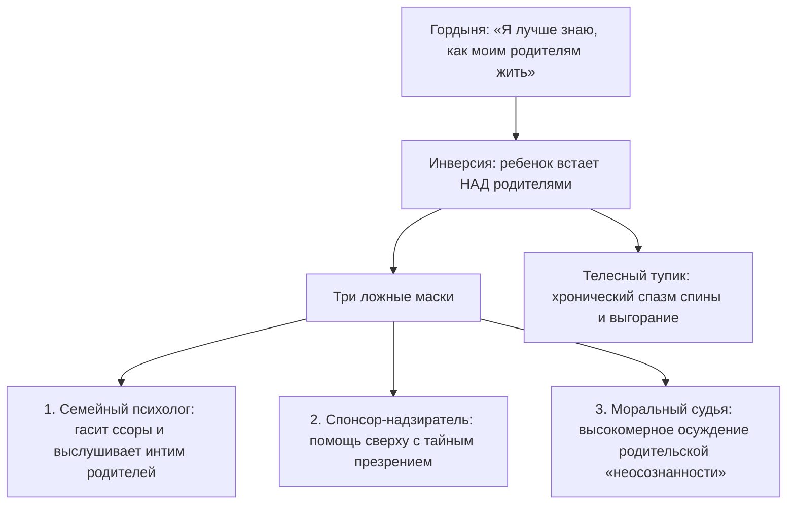

# Инверсия: почему водопад не может течь вверх

Знакомо ли тебе состояние, когда вся твоя жизнь напоминает непрерывную буксировку тяжелого железнодорожного состава в крутую гору на одной лишь голой силе воли?

Сделки успешно закрываются. Цифры на банковских счетах неуклонно растут. Окружающие смотрят с завистью и уважением. Но цена каждого следующего шага становится всё более чудовищной: зубы сжаты до глухого скрежета, в грудном отделе позвоночника намертво затянут раскаленный железный обруч, а внутри живет панический ужас: *«Стоит мне расслабиться хотя бы на секунду — и весь этот поезд полетит под откос, раздавив меня в лепешку»*.

Большинство предпринимателей и амбициозных карьеристов считают эту надрывную тяжесть неизбежной платой за масштаб. 

Но на самом деле причина лежит гораздо глубже. В твоей жизни произошла фундаментальная поломка порядка — **инверсия семейной иерархии**.

Поток жизни устроен точно так же, как могучий горный водопад: он течет строго сверху вниз, подчиняясь неумолимому закону всемирного тяготения. От тех, кто пришел в этот мир раньше, к тем, кто пришел позже. От древних предков — к родителям, от родителей — к их детям, а от детей — вперед, к их собственным проектам, творчеству и потомкам. Когда энергия движется по этому природному руслу, жизнь дается легко, а за спиной всегда чувствуется мощная, несокрушимая опора.

Инверсия — это безумная попытка силой заставить водопад течь вверх.

Это происходит в тот момент, когда младший в семье самовольно объявляет себя старшим. Ребенок забирается на судейскую табуретку и начинает судить своих родителей. Он стыдится их простоты, поучает их жизни, спасает от бедности, финансово «усыновляет» и берет на себя роль их строгого воспитателя.

Человек монтирует в своей душе мощнейший насос гордыни и начинает яростно качать энергию против течения — обратно в родительский контур. 

Насос истошно воет. Медные обмотки плавятся от перегрева. А позвоночник буквально трещит под чудовищным обратным давлением, на которое человеческое тело никогда не было рассчитано.

---

> [!NOTE]
> Один из пионеров семейной терапии Иван Бозормени-Надь в Медицинском колледже Ганемана описал фундаментальный принцип **асимметричной этики поколений**: великий дар жизни невозможно вернуть назад по цепочке.
> 
> Дети никогда не могут «расплатиться» с родителями за свое рождение на равных. Родители всегда отдают неизмеримо больше, потому что передают саму жизнь, а ребенок может лишь принять ее. Здоровый способ выразить благодарность роду — это нести полученный огонь дальше: вкладывать силы в собственных детей, в созидательный бизнес, в искусство и служение миру.
> 
> Когда же взрослый ребенок пытается стать опекуном или судьей своим родителям, в его теле возникает тяжелейший нейромышечный конфликт. Аппаратная электромиография в таких случаях фиксирует хронический гипертонус глубоких паравертебральных мышц спины: нервная система буквально пытается удержать падающую многотонную плиту. Человек лишается тыловой поддержки: вместо того чтобы опираться на предков, он пытается удержать их на своих плечах.

---

## Насос Глеба: слезы на промасленном бетоне

Глебу исполнилось тридцать девять. Крупный девелопер, владелец строительного холдинга, чье имя регулярно мелькает на страницах деловых журналов. Двухэтажный особняк, парк премиальных внедорожников, сотни подчиненных.

И при этом — адская, парализующая боль между лопатками, выкручивающая тело каждую ночь ровно в четыре часа утра. 

Судорога была настолько свирепой, что перехватывало дыхание, а кончики пальцев на руках немели до синевы. Лучшие вертебрологи, мануальные терапевты и неврологи столицы лишь беспомощно разводили руками: «С точки зрения физиологии кости и диски в порядке. Но ваши спинные мышцы напряжены, как натянутые стальные тросы башенного крана».

Истинный корень этой судороги уходил в тесную панельную хрущевку тридцатилетней давности.

Его отец был тихим, скромным инженером-конструктором на приборостроительном заводе. Рубашки с чернильными пятнами от чертежей, стоптанные дерматиновые ботинки, вечная зарплатная ведомость с грошами. Мать пилила его каждый божий вечер: «Я жизнь загубила с ничтожеством! У всех мужья как мужья, дачи строят, а ты только железки свои на заводе перебираешь!» Отец молча сутулил спину, опускал глаза и уходил курить на холодный балкон.

Десятилетний Глеб стоял в темном коридоре и сквозь щель балконной двери смотрел на поникшие плечи отца. В груди мальчика тогда закипел едкий, ядовитый пепел:

*«Слабак. Тряпка. Я никогда в жизни не стану таким, как ты. Я докажу всему миру, как должен жить настоящий мужчина»*.

Глеб сдержал клятву. Он спал по четыре часа в сутки, зубами выгрызал победу в университете, открыл бизнес с яростью раненого зверя. К тридцати годам он стал мультимиллионером. И первым же делом купил родителям огромную четырехкомнатную квартиру в элитном доме и роскошный немецкий седан.

Но за этим щедрым жестом не было сыновней любви. За ним стоял жестокий, надменный триумф судьи над побежденным соперником.

На семейных ужинах в дорогих ресторанах Глеб небрежно бросал на стол черную банковскую карту, покровительственно хлопал шестидесятилетнего отца по плечу и громко, на весь зал, произносил:

— Ну что ты жмешься, батя? Всю жизнь каждую копейку на трамвай считал — хоть на старости лет поживи как человек за мой счет. Скажи спасибо, что сын у тебя орел, а не тюфяк!

Пожилой инженер в непривычно дорогом шерстяном костюме неловко перебирал пальцами тяжелую серебряную вилку. Его шея покрывалась красными пятнами жгучего стыда. Он молчал, глядя в тарелку, и в его потухших глазах читалось растоптанное человеческое достоинство.

А ночью Глеб лез на стену от разрывающей боли в спине.

Он самовольно перевернул водопад. Он возомнил себя богом и благодетелем для собственного отца. Он лишил отца статуса Старшего, а себя — корней и фундамента. Его строительная империя держалась не на прочной земле, а на перенапряженных сухожилиях его собственной поясницы.

Развязка наступила в дождливый субботний вечер.

После долгой, выворачивающей наизнанку сессии Глеб сел в машину и без звонка поехал на окраину города, в старый кирпичный гаражный кооператив. Отец, несмотря на богатство сына, продолжал проводить выходные там — возился у верстака со старыми радиоприборами.

Запах машинного масла, сырости и канифоли. Горит тусклая сорокаваттная лампочка. Отец в замасленной старой куртке обернулся на скрип двери.

Глеб посмотрел на его натруженные, потрескавшиеся руки, на седую прядь над морщинистым лбом — и вся тридцатилетняя спесь миллиардера осыпалась в одну секунду, как сухая штукатурка от взрыва.

Человек, ворочавший судьбами сотен людей, молча подошел к верстаку и опустился на колени прямо на холодный, промасленный бетон. Он обхватил старые, стоптанные ботинки отца, уткнулся лбом в его колени и зарыдал — так, как не плакал ни разу в жизни:

— Папа… Прости меня. Прости меня, дурака спесивого. Я всю жизнь судил тебя. Презирал твою тишину, тыкал в тебя своими деньгами. Думал, что я умнее, сильнее и лучше тебя. Каким же слепым и глухим идиотом я был… Ты дал мне жизнь. Ты не спал ночами, когда я болел. Ты научил меня держать молоток. Ты — большой. Ты — мой отец. А я просто твой маленький сын.

В гараже воцарилась звенящая тишина. Слышно было только, как по жестяной крыше монотонно барабанит дождь.

А затем тяжелая, шершавая от мозолей ладонь отца мягко опустилась на стриженую макушку Глеба.

— Ну полно тебе, сынок… Полно, Глебушка, — голос отца дрогнул, и горячая слеза упала на воротник дорогой куртки сына. — Чего ты… Всё хорошо. Я всегда гордился тобой. Всегда. Поднимайся, сынок, на бетоне холодно…

В ту же секунду где-то в глубине позвоночника Глеба раздался сухой внутренний щелчок — словно отпустила стальная пружина капкана. По спине до самого крестца разлилась густая, горячая, исцеляющая волна. Водопад развернулся в правильную сторону.

Через две недели ночные приступы удушья и судороги исчезли навсегда. А из бизнеса Глеба ушел постоянный надрыв: ему больше не требовалось никому ничего доказывать ценой собственной жизни.

---

## Три маски инверсии: как гордыня обманывает нас

Инверсия почти никогда не приходит в открытом обличье зла. Она надевает белоснежные одежды благородства, заботы и сыновнего долга:

### 1. Домашний психотерапевт
Мать жалуется взрослой дочери на отца, посвящая ее в интимные подробности их брака. Дочь слушает, дает советы, утешает и начинает чувствовать себя мудрее мамы. В этот момент она вылетает со своего законного детского места и становится мамой для собственной матери.

### 2. Спонсор-надзиратель
Помощь родителям — естественное проявление заботы. Но дьявол кроется в мотиве. Если деньги даются свысока, с немым упреком: «Куда бы вы без меня делись, нищие и беспомощные», — это не сыновняя благодарность. Это покупка права доминировать над старшими.

### 3. Духовный судья
«Мои родители темные, токсичные, они ничего не понимают в психологии и духовном росте, а я весь такой осознанный и проработанный». Это тончайшая ловушка эго: человек мнит себя великим гуру по отношению к тем, через кого пришел в этот мир. Этим высокомерием он намертво перерубает питающие корни своего родового древа.

---

## Практика: возвращение на место Младшего

Если твоя спина и шея годами живут в хроническом мышечном спазме, а любые проекты требуют титанического надрыва, выполни эту практику восстановления иерархии:

### 1. Честный внутренний аудит
Задай себе прямой вопрос:
- Перед кем из старших родственников я стою в белом пальто непогрешимого судьи?
- Кого я тайно считаю неудачником, слабаком или обузой?
- Чью жизнь я пытаюсь исправить вместо того, чтобы заниматься своей собственной?

### 2. Поклон телом
Встань прямо. Опусти руки вдоль тела. Медленно склони голову и корпус вперед — почувствуй, как мягко натягиваются мышцы задней поверхности шеи и спины между лопатками. 

Представь перед собой своих родителей такими, какие они есть: со всеми их слабостями, тяжелыми характерами и ошибками. Произнеси вслух, чувствуя вес каждого слова:

> *«Дорогие мама и папа. Вы — большие, а я — маленький. Вы пришли в этот мир раньше, а я — позже. Вы дали мне жизнь, и этой жизни абсолютно достаточно. Я склоняюсь перед вашими выборами, вашей судьбой и вашими трудностями. Я снимаю с себя полномочия вашего судьи, воспитателя и спасателя. Я убираю свои руки от ваших судеб. Я с благодарностью принимаю всё то, что вы смогли мне дать, и разворачиваюсь лицом вперед — в свою собственную жизнь».*

### 3. Разворот к собственному будущему
Сделай глубокий вдох животом и плавно выпрямись. Почувствуй, как за твоей спиной встают поколения предков. Сила больше не выкачивается из тебя назад — она мощным потоком вливается в твою спину, давая несокрушимую опору.

Позволь старшим быть Большими — и тебе больше никогда не придется тащить эту жизнь на разорванных жилах.

---

> [!IMPORTANT]
> **Главная мысль главы**  
> Пока ребенок пытается быть родителем для своих родителей, он остается бесплодным для собственной жизни. Поток силы течет только вперед.

---

> [!TIP]
> **Интерактивный помощник**  
> Если поклон родителям или отказ от роли судьи вызвал внутренний бунт или застарелую обиду — не спеши закрываться. Напиши об этом в диалоговом окне внизу страницы, и мы поможем аккуратно распутать этот узел.
