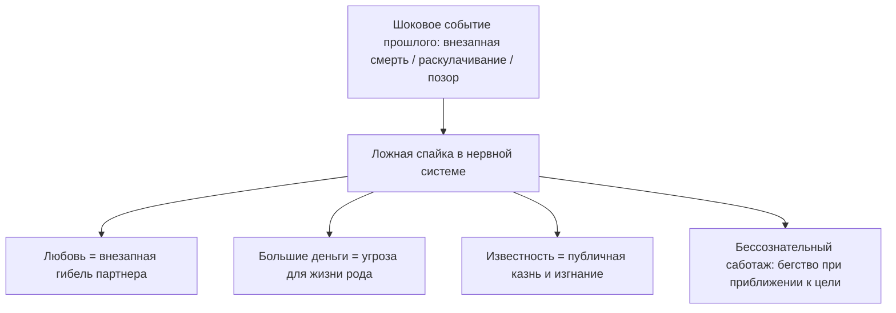

# Ложная связка: почему любовь кажется смертельной опасностью

Ты наверняка замечал эту странную, необъяснимую разницу между людьми.

Один человек спокойно идет на важные переговоры, легко подписывает контракт на десятки миллионов рублей и сразу после этого едет с друзьями в ресторан праздновать победу. А другой при приближении к точно такой же сделке внезапно заболевает с высокой температурой, устраивает скандал с ключевым партнером на ровном месте или забывает паспорт дома в день вылета.

Один с головой ныряет в теплые, глубокие отношения, наслаждаясь каждым днем. А другой, стоит партнеру сделать шаг к настоящему сближению, испытывает первобытный, леденящий душу ужас и сжигает все мосты, спасаясь бегством в глухую ночь.

Это не трусость. Не лень. И не отсутствие профессионализма.

Внутри твоей нервной системы произошло то, что инженеры называют коротким замыканием: два абсолютно не связанных между собой провода однажды намертво спаялись в один узел. И теперь вместо спокойного жизненного сигнала по цепи идет высоковольтный разряд паники.

В психотерапии это состояние называют **травматической связкой**:

- *Большие деньги = раскулачивание, тюрьма и гибель.*
- *Искренняя душевная близость = предательство, удушье и смерть.*
- *Публичное проявление = позор, изгнание и одиночество.*

Стоит тебе искренне захотеть финансового изобилия или счастливой семьи, как организм немедленно включает режим аварийного спасения. В грудине возникает ледяной кол, сердце начинает судорожно трепыхаться, а всё нутро кричит одну команду: *«Беги! Спасайся! Это смертельно опасно!»*

Годами эта ложная спайка надежно держит тебя на безопасной дистанции от всего, о чем ты так отчаянно мечтаешь.

---

> [!NOTE]
> В начале XX века великий физиолог Иван Петрович Павлов в своих классических экспериментах открыл механизм формирования **условного рефлекса**. 
> 
> Нейтральный стимул — например, тихий звон колокольчика — сам по себе не несет для живого существа никакой биологической угрозы. Но если каждый звон сопровождать болезненным ударом электрического тока, синапсы мозга в рекордные сроки спаивают слуховую кору с центрами страха в миндалевидном теле. В дальнейшем одного лишь тихого звона становится достаточно, чтобы организм выбросил лошадиную дозу адреналина, кровеносные сосуды спазмировались, а тело заметалось в поисках выхода.
> 
> В человеческой психике эта нейронная спайка работает еще разрушительнее, потому что способна передаваться через поколения. Если в семье прадеда раскулачили и расстреляли в ночь после продажи урожая, в родовой памяти прочно фиксируется рефлекс: достаток убивает. Спустя восемьдесят лет правнук честно пытается масштабировать бизнес, но его автономная нервная система слышит в слове «прибыль» тот самый смертоносный звон колокольчика — и нажимает на кнопку катапультирования.
> 
> Исцеление заключается не в борьбе со страхом, а в осознанном разъединении ложной связки: нейтральному стимулу возвращается его нейтральность, а прошлой трагедии отдается ее завершенное место в истории.

---

## Синее платье у закрытой двери

Светлане исполнилось двадцать девять. Красивая, умная, мягкая женщина с выразительными глазами, в которых плескалось море застарелой, невыплаканной боли.

— Я всю жизнь мечтала о простой, теплой семье, — говорила она на приеме, нервно теребя ремешок сумочки. — Знаете, как в кино: уютный загородный дом, потрескивание поленьев в камине, детский смех, надежный муж обнимает со спины. Я так отчаянно этого хочу! Но стоит мужчине стать по-настоящему родным, как во мне просыпается неконтролируемое безумие. 

Она глубоко вздохнула, пытаясь сдержать подступающие слезы:

— Стоит нам начать жить вместе, как в моей груди вспыхивает настоящий пожар. Мне начинает казаться, что если я останусь с ним под одной крышей — случится непоправимая беда. Я нахожу самый глупый, ничтожный повод: не так поставленная кружка, забытое слово. Закатываю дикую, истерическую сцену и ухожу в ночь босиком. За последний год я разрушила четвертые прекрасные отношения. Я ненавижу себя за это. Я в полном отчаянии.

> **Терапевт:** Света, закрой глаза. Сделай медленный выдох. Представь вечер. Мужчина, который искренне тебя любит, закрывает входную дверь на ключ, подходит к тебе сзади и нежно обнимает за плечи. Что прямо сейчас происходит в твоем теле?
>
> **Света:** *(мгновенно бледнеет, руки судорожно прижимаются к солнечному сплетению, дыхание перехватывает)* Господи… В животе раскаленный свинец. Словно я выпила стакан серной кислоты. В висках стучит тяжелый кузнечный молот. Мне нечем дышать! Хочется выломать дверь с корнем, бежать сломя голову по лестнице и спрятаться в темном подвале!
>
> **Терапевт:** Кто умер или исчез из твоей жизни в детстве ровно в тот момент, когда между вами было бесконечное счастье и тепло?
>
> **Света:** *(в кабинете повисает ледяная тишина; пальцы девушки начинают мелко дрожать, губы синеют)* Папа… Я была абсолютной «папиной дочкой». Мы дышали одним воздухом. Мне было ровно семь лет. Суббота, мой день рождения. Утром он подошел к моей кровати, поцеловал в лоб и сказал: «Жди меня, Светик! Я сегодня вернусь пораньше с работы и привезу тебе самый лучший сюрприз на свете».
>
> **Терапевт:** Что ты сделала дальше?
>
> **Света:** *(по щекам текут беззвучные слезы)* Я надела свое самое красивое синее платье с кружевным воротничком. Села на холодный линолеум в прихожей прямо напротив входной двери. Я сидела там часами. Слушала гул лифта. Ждала шагов на площадке и знакомого звона ключей в замке…
>
> **Терапевт:** И что произошло?
>
> **Света:** *(голос срывается на шёпот)* Пробило семь вечера. Восемь. Звона ключей не было. А потом в тишине коридора сухо и пронзительно зазвонил дисковый телефон. Мама взяла трубку, помолчала несколько секунд… а потом закричала так, как кричит смертельно раненый зверь. Она сползла по обоям на пол и стала биться головой о плинтус. Папа упал на асфальт в двух кварталах от нашего дома. Обширный инфаркт. Ему было всего двадцать девять лет. Он умер мгновенно, сжимая в руке большую коробку с куклой. Дверь он так и не открыл.

Света замолчала, судорожно глотая воздух.

— Я сидела в том синем платье на ледяном полу прихожей и смотрела на воющую маму. И в моей детской голове в ту секунду намертво запечаталась страшная мысль: *«Если бы я не ждала его так сильно… Если бы я не любила его так сильно — он остался бы жив. Это моя любовь убила папу»*.

Двадцать два года Светлана жила с этой чудовищной связкой. 

В ее подсознании любовь к мужчине была спаяна с внезапной смертью и ледяным ужасом сиротства. Чтобы спасти любимого мужчину от верной гибели, а себя — от разрывающего горя, ее психика при малейшем сближении нажимала кнопку экстренной катапульты.

> **Терапевт:** Света, посмотри сейчас на того молодого двадцатидевятилетнего мужчину с коробкой куклы в руках. Посмотри в его живые, любящие глаза. Скажи ему правду:
>
> **Света:** Папа… Я так долго ждала тебя у той двери. Я всю жизнь просидела на том холодном линолеуме в синем платье… Но твой инфаркт и твоя ранняя смерть — это была твоя взрослая судьба. Это не было ценой моей детской любви. Моя любовь не убивает. Моя любовь — это просто тепло. Я разделяю любовь к тебе и твою трагическую смерть. Мой мужчина — это не ты. Наша квартира — это не морг. Я размыкаю этот провод. Любить безопасно.
>
> **Света:** *(делает судорожный, всхлипывающий вдох; спазм в солнечном сплетении с тихим теплом растворяется, расслабляя живот)*
>
> **Терапевт:** Снова представь закрытую дверь и мужчину рядом. Что сейчас в теле?
>
> **Света:** *(вытирает мокрые щеки, на лице появляется слабая, но искренняя улыбка)* В груди тихо и просторно. Дышится легко. Можно просто подойти к нему, положить голову на грудь и знать: никто не умрет.

Через полгода Светлана прислала фотографию: загородный дом, чашки с чаем на деревянной веранде и спокойный, улыбающийся мужчина рядом. Ложная связка распалась. Жизнь вернула себе безопасность.

---

## Анатомия травматической пайки

Любая ложная связка держится на трех китах:
1. **Шоковый импринт.** Момент, когда трагедия застала врасплох (внезапный звонок, обыск, предательство).
2. **Ложный детский вывод.** Мозг ребенка ищет причинно-следственную связь и берет вину на себя: «Это произошло, потому что я радовался / просил денег / любил».
3. **Охранный саботаж.** Психика блокирует любое повторение ситуации, заставляя человека разрушать свое счастье собственными руками.

---

## Практика: разъединение проводов

Если ты чувствуешь, что приближение к заветной цели вызывает удушливую тревогу или желание сбежать, выполни эту практику разделения:

### 1. Сформулируй свою формулу страха
Найди два понятия, которые склеились в твоей голове:
- *«Если я стану богатым, то… (меня убьют / отнимут / презирают)».*
- *«Если я доверюсь партнеру, то… (он бросит меня умирать / растопчет)».*
- *«Если я заявлю о себе, то… (меня осмеют и уничтожат)».*

### 2. Найди исток замыкания
Вспомни, когда эта формула впервые проявилась в твоей жизни или истории твоей семьи. Чья трагедия стояла за этим страхом?

### 3. Телесное разделение
Положи одну руку на грудь, а другую — на живот. Сделай глубокий вдох через нос и медленный, спокойный выдох через рот. Произнеси вслух твердым, взрослым голосом:

> *«Я вижу эту связку. В момент катастрофы моя испуганная память соединила тепло и смерть, деньги и гибель, проявленность и позор. Долгие годы это казалось мне единым целым. Но сегодня я развожу эти провода. Трагедия прошлого завершена и остается в прошлом. Моя любовь — это жизнь. Мой доход — это созидание. Я возвращаю каждому явлению его подлинный смысл. Опасность миновала. Мне можно жить и любить в безопасности».*

### 4. Возвращение в настоящее
Огляди комнату. Потрогай твердую поверхность стола, почувствуй опору стула под бедрами. Звон старого колокольчика стих. Твой сегодняшний день свободен от призраков прошлого.

---

> [!IMPORTANT]
> **Главная мысль главы**  
> Нервная система может годами бить тревогу на нейтральный сигнал, принимая его за смертельную угрозу. Раздели прошлую боль и сегодняшнюю цель — и путь откроется без борьбы.

---

> [!TIP]
> **Интерактивный помощник**  
> Если воспоминание о внезапной утрате или предательстве отозвалось сдавленным дыханием — напиши об этом в диалоговом окне внизу страницы. Мы поможем бережно снять это напряжение и вернуть чувство безопасности.
