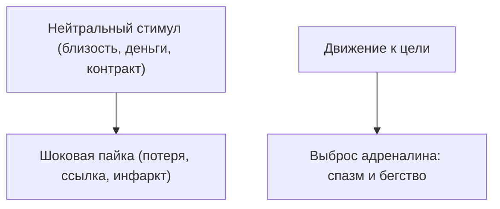

# Битая ссылка

Коллега спокойно подписывает крупный контракт и едет ужинать. Ты в той же точке находишь десять приличных причин слить сделку или устроить скандал накануне.

Не трусость. Не лень. Не дыра в компетенциях. Где-то внутри два провода спаялись в один — и вместо рабочего сигнала идёт разряд паники.

В операционных системах это повреждённый указатель: адрес ведёт не к данным, а в аварийный сектор. В психике то же:

* Деньги = гибель.
* Близость = удушье и исчезновение.
* Проявленность = публичная расправа.

Ставишь цель «хочу близости» или «хочу другой доход» — нервная система запускает спасение. Ледяной ком под рёбрами. Желание сбежать.

**Баг битой ссылки.** Годами держит тебя на безопасной дистанции от того, что тебе дорого. Спасает от тепла и успеха так, будто это одно с гибелью.

`[Обнаружена аномальная связка. Анализ источника…]`

---

## Механика условного рефлекса

Нейтральный звук плюс удар током — и нервная система связывает их намертво. Дальше один звук вызывает шок. В самом звуке опасности нет.

Угроза в прошлом. Перемычка осталась.

> [!NOTE]
> Иван Павлов на рубеже XIX–XX веков показал, как рождается условный рефлекс. Нобелевская премия 1904 года — за физиологию пищеварения; принцип связки шире. Звон колокольчика сам по себе стерилен. В паре с ударом тока синапсы соединяют слуховую кору с миндалиной. Один колокольчик — и уже катехоламины, тахикардия, спазм сосудов, бегство. В архитектуре опыта это битый указатель: близость спаяна с гибелью, благополучие — с раскулачиванием, авторитет — с позором. При каждом шаге к ресурсу автономная система честно гоняет старый скрипт. Связку можно развести: нейтральному сигналу вернуть нейтральность — и тело перестаёт платить чужой болью.

Связки пишутся двумя путями:

* **Через шок семьи.** Раскулачили прадеда на глазах детей — в роду легло: *«Большие деньги = смерть»*. Через три поколения ты хочешь роста, а перед крупной оплатой — спазм, температура, потерянные документы в аэропорту.
* **Через личную потерю.** Открылся ребёнком — человек исчез. Запись: *«Любовь = гибель»*. Рядом появляется надёжный — и сирена. Ты рушишь отношения на взлёте.

Формула бага: **«хочу, но бегу»**. Цель есть. Тянет по-настоящему. Каждый шаг — тревога без объяснения. Колокольчик всё ещё спаян с разрядом.

`[Источник локализован. Подготовка разъединения…]`

См. также: [«Деньги»](/44-resources-in-network), [«Природа багов»](/14-bug-nature).

---

## Сессия. Света

Запрос: «С детства мечтала о большой тёплой семье. Муж, дети, костёр за городом, хлеб, река, покой. Стоит мужчине стать родным — первобытный ужас. Кажется: останусь под одной крышей — случится катастрофа. В груди пожар. Глупый повод. Сцена. Уход в ночь. Скоро тридцать. За год — четвёртый раз. В отчаянии».

> **Терапевт:** Глаза закрой. Вечер. Мужчина обнимает со спины, кладёт руки на плечи, закрывает за тобой дверь. Что в теле?
>
> **Света:** *(бледнеет; всхлипы; ладони к солнечному сплетению)* Раскалённый свинец. Будто кислоты выпила. В затылке молот. Нечем дышать. Хочется выбить дверь и бежать босиком.
>
> **Терапевт:** Кто умер или исчез в детстве ровно тогда, когда между вами было тепло?
>
> **Света:** *(тишина; пальцы дрожат; губы синеют)* Папа. Я была папиной. Дышали в унисон. Мне семь. В субботу — день рождения. Утром поцеловал: «Жди, Светик, вернусь пораньше, привезу сюрприз». Надела синее платье. Села на холодный линолеум у двери. Слушала лифт. Ждала шагов и звона ключей.
>
> **Терапевт:** И?
>
> **Света:** *(слёзы; шёпот)* Семь. Восемь. Ключей нет. Телефон в коридоре — сухо, пронзительно. Мама сняла трубку, закричала как раненый зверь и сползла по обоям. Папа упал на тротуаре в двух кварталах. Обширный инфаркт. Двадцать девять лет. Дверь так и не открыл. Я в синем платье в ледяной прихожей думала: если бы не ждала так сильно — он был бы жив.
>
> **Терапевт:** Вот пайка. Семилетняя на холодном полу спаяла провода: *«Любить мужчину и ждать его = убить его и остаться в тьме»*. Система решила: твоя любовь смертоносна. Чтобы спасти мужчину и себя от сирены — катапульта с порога. Не вина. Условный рефлекс. Готова рвать пайку?
>
> **Света:** *(закрывает лицо; дрожь)* Да… Устала бежать. Хочу любить и не ждать похоронки.
>
> **Терапевт:** Посмотри на молодого отца. Из семи лет. В живые глаза. Вслух:
>
> **Света:** *(сквозь плач)* «Папа… Я так долго ждала у той двери. Я люблю тебя. Твой инфаркт и ранняя смерть — твоя судьба, твой предел, не цена моей любви. Моя любовь не убивает. Разделяю любовь к тебе и твою смерть. Близость с моим мужчиной — жизнь. Твой уход — твоя доля, оставляю её твоему времени. Любовь — просто тепло. Размыкаю этот провод».
>
> **Света:** *(судорожный вдох; диафрагма опускается; спазм тает в тёплую пульсацию)*
>
> **Терапевт:** Снова дверь и мужчина рядом. Что в теле?
>
> **Света:** *(вытирает лицо)* В груди тихо. Тепло. Дышится широко. Можно стоять рядом, держать за руку и не ждать удара в спину.

`[Ложная связка разорвана. Стимул и аффект разведены]`

---

## Практика: развести смыслы

Когда к желаемому приближаешься — и тело саботирует паникой:

1. **Формула пайки.** Через равенство: *«Большие деньги = опасность»*, *«Глубокая близость = предательство»*, *«Успех = отвержение стаи»*.
2. **Точка замыкания.** Где в личной или семейной хроники эти два понятия сплавились от шока?
3. **Разведение.** Ладонь на зажим — горло, диафрагма, солнечное сплетение. Спазму разрешить быть. Ровный вдох. Вслух:
   > «Я вижу связку. В момент [событие] система соединила [желаемое] и [древнюю боль]. Годами это казалось одним. Сегодня разделяю. Ресурс — созидание. Трагедия предков — их завершённый опыт. Любовь — жизнь. Внезапный уход — отдельная судьба. Каждому сигналу — его значение. Ложный код аннулирован».
4. **Фиксация.** Вдох носом, выдох ртом. Образы расходятся по разным комнатам памяти. Панцирь в груди мягчеет. Кровь и дыхание идут свободнее.

Колокольчик — звук колокольчика. Раздели смыслы — и верни себе право идти к доходу, к масштабу и к любви, от которой больше незачем бежать.

---

> [!IMPORTANT]
> **Закон главы**
> Ошибочно спаянный рефлекс держит панику годами; раздели нейтральный сигнал и прошлую боль — и колокольчик снова просто звук.
