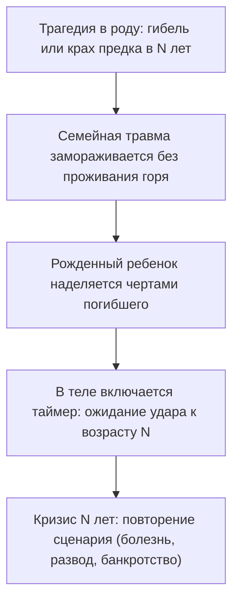

# Замещение: когда в теле тикает чужой будильник

Бывает так, что в твоей жизни всё складывается последовательно и успешно. Выстроена карьера, есть понятный план на годы вперед, тело пышет здоровьем.

И вдруг — словно по невидимому щелчку выключателя — реальность начинает стремительно осыпаться.

В бизнесе на ровном месте срываются ключевые контракты. Отношения, казавшиеся нерушимыми, дают глубокую трещину. А по ночам начинает бешено колотиться сердце, словно в грудь заложили бомбу замедленного действия. 

Человек ищет рациональные объяснения: экономический кризис, возрастная перестройка организма, накопившаяся усталость или банальное совпадение. 

Но если сопоставить даты, вскрывается поразительная закономерность: тебе только что исполнилось ровно столько же лет, сколько было твоему отцу, матери или дяде в момент их внезапной гибели, тяжелейшего инфаркта или банкротства.

В глубинах твоей нервной системы сработал скрытый биологический таймер — **синдром замещения**.

Психика человека обладает колоссальной способностью к бессознательной эмуляции. Если в роду произошла страшная, непережитая трагедия, которая осталась в памяти семьи открытой раной, потомок может взять на себя задачу доиграть оборванную партию. Организм начинает буквально воспроизводить чужие болезни, чужие страхи и чужие финансовые катастрофы, строго сверяясь с календарем погибшего предка.

---

> [!NOTE]
> В 1953 году профессор Стэнфордского университета Джозефина Хилгард в ходе фундаментального клинического исследования описала феномен, получивший название **«реакция годовщины»** (Anniversary Reaction). 
> 
> Ученые обратили внимание на необъяснимую медицинскую статистику: острые психосоматические кризы, панические атаки, внезапные инфаркты и тяжелые депрессивные эпизоды с пугающей частотой обрушиваются на пациентов ровно в том возрасте (или даже в тот же месяц), когда их родитель пережил катастрофу или ушел из жизни.
> 
> Позже один из создателей системной семейной психотерапии Мюррей Боуэн развил эту концепцию, показав, как работает феномен «замещающего ребенка». Если ребенок рождается вскоре после трагической гибели члена семьи, родители бессознательно проецируют на него образ погибшего. Это не просто рассказ в голове: это глубочайший соматический импринтинг. 
> 
> Тело потомка годами несет в себе скрытую команду: *«В тридцать три года — катастрофа», «В сорок один — разрыв сердца», «В сорок пять — разорение»*. Психика добросовестно воспроизводит чужой финал, потому что границы двух разных человеческих судеб оказались склеены.

---

## Часы дяди Андрея: стрелки на 16:42

В просторном кабинете тридцатитрехлетнего Андрея, успешного инженера и руководителя мостостроительного бюро, на массивной дубовой полке всегда стояли старинные карманные часы. Потускневшее золото, треснувшая эмаль циферблата. И тонкие вороненые стрелки, навечно застывшие на отметке 16:42.

Это были часы его родного дяди — маминого старшего брата. Гордость всей семьи, блестящий проектировщик, красавец и любимец института. Он погиб в страшной автокатастрофе в возрасте тридцати трех лет: на скользком от первого заморозка мосту его машина сорвалась в ледяную воду. Ровно в 16:42.

Через два года после похорон на свет появился Андрей-младший.

— Вылитый Андрюшенька, — шептала мать над колыбелью, глядя на младенца сухими, застывшими глазами. — Те же тонкие пальцы. Та же ямочка на подбородке. Тот же серьезный, недетский взгляд. Ты родился, чтобы завершить то, что не успел он.

Мальчик рос образцово-показательным ребенком. Никаких капризов, машинки на ковре расставлены строго по линейке, в школьных тетрадях — идеальные геометрические чертежи. Поступление в строительный институт не обсуждалось: это воспринималось как священная семейная миссия.

Но под маской безупречного послушания всю жизнь тлела глухая, свинцовая тоска. 

Андрей чувствовал себя человеком, на которого надели тяжелое драповое пальто великана: полы волочатся по земле, жесткий воротник до крови натирает шею, плечи ноют от невыносимого веса. Победы на всероссийских конкурсах, престижные заказы и государственные награды не приносили ему ни капли живой радости. Внутри постоянно звучал ядовитый шепот: *«Это всё не твое. Ты празднуешь триумф на чужих поминках»*.

Ад начался ровно за три месяца до тридцать третьего дня рождения.

Андрей проснулся среди ночи в липком холодном поту. На грудную клетку словно опустили бетонную сваю. Пульс зашкаливал за сто сорок ударов в минуту. В горле стянулась ледяная удавка. Три лучших кардиологических центра провели полное обследование: сосуды чистые, миокард в идеальном состоянии. Врачи развели руками: «Вегетативный криз, панические атаки на фоне стресса».

А затем всё покатилось в пропасть. Генеральный подрядчик неожиданно отозвал финансовые гарантии по масштабному мостовому контракту. Банк заблокировал расчетные счета. В кабинете Андрея воздух с каждым днем становился всё тяжелее, словно превращаясь в густой цементный раствор.

Невидимый внутренний таймер неумолимо отсчитывал дни до роковой отметки тридцать три года.

За неделю до дня рождения Андрей сидел один в темном ночном офисе. За панорамным окном хлестал холодный ноябрьский дождь — в точности такой же, какой шел в день гибели дяди. На дубовой полке в полумраке тускло поблескивало золото старых часов.

Андрей медленно подошел к полке, взял тяжелый металлический корпус в ладонь и прижал его к груди. Под ребрами перехватило дыхание.

— Дядя Андрей… — прошептал он в тишину кабинета, и голос его задрожал. — Я тридцать три года прожил вместо тебя. Я строил твои мосты. Я носил твое имя, твои жесты, твои чертежи. Я надеялся, что если я погибну в тридцать три года — мама наконец успокоится и перестанет плакать у окна…

Горло сдавил горячий спазм. Андрей опустился на колени прямо на паркет, сжимая холодный металл часов в кулаке:

— Но твой мост и твоя смерть принадлежат только тебе. Это была твоя судьба. А я — не дублер. Я не продолжение чужой оборванной пьесы. Я твой племянник. Мое время — другое. Моя жизнь принадлежит мне.

Слезы хлынули из глаз — не от страха, а от колоссального, долгожданного облегчения тела, с которого впервые за три десятилетия сняли смертную удавку.

В центре груди раздался глубокий внутренний щелчок. Зажатая диафрагма мягко расправилась. Прохладный, чистый воздух впервые в жизни наполнил легкие до самого дна.

Андрей бережно положил часы обратно на полку, рядом с черно-белой фотографией дяди. Сделал глубокий вдох, поклонился и сделал три твердых шага назад.

Через неделю ему исполнилось тридцать четыре года. Он проснулся ясным солнечным утром без привычной тяжести в затылке. Его ноги твердо стояли на полу. 

Его собственные часы наконец-то пошли своим ходом.

---

## Как передается чужой костюм

Подмена собственной личности чужой трагедией почти всегда происходит из глубокой детской любви и невозможности взрослых справиться с горем:

### 1. Тень погибшего родственника
Дядя, тетя или дедушка, ушедшие в расцвете лет. Ребенка неосознанно называют в их честь, окружающие постоянно повторяют: «Как он похож на покойного!» Ребенок впитывает не только черты лица, но и неизбежность трагического финала.

### 2. Замещающие дети после перинатальной утраты
Когда младенец рождается сразу после умершего брата или сестры, он с колыбели чувствует себя тенью. Ему кажется, что его любят не за то, какой он есть, а за то, кого он заменяет.

### 3. Вычеркнутые возлюбленные родителей
Если отец всю жизнь тайно тосковал по погибшей первой невесте, его дочь может бессознательно перенять ее манеру одеваться, ее вкусы и ее несчастную судьбу, оставаясь одинокой.

---

## Практика: отключение чужого таймера

Если ты приближаешься к возрасту, который стал роковым для кого-то из твоих близких, или чувствуешь, что живешь по чужому расписанию, выполни этот алгоритм разделения:

### 1. Сверь хронологию
Выпиши на лист бумаги ключевые кризисы своей жизни: возраст, когда начались панические атаки, рухнул бизнес или распался брак. 
А рядом выпиши даты предков. Обрати внимание на совпадения: в каком возрасте дед потерял всё? В каком возрасте мама слегла с тяжелым диагнозом? В каком возрасте погиб родственник, в честь которого тебя назвали?

### 2. Ощути «чужой костюм» в теле
Прислушайся к физическим ощущениям:
- Где живет этот страх приближающейся катастрофы?
- Тяжелый обруч на голове? Сдавленное горло? Каменный холод в животе?
Положи туда руку и сделай три спокойных, удлиненных выдоха.

### 3. Слова возврата судьбы
Представь перед собой того предка, чей сценарий ты бессознательно копировал. Посмотри ему прямо в глаза с глубоким состраданием, но без жалости:

> *«Я вижу тебя и уважаю твое место в нашей семье. Твоя жизнь, твоя боль, твой возраст и твоя смерть принадлежат тебе и твоему времени. Я носил твою судьбу из детской любви, пытаясь облегчить память нашего рода. Но сегодня я возвращаю тебе твою судьбу. Ты — старший, а я — младший. Я остаюсь в своем собственном времени. Моя жизнь — моя».*

### 4. Физический шаг назад
Сделай один физический шаг назад. Ощути, как тяжелый образ остается в прошлом, за чертой твоего сегодняшнего дня. Почувствуй плотность своих стоп на полу, тепло в ладонях и свободу в груди.

Ты не обязан умирать чужой смертью, чтобы доказать свою любовь. Твой лучший дар роду — это твоя собственная, счастливая и долгая жизнь.

---

> [!IMPORTANT]
> **Главная мысль главы**  
> Пытаясь прожить оборванную жизнь за погибшего предка, человек превращает собственную реальность в траурную панихиду. Жизнь расцветает только под своим именем и в своем времени.

---

> [!TIP]
> **Интерактивный помощник**  
> Если приближение определенного возраста вызывает иррациональную панику или ощущение неминуемой беды — напиши в диалоговом окне внизу страницы. Мы поможем аккуратно отключить этот таймер и вернуть спокойную уверенность в завтрашнем дне.
