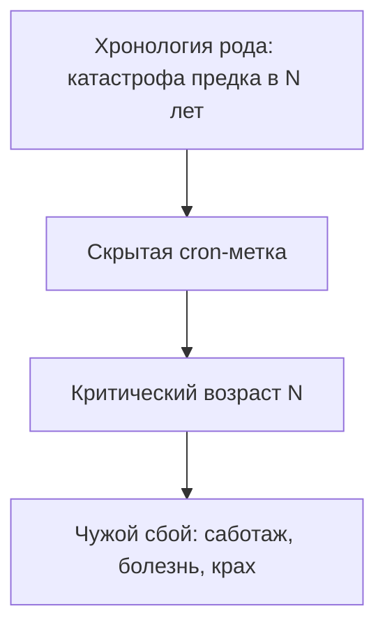

# Замещение

Всё шло. Карьера. План. Здоровье.

И вдруг — в год, когда тебе ровно столько, сколько было отцу в день ухода, — реальность сыпется. Бизнес. Тело. Отношения. Без видимой причины.

Списываешь на кризис. Усталость. Совпадение. Под этим — чужой будильник. Cron, о котором ты не знал.

**Баг замещения.** Процессор психики эмулирует погибшего или исключённого предка. Запускает чужие болезни, крахи, отчаяние по расписанию, сверенному с чужой хронологией.

> [!NOTE]
> В 1953 году Джозефина Хилгард из Стэнфорда описала «реакцию годовщины»: срыв, инфаркт, депрессия, госпитализация часто падают в тот же возраст или ту же дату, когда родитель или предок пережил катастрофу или погиб. Мюррей Боуэн добавил фигуру замещающего ребёнка: зачатый вскоре после утраты несёт эмоциональный груз умершего. Это скрытая cron-задача: не рассказ в голове, а метка в теле — «в 33 — разорение», «в 41 — инфаркт», «в 47 — онкология». Организм исполняет чужой скрипт, потому что две судьбы слились. Симптом не бьют напрямую. Аннулируют сторонний таймер: разводят пространства и времена.

`[Обнаружена скрытая cron-задача. Расшифровка…]`

---

## Как надевают чужой костюм

Редко по своей прихоти. Подмена случается, когда старшие не выдержали вакуум горя:

* **Братья и сёстры.** Ребёнок после смерти первенца, часто с тем же именем. Родители смотрят в глаза и ищут черты потерянного. Растёт ощущение: настоящего меня нет, я тень.
* **Погибшие родственники.** Дядя на войне или в расцвете. Племянник копирует жесты, голос, профессию. К роковой отметке — паника ожидания удара.
* **Исключённые партнёры.** Дочь занимает место первой невесты отца — муза родителя, и собственного союза нет.

Маркер — **синхронизация по возрасту**. У дублёра сбои ровно тогда, когда у замещаемого оборвалась жизнь. В тридцать три рушится компания, как у деда. В сорок два — удушье по картине материнского инфаркта. Система доигрывает чужой финал.

`[Синхронизация подтверждена. Подготовка отмены…]`

См. также: [«Пропущенный элемент»](/18-bug-02-missing-element), [«Чужой профиль»](/22-bug-06-identification).

---

## Зарисовка: чужие часы на дубовой полке

На массивной дубовой полке в кабинете Андрея всегда стояли карманные часы. Тусклое золото. Треснувшая эмаль. Стрелки навечно в 16:42.

Часы дяди Андрея — маминого старшего брата. Инженер-мостостроитель. Гордость семьи. Погиб в автокатастрофе в тридцать три. На скользком осеннем мосту. Ровно в 16:42.

Через два года родился Андрей-младший.

— Вылитый Андрюшенька, — роняла мать над колыбелью сухими глазами. — Пальцы тонкие. Ямочка. Взгляд серьёзный. Ты закончишь то, что он не успел.

Рос послушным. Игрушки по местам. Геометрические схемы. Строительный институт без возражений. Под послушанием — свинцовая тоска. Драповое пальто на великана: полы волочатся, воротник трёт шею, плечи ноют. Победы на олимпиадах и тендеры бюро радости не давали. Внутри: «Не моё. Праздник на чужих поминках».

Кошмар начался за три месяца до тридцать третьего дня рождения.

Проснулся ночью в холодном поту. На груди — плита. Сердце с перебоями. Пульс за сто тридцать. Горло — ледяная удавка. Три клиники: миокард чист, сосуды в норме. «Вегетативный криз».

Потом посыпалось. Партнёры отозвали гарантии по мостовому контракту. Бухгалтерия заблокировала счета. В офисе воздух густел, как кисель. Cron отсчитывал дни до 16:42 тридцать третьего года.

За неделю до даты — пустой ночной кабинет. За окном осенний дождь, как в день гибели дяди. На полке тикали невидимые секунды чужого краха.

Взял тяжёлые золотые часы. Прижал к грудине. Под рёбрами стянуло дыхание.

— Дядя Андрей… Я тридцать три года жил вместо тебя. Строил твои мосты. Носил твоё имя, манеры, незавершённые чертежи. Думал: умру в тридцать три — мама перестанет плакать у окна.

Горячий ком в горле. На колени на паркет. Холодный металл в кулаке.

— Твоя смерть — только твоя. Скользкий мост — твоя судьба. Я не дублёр. Не продолжение оборванной пьесы. Я племянник. Моё время — другое. Моя жизнь — моя.

Слёзы хлынули. Не страх. Тело, с которого впервые за три десятилетия сняли удавку.

В груди глухой щелчок. Диафрагма отпустила. Воздух в низ лёгких — чистый, прохладный.

Аккуратно положил часы на полку рядом с фотографией. Поклонился. Шаг назад.

Через неделю — тридцать четыре. Утро без привычной тревоги. Плотное присутствие в стопах. Его часы пошли своим ходом.

`[Таймер предка отключён. Суверенное расписание]`

---

## Практика: чужой таймер

Если бежишь по чужому кругу или перед знаковой датой подступает страх катастрофы:

1. **Сверка логов.** Свои срывы, симптомы, кризисы — рядом с хронологией предков. Возраст разорения, развода, болезни, гибели.
2. **Костюм в теле.** Где чужая тяжесть? Плита на плечах. Кол между лопатками. Онемение лица.
3. **Выход из роли.** Перед собой — тот, чью судьбу доигрывают. Внимание в дыхании и стопах. Спокойно:
   > «Признаю тебя и твоё место. Твоя судьба, финал и боль — твоего времени. Носил твой костюм из детской преданности, надеясь исцелить память семьи. Сегодня роль заканчиваю. Возвращаю имя, победы и трагедии. Ты — старший, я — младший. Остаюсь в своём времени. Моё расписание — моё».
4. **Шаг.** Назад или в сторону. Образ и чужие часы — в прошлом. Смотри, как меняется глубина дыхания и опора в ногах.

Жизнь набирает силу под собственным именем и в собственном времени.

---

> [!IMPORTANT]
> **Закон главы**
> Жизнь за погибшего превращает реальность в эхо чужого краха; верни судьбу владельцу — и аварийный таймер гаснет.
