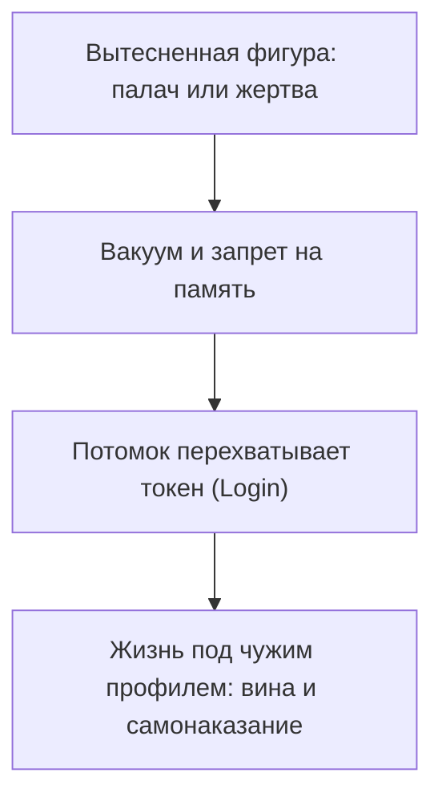

# Чужой профиль

Бывает стыд в момент успеха — странный, без адреса.

Контракт подписан. Гонорар на счёте. Зал аплодирует. А на плечи ложится тяжесть. Будто деньги украдены. Будто права на удачу нет.

Перебираешь недели. Ищешь вину. Не находишь.

Чутьё верное: чувство чужое. Ты годами платишь по кредиту на чужое имя.

---

## Быль: чужой profile

В этой семье одно имя было под табу. Сквозило комнатами, как холод из подвала. Все чувствовали. Вслух — ни звука. Однажды глухой осенней ночью бабушка обронила фразу соседке, думая, что маленький Дима спит. В тридцатые прадед служил следователем в аппарате госбезопасности — там росчерком объявляли врагом народа и отправляли на полигон. Где его кости — не знал никто. Знать не хотели.

Дмитрий родился через полвека. Мальчик чуткий: шмеля накрывал банкой и выпускал в форточку. Каждое утро — удушающий плащ на плечах. Форма осязаемая: серая чекистская шинель не по мерке, приросшая к коже.

Стыдно было зарабатывать: чистые гонорары за программы пахли чужой бедой. Стыдно радоваться весне — будто улыбка топчет свежее погребение. Стоило почувствовать полноту жизни — спазм диафрагмы и тяга пасть на колени, вымаливая прощение за сам вдох.

Семья вымарала прадеда из книги, спасаясь от позора. Память сети ластиков не знает. Вычеркнутая боль ищет контейнер. Вина палача легла на самого тонкого потомка. Он, не сознавая, **залогинился под чужим профилем** — согласился нести то, от чего отшатнулись остальные.

Видел его не во сне — на грани сна и яви: кожаная фуражка, кобура, тёмные пятна на рукавах френча. Правая рука деревенела, будто сжимала перо смертного приговора: *«Это моя вина. Должен искупить страданием»*.

---

Стоп.

Опусти глаза. Посмотри на ладони, Дмитрий. Кровь невинных?

Нет. Мозоли от клавиш ноутбука. Ты проектируешь базы данных. Платишь налоги. Руки чисты. Ты родился в другую эпоху. Чужая вина должна остаться в своём времени.

На сессии Дмитрий сидел на краю стула. Лицо белое. Держится за горло:

— Не могу дышать полной грудью. Кажется: сделаю глубокий вдох — арестуют.

— Посмотри перед собой, — сказал терапевт. — Поставь офицера в кожаной тужурке. Он старше на три поколения. В глаза.

Дмитрий молчал, слушая пульс в висках. Потом — медленно, через ком в гортани:

— Прадед. Я вижу тебя. Вижу списки, жестокость, преступление. Твоё время. Твой выбор. Вина — только твоя. Я правнук, рождённый в свободное время. Мои руки тех бумаг не подписывали. Моё сердце той ненависти не знало. Оставляю вину и возмездие тебе, в твоём тридцать седьмом. Выхожу из твоей учётной записи навсегда.

Тишина.

Серый плащ сорвался с плеч с глухим звоном. Не метафора: лопатки расправились с хрустом, в онемевшие пальцы хлынула горячая кровь.

Его вытащили из бетона, в котором он бежал тридцать лет. Слёзы — облегчение человека, с которого сняли чужие кандалы.

---

Через неделю — кафе на набережной. Утреннее солнце. Самый дорогой сет и кофе, который раньше казался кощунством. Пил не торопясь. Речные блики. Без оправданий перед призраками. Без желания раствориться.

Система вернулась в собственный профиль.

`[Logout из чужой учётки выполнен]`

См. также: [«Унаследованные данные»](/12-inherited-data), [«Замещение»](/21-bug-04-substitution).

---

## Архитектура захвата

Этот баг маскируется под характер, темперамент, «высокую совесть». Человек считает фоновую вину своей нравственностью — и не видит: совесть принадлежит палачу или жертве из другой эпохи.

> [!NOTE]
> В 1936 году Анна Фрейд описала идентификацию с агрессором; Шандор Ференци исследовал то же как ответ на травму и беспомощность. Когда в семье фигура насилия или государственного преступления, родственники стирают её из рассказа. Феноменология связей показывает иное: потомки бессознательно восстанавливают цепь, отождествляясь с отвергнутым. Эмоциональный слепок надевается как своя идентичность. В вычислительных терминах — перехват сессионного токена: задачи идут от имени чужого администратора или осуждённого. Личный профиль блокирован. Ресурс уходит на чужой исторический процесс. Освобождает не рационализация, а разделение субъектов и возврат ответственности первоисточнику.

Легко спутать с соседями.

При **замещении** ты играешь роль вместо другого — костюм на сцене. При **унаследованном чувстве** несёшь чужую тяжесть, но остаёшься собой и знаешь: она со стороны.

При **чужом профиле** границы стираются. Ты не несёшь его вину — ты становишься им. Сессия общая. Управляешь не ты.

Два типа узлов:

1. **С виновником.** Предок насиловал, раскулачивал, бросал детей, наживался на горе. Потомок уничтожает доходы: «Не вправе процветать, пока те в земле».
2. **С жертвой.** Члена семьи уничтожили. Потомок запрещает себе успех: «Их нищета — моё богатство было бы предательством».

Маркер — **чувство рока**.

Живёшь как герой чужой трагедии. Внутри вина без твоего поступка. Ты честный и добрый — а за спиной кровавый шлейф. Успех или простое счастье — и фон коротко: не положено.

`[Диагностика: несанкционированный доступ]`

---

## Практика: Logout

Если внутри глухая вина за собственное благополучие:

1. **Рок.** В момент триумфа — паника? Желание извиниться, спрятаться, раздать деньги первому встречному?
2. **Владелец учётки.** В тишине: *«Чью вину оплачиваю? Кто в роду был палачом, предателем или растерзанной жертвой, о ком молчат?»* Тело ответит холодным спазмом вдоль позвоночника.
3. **Выход.** Предок перед собой на дистанции. Ступни в пол. Плечи. Вслух:
   > «Я вижу тебя, твоё имя и судьбу. Знаю о поступках и цене. Долгие годы был залогинен под твоим профилем из преданности крови. Сегодня вижу границу: твои решения и ответственность — твоего времени. Снимаю вину и возвращаю тебе. Мои руки чисты. Совесть — моих дел. Завершаю сессию. Выхожу из твоей учётной записи. Моя жизнь — моя».
4. **Калибровка.** Плечи опадают. Лицо и шея мягче. Медленный вдох в низ живота.

Корни питают дерево. Крона у каждого побега своя. Выйди из чужого профиля — и открой доступ под своим именем.

---

> [!IMPORTANT]
> **Закон главы**
> Logout из чужой учётки прекращает оплату чужих преступлений и возвращает право на своё дыхание и достаток.
