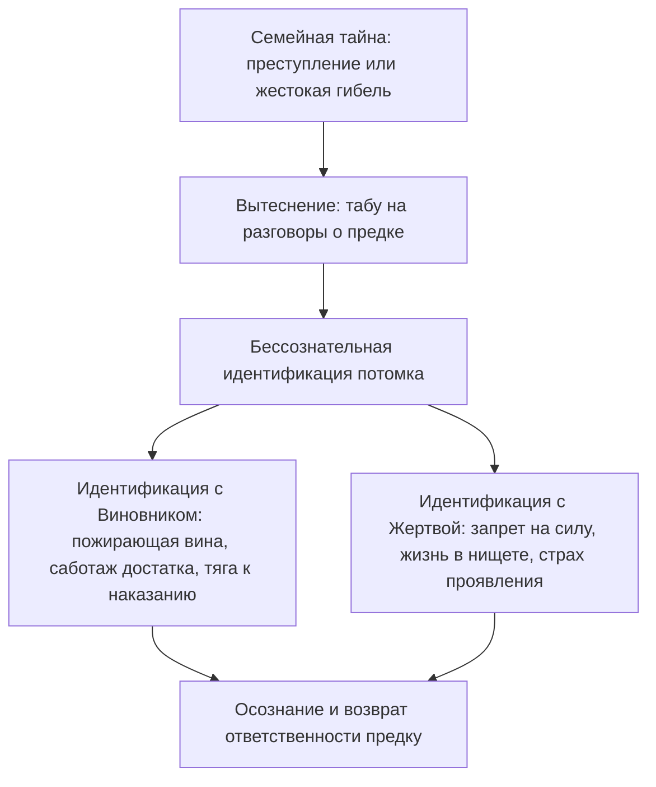

# Чужая вина: когда ты носишь шинель предка

Бывает ли с тобой так, что в моменты самого яркого жизненного успеха тебя внезапно накрывает темная, удушливая волна стыда?

Крупная сделка закрыта. Деньги честно поступили на банковский счет. Коллеги искренне поздравляют, а близкие гордятся твоими достижениями. Но вместо радости и законного торжества на плечи опускается неподъемный свинцовый груз. 

Внутри рождается парализующее чувство: эти деньги словно украдены у сирот. Ты не имеешь права на эту квартиру, на этот красивый отпуск, на саму эту счастливую жизнь. Кажется, что за дверью уже стоят строгие люди в черных шинелях, готовые разоблачить тебя и отправить на каторгу.

Ты лихорадочно перебираешь свои поступки за последние месяцы. Ищешь, кого ты мог случайно обидеть, где слукавил, какую ошибку совершил. И не находишь ровным счетом ничего.

Твое чутье тебя не обманывает: это чувство действительно не принадлежит тебе.

Ты годами расплачиваешься по чужому кровавому кредиту. В твоем подсознании произошла глубокая **идентификация с семейной виной**.

---

## Тайна запертого шкафа

В семье Дмитрия одно имя было под строжайшим табу. Это молчание сквозило по комнатам старой профессорской квартиры, как ледяной сквозняк из сырого подвала. Все взрослые знали тайну, но при детях не произносили ни звука.

Лишь однажды, глухой ноябрьской ночью, семилетний Дима сквозь сон услышал, как бабушка на кухне со слезами шептала соседке страшную правду.

В конце тридцатых годов родной прадед Димы служил следователем в аппарате НКВД. Одним росчерком пера он отправлял людей на расстрельные полигоны или на медленную гибель в заполярные лагеря. А в сороковом году машина перемолола и его самого: ночной арест, скорый приговор и безымянная братская могила, место которой никто в семье не знал. И знать не хотел.

Семья вымарала память о прадеде, спасаясь от позора и страха репрессий. Его лицо вырезали со всех фотографий.

Дмитрий родился спустя полвека. Он рос удивительно тонким, мягким и сострадательным мальчиком: случайно залетевшего в комнату шмеля он бережно накрывал стеклянной банкой, подсовывал листок бумаги и с замиранием сердца выпускал в форточку на волю. Он физически не переносил насилия.

И при этом каждое утро он просыпался с ощущением, что на его худые детские плечи наброшена тяжелая, заскорузлая от чужой крови чекистская шинель. 

Шинель была не по размеру. Она душила, натирала шею до язв и буквально приросла к телу.

Став взрослым программистом и архитектором баз данных, Дмитрий жил в постоянном аду:
- Честно заработанные гонорары пахли чужой бедой. Он спешил раздать их друзьям или спустить на благотворительность, оставляя себе копейки на гречку.
- Радоваться весеннему солнцу или смеяться в компании казалось кощунством: словно его улыбка топчет свежие могилы безвинно погибших людей.
- Стоило ему встретить любящую женщину, как под ребрами возникал жесткий спазм и непреодолимое желание упасть на колени, вымаливая прощение за сам факт своего существования.

Память рода не знает ластиков. Семья вычеркнула палача, но колоссальный долг вины остался висеть в воздухе. И психика выбрала самого чувствительного, самого бескорыстного потомка в качестве искупительной жертвы. Дмитрий, сам того не осознавая, надел на себя вину прадеда и тридцать лет отбывал за него посмертное наказание.

На сессии Дмитрий сидел на краешке кресла. Пальцы судорожно сжимали воротник свитера, губы дрожали:

— Я не могу сделать вдох полной грудью. Мне всё время кажется: стоит мне расправить плечи и вздохнуть глубоко — в дверь постучат прикладом и арестуют.

> **Терапевт:** Опусти глаза. Посмотри на свои ладони, Дима. Внимательно посмотри. Там есть кровь невинных людей?
>
> **Дима:** *(смотрит на свои руки; по щекам текут слезы)* Нет… На пальцах мозоли от клавиатуры. Я пишу код. Я плачу налоги. Я никого в жизни пальцем не тронул.
>
> **Терапевт:** Поставь образ прадеда перед собой. Офицер госбезопасности тридцать седьмого года в кожаной тужурке. Посмотри ему прямо в глаза. Скажи то, что должно быть сказано:
>
> **Дима:** Прадед… Я вижу тебя. Я знаю о твоих расстрельных списках, о твоей жестокости и твоих преступлениях. Но это было твое время. И это был твой личный выбор. Вся вина за содеянное принадлежит только тебе. Я твой правнук, рожденный в свободную эпоху. Мои руки не подписывали смертных приговоров. Мое сердце не знало твоей слепой ненависти. С глубокой скорбью о погибших я оставляю твою вину, твой тридцать седьмой год и твой ответ перед Богом тебе. Я снимаю с себя твою шинель. Я выхожу из твоей судьбы навсегда.

В комнате повисла благоговейная тишина.

И в этот миг Дмитрий почувствовал, как невидимая серые латы со звоном сорвались с его спины. Лопатки с легким хрустом расправились. В онемевшие, холодные пальцы хлынула горячая, пульсирующая кровь.

Он плакал двадцать минут — навзрыд, уткнувшись лицом в ладони. Это были слезы узника, с которого после пожизненного заключения наконец-то сбили ржавые кандалы.

Спустя две недели Дмитрий сидел за столиком уличного кафе на набережной. Светило теплое весеннее солнце. Перед ним стоял лучший колумбийский кофе и свежая выпечка. Он пил маленькими глотками, смотрел на золотые блики на воде и чувствовал: мир больше не требует от него искупления. 

Его руки были чисты. Его жизнь принадлежала только ему.

---

> [!NOTE]
> В 1936 году Анна Фрейд в работе «Эго и механизмы защиты» впервые подробно исследовала феномен бессознательной идентификации. Позже выдающийся психоаналитик Шандор Ференци показал, как травма насилия расщепляет психику ребенка, заставляя его вбирать в себя черты агрессора, чтобы хоть как-то справиться с непереносимым ужасом беспомощности.
> 
> В контексте трансгенерационной психологии этот механизм проявляется с особенной силой. Когда в семейной истории есть фигура палача (чекиста, надсмотрщика, предателя, домашнего тирана) или фигура растерзанной невинной жертвы, семья стремится поскорее забыть кошмар. 
> 
> Но вытесненный эмоциональный заряд никуда не исчезает. Потомки в третьем или четвертом колене бессознательно восстанавливают нарушенный баланс, отождествляясь либо с преступником (и тогда человека пожирает беспричинная вина и тяга к самонаказанию), либо с жертвой (запрет на деньги, безопасность и счастье). 
> 
> Освобождение наступает лишь тогда, когда границы личностей восстанавливаются: потомок твердо возвращает историческую ответственность тому предку, который совершил деяние.

---

## Два типа ложной идентификации

### 1. Слияние с Виновником
Предок совершил преступление, нажился на чужом горе или бросил беспомощных детей. Потомок бессознательно саботирует собственную жизнь: разоряется, отказывается от признания, разрушает здоровье. Внутри живет негласная клятва: *«Я не имею права процветать, пока жертвы моего предка лежат в земле»*.

### 2. Слияние с Жертвой
Члена семьи безжалостно раскулачили, репрессировали или уничтожили. Потомок бессознательно воспроизводит его судьбу: живет на грани выживания, прячется от внимания властей, боится любого проявления силы. Для него успех ощущается как предательство памяти замученных родственников.

---

## Практика: возвращение чужой вины

Если ты ловишь себя на необъяснимом чувстве вины за собственный достаток или страхе быть наказанным за свои успехи, выполни эту практику разделения:

### 1. Выяви чувство рока
Вспомни момент своего триумфа: получение крупной суммы, повышение по службе, покупка красивой вещи. 
Появляется ли в этот миг желание срочно спрятаться, извиниться, заболеть или спустить все деньги? Зафиксируй этот телесный маркер.

### 2. Задай вопрос предкам
Положи ладонь на солнечное сплетение. Сделай медленный выдох и спроси себя:
- *«Чью вину я сейчас пытаюсь искупить?»*
- *«Кто в моем роду был палачом, предателем или разрушителем, о котором все молчат?»*
- *«Чья невинно пролитая кровь или позор стоят за моим страхом благополучия?»*

### 3. Слова освобождения
Представь перед собой того предка, чей груз ты нес на своих плечах. Почувствуй твердую опору стоп на полу, расправь плечи и произнеси вслух:

> *«Я вижу тебя. Я знаю правду о твоих поступках, о твоем времени и о твоей вине. Долгие годы я носил твою шинель из слепой детской преданности нашему роду. Но сегодня я провожу черту. Твои преступления, твой выбор и твой ответ перед вечностью принадлежат только тебе. Я с глубоким почтением к жертвам оставляю твой грех в твоем времени. Мои руки чисты. Моя совесть чиста. Я выхожу из твоей тени. Моя жизнь принадлежит мне».*

### 4. Вдох свободы
Почувствуй, как с плеч падает невидимый плащ чужого позора. Сделай полный, свободный вдох в самый низ живота. Посмотри на свои ладони: это твои руки. Они созданы для созидания, любви и радости в сегодняшнем дне.

---

> [!IMPORTANT]
> **Главная мысль главы**  
> Чужая вина не делает тебя благородным: она лишь крадет твою жизнь. Возвращая грех предку, ты проявляешь высшую справедливость к живым и мертвым.

---

> [!TIP]
> **Интерактивный помощник**  
> Если слова разделения с предком вызвали дрожь в руках или холод вдоль позвоночника — напиши об этом в диалоговом окне внизу страницы. Мы поможем бережно завершить процесс и ощутить чистоту своего настоящего «Я».
