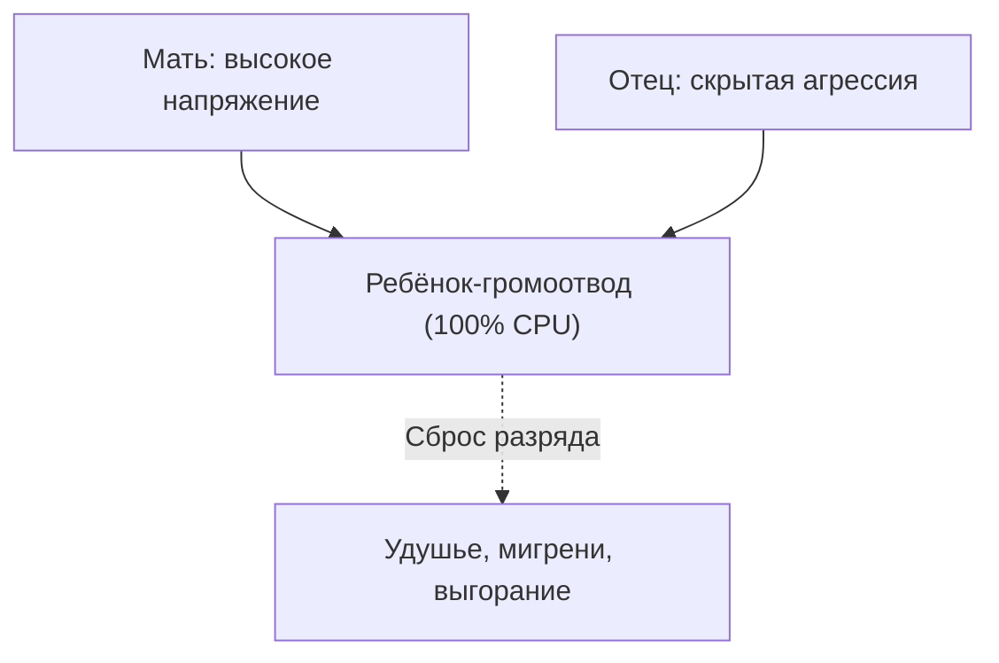

# Триангуляция

Каждый вечер перед своей дверью замираешь. Тело гудит, как трансформаторная будка. Затылок стянут. Дышишь коротко.

Не усталость. Весь день ты — заземление: принимаешь разряды между людьми, которые не говорят друг с другом напрямую.

Когда наступает тишина — не легче. Страшнее. Ком. Пустота. Без чужого напряжения, которое надо гасить, ощущение, что ты есть, куда-то девается.

---

## Трагедия: провод, который не просил тока

Анне тридцать два. HR в крупной компании. Порядок в документах. Внимательный муж. Со стороны — эталон.

В офисе — штатный громоотвод. Столкновения отделов, интриги директоров, обиды акционеров стекаются к её столу. Она тушит. Переводит ультиматумы. Сглаживает.

Платит своими проектами в архиве и мигренями. На «чего ты сама хочешь?» — пустая ошибка.

На сессию пришла с фразой: «Выгорела до пепла. Остановлюсь на секунду — мир разнесёт».

— Встань посреди комнаты, — сказал терапевт. — Сумку опусти. Глаза закрой. Поза, которую тело выбирает само.

Десять секунд. Руки медленно поплыли в стороны. Левая — на запад, правая — на восток. Плечи к мочкам. Шея камнем. Грудь на полувыдохе. Пальцы сжали два невидимых кабеля под напряжением.

— Что сейчас?

Губы посинели. Слёзы. Голос тонкий — голос испуганной девочки:

— Держу их… Разомкну хоть на миллиметр — убьют друг друга.

«Ими» были родители.

Тридцать лет позиционной войны. Не разводились «ради ребёнка». Жизнь дочери — полигон. С семи мать делала из Ани доверенное лицо: ночами рыдала в плечо о жестокости отца. Отец в гараже глухо: «Ты единственная чистая душа в этом доме». Маленькая Аня — на границе двух миров, растянутая.

Детский организм нашёл способ остановить бойню — собственное тело. Стоило родителям достать чемоданы — у семилетней астматический спазм, синюшность, реанимация. Врачи кололи эуфиллин. Перепуганные отец и мать смыкали ряды над постелью.

Скрипт: *«Чтобы семья не распалась, я обязана сгорать между ними»*. Десятилетия спустя астму сменила вегетативная буря. Родителей — токсичные коллеги. Программа честно жгла проводку взрослой женщины.

---

## Архитектура триангуляции

> [!NOTE]
> В 1970-х Сальвадор Минухин описал триангуляцию: в нестабильной диаде, где двое взрослых не выдерживают прямой конфликт, напряжение сбрасывают на третьего — чаще на самого чувствительного ребёнка. Мюррей Боуэн показал: чем выше родительская тревога, тем сильнее соматизация. Ребёнок заболевает астмой, колитом, паническими атаками — и даёт повод объединиться вокруг спасения. В сети это паразитный маршрутизатор: трафик между двумя серверами гонят через слабый узел. CPU на 100%. Своих задач нет. Выход — вернуть взрослым прямую адресацию.

Три частых формы:

* **Буфер.** Ссоры над головой — он берёт огонь на себя болезнью, оценками, поведением.
* **Почтальон.** *«Передай матери…»*, *«Скажи отцу…»* — прямой контакт между взрослыми мёртв.
* **Суррогатный партнёр.** Один родитель делает ребёнка главным конфидентом. Детства нет.

Взрослым платишь собой. Не различаешь, чего хочешь. Собираешь треугольники и выбираешь тех, кого надо от кого-то спасать.

`[Подтверждён режим паразитного буфера]`

См. также: [«Лишний элемент»](/17-bug-01-extra-element), [«Режим наблюдателя»](/05-observer-mode).

---

## Размыкание контура

Терапевт подошёл ближе. Пальцы Анны побелели.

— Глубокий вдох через сжатое горло. Ногами — широкий шаг в сторону. Выйди из середины.

Анна качнулась. Ступни оторвались от паркета с усилием. Шаг влево на метр.

Руки, потеряв опору чужих проводов, рухнули вдоль тела.

— Посмотри туда, где стояла. Пустое между отцом и матерью. Скажи обоим:

Из горла хрип — как воздух из пробитого баллона:

— Мама… Папа… Ваш брак и ваша война — ваши. Тридцать лет держала этот огонь лёгкими, чтобы вы не убили друг друга. Брала ток из детской любви. Ноша больше человеческих сил. Вы — взрослые. Отношения — ваша доля. Возвращаю напряжение вам. Выхожу из буфера. Моё место — не между вами. Я просто ваш ребёнок.

Слёзы горячие, без зажима. Диафрагма, закрытая с семи лет, опустилась. Воздух до рёберных дуг.

Через месяц — короткое письмо:

> «На совете два вице-президента начали привычную травлю, тащили меня в середину. Раньше потемнело бы в глазах. В этот раз внутри тишина. Я сказала: "Коллеги, спор в плоскости ваших полномочий, договоритесь напрямую". Вышла пить чай. Голова не болела. Впервые не нужно никого спасать, чтобы дышать».

`[Цепь разомкнута. Буфер деактивирован]`

---

## Практика: выход из чужой войны

Если тело помнит удержание баланса между полюсами:

1. **Тест.** Посреди комнаты. Слева — мать, справа — отец (или два руководителя). Плечи вверх? Шея камнем? Кулаки?
2. **Шаг.** Физически в сторону. Стопы на нейтральную поверхность.
3. **Манифест.** Глядя на точку былого напряжения:
   > «Ваш конфликт — вашей паре. Ваша боль — ваш опыт. Годами держала чужое напряжение из детской любви. Этот ток разрушителен для меня. Возвращаю вам право разбираться напрямую. Вы — большие. Снимите с меня громоотвод, буфер и миротворца. Выхожу из середины. Энергия — в моё русло. Я просто ваш ребёнок».
4. **Дыхание.** Ладонь на солнечное сплетение. Вдох на четыре. Выдох на шесть. Заметь: необходимость быть начеку слабеет.

Пусть высоковольтные провода замыкаются напрямую. Чужая гроза пройдёт без тебя. Освободившийся ресурс вернётся на твои задачи.

---

> [!IMPORTANT]
> **Закон главы**
> Выход из середины чужой войны отключает аварийное заземление и возвращает право тратить жизнь на свою жизнь.

> [!TIP]
> **Живой AI-психолог**
> Если выход из треугольника вызывает вину — открой чат на сайте (иконка внизу страницы) и восстанови границы в сопровождении.
