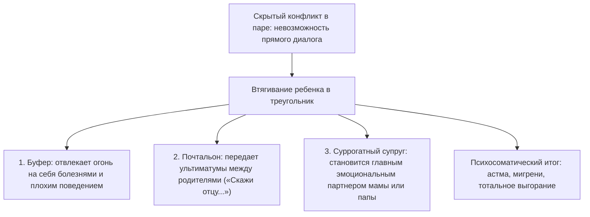

# Триангуляция: когда ребёнок становится громоотводом

Бывает так, что каждый вечер перед дверью собственной квартиры ты замираешь в странном оцепенении. 

Твое тело буквально гудит, как перегруженная трансформаторная будка во время грозы. В затылке пульсирует раскаленная боль, дыхание становится частым и поверхностным, а плечи подняты почти к самым ушам.

Это не просто физическая усталость после напряженного рабочего дня. 

Весь день ты работал живым заземлением: принимал на себя электрические разряды между людьми, которые патологически не умеют говорить друг с другом напрямую. Ты сглаживал чужие ультиматумы, переводил ядовитые реплики начальников в дипломатическое русло, гасил истерики коллег и держал на своих плечах шаткий мир в чужом коллективе.

Но самое страшное наступает тогда, когда в доме наконец воцаряется абсолютная тишина.

Вместо долгожданного покоя на тебя обрушивается ледяная паника. Под ребрами разверзается сосущая пустота. Без привычного чужого напряжения, которое нужно ежесекундно гасить собой, у тебя возникает ощущение, будто ты вообще исчезаешь из этого мира.

В системной психотерапии это состояние называют **триангуляцией**.

Когда двое взрослых людей не способны выдержать напряжение прямого конфликта, они бессознательно втягивают в свои отношения третьего — самого слабого, чуткого и любящего. Ребенок становится громоотводом, принимающим на себя смертоносный разряд родительской ненависти.

---

> [!NOTE]
> В 1970-х годах выдающийся семейный терапевт Сальвадор Минухин ввел в клиническую практику понятие **триангуляции** как патологического способа регуляции супружеского напряжения. 
> 
> Когда эмоциональная диада (муж и жена) оказывается нестабильной, супруги вместо открытого выяснения отношений сбрасывают тревогу на третьего участника — своего ребенка. Ребенок превращается в буфер, смягчающий удары между родителями.
> 
> Другой классик семейной теории, Мюррей Боуэн, подробно описал психосоматическую цену триангуляции: чем выше скрытая тревога и взаимная враждебность между родителями, тем сильнее ребенок соматизирует эту боль. У детей развиваются тяжелые хронические заболевания — бронхиальная астма, язвенный колит, приступы удушья, псориаз, внезапные обмороки. Болезнь ребенка выполняет спасительную для семьи функцию: испуганные родители немедленно прекращают ссору и объединяются у постели больного. 
> 
> Ребенок платит собственным здоровьем за то, чтобы сохранить семью от катастрофического распада. Став взрослым, такой человек бессознательно переносит эту модель на работу и дружбу, становясь вечным спасателем и громоотводом в любых конфликтах.

---

## Руки, держащие высоковольтный кабель

Тридцатидвухлетняя Анна руководила департаментом по управлению персоналом в крупном производственном холдинге. Внешне ее жизнь выглядела безупречно: строгие стильные платья, идеальный порядок в отчетах, заботливый муж, уютная квартира.

Но в компании Анна была штатным громоотводом.

Свирепые столкновения между вице-президентами, интриги акционеров, застарелая вражда между производством и продажами — все ядовитые потоки корпоративной ненависти неизменно стекались к ее рабочему столу. Анна часами выслушивала чужие обиды, сглаживала острые углы, гасила готовые взорваться скандалы.

Она расплачивалась за это жестокими мигренями, бессонницей и полной потерей собственных желаний. Стоило спросить ее: «Аня, а чего хочешь лично ты?», как ее взгляд становился абсолютно пустым.

На терапевтическую сессию Анна пришла с фразой, в которой слышалось предельное отчаяние:

— Я выгорела дотла. Моя нервная система похожа на обугленный провод. Но я не могу остановиться: мне кажется, что стоит мне отпустить контроль хотя бы на минуту — и весь мой мир разорвет в клочья.

> **Терапевт:** Аня, встань посреди кабинета. Поставь сумку на пол, закрой глаза. Позволь своему телу самопроизвольно принять ту позу, которая ярче всего отражает твое внутреннее состояние прямо сейчас.

Прошло десять секунд. И вдруг руки Анны медленно, словно преодолевая невидимое сопротивление воды, поплыли в разные стороны.

Левая рука вытянулась строго на запад, правая — на восток. Плечи поднялись к мочкам ушей, шея окаменела, грудная клетка застыла на судорожном полувыдохе. Пальцы сжались в кулаки с такой силой, будто они держали два оголенных высоковольтных провода.

> **Терапевт:** Что ты чувствуешь прямо сейчас? Что происходит в твоем теле?
>
> **Аня:** *(ее губы синеют, по щекам катятся крупные слезы, а голос срывается на тонкий, дрожащий плач испуганного ребенка)* Я держу их… Я держу их изо всех последних сил. Если я разомкну руки хотя бы на миллиметр — они бросятся друг на друга и убьют…

«Ими» были ее родные родители.

Тридцать лет они вели глухую, позиционную, жестокую войну на уничтожение. Они принципиально не разводились — под лицемерным лозунгом: «Мы терпим этот ад исключительно ради счастья нашей девочки». 

И детство девочки превратилось в бесконечный полигон. С семи лет мать делала из Ани своего главного доверенного поверенного: рыдала по ночам ей в плечо, рассказывая о жестокости и изменах отца. Отец запирался с Аней в гараже и глухо ронял: «Ты — единственная чистая душа в этом проклятом доме». 

Маленькая Аня стояла на нейтральной полосе под перекрестным огнем двух самых дорогих людей на свете.

Ее детский организм нашел единственный способ остановить кровавую бойню: собственное тело. Стоило родителям начать кричать и доставать чемоданы для развода, как у семилетней девочки развивался жесточайший приступ бронхиальной астмы. Она начинала синеть и задыхаться. Приезжала скорая, врачи кололи эуфиллин, а насмерть перепуганные отец и мать смыкали руки над постелью задыхающегося ребенка.

В подсознании запечаталась команда: *«Чтобы мои родители не поубивали друг друга, я обязана сгорать между ними»*.

Прошли десятилетия. Детскую астму сменили хронические спазмы сосудов и мигрени. Место родителей заняли токсичные топ-менеджеры. Но взрослая, успешная женщина продолжала день за днем отдавать свое здоровье, оставаясь аварийным заземлением для чужой войны.

---

## Шаг в сторону: размыкание смертельного контура

Терапевт подошел ближе. Пальцы Анны побелели от чудовищного напряжения.

> **Терапевт:** Аня, сделай глубокий вдох через сжатое горло. А теперь своими ногами сделай один широкий, уверенный шаг влево. Сделай шаг в сторону и выйди из середины.

Анна покачнулась. Казалось, ее подошвы были намертво приварены к полу. Но она сделала усилие — и переступила на метр вбок.

В ту же секунду ее руки, потеряв опору невидимых кабелей, бессильно рухнули вдоль тела.

> **Терапевт:** Посмотри туда, где ты только что стояла. Посмотри на то пустое пространство между отцом и матерью. Скажи им правду:
>
> **Аня:** *(из ее груди вырывается хрип — как воздух из пробитого спасательного жилета)* Мама… Папа… Ваш брак, ваша ненависть и ваша война принадлежат только вам. Тридцать лет я держала этот огонь своими детскими легкими, чтобы вы не уничтожили друг друга. Я брала этот смертельный ток на себя из огромной любви к вам. Но эта ноша превышает человеческие силы. Вы — взрослые. Ваши отношения — это ваша ответственность. Я возвращаю вам ваше напряжение. Я выхожу из роли громоотвода. Мое место — не между вами. Я просто ваш ребенок.

Слезы полились ручьем — горячие, свободные, смывающие многолетний ужас. 

Диафрагма, спазмированная с семилетнего возраста, с мягким выдохом опустилась вниз. Чистый, живительный воздух впервые в жизни наполнил легкие Анны до самых реберных дуг.

Спустя месяц Анна прислала теплое сообщение:

> *«Вчера на совете директоров два наших главных вице-президента начали привычную травлю, пытаясь втянуть меня в середину своего конфликта и заставить принять чью-то сторону. Раньше у меня от этого потемнело бы в глазах и начался приступ удушья.*
> 
> *Но в этот раз внутри меня стояла абсолютная, звенящая тишина. Я спокойно посмотрела на них и сказала: "Коллеги, этот спор лежит исключительно в плоскости ваших полномочий. Пожалуйста, договоритесь напрямую". Встала и пошла на кухню пить травяной чай.*
> 
> *У меня даже голова не заболела. Оказывается, мне больше не нужно никого спасать ценой собственной жизни, чтобы просто дышать».*

---

## Три маски триангуляции

### 1. Ребенок-буфер
Когда градус агрессии в доме зашкаливает, ребенок бессознательно берет огонь на себя: начинает тяжело болеть, попадать в аварии, приносить двойки из школы. Родители переключаются со взаимной ненависти на спасение чада. Семья сохраняется, но цена этой стабильности — разрушенное здоровье ребенка.

### 2. Ребенок-почтальон
«Пойди скажи своему отцу, что он негодяй», «Передай матери, что денег я ей больше не дам». Ребенок превращается в кабель связи между взрослыми людьми, потерявшими человеческий контакт. Его собственная психика не выдерживает чужой злобы и разрушается.

### 3. Суррогатный партнер
Один из родителей, разочаровавшись в супруге, делает из ребенка своего главного конфидента. Дочь заменяет матери подругу и психотерапевта, сын становится для матери «главным мужчиной в жизни». Детство такого ребенка крадется без остатка.

---

## Практика: выход из чужого конфликта

Если ты ловишь себя на том, что постоянно тушишь чужие пожары и живешь с хроническим спазмом в шее и груди, выполни этот алгоритм выхода из треугольника:

### 1. Диагностика телом
Встань посреди комнаты. Представь слева от себя одного участника конфликта (например, мать или начальника), а справа — второго (отца или коллегу). 
Прислушайся к мышцам: поднялись ли плечи? Сжались ли кулаки? Перехватило ли дыхание?

### 2. Физический шаг в сторону
Сделай один осознанный, широкий шаг в сторону. Почувствуй, как твои ноги встают на нейтральную, свободную почву. Опусти руки.

### 3. Слова освобождения
Посмотри на пустое место между конфликтующими сторонами. Произнеси вслух спокойным и твердым голосом:

> *«Ваш спор и ваша вражда принадлежат вам. Я вижу ваше взаимное напряжение, но я больше не буду вашим заземлением. Долгие годы я держал этот огонь своим телом из слепой любви. Но этот ток разрушителен для меня. Вы — взрослые люди. Я возвращаю вам право разбираться между собой напрямую. Снимите с меня мантию громоотвода, миротворца и буфера. Я выхожу из середины. Моя жизнь принадлежит мне».*

### 4. Возвращение дыхания
Положи ладонь на центр грудины. Сделай глубокий вдох на четыре счета и протяжный, расслабляющий выдох на шесть счетов. Почувствуй, как уходит необходимость быть начеку.

Пусть чужие грозовые тучи проходят мимо. Твоя энергия наконец-то возвращается в русло твоей собственной судьбы.

---

> [!IMPORTANT]
> **Главная мысль главы**  
> Выход из чужой войны — это не предательство, а единственный способ сохранить себя. Когда громоотвод уходит, взрослые вынуждены встретиться лицом к лицу.

---

> [!TIP]
> **Интерактивный помощник**  
> Если выход из роли миротворца вызывает мучительное чувство вины перед родителями или коллегами — напиши в диалоговом окне внизу страницы. Мы поможем бережно отделить здоровую заботу от разрушительного самопожертвования.
