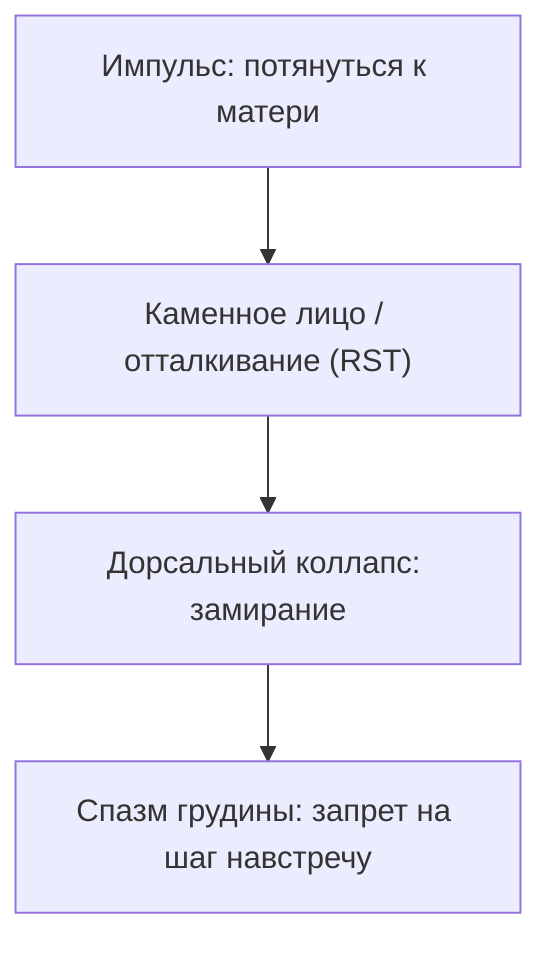

# Прерванное движение

---

## Быль: правильная девочка

Кристина с детства знала правило: быть незаметной, удобной, собранной.

В матери — железная дисциплина. Прямая спина. Голос без уязвимости. Не кричала. Отдавала короткие команды: «Поела — убери тарелку», «Плачешь — в свою комнату», «Соберись, не распускай нюни». Кристина собиралась. Идеальная дочь. Без хлопот.

В девять отец молча собрал чемодан и ушёл. Вещи исчезли из шкафа во вторник. Мать сухо: «Мы больше не живём вместе, закрыли тему». Имени его не произносила.

Кристина взяла эту прошивку: больно — стисни зубы, сотри слёзы, шагай.

---

Потом мамины попытки устроить жизнь.

Кристина считывала кожей: часы у зеркала в коридоре, чужие мужские голоса в трубке, выходные у бабушки «подышать воздухом». Детским чутьём знала: мама ищет тепло, которое дочь дать не может.

Поздний ноябрьский вечер. Тёмная кухня. Вода. Мать у окна на табурете. Лицо в ладонях. Плечи вздрагивают. Плачет беззвучно — вопреки броне.

Сердце девятилетней обожгло. Импульс: подбежать босиком, обвить шею, прижаться щекой к халату: «Мамочка, не плачь, я с тобой».

Кристина сделала шаг. И замерла.

Воздух стал толстым ледяным стеклом. Грудь свело. Мать смахнула слёзы тыльной стороной ладони и, не поворачиваясь, отчеканила:

— Ты чего застыла в темноте? Иди делай уроки.

Кристина на цыпочках ушла в комнату.

Сердце больше не рвалось вперёд. Система записала: *«Тянуться к тому, кого любишь, опасно. Там оттолкнут. Замри»*.

---

В двадцать три встретила Антона.

Тихий инженер. Рядом можно было не защищаться. Говорил мало. Держал слово. Молчал так, что тишина грела. Учился проговаривать чувства — неловко, бережно.

Поженились. Семь лет: поездки, книги, театр, уютная квартира. Идеальная гладь стала капканом.

На исходе седьмого года Антон сел напротив:

— Кристина, ты здесь, но тебя нет. На диване рядом. Чай. А сердце за бронированной дверью. За семь лет ты так и не дошла до меня.

Внутри каменело. Год у семейного психолога. Дневники. Домашние задания. Антон старался. Кристина старалась. Стеклянный купол не таял.

Развелись тихо. Закрыв за ним дверь, она поняла: ни разу не сделала настоящего шага из детской прихожей.

Личная терапия. Обиды. Холодность матери. Рассудком — до винтика. В теле — холодный булыжник в центре грудины.

---

Потом появился Жора.

Шумный системный инженер. Ворвался как ураган. Звонил среди дня. Обнимал без предупреждения. «Я люблю тебя» на третьей неделе — с лёгкостью открытого окна. В коде выщелкивал сбои за секунды и так же привык «чинить» людей.

После семи лет штиля с Антоном напор Жоры был цунами. Пугало до дрожи в коленях — и тянуло, как замерзающего к костру.

Сначала позволяла ему всё. Он шагал — она стояла. Он звонил — она отвечала. Он тянул — она не отстранялась. Казалось: можно быть неподвижной, и близость случится сама.

Потом проснулась глухая ярость.

Злилась, что годы терапии ничего не сдвинули. Срывалась — Жора включал щит. Лицо ровное. Голос снисходительный: «Спокойно. Не накручивай. Разберём по пунктам». Женская боль для него — аварийный баг. Надо пропатчить и закрыть тикет.

Ей не нужен был ремонт. Ей нужно было, чтобы её увидели — растерянной, колючей, плачущей — и не убежали за стену логики.

Жора чувствовал трещину. Читал статьи про привязанность. Ходил к психологу. Возвращался с терминами. Задавал выверенные вопросы. Кристина видела старание — и тошнило. Инструкция без присутствия — имитация. Он исследовал её как код. Она молчала за стеклом.

Финал в коридоре:

— Ты всё делаешь по правилам, Жора. Безупречный оператор. Меня в алгоритме нет. Я для тебя неисправность.

Он вспыхнул. Хлопнул дверью. Ушёл в ночь.

Кристина закрыла замок. Прислонилась к косяку. Сползла на пол. Внутри что-то рухнуло. Не Жора. Не Антон. Девятилетняя на ноябрьской кухне сделала шаг к плачущей матери — и замерла перед стеклом. С тех пор сердце всегда останавливалось у порога.

`[Заморозка импульса привязанности подтверждена]`

См. также: [«ROOT. Дорога к себе»](/01-root-access), [«Открытый порт»](/27-open-port-principle).

---

## Архитектура прерванного движения

> [!NOTE]
> В 1959 году Гарри Харлоу показал: детёнышу нужен не только корм — нужен тактильный контакт. Без тепла — оцепенение, аутоагрессия, потом неспособность к близости. Эдвард Троник в Гарварде через «Still Face» зафиксировал каскад: мать замирает каменным лицом — ребёнок после тщетных попыток падает в дорсальный вагусный коллапс: пульс вниз, гипотония, замирание. В сети это Handshake Timeout: клиент шлёт `SYN`, сервер молчит или рвёт `RST`. Повтори в уязвимое окно — порт блокируется. Драйвер цел. Пакеты тепла не проходят. Взрослый хочет любви, читает книги — и при сближении каменеет. Лечит не анализ. Физическое завершение жеста сближения в безопасности.

Три типичных сценария:

* **Больница без матери.** Часы плача — кора отключает крик. «Тихий удобный пациент». Звать на помощь больше нельзя.
* **Мать в трауре или послеродовом психозе.** Тело рядом. Сознание — нет. Младенец тянется к пустоте и замыкается.
* **Прямое отвержение.** «Не подходи», «глаза б мои не глядели», выталкивание за дверь при слезах. Панцирь на груди.

Взрослый искренне хочет любви. При малейшем сближении — дерево. Дыхание рвётся. Партнёр чувствует стену.

`[Блок грудного отдела подтверждён]`

---

## Сессия: Кристина

После разрыва с Жорой — сухие глаза, мамина осанка:

— Обошла трёх специалистов. Знаю всё про привязанность. Знаю про Антона и Жору. Внутри — лёд. Почему знание не лечит?

— Потому что лёд не в коре, — сказал терапевт. — Он в фасциях грудины и дыхательных мышцах. Закрой глаза. Девять лет. Ноябрьская кухня. Мама у окна плачет. Ты босиком в дверях. Сердце рвётся. Что потом?

Кристина стиснула зубы:

— «Иди делай уроки». И я ушла.

— Что чувствовало маленькое тело?

— Что я виновата. Вошла не вовремя. Если бы была по-настоящему хорошей — мама бы обняла.

— Этой иллюзией ты двадцать пять лет закрывала бездну. Сделала себя виноватой, чтобы верить: тепло существовало, просто ты его не заслужила. Правда проще: мама не повернулась, потому что её сердце было заморожено тем же льдом её детства.

Кристина вздрогнула. Дыхание частое.

— Стань той девочкой. Босые ноги на холодном полу. Сердце бьётся в рёбра. В этот раз не замирай. Разрешение мамы не нужно. Импульс любви свят сам по себе. Сделай шаг. Протяни руки.

Сидела неподвижно. Подбородок дрожал. Пальцы оторвались от колен и медленно потянулись в пустоту.

— Иди, — тихо. — Ты имеешь право подойти. Имела всегда.

Плотина рухнула.

Кристина согнулась. Ладони к грудине. Заплакала — не обидой, а стоном существа, которое четверть века не делало полного вдоха. Звук из живота. Плечи тряслись.

Двадцать минут. Серый зажим в груди растворился в обжигающем тепле.

Подняла заплаканное лицо:

— Мама… Как же мне её жалко. Она всю жизнь в таком же ледяном подвале. Совсем одна.

Первое сострадание к матери. Не страх. Не гонка за похвалой. Взрослая нежность.

---

Через месяц — аудио:

> «Приехала к маме без предупреждения. Она: "Что-то случилось?". Я ничего не объясняла. Шаг через порог. Обняла. Сначала окаменела. Потом плечи обмякли, уткнулась в шею и заплакала. Стояли в коридоре минут пятнадцать. Впервые за тридцать лет стена таяла. Вчера встретила Жору в кофейне. Полчаса. Я больше не злилась на шутки. Он не чинил. Впервые рядом с мужчиной можно быть живой и не ждать, что разорвёт».

`[Импульс завершён. Контакт восстановлен]`

---

## Практика: завершить шаг

Когда близость вызывает оцепенение:

1. **Топография льда.** Обе ладони на грудину. Камень? Холодный колодец? Металлическая пластина? Тридцать секунд дыши в точку. Ничего не ломай силой.
2. **Момент останова.** Эпизод, когда сердце рвалось к матери или отцу — и тело наткнулось на «не лезь», захлопнутую дверь, больничную пустоту. Увидь застывшего ребёнка.
3. **Жест.** Глаза закрыты. Медленно руки вперёд, ладони вверх. Шаг по комнате. Вслух:
   > «Тогда движение к теплу остановили холод и боль. Система заблокировала импульс, спасая сердце. Благодарю тело за защиту. Сегодня я взрослый. Опасности нет. Снимаю засов. Разрешаю импульсу любви завершить движение. Иду навстречу. Открываю сердце. Имею право быть близко».
4. **Объятие себе.** Ладони на плечи. Выдох со звуком. Тепло по межрёберью.

Ум лёд не тает. Стекло тает в физическом шаге — том, на который когда-то не хватило детских сил.

---

> [!IMPORTANT]
> **Закон главы**
> Замёрзший в детстве импульс любви блокирует тепло; осознанный физический шаг навстречу снимает панцирь.

> [!TIP]
> **Живой AI-психолог**
> Если шаг навстречу вызывает спазм и страх отвержения — открой чат на сайте (иконка внизу страницы) и заверши движение в сопровождении.
