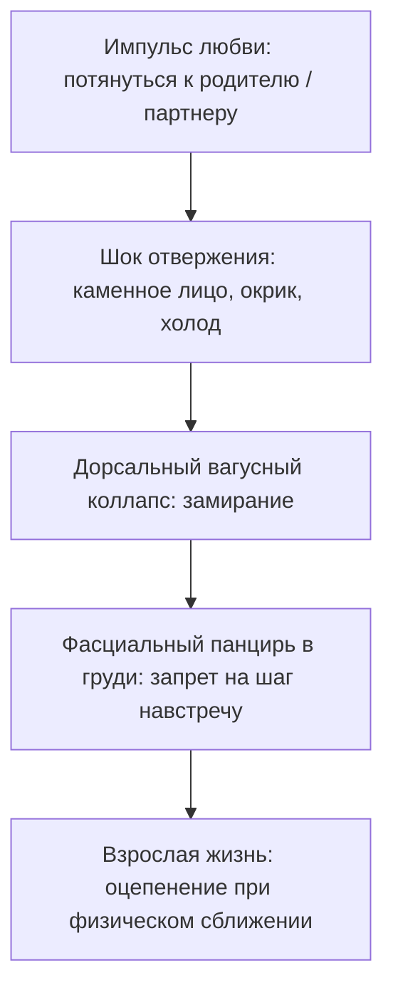

# Прерванное движение: почему мы боимся сделать шаг навстречу

Бывает так, что ты искренне, всем сердцем хочешь любить и быть любимым. Ты читаешь мудрые книги по психологии, учишься выстраивать диалог, искренне восхищаешься своим партнером.

Но стоит человеку подойти слишком близко — обнять с нежностью, заглянуть в самые глубины глаз, предложить жить вместе — как внутри тебя словно опускается тяжелая металлическая заслонка.

Твое тело мгновенно каменеет. В центре грудной клетки появляется холодный, неподъемный булыжник, дыхание становится мелким и поверхностным, а руки непроизвольно отстраняются. В голове вспыхивает глухое раздражение на пустом месте или паническое желание немедленно разорвать контакт и запереться в пустой комнате.

Окружающие называют это «холодным характером», «страхом ответственности» или эгоизмом.

Но на самом деле в твоем теле живет застывшая память о **прерванном движении любви**.

Каждый ребенок рождается с абсолютным, первобытным инстинктом тянуться к матери. Его ручки инстинктивно раскрываются навстречу теплу, его маленькое сердце безоговорочно распахивается для объятия. Но если в момент этого самого чистого и беззащитного порыва ребенок наталкивается на ледяное отвержение, каменное лицо или яростный окрик — происходит катастрофа.

Психика спасает сердце от разрыва единственным доступным способом: она мгновенно замораживает импульс на полпути. Мышцы грудины спазмируются, фиксируя запрет: *«Тянуться к тому, кого любишь — смертельно опасно. Замри. Окаменей. Никогда больше не делай этого шага»*.

---

## Правильная девочка и ноябрьская кухня

Кристина с самого раннего детства знала главное правило выживания в своем доме: быть незаметной, удобной и предельно собранной.

Ее мать была женщиной из железа и дисциплины. Безупречная осанка, строгий взгляд, металлический голос, в котором не было места сантиментам. Она никогда не кричала. Она отдавала короткие, не терпящие возражений команды: «Поела — помой тарелку», «Плачешь — иди в свою комнату и не позорься», «Соберись, нечего распускать нюни».

Кристина старалась изо всех сил. Образцовая дочь: круглые пятерки в школе, идеальный порядок в шкафу, никаких капризов и хлопот.

Когда ей было девять лет, отец молча собрал вещи и навсегда ушел из семьи. Во вторник его одежда просто исчезла из гардероба. Мать сухо отрезала за ужином: «Мы больше не живем вместе. Тема закрыта навсегда». С этого дня его имя в доме было под строжайшим запретом.

Кристина впитала этот закон костями: когда тебе невыносимо больно — стисни зубы, сотри слезы и шагай дальше с прямой спиной.

Потом начались неуклюжие мамины попытки устроить личную жизнь. 

Девятилетняя Кристина улавливала всё до мельчайших нюансов: часы у зеркала в коридоре, чужие мужские голоса в телефонной трубке, частые поездки к бабушке на выходные «подышать свежим воздухом». Детским чутьем девочка знала: мама отчаянно ищет тепла, которое сама Кристина дать ей не способна.

Однажды поздним ноябрьским вечером в квартире стояла тишина. За окном хлестал дождь со снегом. Девятилетняя Кристина проснулась от жажды и тихо пошла на кухню.

В полумраке кухни у окна на табурете сидела мать. Ее лицо было закрыто ладонями. Плечи судорожно, мелко вздрагивали. Женщина из железа плакала — беззвучно, горько, ломая свою многолетнюю броню.

В груди маленькой девочки всё обожгло острой, пронзительной жалостью. Чистейший детский порыв: подбежать босиком по полу, обвить ручонками мамину шею, прижаться мокрой щекой к ее фланелевому халату и прошептать: *«Мамочка, милая, не плачь! Я здесь, я с тобой, я так сильно тебя люблю!»*

Кристина сделала шаг вперед.

И в эту секунду воздух между ними словно превратился в толстое, пуленепробиваемое ледяное стекло. Грудную клетку девочки свело спазмом удушья.

Мать услышала шорох. Она резко смахнула слезы тыльной стороной ладони и, даже не поворачивая головы, металлическим голосом отчеканила в темноту:

— Ты чего застыла в дверях? Немедленно иди спать. И чтобы завтра в дневнике не было ни одной четверки.

Кристина на цыпочках отступила назад в темный коридор.

В ту ночь ее маленькое сердце перестало рваться навстречу людям. Тело намертво запечатало команду: *«Тянуться к близкому — значит получить удар под дых. Любовь приносит невыносимый стыд. Замри на пороге»*.

---

## Семь лет идеального штиля

В двадцать три года Кристина встретила Антона.

Он был тихим, надежным инженером. Рядом с ним можно было не обороняться. Он говорил мало, держал каждое слово, а его молчание согревало лучше любых речей. Он учился говорить о чувствах — бережно, неловко, искренне.

Они поженились. Прошло семь благополучных лет: путешествия, книги, театр, уютная квартира с видом на сквер. Но эта идеальная гладь постепенно превратилась в ледяную тюрьму.

На исходе седьмого года Антон сел напротив Кристины за кухонный стол:

— Кристина… Ты сидишь на диване рядом со мной. Мы вместе пьем чай. Но тебя здесь нет. Твое сердце за бронированной дверью. За семь лет брака ты так и не сделала ни одного шага навстречу мне. Я устал стучаться в пустой дом.

Они развелись тихо, без скандалов. Закрыв за Антоном дверь, Кристина сползла по стене на пол и с ужасом осознала: она ни разу в жизни не сделала настоящего шага из той темной ноябрьской прихожей.

А потом в ее жизни появился Георгий.

Шумный, энергичный, уверенный в себе системный инженер. Он ворвался в ее жизнь как тропический ураган: звонил среди дня, обнимал на глазах у всех, признался в любви уже на третьей неделе с обезоруживающей легкостью.

После семи лет штиля напор Георгия пугал Кристину до дрожи в коленях — и одновременно притягивал, как спасительный костер замерзающего путника.

Но когда Георгий натыкался на ее внутренний холод, он включал привычную броню логики: «Так, спокойно. Не надо эмоций. Давай разберем твою обиду по пунктам». Ее женская боль была для него просто поломкой, системной ошибкой, которую нужно срочно отремонтировать по инструкции.

А Кристине не нужен был ремонт. Ей нужно было, чтобы ее просто увидели — испуганной, колючей, плачущей — и не сбежали за стену заумных объяснений.

Развязка наступила в прихожей:

— Ты все делаешь правильно, Жора, — тихо сказала Кристина, глядя сквозь него. — Ты идеальный специалист. Только меня в твоих правилах нет. Я для тебя просто сломанная деталь.

Он вспыхнул от обиды, хлопнул дверью и ушел в ночь.

Кристина закрыла замок, прижалась лбом к холодному косяку и зарыдала. Рухнули не отношения с Георгием и не брак с Антоном. В ее памяти вспыхнула та самая девятилетняя девочка на кухне, которая замерла перед ледяным стеклом и так и не дошла до матери.

---

> [!NOTE]
> В 1959 году знаменитый американский психолог Гарри Харлоу в серии классических экспериментов доказал: базовая потребность живого существа заключается вовсе не в получении пищи, а в теплом тактильном контакте (contact comfort). Без материнского тепла детеныши впадают в оцепенение, теряют способность к социализации и на всю жизнь остаются эмоциональными инвалидами.
> 
> Позже профессор Гарвардского университета Эдвард Троник в потрясающем эксперименте **«Каменное лицо»** (Still Face Experiment) зафиксировал биологический каскад отвержения. Когда мать внезапно перестает реагировать на младенца и ее лицо становится каменным, ребенок сначала пытается улыбнуться, затем плачет, а через две минуты безуспешных попыток падает в тяжелый вегетативный коллапс: сердечный ритм замедляется, тело обмякает, взгляд тускнеет. Включается защитное торможение блуждающего нерва (dorsal vagal state).
> 
> Это и есть физиология прерванного движения. Ребенок не может выдержать отвержения и прекращает движение навстречу. В теле формируется жесткий фасциальный панцирь в области грудины и ключиц. Взрослый человек может пройти сотни психологических тренингов, но при физическом сближении его тело автоматически проваливается в то самое детское оцепенение. 
> 
> Это исцеляется не логическим анализом, а физическим, телесным завершением прерванного жеста в атмосфере абсолютной безопасности.

---

## Сессия: завершение шага через четверть века

На сессию Кристина пришла с сухими, потухшими глазами и каменной маминой осанкой:

— Я знаю всю теорию привязанности наизусть. Я понимаю умом всё про маму, про Антона и Жору. Но в моей груди лежит кусок льда. Почему знание не лечит?

> **Терапевт:** Потому что лед находится не в коре головного мозга, Кристина. Он заморожен в фасциях твоей грудины и в дыхательных мышцах. Закрой глаза. Вспомни тот ноябрьский вечер. Тебе девять лет. Мама сидит у окна и плачет. Ты стоишь босиком на холодном полу. Твое сердце бьется от жалости и любви. Что произошло дальше?
>
> **Кристина:** *(сжимает зубы так, что белеют скулы)* Мама сказала: «Иди делай уроки». И я ушла.
>
> **Терапевт:** Что в ту секунду решило твое маленькое тело?
>
> **Кристина:** Что я плохая. Что я виновата. Что если бы я была по-настоящему любимой и хорошей дочерью — мама бы повернулась и обняла меня.
>
> **Терапевт:** Этой детской иллюзией вины ты двадцать пять лет закрывала черную бездну. Ты предпочла считать себя плохой, лишь бы верить: тепло существовало, просто ты его не заслужила. Но правда куда проще и трагичнее: мама не повернулась к тебе не потому, что ты плохая. А потому, что ее собственное сердце было заморожено точно таким же льдом ее несчастного детства. Она просто не умела обнимать.

Кристина вздрогнула всем телом. Ее дыхание участилось.

> **Терапевт:** Стань прямо сейчас той маленькой босоногой девочкой. Твои ступни на холодном полу. Твое сердце колотится в ребра. Но в этот раз — не замирай. Тебе больше не нужно мамино разрешение, чтобы любить. Порыв твоей любви свят сам по себе. Сделай этот шаг. Протяни руки вперед.

Кристина сидела неподвижно. Ее подбородок мелко дрожал. А затем ее пальцы медленно, преодолевая сопротивление векового страха, оторвались от колен и вытянулись вперед в пространство комнаты.

> **Терапевт:** Иди. Ты имеешь право подойти к маме. Ты имела это право всегда.

И плотина рухнула.

Кристина согнулась пополам, прижав обе ладони к грудине. Из ее горла вырвался не просто плач — это был глубокий, утробный стон существа, которое четверть века не делало полного, свободного вдоха. Она плакала двадцать минут, сотрясаясь всем телом.

Тяжелый серый камень в центре ее груди буквально растворился в обжигающем, горячем потоке слез.

Когда она подняла мокрое лицо, ее глаза сияли:

— Мама… Господи, как же мне ее жалко! — прошептала Кристина с благоговением. — Она ведь всю жизнь прожила в таком же ледяном бункере. Совсем одна…

Впервые в ее сердце проснулась не детская обида и не жажда похвалы, а взрослая, зрелая, целительная женская нежность.

Спустя месяц Кристина прислала голосовое сообщение:

> *«Вчера я без звонка приехала к маме. Она открыла дверь, увидела меня и нахмурилась: "Что-то случилось?". А я ничего не стала говорить. Просто шагнула через порог и крепко-крепко обняла ее за плечи.*
> 
> *Сначала мама окаменела от неожиданности. А потом ее плечи обмякли, она уткнулась носом в мою куртку и тихо заплакала. Мы простояли в темной прихожей минут пятнадцать. Впервые за тридцать лет стена между нами растаяла.*
> 
> *А сегодня утром я случайно встретила Жору в кофейне. Мы проговорили полчаса. Я больше не злилась на его шутки, а он не пытался меня "чинить". Оказывается, можно просто быть рядом с мужчиной, чувствовать тепло и не бояться, что твое сердце разобьют вдребезги».*

---

## Архитектура прерванного движения

Три типичные детские ситуации, которые замораживают импульс:
1. **Больничный карантин в младенчестве.** Ребенка забирают в бокс без мамы. На третий день крика мозг отключает призыв о помощи, погружаясь в апатию: «Звать бесполезно».
2. **Мать в депрессии или горе.** Мама физически присутствует, но эмоционально отсутствует. Ребенок тянется к ее глазам, видит пустоту и закрывается.
3. **Прямое физическое отталкивание.** «Отойди, не мешай», «не смей ко мне прикасаться». В теле запечатывается страх прикосновения.

---

## Практика: завершение прерванного жеста

Если при искреннем сближении с близким человеком ты чувствуешь оцепенение и холод в груди, выполни эту телесную практику:

### 1. Топография зажима
Положи обе ладони на центр грудины. Что ты чувствуешь под пальцами? Холодный камень? Деревянную доску? Металлическую пластину? 
Не пытайся ломать это ощущение силой. Просто дыши в эту точку в течение одной минуты, согревая ее вниманием.

### 2. Вспомни застывшего ребенка
Увидь ту ситуацию из своего детства, где твой искренний порыв был остановлен холодом, криком или захлопнутой дверью. Посмотри на того застывшего мальчика или девочку.

### 3. Физический жест раскрытия
Закрой глаза. Медленно вытяни руки перед собой ладонями вверх. Сделай один мягкий шаг вперед по комнате. Произнеси вслух:

> *«В тот день мое движение к теплу остановили холод и страх. Мое тело заблокировало импульс, спасая мое сердце от разрыва. Я благодарю свое тело за эту защиту. Но сегодня я взрослый человек. Та опасность осталась в далеком прошлом. Я снимаю засов со своего сердца. Я разрешаю своему импульсу любви завершить движение. Я иду навстречу. Я открываю руки. Я имею полное право быть в тепле и безопасности».*

### 4. Телесное принятие
Мягко положи ладони себе на плечи, словно обнимая самого себя. Сделай глубокий выдох со звуком облегчения. Почувствуй, как тепло мягкой волной разливается по межреберным мышцам.

Лед не тает от мыслей в голове. Стекло тает в живом физическом движении — в том самом шаге навстречу, на который когда-то не хватило детских сил.

---

> [!IMPORTANT]
> **Главная мысль главы**  
> Прерванный жест любви не исчезает: он десятилетиями ждет своего завершения в спазме грудных мышц. Сделай этот шаг сегодня — и тепло вернется в твою жизнь.

---

> [!TIP]
> **Интерактивный помощник**  
> Если жест раскрытия рук вызвал сопротивление или подкативший к горлу ком — напиши в диалоговом окне внизу страницы. Мы поможем бережно отогреть застывший импульс и вернуть доверие к миру.
