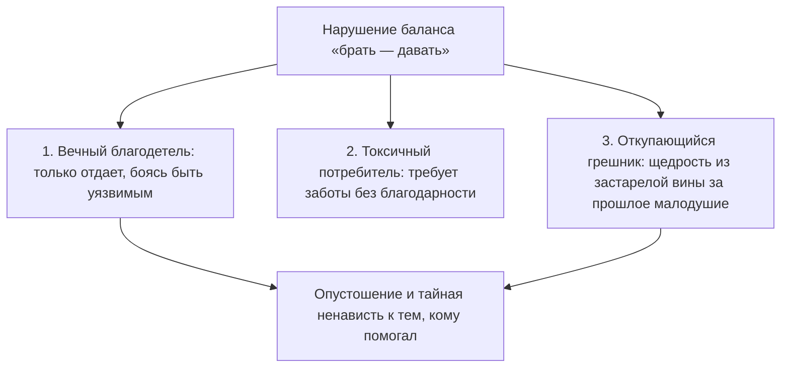

# Загадка «У пересохшего колодца»

> [!TIP]
> **Притча о двух путниках**  
> Двое изможденных путников встретились у старого колодца на каменистом перевале. Вода была глубоко на дне. Чтобы поднять тяжелое дубовое ведро, требовалось крутить тугой ворот синхронно, налегая на рукоять вдвоем.
> 
> Первый путник обессилел и сел на пыльную землю, ожидая, что второй сделает первый шаг. Второй хмуро скрестил руки на груди и отчеканил: «Ты шире в плечах — вот ты и крути первым. Я не собираюсь надрываться ради чужого человека».
> 
> И пока оба упрямо ждали идеальной справедливости, ведро неподвижно висело в темноте. Вода была рядом, но их губы трескались от смертельной жажды.
> 
> **Голос Расчета:** Пусть он сделает свои пятьдесят оборотов. Я не намерен тратить силы впустую — сделка должна быть строго симметричной.  
> **Голос Правила:** Кто первым подошел к колодцу, тот и обязан начинать. Справедливость превыше всего. Чужой лени потакать нельзя.  
> **Голос Души:** Какая разница, чей сейчас черед, если вы оба умираете от жажды? Положи ладони на теплое дерево ворота и сделай первый оборот ради самой жизни.  
> 
> *Вопрос силы:* Кто делает первое движение навстречу — тот, кто формально слабее, тот, кто упрямо считает себя правым, или тот, кто находит в себе смелость открыться потоку?

---

# Дисбаланс обмена: почему мы боимся принимать тепло

Любая человеческая связь — в любви, дружбе или бизнесе — живет лишь до тех пор, пока дыхание идет в обе стороны. 

Вдох и выдох. Давать и принимать. 

Но стоит одному из партнеров навсегда застрять в роли снисходительного благодетеля, а второму — в роли вечного, пристыженного должника, как мост доверия начинает угрожающе крениться. Канал взаимности заиливается обидой и скрытой агрессией. В конечном счете в этой ловушке сгорают оба.

---

## Предательство под железнодорожным мостом

Четырнадцатилетний Марк стоял за сырой бетонной опорой железнодорожного моста и обеими руками изо всех сил зажимал себе рот.

Не для того, чтобы не вскрикнуть. Его рвало от ледяного, парализующего ужаса.

В десяти метрах от него на острой гравийной насыпи трое рослых старшеклассников методично избивали Данила. 

Данил был тихим, нескладным сыном глухонемой уборщицы тети Веры, мывшей полы в их подъезде. Он ходил за Марком преданной тенью и считал его своим единственным другом. Данил упал в мокрую грязь на первой же минуте. А дальше его вбивали тяжелыми ботинками в щебень — деловито, молча, под хруст ребер.

Окровавленными руками Данил судорожно прижимал к груди кожаный рюкзак Марка. Внутри лежал новенький японский зеркальный фотоаппарат — дорогая игрушка, которую Марк с боем выпросил у состоятельного отца на день рождения.

— Тут… вещи Марка… — хрипел Данил разбитыми губами, задыхаясь от боли. — Я ничего вам не отдам. Сволочи.

Это были его последние связные слова в тот вечер.

А Марк стоял за бетонной опорой. Внутри него бушевал смертоносный вихрь:
- Животный ужас: *«Если я выйду — они выбьют мне зубы и покалечат»*.
- Жгучий, разъедающий стыд: *«Я трус. Я стою в темноте и смотрю, как его убивают из-за моей железки»*.
- И на самом дне — омерзительная, малодушная злоба на самого Данила: *«Зачем ты вцепился в этот проклятый рюкзак?! Зачем ты строишь из себя героя?! Я не просил тебя умирать за меня!»*

Всё это спрессовалось в раскаленный свинцовый ком в горле Марка. Дыхание перехватило. 

Когда хулиганы сплюнули и скрылись в сумерках, Марк выждал пять минут в сырой темноте и бросился бежать прочь по темным переулкам. Быстро. Задыхаясь. Не оглядываясь назад. 

Как вор.

Ночью Данил приполз домой. Заплывший глаз, сотрясение мозга, разорванная в клочья куртка. Но разбитый рюкзак с фотоаппаратом он удержал.

Он не сказал Марку ни единого слова упрека. 

На следующий день во дворе Данил посмотрел на Марка долгим, невыносимо тихим взглядом. В нем не было ненависти. Это был взгляд перегоревшей лампы. И в этой глубине читалась детская, чистая жалость. Данил словно понимал: настоящим калекой из той бойни под мостом вышел вовсе не он.

Этот взгляд Марк вынести не смог.

Раскаленный ком малодушия превратился в каменную плиту под ребрами. Находиться рядом с Данилом стало физически невозможно: каждый жест друга напоминал Марку о его собственном позоре. 

Через три недели Марк тайком вытащил из спальни родителей золотые запонки с сапфирами и подбросил их в крошечную каморку тети Веры под лестницей. А вечером, глядя в угол паркета, ровным голосом сказал отцу: «Я видел, как сын уборщицы крутил твои запонки в руках».

Немой женщине и ее избитому сыну дали двадцать четыре часа на сборы.

Под проливным осенним дождем у чугунной калитки Данил в последний раз обернулся. Посмотрел на Марка, стоявшего у окна. Без гнева. Без проклятий. С той же пронзительной, прощающей жалостью.

Марк победил. Свидетель его позора был стерт с лица земли. 

Но цена этой победы оказалась страшнее любого тюремного срока.

---

> [!NOTE]
> В 1925 году выдающийся французский социолог и антрополог Марсель Мосс в своем классическом труде «Очерк о даре» сформулировал базовый закон человеческих сообществ: **цикл дарообмена состоит из трех священных обязанностей — давать, принимать и возмещать**.
> 
> Если человек только дает, категорически отказываясь принимать что-либо взамен, он бессознательно ставит себя в позицию морального бога, низводя окружающих до роли беспомощных попрошаек. 
> 
> Иван Бозормени-Надь в рамках контекстуальной психотерапии развил эту мысль: когда партнер или друг оказывается в ситуации, где он не способен выровнять баланс взаимности (счет лояльности), у него накапливается глухое чувство вины, неизбежно перерастающее в яростную ненависть к благодетелю. Именно поэтому люди так часто предают тех, кто осыпал их благодеяниями: непереносимый груз вечного неоплатного долга разрушает психику.
> 
> В эволюционной биологии Роберт Триверс доказал: устойчивость популяции держится на взаимном (реципрокном) альтруизме. Односторонняя накачка ресурсом всегда воспринимается системой как патологический сбой и провоцирует агрессивное отторжение.

---

## Марк двадцать пять лет спустя: синдром вечного донора

Прошло двадцать пять лет.

Марк стал управляющим партнером одной из самых влиятельных юридических коллегий столицы. Офис с видом на Патриаршие пруды, безупречные итальянские костюмы, тяжелый стальной взгляд человека, не знающего пощады.

Он стал легендарным благотворителем. 

Марк жертвовал десятки миллионов рублей детским домам, оплачивал сложнейшие операции чужим детям, вел безнадежные судебные процессы для неимущих людей абсолютно бесплатно. Он работал по восемнадцать часов в сутки, буквально раздавая себя миру без остатка.

Но сам он не мог принять ни крупицы тепла.

Стоило молодой коллеге в офисе с искренней улыбкой предложить: «Марк Сергеевич, вы так бледны сегодня, давайте я сварю вам кофе?», как внутри него включалась сирена тревоги. Взгляд становился ледяным: «Благодарю вас. Я справлюсь сам».

Он не позволял никому прикоснуться к себе. Он не умел просить о помощи. Он загнал себя до гипертонического криза и на сессию к психотерапевту пришел в состоянии физического коллапса: пальцы впивались в кожаные подлокотники кресла до белизны суставов.

> **Терапевт:** Марк, закрой глаза. Представь человека, который искренне тебя уважает. Он видит твою смертельную усталость, садится рядом, кладет руку на плечо и говорит: «Марк, обопрись на меня. Отдохни. Я прикрою тебя». Что прямо сейчас происходит в твоем теле?
>
> **Марк:** *(втягивает голову в плечи, челюсти сжимаются до хруста, дыхание со свистом вырывается из горла)* Свинец! На груди тяжеленный свинцовый бронежилет! В горле железная удавка! Внутри всё орет: «Не подходи ко мне! Не прикасайся! Не смей ничего у них брать!»
>
> **Терапевт:** Чего так панически боится эта броня, Марк?
>
> **Марк:** Приму помощь — стану должником. Стану слабым. А слабых ломают и вбивают сапогами в щебень. Брать тепло смертельно опасно. Безопасно только давать самому — пока не сдохнешь на работе!
>
> **Терапевт:** Когда этот свинцовый ком впервые встал у тебя в горле?
>
> **Марк:** *(опускает голову на грудь, плечи начинают мелко вздрагивать)* Четырнадцать лет… Осенняя грязь. Железнодорожный мост. Я стою за сырой бетонной колонной и зажимаю себе рот ладонями… А Данила топчут ногами…
>
> **Терапевт:** Ты струсил тогда. А потом подбросил запонки и вышвырнул его с матерью на мороз.
>
> **Марк:** *(задыхается от рыданий, слезы капают на дорогой шелковый галстук)* Я не мог вынести его взгляда! Я не мог выдержать того, что он не возненавидел меня! Он посмотрел на меня с жалостью… Я двадцать пять лет доказываю всему миру, какой я благородный, сильный и святой! Я раздал миллионы! Я спас сотни людей! А на самом деле я четверть века просто откупаюсь от взгляда того избитого мальчишки у калитки…
>
> **Терапевт:** Твой ком в горле — это неиспытанный стыд, похороненный заживо страх и малодушие того четырнадцатилетнего пацана. Ты заковал себя в свинцовый панцирь святости. Но чужими жизнями старый грех не искупить. Поставь Данила перед собой. Посмотри в его глаза.

Марк уронил лицо в ладони. Его широкая спина сотрясалась от тяжелых, сокрушительных рыданий:

— Данил… Прости меня. Если сможешь — прости меня, труса проклятого. Я испугался боли. Я испугался сломанных ребер. А потом предал тебя, потому что сгорал от собственного позора. Ты не должен был расплачиваться за мое малодушие. Этот позор, этот страх и эта грязь принадлежат только мне. Это мой личный грех. Я снимаю с тебя ту тень. Я признаю свой долг перед тобой. Я больше не прячусь за маской идеального благодетеля.

В кабинете наступила звенящая тишина. Слышно было только, как за окном шуршат капли осеннего дождя.

Марк сделал первый за двадцать пять лет медленный, глубокий, ничем не скованный вдох.

> **Терапевт:** Что с броней?
>
> **Марк:** *(кладет ладонь на грудь, его лицо бледное, но абсолютно живое)* Камень раскололся. В горле больше нет удавки. Сердце бьется ровно и тепло. Боже мой… как же легко дышать, когда тебе больше не нужно казаться святым.

Спустя два месяца Марк нанял людей и разыскал Данила в небольшом провинциальном городе. Тот стал прекрасным мастером, реставратором старинной мебели. Марк приехал к нему лично — без охраны, на простом поезде.

Они просидели на деревянной веранде мастерской пять часов. Марк не предлагал денег, фондов или квартир. Это был разговор двух взрослых, седеющих мужчин — разговор равного с равным. Долг чести, возвращенный через четверть века.

---

## Три ловушки перекошенного обмена

### 1. Вечный донор
Человек убежден: «Мне ничего не нужно, я справлюсь сам». Он осыпает близких заботой, подарками и связями, но намертво блокирует входящий поток. За этой мнимой святостью всегда скрывается страх близости: дающий всегда находится в позиции власти, а принимающий чувствует себя должником.

### 2. Токсичный потребитель
Человек инфантильно убежден, что мир кругом ему задолжал. Он жадно поглощает чужие силы, время и деньги, искренне не понимая, почему люди рано или поздно в ужасе разрывают с ним любые контакты.

### 3. Откупающийся
Щедрость, рожденная из застарелого чувства вины за собственную трусость или некрасивый поступок в прошлом. Человек пытается «заслужить» прощение добрыми делами, но пока первоначальный долг не признан лицом к лицу, внутренний ад не утихает.

---

## Практика: выравнивание шлюзов обмена

Если ты чувствуешь опустошение от бесконечной отдачи или ловишь себя на паническом страхе принять искреннюю заботу, выполни эту практику балансировки:

### 1. Честная ревизия отношений
Взгляни на свои отношения в семье, дружбе и бизнесе:
- Сколько процентов энергии уходит наружу? 
- Сколько процентов ты позволяешь себе принимать без чувства вины?
- От чего ты пытаешься откупиться своей гиперопекой?

### 2. Тест на принятие
Представь, что близкий человек искренне дарит тебе дорогой подарок или предлагает бескорыстную помощь в трудную минуту. 
Где в теле возникает зажим? Сжались челюсти? Застыло дыхание? Окаменели плечи? Положи руку на эту зону.

### 3. Выравнивание потока
Положи левую ладонь на центр груди (шлюз принятия), а правую руку вытяни вперед с открытой ладонью (шлюз отдачи). Сделай глубокий вдох через нос и спокойный выдох через рот. Произнеси вслух:

> *«Я выравниваю баланс своей жизни. Я снимаю заслонку со своего сердца. Принимать помощь и заботу — безопасно для моего достоинства. Я признаю свои человеческие ограничения. Я разрешаю себе опираться на других. Я отдаю из полноты и избытка. Я принимаю с чистой благодарностью. Встречный поток уравновешен. Мой обмен с миром чист».*

### 4. Практическое действие
В течение ближайших суток осознанно прими малейшую помощь: позволь кому-то открыть перед тобой дверь, угостить тебя кофе или сказать искренний комплимент. Не отмахивайся дежурным «не стоило». Посмотри человеку в глаза и скажи простое: *«Спасибо. Мне очень приятно»*.

---

> [!IMPORTANT]
> **Главная мысль главы**  
> Душевный покой невозможно купить внешней жертвенностью. Баланс возвращается тогда, когда ты находишь в себе смелость признать старый позор и снова разрешаешь себе принимать любовь.

---

> [!TIP]
> **Интерактивный помощник**  
> Если принятие заботы вызывает волну стыда или страх показаться слабым — напиши об этом в диалоговом окне внизу страницы. Мы поможем бережно восстановить баланс «брать и давать» без потери внутреннего достоинства.
