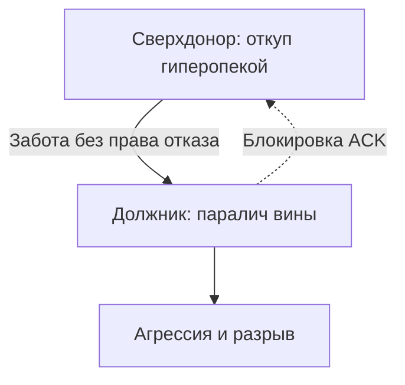

# Загадка «У колодца»

> [!TIP]
> **Загадка: «У колодца»**
> Двое путников у одного пересохшего колодца на перевале. Вода глубоко. Чтобы поднять дубовое ведро на ржавом тросе, нужен синхронный ворот. Первый измождён и ждёт встречного шага. Второй хмурится: «Ты шире в плечах — налегай».
>
> Пока оба ждут идеальной симметрии, ведро висит в темноте. Вода рядом. Губы трескаются.
>
> **Голос Расчёта:** Пусть сделает свои пятьдесят оборотов. Я не жгу ресурс впустую — сделка невыгодная.
> **Голос Правила:** Кто первый подошёл, тот и крутит. Справедливость выше. Чужой лени потакать нельзя.
> **Голос Души:** Какая разница, чей черёд, когда оба гибнут от жажды? Положи ладони на холодное дерево и сделай первый оборот ради жизни.
>
> *Вопрос силы:* Кто делает первое движение — тот, кто сильнее, кто формально правее, или тот, кто способен рискнуть и открыться потоку?

---

# Дисбаланс обмена

Связь держится, пока потоки идут в обе стороны.

Один застрял благодетелем, другой — потребителем — мост кренится. Канал заиливается. Садятся оба.

---

## Быль: предательство под мостом

Марку было четырнадцать. Он стоял за сырой бетонной опорой железнодорожного моста и обеими ладонями зажимал себе рот.

Не чтобы не вскрикнуть. Чтобы не вырвало.

В десяти метрах на гравийной насыпи трое старшеклассников методично избивали Данила. Нескладного, тихого сына глухонемой уборщицы тёти Веры. Данил всюду ходил за Марком тенью. Считал его единственным другом. Упал в грязь на первой минуте. Дальше его вбивали ногами в щебень — коротко, деловито.

В судорожных руках держал школьный рюкзак Марка. Внутри — новенький японский фотоаппарат, выпрошенный у отца на день рождения.

— Тут вещи Марка… — хрипел с разбитым лицом. — Ничего не отдам.

Последние связные слова тем вечером.

---

Внутри Марка — вихрь.

Ледяной ужас: *«Заметят. Выбьют зубы. Сломают рёбра»*. Жгучий стыд: *«Стою трусом и смотрю, как его калечат из-за меня»*. Ярость — на подонков, на фотоаппарат, на Данила, который полез. На дне — малодушная обида: *«Зачем вцепился в рюкзак? Я не просил быть героем»*.

Всё спрессовалось в раскалённый ком в гортани. Голос заблокирован. Дыхание перехвачено. Марк давил пальцами на зубы, а ком плотнел с каждым ударом ботинка о рёбра друга.

Хулиганы сплюнули и ушли. Марк выждал пять минут в сырой темноте и бросился прочь закоулками. Быстро. Не оглядываясь.

Как вор.

---

Данил приполз ночью — заплывший глаз, сотрясение, порванная куртка. Рюкзак удержал.

Упрёка не было.

На следующий день во дворе посмотрел на Марка долгим тихим взглядом. Без ненависти. Погасшая лампа — вольфрам перегорел.

Этот взгляд Марк не выдержал.

Ком под мостом стал свинцовым булыжником в грудине. Рядом с Данилом — физически невозможно. Камень раскалялся: *«Исчезни. Не напоминай, кто я»*.

Через три недели тайком подбросил отцовские золотые запонки в каморку Данила под лестницей. Отцу, глядя в угол паркета: «Видел, как сын уборщицы вертел их в руках».

Семью выставили за сутки.

Под осенним дождём у калитки Данил обернулся. Посмотрел на Марка.

Без гнева. Без проклятий.

С детской жалостью. Будто понимал: настоящим калекой из той бойни вышел не он.

Он был прав.

`[Шоковый аффект заблокирован. Аварийная гиперкомпенсация]`

---

## Архитектура перекоса

> [!NOTE]
> В 1925 году Марсель Мосс в «Очерке о даре» сформулировал цикл: давать, принимать, возмещать. Кто только даёт и отвергает встречное — ставит себя сверху. Иван Бозормени-Надь показал: должник без возможности выровнять счета лояльности копит гнев и вину — контакт рушится. Роберт Триверс в эволюционной биологии: реципрокный альтруизм жив только при симметрии. Односторонняя накачка читается как сбой и провоцирует отторжение. В инфраструктуре — переполнение асимметричного канала: узел шлёт пакеты и блокирует `ACK`. Стек зависает. Соединение рвётся.

Три формы:

1. **Вечный донор.** «Мне ничего не нужно». Осыпает заботой, кредитами, связями — и заваривает входной шлюз. За «бескорыстием» — страх уязвимости: дающий сверху, принимающий — вечный должник.
2. **Потребитель.** Мир обязан обеспечивать. Жрёт чужие силы без взаимности, пока доноры не отключат доступ.
3. **Откупающийся.** Щедрость из старой вины за малодушие. Раздаёт миру без остановки. Принять малейшую помощь — значит обнажить рану.

Если ты из вечно отдающих — поймай момент, когда грудь каменеет при мысли попросить. От чего откупаешься? Какой непрожитый ком — страх, стыд, злость — так и не вышел? Сколько ни отдавай: перекрытый канал этим не чинят.

`[Обнаружен перекос потока]`

См. также: [«Границы»](/16-boundaries-safekeeping-defense-isolation), [«Долги»](/45-debts-and-survival-strategies).

---

## Сессия: Марк

Прошло двадцать пять лет.

Управляющий партнёр юридической корпорации. Патриаршие. Итальянские костюмы. Стальной взгляд. Миллионы на сирот. Безнадёжные процессы для друзей без гонорара. Восемнадцать часов в сутки. Раздавал себя без остатка.

Принять помощь не мог физически.

Коллега предлагает кофе — сирена. Ледяная вежливость: «Благодарю, я в порядке».

На сессию — после гипертонического криза. Пальцы впились в подлокотники до белизны.

> **Терапевт:** Закрой глаза. Близкий видит усталость, садится рядом: «Обопрись, Марк. Прикрою. Выдохни». Что делает тело?
>
> **Марк:** *(голова в плечи; хриплое дыхание; челюсти)* Железо. Бронежилет из свинца. Горло удавкой. Сирена: «Не прикасайся. Не смей принимать!»
>
> **Терапевт:** Чего боится броня? Что будет, если примешь опору?
>
> **Марк:** *(молчание; лицо искажается)* Приму — стану слабым. Слабых ломают. Брать тепло — опасно. Безопасно только отдавать, пока не упадёшь.
>
> **Терапевт:** Сколько лет броне? Когда ком впервые встал в горле?
>
> **Марк:** *(голова вниз; шёпот)* Четырнадцать. Осень. Железнодорожный мост. Стою за бетоном. Ладони у рта. Данила вбивают в щебень…
>
> **Терапевт:** Бросил его. Потом запонки. Выгнал семью.
>
> **Марк:** *(задыхается; редкие слёзы)* Не мог видеть его глаз. Не мог выдержать, что он не возненавидел. Посмотрел с жалостью… Всю жизнь доказываю, что сильный, благородный, чистый. Раздал миллионы. Спас сотни карьер. А на деле двадцать пять лет откупаюсь от взгляда избитого мальчишки у калитки.
>
> **Терапевт:** Ком под мостом — страх, стыд, малодушие. Заморозил в броню. Чужими победами канал не открыть. Поставь Данила. Четырнадцать. Рваная куртка. Твой фотоаппарат. В глаза.
>
> **Марк:** *(роняет голову на руки; плечи трясутся)*
> «Данил… Прости, если сможешь. Струсил под тем мостом. Испугался боли и сломанных костей. Потом предал и очернил перед отцом, потому что позор сжигал. Ты не должен был платить за моё малодушие. Позор, страх и грязь — только мои. Мой грех. Снимаю с тебя ту тень. Признаю долг. Больше не прячусь за чужими спинами».
>
> **Марк:** *(затихает; за окном дождь; первый медленный свободный вдох)*
>
> **Терапевт:** Что с бронёй?
>
> **Марк:** *(ладонь на солнечное сплетение)* Камень раскололся. В горле нет удушья. Сердце ровно. Как же легко дышать…

Через два месяца нашёл Данила. Другой город. Реставратор старинной мебели. Приехал лично. Пять часов на веранде мастерской. Без подачек и фондов — разговор равного с равным. Долг уважения, возвращённый через четверть века.

`[Исторический долг признан. Баланс восстановлен]`

---

## Практика: калибровка шлюзов

Если связи воспроизводят перекос — опустошение от отдачи или глухая изоляция:

1. **Ревизия.** Отношения, команда, родители. Какой процент уходит наружу? Какой дозволяешь принимать?
2. **Плотина.** Представь: кто-то искренне предлагает заботу или дар. Где напряжение? Зубы? Дыхание? Предплечья?
3. **Приём.** Левая ладонь на грудину (вход). Правая вперёд открыта (выход). Вдох. Вслух:
   > «Выравниваю баланс. Снимаю заслонку с входа. Принимать заботу безопасно для автономии. Признаю ограничения. Разрешаю опираться. Отдаю из изобилия. Принимаю с благодарностью. Встречный поток уравновешен. Обмен чист».
4. **Резонанс.** Обе руки на колени ладонями вверх. Равномерное тепло в кистях.

Организм живёт вдохом и выдохом. Жизнь требует смелости отдавать — и смелости принимать.

---

> [!IMPORTANT]
> **Закон главы**
> Внутренний дефицит внешней гиперкомпенсацией не закрыть; признай старый долг и выровняй встречный поток — отношениям вернётся дыхание.

> [!TIP]
> **Живой AI-психолог**
> Если принимать заботу кажется опасным и поднимается стыд — открой чат на сайте (иконка внизу страницы) и восстанови баланс «брать–давать» в безопасном пространстве.
