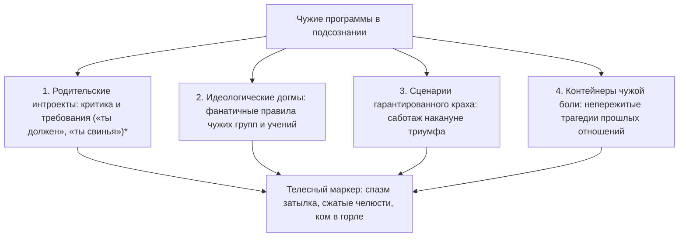

# Чужой голос в голове: как освободиться от родительских внушений

Субботний вечер. Рабочие дела на неделю наконец-то завершены. В квартире идеальная чистота, горячий чай парит в любимой кружке, а за окном медленно кружатся хлопья вечернего снега.

Ты опускаешься на мягкий диван, вытягиваешь гудящие ноги и собираешься наконец открыть книгу или включить фильм.

И в эту самую секунду в основании черепа натягивается ледяная, звенящая струна. 

В голове вспыхивает резкий, въедливый шепот: *«Чего расселась? Вон в углу пыль осталась. Другие люди делом заняты, развиваются, проекты пилят, а ты лежишь как бревно. Встань немедленно, ничтожество!»*

Твое тело подскакивает с дивана словно от удара электрическим током. Руки сами хватают швабру или открывают рабочую почту. Книги на полке лихорадочно переставляются с места на место, стирка запускается на третий круг. Отдых бесповоротно отравлен. К ночи ты падаешь в постель в состоянии волчьего истощения, но с нулевым удовлетворением.

Мы привыкли называть это «совестью», «высокой дисциплиной» или «неугомонным характером».

Но если остановиться и прислушаться, откроется пугающая правда: этот голос внутри твоей головы не принадлежит тебе.

Это **чужой интроект** — застрявшая в подсознании чужая программа, которая маскируется под твой собственный внутренний диалог. Она круглосуточно сжигает твои жизненные силы, пока ты наивно полагаешь, что «просто родился таким тревожным человеком».

---

> [!NOTE]
> Выдающийся психоаналитик Шандор Ференци в начале XX века описал механизм **интроекции**: в моменты детской беспомощности и страха слова, оценки и эмоциональные реакции значимых взрослых проглатываются ребенком целиком, без критического осмысления. 
> 
> Позже создатель когнитивной терапии Аарон Бек доказал, что именно из этих интроектов вырастает паутина разрушительных автоматических мыслей, порождающих хроническую тревогу и депрессию.
> 
> Современные нейробиологические исследования под руководством профессора Маркуса Райхла в Вашингтонском университете пролили свет на аппаратную сторону этого процесса. Когда человек перестает выполнять внешние задачи и пытается просто отдохнуть, в мозге активируется так называемая «сеть пассивного режима» (Default Mode Network, DMN). У людей с непроработанными детскими травмами эта сеть мгновенно запускает петлю яростной самокритики: функциональная МРТ фиксирует аномальную гиперактивацию дорсомедиальной префронтальной коры, а электроэнцефалография показывает, что в моменты внутреннего самобичевания вспыхивают ровно те же зоны слуховой коры, которые реагируют на чужую агрессивную речь.
> 
> Силой воли этот голос заглушить невозможно, потому что сама воля пытается опереться на зараженную почву. Освобождение наступает лишь тогда, когда человек телесно локализует чужой голос и осознанно отзывает у него право на управление своей жизнью.

---

## Швабра в час ночи: дело Натальи

Наталье сорок пять лет. Успешный финансовый аналитик, владелица просторной трехкомнатной квартиры в центре города.

В субботу в первом часу ночи она сидела на полу собственной кухни и задыхалась от слез, сжимая в мокрых пальцах ручку швабры:

— Я стою посреди кухни и реву в голос от бессилия, — рассказывала она терапевту на следующий день. — Час ночи. Плинтусы вымыты до блеска зубной щеткой. Посуда перемыта за неделю вперед. Горы белья переглажены. Ноги гудят так, что сводит икры, поясница горит огнем. Я хотела лечь спать еще в десять вечера. Села на кровать, сняла носки… и в затылке словно зазвенела циркулярная пила! 

Голос в голове буквально взревел: *«А ну вставай, свинья нечесаная! Грязищу развела! Матери стыдно было бы людям в глаза смотреть за такую дочь!»*

— Я не смогла остаться в постели, — шептала Наталья, пряча заплаканные глаза. — Я вскочила и побежала мыть полы. Я боюсь собственной квартиры. Я чувствую себя рабыней, которую бьют палками.

> **Терапевт:** Наташа, закрой глаза. Положи ладонь на то место, где звенит эта пила.
>
> **Наталья:** *(прижимает пальцы к основанию черепа)* Здесь… Ледяной обруч, намертво стянувший затылок. В горле сухой, царапающий ком.
>
> **Терапевт:** Прислушайся к интонации фразы «свинья нечесаная». Кому принадлежит этот тембр? Кто так кричал на тебя?
>
> **Наталья:** *(после долгой паузы ее лицо белеет, плечи опускаются)* Мама… Мне десять лет. Жаркое июльское утро, суббота. Все соседские ребята во дворе гоняют в казаки-разбойники. А мама возвращается после ночной смены на заводе — лицо землисто-серое, глаза бешеные от усталости. Она срывает с меня одеяло, швыряет на середину комнаты ведро с ледяной водой и орет: «Не вырастет из тебя человека! Я на трех работах корячусь, а ты, паразитка, книжку на диване читаешь?! Мой полы, пока блестеть не будут!»
>
> **Терапевт:** Что ты чувствовала тогда?
>
> **Наталья:** Я ползала по линолеуму с тряпкой, стирала пальцы в кровь и давилась слезами. Я думала: если я отмою все углы до идеального блеска, мама успокоится, улыбнется и наконец-то погладит меня по голове…
>
> **Терапевт:** Но она не погладила.
>
> **Наталья:** Нет. Она упала на кровать и уснула, отвернувшись к стене.
>
> **Терапевт:** Наташа, мама кричала на тебя не потому, что полы были грязными. Она срывала на маленькой девочке свое взрослое отчаяние перед нищетой и безысходностью. А ты проглотила этот крик целиком — вместе с крючком и леской. И теперь ты орешь на себя маминым голосом тридцать пять лет подряд. Чьи полы ты драила сегодня в час ночи?
>
> **Наталья:** *(по щекам катятся крупные слезы)* Свои… В моей квартире, купленной на мои честно заработанные деньги… Господи, я тридцать пять лет мою мамины полы! Я каждый божий день вымаливаю у мертвого человека право просто закрыть глаза и уснуть. Как же я смертельно устала быть хорошей девочкой…

Терапевт предложил Наталье поставить образ матери перед собой на чистый кухонный пол:

> **Наталья:** Мама… Это были ваши слова, ваш страх и ваша невыносимая усталость. Я была маленькой и взяла ваш гнев на себя, надеясь спасти вас от тоски. Но сегодня я возвращаю вам эту швабру и эту ярость. Я взрослая женщина. Мой дом чист. Мое тело устало. Я стираю ваш крик из своей головы. Отныне в моих мыслях будет звучать только мой собственный, добрый голос.
>
> **Наталья:** *(сначала говорит шепотом, а потом выкрикивает эти слова во весь голос, сотрясая тишину комнаты)*

В ту же секунду ледяной обруч на затылке с сухим щелчком лопнул. По шее и плечам разлилось мягкое, покалывающее тепло.

Наталья опустила руки. В ее голове воцарилась звенящая, чистая, долгожданная тишина.

— В углу кухни остался невымытый кусок пола, — прошептала она с изумленной улыбкой. — И мне абсолютно всё равно. Мир не рухнул. Мама не кричит. Я могу просто пойти и лечь спать.

---

## Слезы системного инженера: ночной лог Жоры

В ту же ненастную октябрьскую ночь Георгий — тот самый системный инженер, от чьей удушающей рациональности сбежала Кристина, — сидел в своей холостяцкой квартире на двадцатом этаже.

За панорамным окном моросил мелкий дождь. В полумраке светился экран ноутбука, на котором была открыта статья по нейробиологии интроектов. Остывший кофе в кружке.

Дойдя до описания затылочного спазма Натальи, Георгий внезапно замер.

Его собственная шея налилась свинцовой тяжестью. Пальцы машинально коснулись затылочных бугров — мышцы были твердыми, как гранитные булыжники.

Его в детстве никто не бил ведром с водой. Его мать — завуч школы и преподаватель физики — воспитывала сына совершенно иначе. Очень тихо. Очень интеллигентно.

Она вставала в дверях детской комнаты, складывала тонкие, ухоженные пальцы на груди и с легким вздохом произносила:

— Жорик… Ну ты же у меня умный мальчик. Умные люди не совершают таких нелепых ошибок. Сделай всё как надо.

В ее голосе не было злобы. И именно поэтому этот тихий ультиматум врос в кости ребенка намертво. 

«Ты же умный» означало одно: *ты не имеешь права на слабость, на ошибку, на спонтанную эмоцию, на слезы*. Вся его железная броня, вся его привычка «чинить» близких людей, как сломанные алгоритмы, выросла из этого ледяного материнского требования безупречности.

Когда Кристина плакала на кухне, внутри Георгия вспыхивала паника: *«Ты же умный! Почини ее немедленно! Найди поломку в ее голове! Не смей чувствовать ее боль — сделай как надо!»* И он сыпал логическими аргументами, замуровывая живую, страдающую женщину в саркофаг холодных инструкций.

Георгий медленно опустил лоб на прохладную деревянную столешницу. Из его широкой груди вырвался глухой, хриплый стон:

— Мама… — прошептал он в темноту пустой комнаты. — Вы же убили во мне живого человека этим вашим «ты же умный»… Я потерял единственную женщину, которую любил больше жизни, только потому, что панически боялся показаться слабым и глупым.

Горячие слезы обожгли веки. Он не стал их вытирать. 

Впервые за сорок лет успешный, сильный мужчина позволил себе быть растерянным, неидеальным, разбитым — и по-настоящему живым.

---

## Четыре типа чужих программ

### 1. Родительские голоса
Фразы матери или отца, выученные наизусть в раннем детстве. Они не спорят с тобой — они ядовито комментируют каждый твой шаг, лишая права на отдых и радость.

### 2. Идеологические догмы
Чужие правила, почерпнутые из религиозных сект, фанатичных сообществ или токсичных корпоративных культур. Человек приносит им в жертву свои истинные потребности, искренне веря, что «служит высокой цели».

### 3. Сценарии самосаботажа
Внутренний саботажник активизируется ровно за день до долгожданного успеха: провоцирует ссору перед свадьбой, заставляет забыть паспорт перед посадкой на судьбоносный рейс или напиться перед важными переговорами.

### 4. Контейнеры чужой боли
Эмоциональные осколки тяжелых разрывов. Человек годами носит в себе обиду бывшего партнера, бессознательно защищаясь от новой любви.

---

## Практика: деинсталляция чужого голоса

Когда внутри поднимается суетливая паника, ядовитая самокритика или навязчивое чувство долга, выполни эту практику очищения:

### 1. Телесный перехват
Замри неподвижно на десять секунд. Где прямо сейчас физически отзывается этот упрекающий голос?
- Ледяной обруч на затылке?
- Сжатые до боли челюсти?
- Каменный ком в гортани?
- Дрожь в коленях?
Положи ладонь на эту область.

### 2. Опознай владельца интонации
Спроси себя прямо:
- *«Чьим тоном это сказано?»*
- *«Кто в моем детстве смотрел на меня с таким выражением лица?»*
Не пытайся анализировать логикой — позволь памяти самой высветить конкретный образ, запах или фразу из прошлого.

### 3. Твердое разделение
Представь фигуру этого человека перед собой на безопасном расстоянии. Почувствуй тепло своей ладони на зажатой мышце и произнеси вслух:

> *«Я вижу тебя и узнаю твои слова. Ты — чужой голос в моем доме. Долгие годы я принимал этот упрек за свою собственную совесть. Но сегодня я возвращаю тебе твои страхи, твою ярость и твои требования. Мое сознание свободно. Мое тело принадлежит мне. В моем внутреннем пространстве отныне звучит только мой собственный, любящий голос».*

### 4. Погружение в тишину
Сделай глубокий вдох животом и длинный выдох со звуком. Почувствуй, как расслабляются плечи, а затылок наполняется приятным, теплым покоем. 

В твоей голове воцарилась чистая, суверенная тишина. Ты дома.

---

> [!IMPORTANT]
> **Главная мысль главы**  
> Чужой голос годами маскируется под твою совесть, требуя невозможного. Точная телесная локализация интроекта навсегда лишает его власти и возвращает душе долгожданный покой.

---

> [!TIP]
> **Интерактивный помощник**  
> Если чужой критикующий голос звучит слишком громко, а попытка остановиться вызывает панический ужас — напиши в диалоговом окне внизу страницы. Мы поможем бережно нейтрализовать эту команду и вернуть опору на себя.
