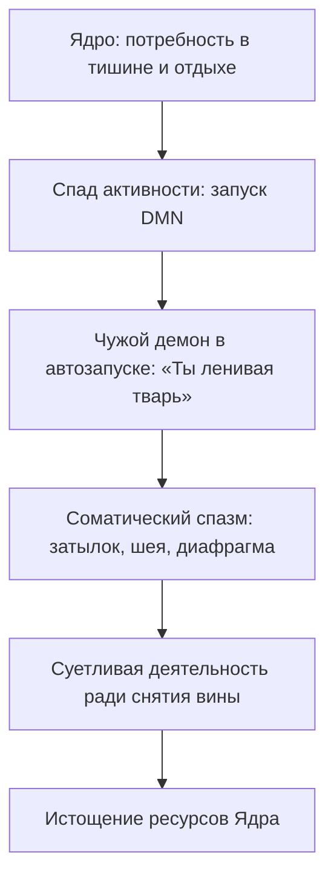

# Что такое чужой фоновый процесс

Суббота. Отчёты сданы. Пыль вытерта. Чай уже парит в кружке.

Ты садишься на диван — и в основании черепа натягивается ледяная тетива. Шепот шипит чужим ртом: *«Чего расселась? Другие пилят проекты. Встань. Ничтожество»*.

Тело подскакивает. Швабра. Почта. Книги на полке — то туда, то сюда. Отдых отравлен. К ночи — волчья усталость. Удовлетворения ноль.

Принято звать это совестью. Дисциплиной. Характером.

Остановись. Это не ты.

Чужая программа в автозапуске. Маскируется под внутренний диалог. Жрёт процессор, пока ты думаешь, что «просто такой человек».

---

## Анатомия стороннего демона

> [!NOTE]
> Ференци описал интроекцию: чужие слова входят в уязвимого ребёнка и остаются жить внутри. Бек показал, как из этого вырастают автоматические мысли. Райхл на фМРТ увидел: когда ты «просто думаешь о себе», у выгоревших людей гиперактивируется дорсомедиальная кора — петля самокритики. ЭЭГ добавляет: в момент внутреннего обвинения вспыхивают те же слуховые зоны, что при чужой речи. Воля не убивает этот демон — воля работает на тех же заражённых ресурсах. Нужен телесный якорь и снятие прав на исполнение.



Четыре класса чужих программ:

1. **Родительские интроекты.** Интонации значимых взрослых, выученные наизусть. Не спорят — комментируют каждый шаг.
2. **Идеологические подписки.** Каналы партий, движений, фанатичных групп. Туда утекают мегаватты внимания за иллюзию защиты.
3. **Скрипты отложенного краха.** Вспыхивают накануне триумфа: скандал перед свадьбой, забытый паспорт в аэропорту.
4. **Осадочные контейнеры чужой боли.** Аффекты после тяжёлых разрывов, которые психика держит как свои.

Их нельзя уговорить. Их находят телом и снимают с автозапуска.

---

## Чат с ROOT: голос в автозапуске

В девятой главе Наталья прошла родовую вину перед бабушкой, варившей лебеду в голодном сорок седьмом. После сессии обнажился другой слой — бытовой, въедливый.

Суббота. Глухая ночь. В терминале ROOT:

```status
[01:14] Наталья → ROOT
Я стою посреди кухни со шваброй и реву. Час ночи. Плинтусы вымыты. Посуда за неделю. Бельё. Ноги гудят, поясницу ломит. Хотела лечь в десять. Села, сняла носки — и в затылке зазвенела пила. Голос: «Вставай, свинья нечесаная. Грязищу развела, матери стыдно в глаза людям смотреть было бы». Я не могу остановиться. Я боюсь своего дома.
```

```status
[01:16] ROOT → Наталья
Останови швабру. Брось тряпку. Шаг назад. Сядь на табурет.
```

```status
[01:17] Наталья → ROOT
Бросила. Сижу. Руки трясутся. Затылок стянуло ледяным обручем, в горле сухой ком. Мысли орут: «Слабачка. Даже полы домыть не способна».
```

```status
[01:18] ROOT → Наталья
Обруч на затылке — якорь чужого процесса.
Вслушайся в тембр «свинья нечесаная».
Какой возраст у этого голоса? Какой тембр?
```

```status
[01:21] Наталья → ROOT
(пауза 3 минуты)
Это… мама. Мне десять. Лето, суббота, дети во дворе гоняют мяч. Мама со второй смены — лицо серое, глаза бешеные. Срывает одеяло, швыряет ведро с ледяной водой: «Не вырастет из тебя человека! Я горбачусь на трёх работах, а ты, паразитка, книжку читаешь! Мой полы, пока блестеть не будут!»
Я драила линолеум и давилась слезами — думала, отмою до блеска, и мама улыбнётся, погладит по голове.
```

```status
[01:23] ROOT → ROOT
THREAD_AUDIT:
Name: maternal_introject_scrub_loop.exe
PID: 35-years-runtime
Impact: chronic exhaustion, self-directed verbal abuse, 0% idle capacity
Status: ACTIVE in user space
```

```status
[01:24] ROOT → Наталья
Мама не гладила тебя не потому, что полы были грязными. Она срывала на тебе отчаяние перед нищетой. Ты заглотила этот крик целиком — наживку вместе с крючком.
Теперь ты орёшь на себя маминым ртом тридцать пять лет.
Посмотри на взрослые руки.
Чьи полы ты моешь в час ночи?
```

```status
[01:28] Наталья → ROOT
Свои… Мои. В моей квартире. Купленной на мои деньги.
(слёзы капают на экран)
Господи, я тридцать пять лет мою мамины полы… Каждый день заслуживаю право закрыть глаза. Я так устала быть хорошей девочкой для женщины, которая умерла десять лет назад.
```

```status
[01:30] ROOT → Наталья
Вынеси фигуру матери наружу. Поставь её на чистый кухонный пол.
Почувствуй холодный затылок и скажи вслух, глядя в глаза:
«Мама. Это ваши слова, ваш страх и ваш гнев. Я была маленькой и взяла их, чтобы спасти вас от тоски. Сегодня я возвращаю вам швабру и ярость. Я взрослая. Мой дом — чистый. Моё тело — устало. Я стираю ваш крик из автозапуска. В моей голове будет звучать только мой голос».
```

```status
[01:35] Наталья → ROOT
Сначала сипела. Потом крикнула во весь голос в пустоту кухни.
Обруч лопнул.
В затылке — словно отстегнулась ржавая пряжка.
По шее — горячее покалывание. В голове — тишина. Хрустальная. Пугающая.
Сижу посреди невымытого угла. И мне всё равно. Мир не рухнул. Меня никто не бьёт. Я могу пойти спать.
```

`[Процесс maternal_introject завершен. Память освобождена]`

---

## Ночной лог Жоры

В ту же ночь Жора читал этот лог в холостяцкой квартире на двадцатом этаже.

За окном — мелкий октябрьский дождь, огни высоток в жёлтых пятнах. Остывший кофе. Тёмный монитор.

Он дошёл до затылочного спазма Натальи — и замер.

Собственная шея налилась свинцом. Рука коснулась бугров за ушами. Мышцы — как гранит.

Его никто не бил ведром. Мать — учительница физики — говорила иначе. Тихо. Стояла в дверях детской, складывала тонкие пальцы на груди:

— Жорик, ну ты же умный мальчик. Умные люди не совершают таких нелепых ошибок. Сделай как надо.

Беззлобно. И поэтому сросся до кости. «Ты же умный» означало: *нет права устать, растеряться, быть слабым*. Вся его броня, вся удушливая логика, от которой задыхалась Кристина, выросла из этого тихого ультиматума.

Когда Кристина плакала на кухне, процесс вспыхивал: *«Ты же умный. Почини её. Найди баг. Не чувствуй. Сделай как надо»*. И он сыпал инструкциями, замуровывая живую женщину в саркофаг рацио.

Жора опустил лоб на холодную столешницу. Из горла — хриплый стон.

— Мама… — прошептал в пустую комнату. — Вы убили во мне человека этим «ты же умный»… Я потерял единственную, которую любил, потому что боялся оказаться глупым и живым.

Слёзы обожгли веки. Он не вытирал. Впервые за сорок лет позволил себе быть глупым, разбитым, беспомощным. Чужой процесс дал первую глубокую трещину.

---

## Практика: деинсталляция стороннего демона

Когда поднимается суетливая самокритика, тревога или зудящий долг:

1. **Соматический перехват.** Замри на десять секунд. Где сигнал? Основание черепа, верхняя челюсть, горло, виски.
2. **Аутентификация отправителя.** *«Чьим тоном это звучит? Кто так со мной говорил?»* Не анализируй — дай всплыть лицу, интонации, запаху, фразе.
3. **Команда на завершение.** Поставь фигуру владельца перед собой. Ладонь на зажим:
   > «Я вижу тебя и узнаю твои слова. Ты — чужой процесс. Долго я принимал этот шум за свою суть. Сегодня я отзываю права доступа. Твои ожидания и тревога остаются в твоём времени. Мой процессор свободен. В моём доме звучит только мой голос».
4. **Фиксация чистого фона.** Вдох до тазового дна. Тишина за затылком. Тепло по плечам и шее.

Ты — хозяин своей машины. Очисти автозагрузку от призраков.

> [!IMPORTANT]
> **Закон главы**
> Сторонний фоновый процесс годами паразитирует в автозагрузке под видом внутреннего голоса, но точная соматическая локализация чужого интроекта навсегда отключает его питание и возвращает процессору суверенную тишину.

> [!TIP]
> **Живой AI-психолог**
> Если голос слишком силён и попытка остановиться вызывает панический ужас — открой чат на сайте (иконка внизу страницы), чтобы провести бережную деинсталляцию в реальном времени.
