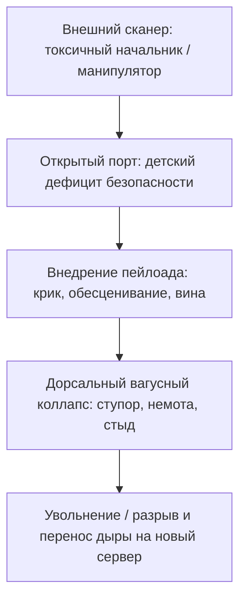

# Принцип открытого порта

Выставь сервер в интернет с паролем `admin/admin` — гости придут за минуты. Не злые гении. Боты. Сканируют диапазоны. Дыра зовёт сама.

В жизни то же. Меняешь работу — через пару месяцев новый начальник снова тиран. Меняешь партнёров — сюжет копируется. Города, компании, круг.

Хакер возвращается, словно по объявлению.

Ты жалуешься на «не тех людей». Дело не в людях. Дело в **открытом порте**, который ты носишь с собой. Он транслирует сигнал и ловит ровно тот трафик, под который настроен.

Чужой гнев, манипуляция, обесценивание пролетают мимо закрытой двери, как мусорные пакеты. В открытый порт тот же сигнал заходит на правах администратора, хозяйничает в памяти и парализует процессор.

---

## Архитектура пробоины

> [!NOTE]
> Пеннебейкер показал: держать невыраженный аффект дорого — тело платит непрерывно и снижает порог возбуждения. Порджес добавил: ребёнок, которого годами ломали подчинением, теряет нейроцепцию — умение отличить опасность от шума. Вентральный вагус не тормозит. Перед доминантным агрессором тело падает в дорсальный коллапс: ступор, брадикардия, немота. В сети это незакрытый порт управления. Хакер не ломает стену — он входит в штатный разъём, оставленный открытым в детской перегрузке. Бегство от сканеров бесполезно. Закрывается сам порт — через насыщение дефицита безопасности в теле.

Три конфигурации:

* **Порт дефицита.** В детстве недодали тепла, признания, простого «ты хороший». Или денег — бедность впечаталась как норма. На месте пустоты — вакансия: «возьму любовь или деньги любого качества, срочно». Сбегаются худшие. Голодная система примет абьюз — лишь бы заполнить вакуум.
* **Порт незажившей травмы.** Старый пролом под гиперчувствительной броней. Малейшее повышение тона — как повтор катастрофы. Паралич.
* **Порт частотного резонанса.** Фоновое *«я маленький и беззащитный»* звучит как радиомаяк. На него слетаются любители лёгкой добычи.

Бесполезно менять декорации, пока порт открыт. Уйдёт один агрессор — система вызовет следующего.

---

## Сессия. Костя

Косте тридцать шесть. Ведущий инженер по базам данных. Рост под метр девяносто, широкие плечи, густая борода — и взгляд подростка, которого загнали в угол школьного туалета.

За два года — три престижные IT-компании. Сюжет один: первые месяцы на отличном счету, потом техдир или тимлид устраивает публичные разносы на планёрках. Костя не спорит. Каменеет. Глаза в пол. Холодный пот. Через пару месяцев — заявление, запой на съёмной, кулаки в стену: «Почему снова струсил?! Почему не врезал?!»

На сессии сидел, ссутулившись, будто старался занять меньше места.

— Я профессионал, — хрипло, в пол. — Мой код держит терабайты. Но когда шеф повышает голос… пробки вышибает. Взрослый мужик — и стою перед сопляком-менеджером без единого слова. Горло пережато. Язык деревянный. Внутри всё стынет.

— Костя, посмотри на руки, — спокойно перебил терапевт.

Правая мёртвой хваткой вцепилась в левое предплечье. Ногти сквозь свитер — тёмные точки крови.

— Где тело научилось этой позе? Кого ты удерживаешь от крика?

Дыхание остановилось. Пальцы побелели. Губы задрожали.

— Мне восемь… — сиплый детский голос. — Гарнизон под Читой. Мороз за сорок. Отец — майор артиллерии, списанный, пьющий. Я пришёл из школы, забыл вытереть сменку, наследил талым снегом на коричневом коврике…

В горле — сухой хруст.

— Отец вышел из кухни в майке — дешёвый табак и перегар. Вены на шее — канаты. Сорвал армейский ремень с латунной пряжкой и орал так, что звенели рюмки в серванте: «Ты здесь никто! Щенок! Жрёшь мой хлеб — стой смирно и молчи, пока я не разрешу дышать!» Я стоял на коврике… вцепился в руки, чтобы не пискнуть — пряжка прилетит в лицо. Ждал, когда меня убьют.

Слёзы хлынули — не тихие капли, а надрывный плач мужчины, которого двадцать восемь лет держали на гарнизонном коврике под занесённым ремнём. Костя согнулся, уткнулся в ладони. Мощные плечи ходили ходуном.

— Он орал не из-за следов, — твёрдо сказал терапевт, положив руку на спину. — Отец орал от бессилия и нищеты. Ты остался на том коврике на всю жизнь. Приносишь его на каждую планёрку. Порт открыт: стоишь перед кричащим шефом и ждёшь пряжку. Начальник считывает оцепенение и усиливает напор.

Пауза. Рыдания утихли.

— Встань, Костя. Во весь рост.

Метр девяносто. Огромные ладони. Плечи расправлены.

— Посмотри в тёмный угол прихожей. Там пьяный, несчастный майор из девяностых. Скажи ему правду глазами взрослого.

Долго дышал. Гул крови в ушах. Потом — низкий, густой бас:

— Отец. Я вижу ваш страх и вашу ярость. Это была ваша война и ваше крушение. Но я больше не тот пацан на сыром коврике. Вы меня не убьёте. Я зарабатываю свой хлеб мозгами. Мои счета — мои. Я выхожу из вашего строя. Я закрываю этот порт.

В груди что-то глухо провернулось. Пальцы разжались. Воздух с шипением заполнил живот. Плотное, устойчивое тепло.

Через месяц — короткое сообщение:

> «Вчера на демо техдир сорвался на крик из-за сбоя в базе. Брызгал слюной при всех. Раньше провалился бы сквозь землю. А вчера — ровная тишина. Живот тёплый, челюсти свободны. Откинулся на спинку, посмотрел в зрачки: "Игорь Сергеевич, сбавьте тон. В таком формате мы работать не будем. Откройте логи — вот факты". Он осёкся, моргнул, пробормотал про переутомление и перешёл на деловой тон. Мой страх больше не зовёт его на бойню. Дверь заперта».

`[Сессия Кости завершена. Порт уязвимости закрыт]`

---

## Практика: соматическое закрытие порта

Если снова и снова — агрессия, обесценивание, манипуляция:

1. **Опознание сигнала.** Эпизод, когда чужой напор дал оцепенение, желание исчезнуть, судорожное оправдание. Где ловушка? Эпигастрий, немота языка, поджатые пальцы ног.
2. **Поиск первичного адреса.** *«Перед кем в детстве надо было замереть и перестать дышать, чтобы уцелеть?»* Дай всплыть реальной сцене.
3. **Разрыв соматической дуги.** Стопы на ширине плеч. Вес взрослого тела. Челюсти разомкни. Вдох животом:
   > «Я вижу эту точку входа. В детстве оцепенение спасло мне жизнь. Я признаю эту защиту. Сегодня я взрослый. Моя безопасность опирается на мою силу и мои границы. Чужой гнев — чужая буря. Я закрываю порт детского страха. Периметр — под моим контролем».
4. **Калибровка нейтрального присутствия.** Минута в стопах и дыхании. Заметь: защищаться больше не нужно. Закрытый порт невидим для манипуляций.

Хакеры не штурмуют стены, если порты заперты.

> [!IMPORTANT]
> **Закон главы**
> Агрессор или манипулятор входит исключительно в незакрытый дефицит признания, но внутреннее соматическое насыщение этой пустоты навсегда лишает внешнего хакера ключей доступа к твоей системе.
