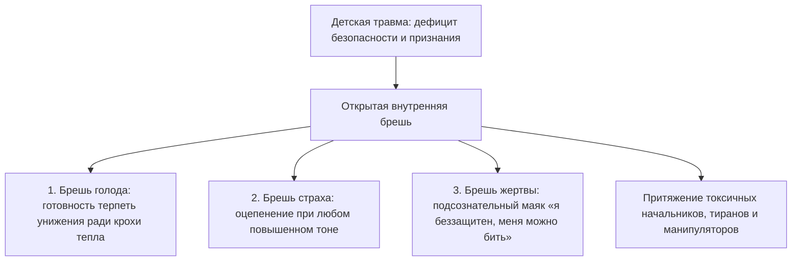

# Открытый порт: почему мы притягиваем чужую агрессию

Ты наверняка не раз наблюдал в своей жизни странную и мучительную закономерность.

Ты меняешь место работы, надеясь сбежать от самодура-начальника, но спустя три месяца новый руководитель начинает общаться с тобой ровно тем же унизительным, приказным тоном. Ты разрываешь токсичные отношения с партнером-манипулятором, долго приходишь в себя, клянешься больше никогда не наступать на эти грабли — но следующий избранник с пугающей точностью повторяет те же сцены обесценивания и контроля.

Кажется, что весь мир полон агрессоров, которые словно по тайному сговору находят именно тебя.

Мы привыкли сетовать на фатальное невезение или плохих людей. Но горькая правда заключается в другом: дело не во внешних людях, а в **открытой внутренней бреши**, которую ты повсюду носишь с собой.

Твоя психика непрерывно транслирует в пространство безмолвный сигнал. 

Чужой гнев, попытка манипуляции или хамство случайного прохожего легко пролетают мимо человека с закрытыми, здоровыми границами: они отскакивают, как сухой горох от гранитной стены. Но если внутри тебя зияет старая детская рана, тот же самый чужой крик входит внутрь без малейшего сопротивления, мгновенно парализуя волю и погружая тело в ледяной ступор.

Бесполезно менять декорации, города и компании, пока эта брешь остается распахнутой настежь. Уйдет один тиран — твой внутренний сигнал немедленно призовет следующего.

---

> [!NOTE]
> В фундаментальных работах профессора Стивена Порджеса по поливагальной теории описан механизм **нейроцепции** (neuroception) — подсознательной способности автономной нервной системы ежесекундно сканировать окружающую среду на предмет безопасности.
> 
> Когда ребенок растет в атмосфере непрекращающегося домашнего насилия, непредсказуемой агрессии или родительского гнева, его естественные защитные рефлексы ломаются. В присутствии доминантного агрессора организм ребенка не может ни убежать, ни дать отпор. Включается самая древняя форма биологической защиты — дорсальное вагусное торможение: резкое замедление пульса, оцепенение мышц, потеря голоса и диссоциация («притворись мертвым, чтобы не добили»).
> 
> Профессор Джеймс Пеннебейкер доказал: подавленный, незавершенный аффект ужаса сохраняется в теле десятилетиями, постоянно удерживая порог нервного возбуждения на критическом уровне. Взрослый человек может обладать внушительной внешностью и блестящим умом, но при малейшем окрике или повышении тона со стороны начальника его нервная система мгновенно проваливается в тот самый детский паралич. Агрессор безошибочно считывает этот язык тела и инстинктивно усиливает давление. 
> 
> Единственный способ разорвать этот круг — не бегство от внешних угроз, а восстановление чувства взрослой безопасности внутри собственного тела.

---

## Парень с гарнизонного коврика: история Кости

Константину исполнилось тридцать шесть лет. Ведущий архитектор баз данных в крупнейшей технологической компании.

Внешне он производил впечатление богатыря: рост метр девяносто, косая сажень в плечах, густая смоляная борода, тяжелые мускулистые руки. И при этом — глаза насмерть перепуганного подростка, которого старшеклассники загнали в угол темного школьного туалета.

За последние два года Костя сменил три престижные IT-компании. Сюжет везде развивался по одной и той же колее: первые месяцы он был на великолепном счету, руководство восхищалось его профессионализмом. А затем технический директор или руководитель проекта на общей планерке позволял себе публично повысить голос из-за рабочего сбоя.

И огромный, сильный мужчина мгновенно каменел. 

Глаза в пол. Лицо покрывалось белыми пятнами. Дыхание перехватывало. Костя не мог выдавить из себя ни единого слова в свою защиту. Он молча сносил унижение, а через пару месяцев писал заявление об увольнении по собственному желанию. Дома он неделями глушил позор водкой и в бессильной ярости разбивал кулаки о кафель ванной: «Господи, почему я снова струсил?! Почему я не врезал этому сопляку прямо там, при всех?!»

На консультации Костя сидел, неестественно ссутулив широкие плечи, словно пытаясь стать крошечным и невидимым в глубоком кресле.

— Я первоклассный специалист, — хрипел он, глядя в пол. — Моя архитектура держит петабайты сложнейших транзакций. Но когда шеф на планерке повышает голос… у меня словно выбивает пробки. Я взрослый, здоровый мужик — и стою перед ним как парализованный. Горло пережато удавкой. Язык превращается в кусок сухого дерева. Внутри всё замерзает…

> **Терапевт:** Костя, посмотри прямо сейчас на свои руки. Внимательно посмотри.

Костя опустил глаза. Его правая пятерня мертвой хваткой вцепилась в собственное левое предплечье. Ногти сквозь рукав плотного шерстяного свитера впились в кожу до темно-багровых кровоподтеков.

> **Терапевт:** Где твое тело выучило эту позу, Костя? Кого ты так отчаянно удерживаешь от крика?

Дыхание мужчины оборвалось со свистом. Пальцы побелели от чудовищного спазма. Его губы мелко задрожали, а плечи опустились.

— Мне восемь лет… — голос сорокалетнего великана внезапно стал тонким, прерывающимся голосом маленького мальчика. — Забайкалье. Военный гарнизон под Читой. Зима, мороз за сорок градусов… Мой отец — майор артиллерии. Его списали из армии по ранению, он пил по-черному каждый день. Я пришел из школы, закоченел, второпях забыл вытереть ботинки и наследил талым снегом с грязью на коричневом коврике в прихожей…

Костя судорожно сглотнул, в горле раздался сухой хруст:

— Отец вывалился из кухни в майке-алкоголичке. От него разило перегаром и папиросами «Беломор». Вены на шее вздулись, как толстые канаты. Он сорвал с брюк тяжелый офицерский ремень с литой латунной пряжкой и взревел так, что задребезжали рюмки в серванте: «Ты здесь никто, щенок! Ты жрешь мой хлеб! Стой смирно и не дыши, пока я не разрешу!» Он замахнулся… Я стоял на том мокром коврике, вцепился ногтями в свои руки, чтобы не пискнуть от ужаса, потому что знал: если закричу — пряжка прилетит прямо в лицо. Я зажмурился и ждал, когда он меня убьет…

Слезы полились ручьем — не тихие слезы обиды, а страшный, надрывный плач взрослого мужчины, которого двадцать восемь лет держали на том ледяном гарнизонном коврике под занесенным ремнем. Костя согнулся пополам, закрыв лицо огромными ладонями. Его спина содрогалась в рыданиях.

> **Терапевт:** Костя, твой отец орал тогда не из-за следов на полу. Он вымещал на восьмилетнем сыне свой животный страх перед нищетой, ненужностью и крушением собственной жизни. Но ты остался стоять на том коврике на двадцать восемь лет. Ты приносишь его с собой на каждую планерку. Твой внутренний порт распахнут настежь: ты видишь перед собой кричащего начальника и ждешь удара пряжкой. Руководитель подсознательно считывает твой паралич и давит еще сильнее.

Рыдания постепенно стихли. В кабинете стало тихо.

> **Терапевт:** Встань, Константин. Встань во весь свой богатырский рост.

Костя медленно поднялся. Метр девяносто. Могучие плечи, огромные натруженные ладони.

> **Терапевт:** Посмотри в тот темный угол прихожей. Там стоит пьяный, несчастный, сломленный жизнью майор из девяностых годов. Посмотри на него глазами взрослого, сильного мужчины. Скажи ему правду.

Костя долго и глубоко дышал, слушая глухой стук собственного сердца. А затем заговорил — низким, бархатным, сокрушительным басом:

— Отец… Я вижу твой ад, твою боль и твою сломанную судьбу. Но это было твое крушение и твоя жизнь. А я больше не тот беспомощный восьмилетний мальчик на сыром коврике. Ты больше никогда не поднимешь на меня руку. Ты меня не убьешь. Я сам зарабатываю свой хлеб. Мои счета оплачены мной. Я выхожу из твоего гарнизона. Я навсегда закрываю эту дверь.

Где-то под ключицами у Кости словно провернулся тяжелый латунный ключ. Пальцы, терзавшие предплечье, мягко разжались. Горячий, плотный воздух волной заполнил живот. 

Его тело обрело несокрушимую, монолитную устойчивость.

Спустя месяц Костя прислал короткое письмо:

> *«Вчера на общем демо-дне технический директор сорвался из-за сбоя серверов. Начал орать, брызжа слюной на всю переговорную. Раньше у меня потемнело бы в глазах, и я провалился бы сквозь землю.*
> 
> *А вчера внутри меня стояла абсолютная, несокрушимая тишина. В животе было горячо, челюсти свободны, дыхание ровное. Я спокойно откинулся на спинку кресла, посмотрел ему прямо в зрачки и негромко произнес: "Игорь Сергеевич, сбавьте тон. В таком формате мы диалог вести не будем. Откройте системные логи — вот сухие факты".*
> 
> *Он поперхнулся на полуслове. Замолчал, растерянно моргнул, пробормотал что-то про тяжелую неделю и перешел на деловой тон.*
> 
> *Мой детский страх больше не зовет его на расправу. Мой гарнизонный коврик наконец-то сгорел».*

---

## Три вида открытых брешей

### 1. Брешь эмоционального голода
Если в детстве ребенка морили эмоциональным голодом — не хвалили, не обнимали, заставляли заслуживать любовь пятерками, — во взрослом возрасте он соглашается на любые токсичные условия. Он готов терпеть издевательства начальника или партнера, лишь бы иногда получать скупую похвалу.

### 2. Брешь незажившего страха
Ребенок, переживший жестокое подавление или побои, реагирует на любой конфликт как на угрозу жизни. При малейшем споре его мышцы каменеют, голос пропадает, а логика отключается.

### 3. Брешь виктимного резонанса
Человек с глубинным убеждением «я ничтожество, меня никто не защитит» излучает эту покорность в микромимике, походке и интонациях. Хищники и манипуляторы безошибочно вычисляют такую легкую добычу в любой толпе.

---

## Практика: закрытие бреши уязвимости

Если ты раз за разом оказываешься мишенью для чужого гнева, критики или манипуляций, выполни эту телесную практику закрытия границ:

### 1. Вспомни момент оцепенения
Воскреси в памяти недавнюю ситуацию, когда чужой напор вызвал в тебе ступор, желание исчезнуть или судорожные оправдания:
- Где в теле возник паралич?
- Сжалось ли солнечное сплетение?
- Онемел ли язык?
- Поджались ли пальцы на ногах?

### 2. Найди исток страха
Задай себе вопрос: *«Перед кем в моем детстве я должен был замереть и перестать дышать, чтобы просто выжить?»* Позволь памяти показать ту самую комнату, тот крик и то занесенное наказание.

### 3. Восстановление взрослой силы
Встань прямо. Поставь стопы на ширину плеч, почувствуй вес своего взрослого тела. Разомкни челюсти, расправь плечи. Положи ладонь на живот и сделай глубокий вдох:

> *«Я вижу эту старую брешь. В детстве оцепенение и покорность спасли мне жизнь. Я с уважением признаю ту детскую защиту. Но сегодня я взрослый человек. Моя безопасность опирается на мою собственную силу, мой ум и мои границы. Чужой гнев — это не смертельный приговор, а просто чужая слабость. Я навсегда закрываю дверь детского страха. Мой дом — под моей защитой».*

### 4. Взгляд равного
Представь своего начальника, критика или партнера. Посмотри на него не снизу вверх из детского ужаса, а строго на одном уровне — глаза в глаза. 

Когда брешь закрыта изнутри, чужой крик превращается в пустой звук за толстым стеклом. Тебе больше не нужно ни нападать, ни прятаться. Ты в безопасности.

---

> [!IMPORTANT]
> **Главная мысль главы**  
> Манипулятор или тиран способен войти лишь туда, где зияет детский дефицит безопасности. Насыщение этой пустоты взрослой опорой навсегда лишает внешнего агрессора ключей к твоей душе.

---

> [!TIP]
> **Интерактивный помощник**  
> Если воспоминание об отцовском или материнском крике вызвало спазм в груди или дрожь в коленях — напиши в диалоговом окне внизу страницы. Мы поможем бережно вернуть ощущение устойчивой опоры под ногами.
