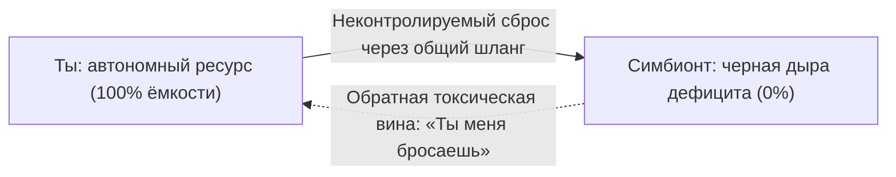

# Симбиоз процессов

Разговор — полчаса. Никто не повышал голос. Не бил посуду. Воскресный созвон с матерью, партнёром, родственником: новости, погода, длинный список обид на мир.

Красная кнопка. В глазах темнеет.

Ноги ватные. В груди — холодная сосущая пустота. Заряд — три процента. Хочется лежать и не двигаться.

Ссоры не было. Тебя «держали в курсе». К вечеру — ноль на проекты, зал, детей. Энергия весь день уходила в чужую систему. Ты называл это заботой.

Это не усталость. Это **симбиоз процессов** — шланг, по которому чужой дефицит откачивает твою ёмкость, пока сказки о «дочернем долге» и «святой близости» убаюкивают сознание.

---

## Сообщающиеся сосуды

> [!NOTE]
> Минухин описал «запутанные семьи»: границы между людьми размыты, стресс одного мгновенно заражает всех. Боуэн добавил: чем ниже дифференциация «Я», тем сильнее ты спаян с семейной эмоциональной массой — и тем хуже сам регулируешь тело. В инженерии это tight coupling: два сервиса на общей памяти. Завис один — каскадом выедает ресурсы у второго. Живая связь возможна только между двумя отдельными. Разделение каналов не убивает любовь. Оно убирает паразитическую перекачку.

Три магистрали:

* **Родитель и взрослый потомок.** Мать делает дочь органом утилизации своей тревоги: *«Ты моя единственная опора, без тебя я умру»*.
* **Слияние в паре.** «Мы — половинки одного целого» — один отказывается от взрослости, второй — от собственной жизни.
* **Канал к незавершённой потере.** Труба в прошлое к умершему. Психика отказывается признать уход и отапливает могилу живым теплом.

Настоящая близость начинается там, где кончается симбиоз. Пока границы размыты, вы не видите друг друга — только розетку и штепсель.

---

## Быль: воскресный шланг

Татьяне тридцать восемь. Архитектор интерфейсов. Квартира-студия, свет, стеллажи с книгами по искусству. Снаружи — эталон самостоятельности.

Каждое воскресенье в 18:00 на стеклянном столике вибрирует телефон. Фото: мама.

Внутри — ржавый ключ. Живот каменеет. Тошнота. Пальцы холодеют.

Тамара Львовна, шестьдесят восемь, провинциальный городок в пятистах километрах. Разговор не с крика. С липкого тихого стона:

— Танюша… Ты не занята? У меня опять аритмия… Соседка ковры выбивала, голова… Одиноко так, доченька, хоть волком вой. Никому старуха не нужна. Ты хоть не забывай мать, пока я жива…

Татьяна сжимает трубку мокрыми пальцами:

— Мамочка, давай кардиолога на дом! Я оплачу! Хочешь — санаторий на воды?

Тяжёлый вздох из трубки:

— Конечно… Деньгами откупаешься. Чужие мне не нужны. Мне твоё сердце… Ладно, иди к своим важным делам, а я уж в темноте посижу…

В солнечное сплетение — толстый чёрный рукав. Из фасций, из лёгких с гулом выкачивают жизнь. Мать глотает тепло. Внутри Тамары Львовны — дыра не прожитого горя по ушедшей молодости. Её не заткнуть океанами дочерней крови.

Два часа. Отбой.

Татьяна сползает с дивана на ковёр. Не может дойти до кухни за водой. Мужчина пишет: «Таня, мы едем ужинать?». Она читает сквозь пелену и гасит телефон — ни миллиграмма на чужое прикосновение. По понедельникам срывает дедлайны. Ночами — тахикардия.

Перелом — на сессии.

Колени к груди. Тёмные круги:

— Я физически умираю после каждого звонка. Но как положить трубку? Она же моя мать! Замолчу — инфаркт! Я буду убийцей!

— Посмотри в солнечное сплетение, — сказал терапевт. — Что там соединяет тебя с матерью?

Зажмурилась. Дыхание сбилось:

— Трос. Чёрный резиновый шланг. Пульсирует. От меня к ней — горячее. Обратно — ледяная муть.

— Твоя мать — младенец в кювезе на твоих лёгких? Или шестидесятивосьмилетняя женщина, которая выжила в девяностые, вырастила тебя, похоронила мужа и имеет собственную судьбу?

Тишина.

— Она взрослая… — прошептала Татьяна.

— Тогда почему твоя плоть — её заместительная терапия? Сколько ни лей в шланг — она не станет молодой и счастливой. Ты сгораешь в её печи. Лишаешь себя детей, мужчины, будущего.

Слёзы — не вина. Освобождение. Плач по детству, в котором ей не разрешали быть маленькой.

— Возьми инструмент. Перережь трубу. Сейчас.

Рубящее движение в воздухе.

— Я люблю вас, мама, — через рыдания. — Но я ваша дочь, а не аккумулятор. Я снимаю шланг. Моя жизнь — моя. Ваша судьба, ваша старость, ваша тоска — ваши. Я выбираю остаться живой.

Глаза распахнулись. Руки на живот.

— Боже… Тепло. Как грелка. В животе плотно. Дышать… как легко дышать!

Через неделю в 18:00 телефон снова.

Сердце чаще — но без ледяного спазма. Десять минут жалоб. Потом шарманка: «Ой, голова кружится, наверно, умирать пора…».

Раньше — судорожные врачи.

Сейчас — дыхание в живот, твёрдый паркет под ногами:

— Мамочка, если кружится — прилягте и вызовите 112. Я люблю вас. Наберу в среду. Целую. Хорошего вечера.

Красная кнопка.

Телефон на стол. К окну. Осенний закат — розовый и медный. Руки не дрожат. В груди тихо и просторно. Впервые за тридцать восемь лет жизнь принадлежала ей целиком.

`[Сессия Татьяны завершена. Симбиотический канал перекрыт]`

---

## Практика: демонтаж симбиотической магистрали

Если после контакта с кем-то — соматический провал и опустошение:

1. **Сканирование шлюза.** Ладонь на солнечное сплетение. Образ человека. Где труба, трос, шланг, жгут?
2. **Соматическая цена.** Сколько уходит в сутки? *«Что я искупаю этой жертвой? Чью пустоту пытаюсь заткнуть собой?»*
3. **Демаркация.** Жест отсечения перед сплетением:
   > «Я вижу эту трубу. Долго я отдавал силы из детского страха быть отвергнутым. Сегодня я перекрываю клапан. Моя ёмкость возвращается ко мне. Твой дефицит — твоя зона роста. Я выбираю любить тебя на расстоянии вытянутой руки, оставаясь отдельным человеком».
4. **Телесная граница.** Упругая оболочка вокруг тела на полметра. Вдох — тепло и свет в этот объём.

Любовь живёт на границе двух суверенных миров.

> [!IMPORTANT]
> **Закон главы**
> Физическое перекрытие симбиотического канала перекачки ресурсов останавливает паразитное истощение системы и возвращает обоим участникам шанс на зрелую автономную жизнь.
