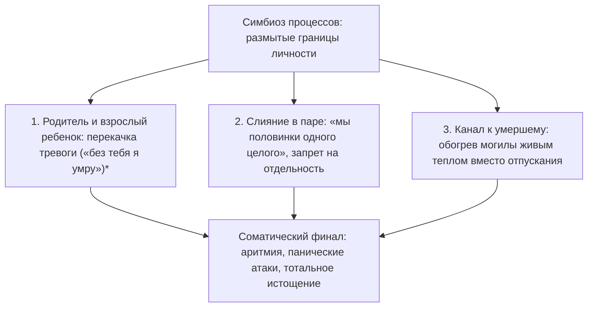

# Симбиоз: почему забота о близких опустошает дотла

Разговор по телефону длился всего полчаса. 

Никто не кричал. Никто не хлопал дверьми и не сыпал оскорблениями. Это был обычный воскресный созвон с матерью, пожилым родственником или эмоционально зависимым партнером: обсудили погоду, последние городские новости, здоровье и длинный список обид на несправедливый мир.

Ты нажимаешь красную кнопку отбоя на экране смартфона.

И в ту же секунду в глазах темнеет. Ноги становятся ватными. В области солнечного сплетения разверзается холодная, сосущая пустота, словно из тебя вынули внутренности. Запас жизненных сил стремительно падает до нуля. Хочется просто лечь лицом в подушку и не шевелиться несколько часов.

Внешне не произошло никакого конфликта. Тебя просто «держали в курсе семейных дел». 

Но к вечеру у тебя нет ни капли ресурса на собственное творчество, на спортзал, на любимого человека или на собственных детей. Твоя жизненная сила весь день самотеком уходила в чужую бездну. А ты по привычке называл это «дочерним долгом» или «святой заботой о родителях».

Это не банальное переутомление. Это **токсический симбиоз** — невидимая труба, по которой чужой дефицит выкачивает твою жизнь, пока сладкие сказки о жертвенности убаюкивают твою бдительность.

---

> [!NOTE]
> Основатель структурной школы семейной терапии Сальвадор Минухин ввел классическое понятие **«запутанных семей»** (enmeshed families). В таких семьях границы между личностями полностью стерты: переживание, тревога или соматический симптом одного члена семьи мгновенно заражает всех остальных.
> 
> Другой корифей психотерапии, Мюррей Боуэн, сформулировал теорию **дифференциации «Я»**: чем слабее человек отделен от эмоциональной массы своей родительской семьи, тем хуже его собственная автономная нервная система справляется со стрессом. Человек живет в состоянии слияния, не различая, где заканчиваются его чувства и начинаются чужие страдания.
> 
> Подлинная, зрелая любовь возможна исключительно между двумя суверенными, отдельными личностями. Разделение каналов не разрушает близость. Напротив: оно уничтожает паразитическую зависимость и впервые дает возможность увидеть реального человека рядом, а не использовать его как питательную батарейку.

---

## Воскресный звонок: история Татьяны

Татьяне исполнилось тридцать восемь лет. Блестящий архитектор цифровых интерфейсов, интеллигентная, красивая женщина с тонким вкусом. 

Ее квартира-студия в тихом центре была наполнена светом, комнатными растениями и альбомами по классическому искусству. Со стороны Татьяна казалась образцом независимой, состоявшейся женщины.

Но каждое воскресенье ровно в 18:00 на ее стеклянном журнальном столике начинал вибрировать телефон. На заставке высвечивалось лицо матери.

В ту же секунду в животе Татьяны поворачивался ржавый ключ. Желудок сводило судорогой тошноты. Пальцы мгновенно леденели.

Тамаре Львовне было шестьдесят восемь. Она жила одна в маленьком провинциальном городке в пятистах километрах от столицы. Ее звонки никогда не начинались с открытой агрессии. Они начинались с тихого, тягучего, липкого вздоха:

— Танюша… Ты, наверное, занята? У меня опять аритмия с обеда… Соседка сверху ковры выбивала, голова раскалывается. Так одиноко, доченька, хоть волком вой на стену. Никому старуха не нужна на белом свете… Ты хоть не забывай родную мать, пока я еще жива…

Татьяна судорожно сжимала трубку взмокшими пальцами:

— Мамочка, родная! Давай я прямо сейчас вызову тебе платного кардиолога на дом? Я всё оплачу! Хочешь, я куплю тебе путевку в лучший кардиологический санаторий на воды?

В ответ из трубки доносился тяжелый, убивающий вздох вселенской скорби:

— Конечно… Деньгами откупаешься. Чужие люди мне не нужны. Мне твое сердце нужно, тепло твое дочернее… Ну да ладно, иди к своим важным столичным делам, а я уж как-нибудь в темноте посижу…

И в эту минуту прямо в солнечное сплетение Татьяны словно врезался толстый, холодный рукав. Из ее легких, из ее крови с глухим гулом начинала утекать живая энергия. Мать жадно пила это дочернее тепло. 

Но на дне души Тамары Львовны зияла черная дыра не прожитого горя по ушедшей молодости и несостоявшейся судьбе. А эту дыру невозможно заполнить даже океанами чужой крови.

Спустя два часа разговор заканчивался. 

Татьяна сползала с дивана на ковер. У нее физически не оставалось сил даже на то, чтобы дойти до кухни и налить себе стакан воды. В мессенджере всплывало сообщение от любимого мужчины: «Танюш, я забронировал столик, мы едем ужинать?» Татьяна смотрела на экран сквозь пелену слез и в бессилии гасила телефон: в ее душе не оставалось ни миллиграмма тепла для живого прикосновения.

По понедельникам она срывала рабочие дедлайны. По ночам мучилась от приступов необъяснимой тахикардии.

---

## Ножницы для пуповины

Перелом наступил на сессии у психотерапевта. Татьяна сидела, подтянув колени к груди, с серым лицом и темными кругами под глазами:

— Я физически умираю после каждого воскресного разговора. Но как я могу оборвать ее?! Она же моя мать! Стоит мне положить трубку — у нее случится инфаркт! Я буду ее убийцей!

> **Терапевт:** Таня, закрой глаза. Положи руку на солнечное сплетение. Что прямо сейчас соединяет тебя с мамой?
>
> **Татьяна:** *(зажмуривается, ее дыхание становится прерывистым)* Черный, толстый резиновый шланг… Он пульсирует прямо у меня под ребрами. От меня к ней течет горячая жизнь, а обратно идет ледяная, мутная жижа вины…
>
> **Терапевт:** Таня, скажи мне честно: твоя мама — это беспомощный недоношенный младенец в кювезе, подключенный к твоим легким? Или она шестидесятивосьмилетняя взрослая женщина, которая пережила голод, распад страны, вырастила тебя, похоронила мужа и имеет свою собственную взрослую судьбу?

В кабинете повисла долгая, глубокая тишина.

— Она взрослая… — прошептала Татьяна, и слезы брызнули из ее глаз.

> **Терапевт:** Тогда почему твое тело стало для нее аппаратом искусственного дыхания? Сколько бы ты ни вливала в нее своей крови, она не станет молодой, здоровой и счастливой. Ты добровольно сгораешь в ее топке. Ты лишаешь себя замужества, детей и собственного будущего. Возьми мысленные ножницы. Перережь эту трубу прямо сейчас.

Татьяна сделала резкое, рубящее движение ладонью перед своим солнечным сплетением:

— Я люблю вас, мама, — произнесла она сквозь сокрушительные рыдания. — Но я ваша дочь, а не ваш аккумулятор. Я отсоединяю этот шланг. Моя жизнь принадлежит мне. Ваша старость, ваша тоска и ваша судьба принадлежат вам. Я выбираю остаться живой.

Она распахнула глаза и прижала обе ладони к животу. По ее лицу растеклась ошеломленная улыбка:

— Боже мой… Тепло. Словно к животу приложили горячую грелку. Внутри стало так плотно, так устойчиво… Дышать… Как же невероятно легко дышать!

Спустя неделю ровно в 18:00 на столике снова запел телефон.

Сердце Татьяны екнуло — но привычного ледяного паралича не возникло. Она спокойно сняла трубку. Десять минут выслушивала привычные жалобы на соседей. А затем мать завела знакомую шарманку: «Ой, голова кружится, давление двести, умирать, наверно, пора…»

Раньше Татьяна в панике бросилась бы вызывать скорую и винить себя.

Сейчас она сделала мягкий вдох животом, почувствовала твердый паркет под босыми ногами и спокойно сказала:

— Мамочка, если кружится голова — приляг на диван и набери 112. Врачи приедут через десять минут. Я очень люблю тебя. Я наберу тебя в среду после работы. Целую, хорошего вечера.

И нажала красную кнопку отбоя.

Она положила телефон на стол и подошла к окну. За стеклом горел великолепный осенний закат — розовый, медовый, золотой. Руки не дрожали. В груди было тихо, просторно и светло.

Впервые за тридцать восемь лет ее жизнь принадлежала только ей.

---

## Три формы токсического слияния

### 1. Родительская черная дыра
Родитель отказывается брать ответственность за свое эмоциональное состояние и делает из выросшего ребенка единственный смысл жизни. Ребенок живет под вечным гнетом: «Если я буду счастлив отдельно от мамы — я ее убью».

### 2. Слияние в любовных отношениях
Иллюзия «мы одно целое». В такой паре партнеры не имеют собственных увлечений, друзей и личного пространства. Стоит одному проявить малейшую автономность, второй воспринимает это как смертельное предательство.

### 3. Застрявшая скорбь
Труба, протянутая в прошлое к погибшему или умершему близкому. Человек отказывается завершить траур и годами сливает свою витальную энергию на обогрев пустоты.

---

## Практика: демонтаж симбиотического канала

Если после каждого общения с близким человеком ты чувствуешь себя полностью опустошенным и обесточенным, выполни эту практику восстановления автономии:

### 1. Сканирование солнечного сплетения
Положи ладонь на живот чуть выше пупка. Представь перед собой образ человека, после общения с которым ты теряешь силы. 
Прислушайся к ощущениям: чувствуешь ли ты натяжение? Тяжелый жгут? Трос? Пульсирующую трубку?

### 2. Честный вопрос себе
Спроси себя:
- *«Что я пытаюсь искупить этой бесконечной отдачей?»*
- *«Какую детскую вину я пытаюсь замолить, отдавая свое здоровье?»*
- *«Действительно ли моя жертва делает этого человека счастливым?»*

### 3. Телесный жест разделения
Сделай четкий, рубящий жест ладонью перед областью солнечного сплетения, символически перерезая привязку. Произнеси вслух:

> *«Я вижу эту невидимую связь. Долгие годы я отдавал свои жизненные силы из детского страха остаться виноватым. Но сегодня я перекрываю эту утечку. Моя жизненная энергия возвращается ко мне. Твоя боль, твоя тоска и твое одиночество — это твоя взрослая судьба. Я не могу прожить твою жизнь за тебя. Я выбираю любить тебя на уважительном расстоянии, оставаясь отдельным, живым человеком».*

### 4. Создание упругой границы
Представь вокруг своего тела мягкую, прозрачную, но абсолютно непроницаемую сферу на расстоянии вытянутой руки. Сделай глубокий вдох, наполняя эту сферу теплом и покоем. 

Любовь расцветает только на границе двух свободных миров.

---

> [!IMPORTANT]
> **Главная мысль главы**  
> Пока ты служишь аккумулятором для чужой незрелости, никто в этих отношениях не повзрослеет. Перекрытие утечки спасает не только тебя, но и дает шанс близкому наконец встретиться с собственной жизнью.

---

> [!TIP]
> **Интерактивный помощник**  
> Если мысль об отказе от роли спасателя вызывает панику и обвинения в бессердечии — напиши в диалоговом окне внизу страницы. Мы поможем бережно выстроить твердые границы без ссор и чувства вины.
