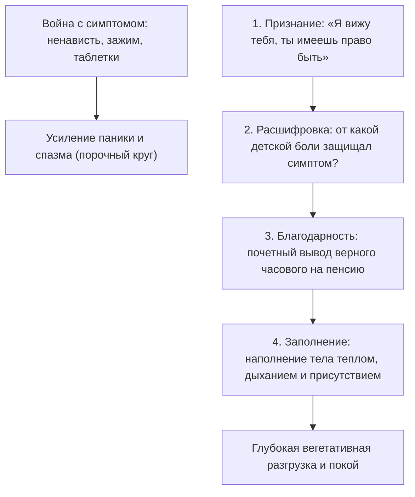

# Экологичное освобождение: почему война с собой делает симптом сильнее

Вспомни, как ты обычно поступаешь, когда внутри поднимается приступ паники, парализующая лень, внезапная неуверенность в себе или ядовитая самокритика.

Ты объявляешь этому состоянию войну.

Ты сжимаешь челюсти, берешь себя в ежовые рукавицы, начинаешь хлестать себя мотивационными лозунгами или глушить симптом таблетками. Ты шипишь сквозь зубы: *«Соберись, тряпка! Не смей бояться! Заткнись и делай!»*

Но почему-то эта священная война никогда не заканчивается победой. 

Симптом отступает на пару дней, а затем возвращается с удвоенной, свирепой силой. И обрушивается на тебя в самый неподходящий момент: за пять минут до судьбоносных переговоров, перед выходом на сцену или в минуту первого признания в любви.

Почему так происходит?

Потому что в глубинах человеческой психики действует непреложный биологический закон: **то, с чем ты яростно борешься, получает всё твое внимание и жизненную энергию**.

Объявляя войну своей тревоге или слабости, ты сам возводишь ее на пьедестал. Ты делаешь симптом главным событием своей жизни. Ты непрерывно следишь за ним, боишься его возвращения, злишься и сливаешь туда мегаватты душевных сил — те самые силы, которые могли пойти на созидание, развитие и подлинную близость.

Враг жиреет на твоем собственном пайке.

Чем яростнее ты пытаешься раздавить свой симптом, тем большую угрозу считывает нервная система и тем глубже она окапывается в глухой обороне. Силой здесь победить невозможно. Освобождение наступает совершенно другим путем — через признание, расшифровку и почетный вывод на покой.

---

> [!NOTE]
> В рамках поливагальной теории профессор Стивен Порджес доказал, почему попытки силой подавить страх или вегетативный криз обречены на провал. 
> 
> Реакции мобилизации («бей или беги») и паралича зарождаются в стволе мозга и лимбической системе — древних структурах, которые функционируют в обход рационального неокортекса. Когда ты встречаешь собственный спазм яростью, осуждением или стыдом, миндалевидное тело (амигдала) считывает этот внутренний гнев как появление нового свирепого хищника — прямо внутри организма! Выброс адреналина и кортизола усиливается, сосуды сжимаются еще сильнее, а префронтальная кора окончательно отключается.
> 
> Единственный способ успокоить эту бурю — задействовать так называемый **«вагальный тормоз»** (вентральный блуждающий нерв). Он активируется исключительно в условиях признания и безопасности: мягкое глубокое дыхание, теплое прикосновение ладони, расслабление лицевых мышц и полное прекращение внутренней борьбы. 
> 
> Как показал основатель ненасильственного общения Маршалл Розенберг, любая защитная реакция человеческой психики — это лишь отчаянная, искаженная просьба о защите. Стоит признать эту глубинную потребность, как защитный панцирь спадает сам собой.

---

## Чугунный ёж в кабинке санузла

Виктория — старший управляющий партнер крупной международной аудиторской компании. 

Сорок второй этаж небоскреба из темного тонированного стекла. Запертая кабинка санузла представительского этажа. Через пятнадцать минут начнется внеочередное заседание совета директоров: за овальным столом из мореного дуба соберутся восемь тяжеловесов бизнеса, где на кону стоит сделка ценой в сотни миллионов.

А Виктория стоит на коленях перед унитазом, прижавшись пылающим лбом к ледяному мрамору стены. Воздух со свистом и хрипом с трудом пробивается сквозь спазмированное горло.

Внизу живота, прямо под пупком, снова проснулся он. 

Чугунный ёж. Тугой, тяжелый, колючий клубок.

Каждая его игла излучает полярный, мертвящий холод. Стоит ему шевельнуться — живот скручивает мучительной судорогой, к горлу подкатывает тошнота, а кончики пальцев превращаются в белые ледышки. Кровь отливает от головы. В ушах стоит белый гул, а в висках бьется животный ужас: *«Сейчас я выйду к трибуне… язык онемеет… руки затрясутся… они увидят, что я самозванка… я упаду в обморок прямо на ковер…»*

В ее дизайнерской сумочке лежала целая аптечка. Двадцать пять лет непримиримой войны. Транквилизаторы, антидепрессанты, дыхание по квадрату, ледяной душ по утрам, аутотренинги перед зеркалом: «Я железная леди, я справлюсь!» 

Каждую паническую атаку Виктория встречала волной бешеных проклятий к собственной слабости:

*«Опять ты?! Тварь трусливая! Ненавижу! Сдохни, дай мне нормально жить!»*

Но чем сильнее она сжимала зубы, пытаясь раздавить внутренний ком, тем длиннее и острее становились чугунные иглы.

И вот сейчас успокоительные таблетки закончились в сумке. Время неумолимо тает. Пульс — сто сорок ударов в минуту. Силы бороться исчерпаны до капли. Это был предел: солдат просто роняет оружие в грязь, потому что руки больше физически не поднимаются для выстрела.

Виктория бессильно сползла по кафелю на пол. Подтянула колени к груди. Опустила дрожащие, мокрые ладони на ледяной низ живота.

И вместо привычных проклятий из ее груди вырвался тихий, надрывный шёпот:

— Всё… Я сдаюсь. Я больше не буду тебя убивать. Ни одной пули. Ни одного проклятия. Живи. Если тебе нужно разорвать меня прямо здесь, перед этим советом директоров — разрывай. Я устала драться. Я вижу тебя. Ты здесь. Ты имеешь полное право находиться в моем теле.

Она не пыталась специально расслабляться по секундомеру. Она просто сидела на полу в темноте кабинки один на один со своим многолетним чудовищем. Согревала его теплом своих ладоней сквозь дорогую ткань брюк.

И впервые за четверть века чугунный ёж замер. 

Его иглы перестали вонзаться в ткани. Под ладонями забилось не злобное чудовище, а что-то сжатое, окоченевшее от смертельного холода, невероятно хрупкое и перепуганное.

— Кто ты? — беззвучно спросила Виктория в глубь собственного живота. — Зачем ты пришел? От какой беды ты пытаешься меня защитить?

Ответом стала внезапная вспышка запаха — морозной пыли и старых шерстяных варежек. Память мгновенно перенесла ее на сорок лет назад.

Заполярный военный гарнизон. За окном свирепствует пурга, швыряя в стекло пригоршни мерзлого песка. Ей пять лет. Родители заперли входную дверь на ключ снаружи и ушли на офицерский новогодний бал. В квартире внезапно погас свет: на подстанции произошла авария. Вокруг — звенящая, мертвая, арктическая тьма. В пустом коридоре скрипят половицы. Маленькой девочке кажется, что из темного шкафа вот-вот выйдет нечто страшное и утащит ее навсегда.

Она сидит на продавленном диване, поджав ноги в колючих шерстяных носках, и изо всех детских сил сжимает живот в тугой комок. В ее детской голове застыла мысль: *«Пока мой живот натянут как струна — я невидима для темноты. Если я расслаблюсь хотя бы на миг — тьма поглотит меня»*.

Этот комок родился не ради совета директоров. Он родился тем страшным полярным вечером сорок лет назад, чтобы спасти пятилетнюю Вику от безумия ледяного одиночества. 

Это был ее верный часовой. Он сорок лет стоял на бессменном посту в темноте, пока вокруг пили шампанское.

Слезы хлынули из глаз Виктории — не слезы жалости к себе, а слезы жгучей благодарности и нежности к тому, кого она четверть века травила ядовитыми таблетками и ненавистью:

— Господи… — прошептала она, прижимая ладони к животу. — Это ты… Ты держал оборону в той ледяной комнате. Ты думал, что я всё еще та брошенная маленькая девочка… Спасибо тебе за каждую ночь твоей службы. Ты спас мне жизнь. Но посмотри на меня: мне сорок пять лет. У меня сильное взрослое тело, крепкие ноги, твердый голос. Меня больше никто и никогда не бросит одну в темноте. Твоя служба окончена, родной. Ты можешь отдохнуть.

Чугун под ее ладонями начал таять. Сначала медленно — как весенний речной лед под первыми горячими лучами солнца. А затем густое, золотистое, обволакивающее тепло хлынуло по бедрам, пояснице и вдоль позвоночника к самому горлу.

Диафрагма Виктории мягко расправилась. Она сделала такой глубокий и свободный вдох, какого не помнила с раннего детства. Ее пальцы порозовели и согрелись.

Виктория поднялась с пола, поправила пиджак и умыла лицо прохладной водой. В зеркало на нее смотрела взрослая, красивая, уверенная женщина с глубоким, спокойным взглядом. Внизу живота разливалась плотная, уютная тишина.

Через десять минут она вошла в зал заседаний. Председатель совета директоров попытался сбить ее ядовитой репликой о финансовых нестыковках. Но внутри Виктории ничего не дрогнуло. 

Ее старый часовой мирно спал у теплого домашнего очага. А взрослая женщина спокойно и безупречно разложила стратегию по пунктам. Контракт был подписан на ее условиях.

---

## Четыре шага экологичного освобождения

### 1. Признание присутствия
Нельзя исцелить то, что ты отказываешься замечать. Первый шаг — положить руку на зажим и честно сказать: «Я вижу тебя. Ты здесь. Я опускаю оружие».

### 2. Понимание охранной функции
Ни один симптом не возникает ради вредительства. Хронический критик бережет от позора. Паническая атака защищает от опасной перегрузки. Задай симптому вопрос: «От какой беды ты меня прикрываешь?»

### 3. Снятие с вахты
Поблагодари симптом за многолетнюю верную службу. Покажи ему, что ты вырос и теперь способен защитить себя сам взрослыми способами.

### 4. Заполнение освобожденного пространства
Психика не терпит пустоты. Если убрать симптом и оставить на его месте вакуум, туда быстро заселится новая тревога. Наполни освободившееся место мягким дыханием, опорой стоп на землю и теплым присутствием в собственном теле.

---

## Практика: почетный вывод симптома на покой

Выбери один застарелый симптом, с которым ты воюешь годами — спазм в горле, тяжесть в желудке, ком в грудине или внезапная слабость:

### 1. Точная локализация
Закрой глаза. Где именно в теле живет этот зажим? Опиши его форму, плотность, вес и температуру.

### 2. Прекращение огня
Положи теплую ладонь на это место. Сделай медленный выдох и мысленно произнеси:

> *«Я вижу тебя. Я складываю оружие. Я больше не воюю с тобой. Ты имеешь полное право находиться в моем теле как старая память, которая когда-то спасла меня».*

### 3. Диалог с часовым
Удерживая руку на теле, спроси с искренним состраданием:
- *«От какой боли ты меня прикрываешь?»*
- *«Какую детскую катастрофу ты пытаешься предотвратить?»*
Позволь памяти показать детскую сцену, страх или образ одиночества.

### 4. Торжественная демобилизация
Обратись к своему симптому как к верному старому солдату:

> *«Я вижу твою преданную службу. Ты годами защищал меня от [страха / унижения / одиночества]. Спасибо тебе. Но сегодня я взрослый человек. Я беру управление своей жизнью в свои руки. Твоя вахта окончена. Ты можешь сложить оружие и отдохнуть».*

### 5. Принятие разгрузки
Почувствуй, как плотный узел под рукой начинает мягко таять. Сделай глубокий вдох животом, позволь телу зевнуть или вздрогнуть. Тепло разливается по конечностям. Ты в безопасности.

---

> [!IMPORTANT]
> **Главная мысль главы**  
> Война с симптомом лишь откармливает его твоей энергией. Признание его древней защитной роли возвращает заблокированную силу обратно в сердцевину твоей личности.

---

> [!TIP]
> **Интерактивный помощник**  
> Если внутренний зажим не поддается расслаблению и продолжает колоть иглами — напиши в диалоговом окне внизу страницы. Мы поможем бережно расшифровать послание этого симптома и проводить его на заслуженный отдых.
