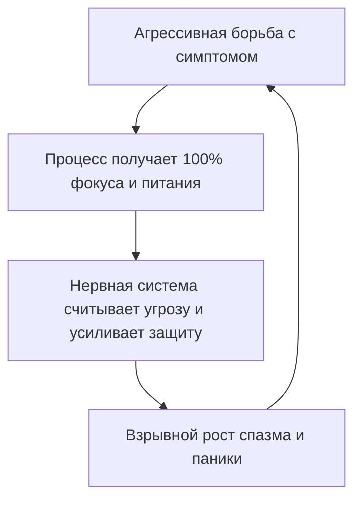

# Экологичное удаление

В прошлой главе ты перекрывал внешнюю трубу. Здесь — то, что уже крутится внутри и с чем ты воюешь годами.

Зависшая программа. Неопытный пользователь кликает по ярлыку в ярости, пытается снести файл на ходу. Система: *«Файл занят»*. Грубый `kill -9` без завершения потоков — синий экран.

С внутренним то же, только ставки выше. Это не удалённый сервер. Это твоё тело.

**Воевать с тем, что запущено внутри, опасно.** Война с тревогой, критиком, ступором — попытка отформатировать раздел, на котором крутится жизнь.

Силой здесь не побеждают. Ты роняешь пропускную способность нервной системы — обычно в худший момент: переговоры, бюджет, шаг к близости.

---

## Почему война кормит врага

Куда идёт фокус — туда идёт питание.

Объявил войну тревоге, критику, скованности — вывел их на главный экран. Сделал героями дня. Следишь. Ждёшь. Злишься. Боишься заранее. Сливаешь туда тонны сил — те, что могли пойти в проект, переговоры, цену себе.

Враг жиреет. На твоём довольствии.

Ты сам поставил его в автозапуск с наивысшим приоритетом. Потом удивляешься, кто рулит счётом и личной жизнью.

Чем яростнее борешься — тем больше кормишь. Чем больше кормишь — тем сильнее накатывает. Чем сильнее накатывает — тем яростнее борешься.

Поэтому не выжигаем железом. Не берём себя в кулак. Это подкормка. Удаляем бережно. Четыре движения.

Сначала — **признать, что оно есть.**

Нельзя удалить файл, которого ты не видишь. Скажи тревоге: *«Я вижу тебя. Ты есть. Ты имеешь право здесь быть»* — и половина напряжения спадёт ещё до работы. Ты перестал давить на крышку кипящей кастрюли.

Дальше — **понять, зачем.**

Ничто внутри не стартовало из вредности. У каждого процесса было задание.

Критик берёг от позора: лучше сам обругаю, чем услышу от других. Внезапная слабость укладывала на диван, когда ты сам себя не жалел, — и спасала перегретое сердце.

Поблагодарить за службу — не сантименты. Единственный способ снять статус «жизненно важно, не выключать», который процесс присвоил себе тридцать лет назад.

Третий шаг — **вернуть чужой код.** Ничего не выдираем из плоти. Чужой страх, родительский ультиматум, чужой стыд — аккуратно владельцам. Свой ресурс, скованный защитой, распаковывается и растворяется в Ядре.

Последнее, о чём забывают почти все, — **заполнить освободившуюся память.** На месте остановленного процесса — чистое пространство. Психика не терпит пустоты. Не заполни теплом, дыханием, опорой в тазу и стопах — за часы пропишется новый шум, часто хуже прежнего. Очистил — сразу засели своим присутствием.

---

## Исповедь: тридцать лет войны с ежом

Виктория — управляющий партнёр аудиторской компании. Запертая кабинка представительского санузла на сорок втором этаже башни из чёрного стекла. Через двадцать минут — экстренный совет директоров. Восемь костюмов за овальным столом из морёного дуба. Сделка на десятки миллионов.

Она не повторяет цифры. Пылающий лоб на ледяном мраморе. Воздух — через перехваченное горло.

Под пупком снова он. Чугунный ёж. Тугой колючий клубок.

Каждая игла — полярный холод. Шевелится — живот скручивает, тошнота, пальцы — белые ледышки. Кровь уходит из коры. Вместо финансового интеллекта — белый шум и липкий ужас: *«Сейчас выйду к микрофону, язык онемеет, руки затрясутся, они увидят — самозванка»*.

В сумочке — аптечка. Двадцать пять лет войны. Транквилизаторы. Психотерапевты. Дыхательные квадраты. Ледяной душ. Аутотренинг перед зеркалом: «Я сильная». Каждая паническая атака — ярость к собственной «трусости»:

*«Снова ты?! Ненавижу! Сдохни, дай жить!»*

Чем сильнее сжимает челюсти, пытаясь раздавить ком, — тем длиннее чугунные иглы. Диафрагма. Нет кислорода.

Транквилизаторы кончились. Время тает. Пульс 140. Силы бороться — ноль. Солдат роняет автомат, потому что рука больше не поднимается.

Сползла по плитке на пол. Колени к груди. Дрожащие ладони на ледяной низ живота.

Вместо проклятий — глухой шёпот:

— Всё. Я сдаюсь. Больше не убиваю. Ни одной пули. Живи. Если надо разорвать меня здесь, перед советом — разрывай. Я вижу тебя. Ты здесь. Ты имеешь право быть в моём теле.

Не расслаблялась по счёту. Просто сидела с чудовищем один на один. Согревала ладонями сквозь ткань брюк.

И впервые за тридцать лет ёж замер. Иглы не вонзились глубже. Под ладонями билось не враг — что-то сжатое, окоченевшее, до смерти перепуганное.

— Кто ты? — беззвучно в живот. — Зачем пришёл? От чего закрываешь?

Ответ — вспышка запаха. Воспоминание сорок лет назад.

Заполярный гарнизонный посёлок. Пурга швыряет в стекло мёрзлый гравий. Ей пять. Родители закрыли дверь на ключ снаружи и ушли на офицерский вечер. Квартира тёмная — подстанцию выбило. В коридоре скрипят половицы. Из шкафа вот-вот выйдет безликое и заберёт навсегда. Девочка в колючих шерстяных носках сидит на диване, стискивает живот: пока натянут как струна — она невидима для тьмы. Расслабится — тьма поглотит.

Этот ком родился не ради совета директоров. Он родился тем декабрьским вечером, чтобы спасти пятилетнюю Вику от безумия одиночества. Часовой. Сорок лет на посту, пока мир пил шампанское.

Слёзы — не жалость к себе. Жгучая благодарность и вина перед тем, кого четверть века травила таблетками.

— Господи… — ладони на живот. — Это ты. Ты держал оборону в той тёмной комнате. Думал, я всё ещё та брошенная девочка. Спасибо за каждую ночь. Ты спас меня тогда. Посмотри: мне сорок пять. У меня крепкие ноги, голос, сила. Никто больше не бросит в темноте. Твоя служба окончена. Можешь отдохнуть.

Чугун под ладонями начал плавиться. Сначала медленно — речной лёд на весеннем солнце. Потом — густое золотистое тепло по бёдрам, пояснице, позвоночнику к горлу.

Диафрагма отпустила. Вдох — полный, какого не помнила с детства. Долгий зевок вегетативной разгрузки. Пальцы порозовели.

Встала. Поправила пиджак. Умыла лицо. Глаза — спокойно и прямо. Под пупком — плотное спокойствие. Ни пустоты, ни боли.

Через десять минут — зал заседаний. Председатель с ядовитой ухмылкой попытался сбить вопросом о кассовых разрывах. Внутри ничего не сжалось. Старый часовой спал у тёплого очага. Взрослая женщина разложила отчёт по пунктам. Сделка закрыта на её условиях.

---

> [!NOTE]
> ## Научный блок: поливагальный тормоз и деэскалация
>
> Подавить вегетативный симптом волей — ошибка. Порджес показал: «бей или беги» и оцепенение живут в стволе и лимбике, в обход неокортекса. Встречаешь спазм яростью или стыдом — миндалина видит нового хищника уже внутри. Круг закручивается. Катехоламины. Кровь уходит от префронтальной коры.
>
> Сброс идёт через вентральный вагальный путь — «вагальный тормоз». Он включается только в безопасности: спокойное дыхание, мягкое лицо, прикосновение, отсутствие внутренней войны. ФМРТ: фраза «я вижу тебя, ты имеешь право быть» снижает реактивность амигдалы.
>
> В инженерии это `SIGTERM` вместо аварийного `kill -9`. Служба корректно сбрасывает буферы и освобождает ресурсы. Розенберг сказал то же человеческим языком: защитная реакция — искажённая просьба о безопасности. Узнал потребность — скрипт сам отпускает память.

---

## Практика: деэскалация и закрытие процесса

Возьми один застарелый симптом, с которым воюешь, — самый назойливый. Часто именно он блокирует деньги, публичность, автономию.

1. **Локализация.** Где плотность? Границы, вес, температура, текстура.
2. **Прекращение огня.** Ладонь на зажим:
   > «Я вижу тебя. Я опускаю оружие. Ты имеешь право быть в этом теле — как старая программа, которая когда-то спасала».
3. **Расшифровка.** Удерживая контакт:
   > «От какой боли ты прикрываешь? Какую катастрофу пытался предотвратить?»
   Прими первый импульс, образ, детскую сцену без критики.
4. **Снятие полномочий:**
   > «Я вижу твою службу. Ты берёг от [одиночества / унижения / уничтожения]. Спасибо. Сейчас я управляю из взрослого Ядра. Вахта закончена. Можешь снять броню».
5. **Заполнение кластера.** Лёд растворяется в тепло. Дыхание в освобождённый участок:
   > «Я освобождаю тебя от службы. Пространство заполняю собственным присутствием, опорой и покоем».
6. **Верификация.** Глубокий выдох, зевок, тепло в конечностях, урчание в животе — нервная система подтверждает приём.

Не ломай себя нажимом воли. Проведи старые процессы на почётный покой.

> [!IMPORTANT]
> **Закон главы**
> Любая попытка силой уничтожить внутренний процесс лишь откармливает его твоим вниманием, тогда как признание его защитной роли возвращает заблокированную энергию в ядро системы.
